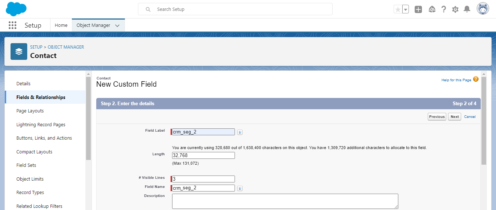
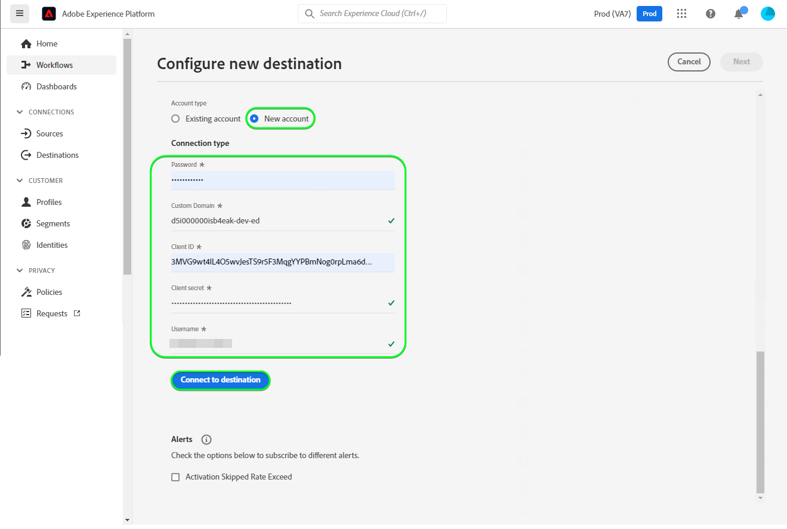
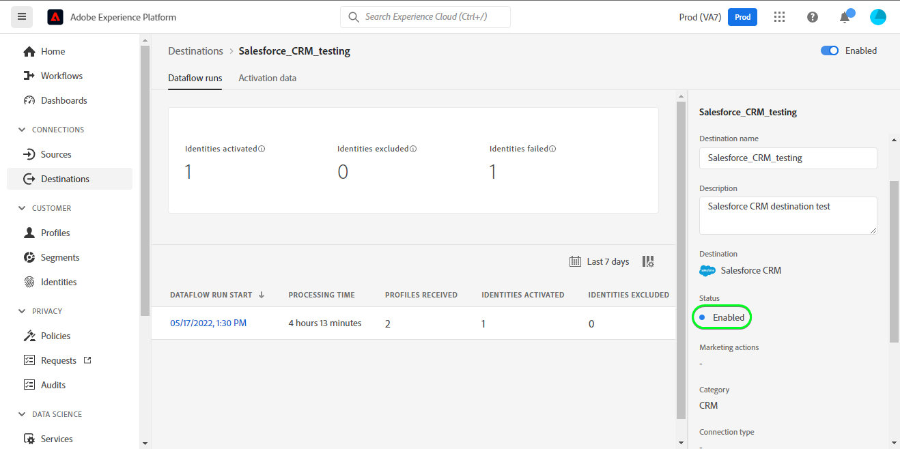

# [!DNL Salesforce CRM]连接

## 概述 {#overview}

[[!DNL Salesforce CRM]](https://www.salesforce.com/crm/)是一个流行的客户关系管理(CRM)平台，它支持如下所述的配置文件类型：

* [潜在客户](https://developer.salesforce.com/docs/atlas.en-us.object_reference.meta/object_reference/sforce_api_objects_lead.htm) — 潜在客户是可能对您销售的产品或服务感兴趣（也可能不感兴趣）的人员或公司的名称。
* [联系人](https://developer.salesforce.com/docs/atlas.en-us.object_reference.meta/object_reference/sforce_api_objects_contact.htm) — 联系人是您的代表之一已建立关系并已被授予潜在客户资格的个人。

此[!DNL Adobe Experience Platform] [目标](/help/destinations/home.md)利用支持上述两种配置文件类型的[[!DNL Salesforce composite API]](https://developer.salesforce.com/docs/atlas.en-us.api_rest.meta/api_rest/resources_composite_sobjects_collections_update.htm)。

在[激活区段](#activate)时，您可以在潜在客户或联系人之间进行选择，并将属性和受众数据更新到[!DNL Salesforce CRM]中。

[!DNL Salesforce CRM]使用带有密码授予的OAuth 2作为身份验证机制来与Salesforce REST API通信。 下面的[向目标身份验证](#authenticate)部分中进一步提供了向您的[!DNL Salesforce CRM]实例进行身份验证的说明。

## 用例 {#use-cases}

作为营销人员，您可以根据用户的Adobe Experience Platform配置文件中的属性，为其提供个性化体验。 您可以从离线数据构建受众并将这些受众发送到Salesforce CRM，以在Adobe Experience Platform中更新受众和配置文件后立即更新CRM成员资格。

## 先决条件 {#prerequisites}

### Experience Platform中的先决条件 {#prerequisites-in-experience-platform}

在将数据激活到Salesforce CRM目标之前，您必须在[!DNL Experience Platform]中创建一个[架构](/help/xdm/schema/composition.md)、[数据集](https://experienceleague.adobe.com/docs/platform-learn/tutorials/data-ingestion/create-datasets-and-ingest-data.html?lang=zh-Hans)和[区段](https://experienceleague.adobe.com/docs/platform-learn/tutorials/segments/create-segments.html?lang=zh-Hans)。

### [!DNL Salesforce CRM]中的先决条件 {#prerequisites-destination}

请注意[!DNL Salesforce CRM]中的以下先决条件，以便将数据从Experience Platform导出到您的Salesforce帐户：

#### 您需要拥有[!DNL Salesforce]帐户 {#prerequisites-account}

转到[!DNL Salesforce] [试用版](https://www.salesforce.com/in/form/signup/freetrial-sales/)页面以注册并创建[!DNL Salesforce]帐户（如果尚未注册）。

#### 在[!DNL Salesforce]中配置连接的应用 {#prerequisites-connected-app}

首先，您需要在[!DNL Salesforce]帐户中配置[[!DNL Salesforce] 连接的应用](https://help.salesforce.com/s/articleView?id=sf.connected_app_create.htm&language=en_US&r=https%3A%2F%2Fhelp.salesforce.com%2F&type=5)（如果尚未配置）。 [!DNL Salesforce CRM]将利用连接的应用连接到[!DNL Salesforce]。

接下来，为[!DNL Salesforce connected app]启用[!DNL OAuth Settings for API Integration]。 有关指导，请参阅[[!DNL Salesforce]](https://help.salesforce.com/s/articleView?id=connected_app_create_api_integration.htm&type=5&language=en_US)文档。

另外，请确保为[!DNL Salesforce connected app]选择下面提到的[范围](https://help.salesforce.com/s/articleView?id=connected_app_create_api_integration.htm&type=5&language=en_US)。

* ``chatter_api``
* ``lightning``
* ``visualforce``
* ``content``
* ``openid``
* ``full``
* ``api``
* ``web``
* ``refresh_token``
* ``offline_access``

最后，确保在您的[!DNL Salesforce]帐户中启用`password`授权。 如果需要指导，请参阅[!DNL Salesforce] [OAuth 2.0特殊方案的用户名 — 密码流程](https://help.salesforce.com/s/articleView?id=sf.remoteaccess_oauth_username_password_flow.htm&type=5)文档。

>[!IMPORTANT]
>
>如果[!DNL Salesforce]帐户管理员限制了对受信任IP范围的访问，则需要联系他们以获取[Experience Platform 列入允许列表 IP的](/help/destinations/catalog/streaming/ip-address-allow-list.md)访问权限。 如果您需要其他指导，请参阅[!DNL Salesforce] [限制对连接应用程序的受信任IP范围的访问](https://help.salesforce.com/s/articleView?id=sf.connected_app_edit_ip_ranges.htm&type=5)文档。

#### 在[!DNL Salesforce]中创建自定义字段 {#prerequisites-custom-field}

将受众激活到[!DNL Salesforce CRM]目标时，必须在&#x200B;**[受众计划](#schedule-segment-export-example)**&#x200B;步骤中为每个激活的受众在&#x200B;**[!UICONTROL 映射ID]**&#x200B;字段中输入值。

[!DNL Salesforce CRM]需要此值才能正确读取和解释从Experience Platform传入的受众，并在[!DNL Salesforce]中更新其受众状态。 如果您需要受众状态指南，请参阅Experience Platform有关[受众成员资格详细信息架构字段组](/help/xdm/field-groups/profile/segmentation.md)的文档。

对于从Experience Platform激活到[!DNL Salesforce CRM]的每个受众，您需要在[!DNL Salesforce]中创建类型为`Text Area (Long)`的自定义字段。 您可以根据业务要求定义字段字符长度，长度不限，可为256 - 131,072个字符。 有关自定义字段类型的更多信息，请参阅[!DNL Salesforce] [自定义字段类型](https://help.salesforce.com/s/articleView?id=sf.custom_field_types.htm&type=5)文档页面。 如果您在字段创建方面需要帮助，另请参阅[!DNL Salesforce]文档以[创建自定义字段](https://help.salesforce.com/s/articleView?id=mc_cab_create_an_attribute.htm&type=5&language=en_US)。

>[!IMPORTANT]
>
>请勿在字段名称中包含空白字符。 请改用下划线`(_)`字符作为分隔符。
>在[!DNL Salesforce]内，您必须为每个激活的Experience Platform区段创建与&#x200B;**[!UICONTROL 映射ID]**&#x200B;中指定的值完全匹配的自定义字段，该字段具有&#x200B;**[!UICONTROL 字段名称]**。 例如，下面的屏幕截图显示了一个名为`crm_2_seg`的自定义字段。 将受众激活到此目标时，请添加`crm_2_seg`作为&#x200B;**[!UICONTROL 映射ID]**，以将受众从Experience Platform填充到此自定义字段中。

下面显示了[!DNL Salesforce]，*步骤1 — 选择数据类型*中的自定义字段创建示例：

[!DNL Salesforce]中的自定义字段创建示例，*步骤2 — 输入自定义字段*的详细信息，如下所示：

>[!TIP]
>
>* 为了区分用于Experience Platform受众的自定义字段和[!DNL Salesforce]中的其他自定义字段，在创建自定义字段时可以包含可识别的前缀或后缀。 例如，使用`Adobe_test_segment`或`test_segment_Adobe`，而不是`test_segment`
>* 如果已在[!DNL Salesforce]中创建了其他自定义字段，则可以使用与Experience Platform区段相同的名称，以便轻松地识别[!DNL Salesforce]中的受众。

>[!NOTE]
>
>* Salesforce中的对象限制为25个外部字段，请参阅[自定义字段属性](https://help.salesforce.com/s/articleView?id=sf.custom_field_attributes.htm&type=5)。
>* 此限制意味着在任何时候，您最多只能有25个Experience Platform受众成员处于活动状态。
>* 如果您在Salesforce中达到了此限制，则必须先从Salesforce中删除用于根据Experience Platform中的旧受众存储受众状态的自定义属性，然后才能使用新的&#x200B;**[!UICONTROL 映射ID]**。

#### 收集[!DNL Salesforce CRM]凭据 {#gather-credentials}

在对[!DNL Salesforce CRM]目标进行身份验证之前，请记下以下项目：

| 凭据 | 描述 | 示例 |
| --- | --- | --- |
| `Username` | 您的[!DNL Salesforce]帐户用户名。 | |
| `Password` | 您的[!DNL Salesforce]帐户密码。 | |
| `Security Token` | 您的[!DNL Salesforce]安全令牌，稍后将附加到您的[!DNL Salesforce]密码的末尾，以创建在[向目标](#authenticate)进行身份验证时用作&#x200B;**[!UICONTROL 密码]**&#x200B;的串联字符串。 请参阅[!DNL Salesforce]文档以[重置您的安全令牌](https://help.salesforce.com/s/articleView?id=sf.user_security_token.htm&type=5)，了解如何从[!DNL Salesforce]界面重新生成没有安全令牌的安全令牌。 |  |
| `Custom Domain` | 您的[!DNL Salesforce]域前缀。  请参阅[[!DNL Salesforce] 文档](https://help.salesforce.com/s/articleView?id=sf.domain_name_setting_login_policy.htm&type=5)以了解如何从[!DNL Salesforce]界面获取此值。 | 如果您的[!DNL Salesforce]域是  *`d5i000000isb4eak-dev-ed`.my.salesforce.com*， 需要`d5i000000isb4eak-dev-ed`作为值。 |
| `Client ID` | 您的Salesforce `Consumer Key`。  请参阅[[!DNL Salesforce] 文档](https://help.salesforce.com/s/articleView?id=sf.connected_app_rotate_consumer_details.htm&type=5)以了解如何从[!DNL Salesforce]界面获取此值。 | |
| `Client Secret` | 您的Salesforce `Consumer Secret`。  请参阅[[!DNL Salesforce] 文档](https://help.salesforce.com/s/articleView?id=sf.connected_app_rotate_consumer_details.htm&type=5)以了解如何从[!DNL Salesforce]界面获取此值。 | |

### 护栏 {#guardrails}

[!DNL Salesforce]通过强制实施请求、速率和超时限制来平衡事务加载。 有关详细信息，请参阅[API请求限制和分配](https://developer.salesforce.com/docs/atlas.en-us.salesforce_app_limits_cheatsheet.meta/salesforce_app_limits_cheatsheet/salesforce_app_limits_platform_api.htm)。

如果[!DNL Salesforce]帐户管理员已强制执行IP限制，则需要将[Experience Platform IP地址](/help/destinations/catalog/streaming/ip-address-allow-list.md)添加到您的[!DNL Salesforce]帐户的受信任IP范围。 如果您需要其他指导，请参阅[!DNL Salesforce] [限制对连接应用程序的受信任IP范围的访问](https://help.salesforce.com/s/articleView?id=sf.connected_app_edit_ip_ranges.htm&type=5)文档。

>[!IMPORTANT]
>
>在[激活区段](#activate)时，您必须选择&#x200B;*联系人*&#x200B;或&#x200B;*潜在客户*&#x200B;类型。 您需要确保受众具有符合所选类型的相应数据映射。

## 支持的身份 {#supported-identities}

[!DNL Salesforce CRM]支持更新下表中描述的标识。 了解有关[标识](/help/identity-service/features/namespaces.md)的更多信息。

| 目标身份 | 描述 | 注意事项 |
|---|---|---|
| `SalesforceId` | 您通过区段导出或更新之联系人或潜在客户身份的[!DNL Salesforce CRM]标识符。 | 必需 |

## 导出类型和频率 {#export-type-frequency}

有关目标导出类型和频率的信息，请参阅下表。

| 项目 | 类型 | 注释 |
|---------|----------|---------|
| 导出类型 | **[!UICONTROL 基于配置文件]** | <ul><li>您正在根据字段映射导出区段的所有成员，以及所需的架构字段&#x200B;*（例如：电子邮件地址、电话号码、姓氏）*。</li><li> 根据[受众计划](#schedule-segment-export-example)步骤期间提供的&#x200B;**[!UICONTROL 映射ID]**&#x200B;值，[!DNL Salesforce CRM]中的每个受众状态都将通过Experience Platform中的相应受众状态进行更新。</li></ul> |
| 导出频率 | **[!UICONTROL 正在流式传输]** | <ul><li>流目标为基于API的“始终运行”连接。 根据受众评估在Experience Platform中更新用户档案后，连接器会立即将更新发送到下游目标平台。 阅读有关[流式目标](/help/destinations/destination-types.md#streaming-destinations)的更多信息。</li></ul> |

{style="table-layout:auto"}

## 连接到目标 {#connect}

>[!IMPORTANT]
>
>若要连接到目标，您需要&#x200B;**[!UICONTROL 查看目标]**&#x200B;和&#x200B;**[!UICONTROL 管理目标]** [访问控制权限](/help/access-control/home.md#permissions)。 阅读[访问控制概述](/help/access-control/ui/overview.md)或联系您的产品管理员以获取所需的权限。

要连接到此目标，请按照[目标配置教程](../../ui/connect-destination.md)中描述的步骤操作。 在配置目标工作流中，填写下面两个部分中列出的字段。

在&#x200B;**[!UICONTROL 目标]** > **[!UICONTROL 目录]**&#x200B;中，搜索[!DNL Salesforce CRM]。 或者，您可以在&#x200B;**[!UICONTROL CRM]**&#x200B;类别下找到它。

### 验证目标 {#authenticate}

要验证到目标，请填写下面的必填字段，然后选择&#x200B;**[!UICONTROL 连接到目标]**。 有关任何指导，请参阅[收集 [!DNL Salesforce CRM] 凭据](#gather-credentials)部分。

| 凭据 | 描述 |
| --- | --- |
| **[!UICONTROL 用户名]** | 您的[!DNL Salesforce]帐户用户名。 |
| **[!UICONTROL 密码]** | 由附加了[!DNL Salesforce]安全令牌的[!DNL Salesforce]帐户密码组成的连接字符串。 连接值采用`{PASSWORD}{TOKEN}`的形式。 注意，不要使用任何大括号或空格。 例如，如果您的[!DNL Salesforce]密码为`MyPa$$w0rd123`，[!DNL Salesforce]安全令牌为`TOKEN12345....0000`，则您在&#x200B;**[!UICONTROL 密码]**&#x200B;字段中使用的串联值为`MyPa$$w0rd123TOKEN12345....0000`。 |
| **[!UICONTROL 自定义域]** | 您的[!DNL Salesforce]域前缀。  例如，如果您的域是&#x200B;*`d5i000000isb4eak-dev-ed`.my.salesforce.com*，则需要提供`d5i000000isb4eak-dev-ed`作为值。 |
| **[!UICONTROL 客户端ID]** | 您的[!DNL Salesforce]已连接应用程序`Consumer Key`。 |
| **[!UICONTROL 客户端密码]** | 您的[!DNL Salesforce]已连接应用程序`Consumer Secret`。 |

如果提供的详细信息有效，则UI会以绿色复选标记显示&#x200B;**[!UICONTROL 已连接]**&#x200B;状态，然后您可以继续执行下一步。

### 填写目标详细信息 {#destination-details}

要配置目标的详细信息，请填写下面的必需和可选字段。 UI中字段旁边的星号表示该字段为必填字段。
* **[!UICONTROL 名称]**：将来用于识别此目标的名称。
* **[!UICONTROL 描述]**：可帮助您将来识别此目标的描述。
* **[!UICONTROL Salesforce ID类型]**：
   * 如果要导出或更新身份为&#x200B;*联系人*&#x200B;类型，请选择&#x200B;**[!UICONTROL 联系人]**。
   * 如果要导出或更新身份为&#x200B;*潜在客户*&#x200B;类型，请选择&#x200B;**[!UICONTROL 潜在客户]**。

### 启用警报 {#enable-alerts}

您可以启用警报，以接收有关发送到目标的数据流状态的通知。 从列表中选择警报以订阅接收有关数据流状态的通知。 有关警报的详细信息，请参阅[使用UI订阅目标警报的指南](../../ui/alerts.md)。

完成提供目标连接的详细信息后，选择&#x200B;**[!UICONTROL 下一步]**。

## 激活此目标的受众 {#activate}

>[!IMPORTANT]
> 
>* 若要激活数据，您需要&#x200B;**[!UICONTROL 查看目标]**、**[!UICONTROL 激活目标]**、**[!UICONTROL 查看配置文件]**&#x200B;和&#x200B;**[!UICONTROL 查看区段]** [访问控制权限](/help/access-control/home.md#permissions)。 阅读[访问控制概述](/help/access-control/ui/overview.md)或联系您的产品管理员以获取所需的权限。
>* 要导出&#x200B;*标识*，您需要&#x200B;**[!UICONTROL 查看标识图形]** [访问控制权限](/help/access-control/home.md#permissions)。  {width="100" zoomable="yes"}

有关将受众激活到此目标的说明，请阅读[将配置文件和受众激活到流式受众导出目标](/help/destinations/ui/activate-segment-streaming-destinations.md)。

### 映射注意事项和示例 {#mapping-considerations-example}

要将受众数据从Adobe Experience Platform正确发送到[!DNL Salesforce CRM]目标，您需要完成字段映射步骤。 映射包括在Experience Platform帐户中的Experience Data Model (XDM)架构字段与其与目标中的相应等效字段之间创建链接。

在&#x200B;**[!UICONTROL 目标字段]**&#x200B;中指定的属性的名称应与属性映射表中所述完全相同，因为这些属性将构成请求正文。

在&#x200B;**[!UICONTROL Source字段]**&#x200B;中指定的属性不遵循任何此类限制。 您可以根据需要进行映射，但请根据[[!DNL Salesforce] 文档](https://help.salesforce.com/s/articleView?id=sf.custom_field_attributes.htm&type=5)确保输入数据的格式有效。 如果输入数据无效，则对[!DNL Salesforce]的更新调用将失败，您的联系人/潜在客户将无法更新。

要将XDM字段正确映射到[!DNL (API) Salesforce CRM]目标字段，请执行以下步骤：

1. 在&#x200B;**[!UICONTROL 映射]**&#x200B;步骤中，选择&#x200B;**[!UICONTROL 添加新映射]**，您将在屏幕上看到一个新映射行。
   
1. 在&#x200B;**[!UICONTROL 选择源字段]**&#x200B;窗口中，选择&#x200B;**[!UICONTROL 选择属性]**&#x200B;类别并选择XDM属性，或选择&#x200B;**[!UICONTROL 选择身份命名空间]**&#x200B;并选择身份。
1. 在&#x200B;**[!UICONTROL 选择目标字段]**&#x200B;窗口中，选择&#x200B;**[!UICONTROL 选择身份命名空间]**&#x200B;并选择身份，或者根据需要选择&#x200B;**[!UICONTROL 选择自定义属性]**&#x200B;类别并选择属性或使用&#x200B;**[!UICONTROL 属性名称]**&#x200B;字段定义属性。 有关支持的属性的指导，请参阅[[!DNL Salesforce CRM] 文档](https://help.salesforce.com/s/articleView?id=sf.custom_field_attributes.htm&type=5)。
   * 重复这些步骤以在XDM配置文件架构和[!DNL (API) Salesforce CRM]之间添加以下映射：

   **使用联系人**

   * 如果您正在使用区段中的&#x200B;*联系人*，请参阅Salesforce中的[联系人](https://developer.salesforce.com/docs/atlas.en-us.object_reference.meta/object_reference/sforce_api_objects_contact.htm)的对象引用，以便为要更新的字段定义映射。
   * 您可以通过搜索单词&#x200B;*必需*&#x200B;来标识必填字段，上述链接中的字段描述中提到了该单词。
   * 根据要导出或更新字段，在XDM配置文件架构和[!DNL (API) Salesforce CRM]之间添加映射：

     | 源字段 | 目标字段 | 注释 |
     | --- | --- | --- |
     | `IdentityMap: crmID` | `Identity: SalesforceId` | `Mandatory` |
     | `xdm: person.name.lastName` | `Attribute: LastName` | `Mandatory`的问题。联系人的姓氏，最多80个字符。 |
     | `xdm: person.name.firstName` | `Attribute: FirstName` | 联系人的名字最多可包含40个字符。 |
     | `xdm: personalEmail.address` | `Attribute: Email` | 联系人的电子邮件地址。 |

   * 下面显示了使用这些映射的示例：

     

   **使用潜在客户**

   * 如果您正在区段中使用&#x200B;*潜在客户*，请参阅Salesforce中的[潜在客户](https://developer.salesforce.com/docs/atlas.en-us.object_reference.meta/object_reference/sforce_api_objects_lead.htm)的对象引用，以便为要更新的字段定义映射。
   * 您可以通过搜索单词&#x200B;*必需*&#x200B;来标识必填字段，上述链接中的字段描述中提到了该单词。
   * 根据要导出或更新字段，在XDM配置文件架构和[!DNL (API) Salesforce CRM]之间添加映射：

     | 源字段 | 目标字段 | 注释 |
     | --- | --- | --- |
     | `IdentityMap: crmID` | `Identity: SalesforceId` | `Mandatory` |
     | `xdm: person.name.lastName` | `Attribute: LastName` | `Mandatory`的问题。潜在客户的姓氏最多为80个字符。 |
     | `xdm: b2b.companyName` | `Attribute: Company` | `Mandatory`的问题。潜在客户的公司。 |
     | `xdm: personalEmail.address` | `Attribute: Email` | 商机的电子邮件地址。 |

   * 下面显示了使用这些映射的示例：

     

完成提供目标连接的映射后，请选择&#x200B;**[!UICONTROL 下一步]**。

### 计划受众导出和示例 {#schedule-segment-export-example}

执行[计划受众导出](/help/destinations/ui/activate-segment-streaming-destinations.md#scheduling)步骤时，必须手动将从Experience Platform激活的受众映射到其[!DNL Salesforce]中的相应自定义字段。

为此，请选择每个区段，然后在[!DNL Salesforce CRM] **[!UICONTROL 映射ID]**&#x200B;字段中输入来自[!DNL Salesforce]的自定义字段名称。 有关在[!DNL Salesforce]中创建自定义字段的指导和最佳实践，请参阅[在 [!DNL Salesforce]](#prerequisites-custom-field)中创建自定义字段。

例如，如果[!DNL Salesforce]自定义字段为`crm_2_seg`，请在[!DNL Salesforce CRM] **[!UICONTROL 映射ID]**&#x200B;中指定此值以将Experience Platform中的受众填充到此自定义字段中。

以下显示了[!DNL Salesforce]中的自定义字段示例：
![[!DNL Salesforce]显示自定义字段的UI屏幕截图。](../../assets/catalog/crm/salesforce/salesforce-custom-field.png)

下面显示了一个示例，用于指示[!DNL Salesforce CRM] **[!UICONTROL 映射ID]**&#x200B;的位置：

如上所示，[!DNL Salesforce] **[!UICONTROL 字段名称]**&#x200B;与[!DNL Salesforce CRM] **[!UICONTROL 映射ID]**&#x200B;中指定的值完全匹配。

根据您的用例，所有激活的受众都可以映射到同一[!DNL Salesforce]自定义字段或[!DNL Salesforce CRM]中的不同&#x200B;**[!UICONTROL 字段名称]**。 基于上述图像的典型示例可能是。

| [!DNL Salesforce CRM]区段名称 | [!DNL Salesforce] **[!UICONTROL 字段名称]** | [!DNL Salesforce CRM] **[!UICONTROL 映射ID]** |
| --- | --- | --- |
| crm_1_seg | `crm_1_seg` | `crm_1_seg` |
| crm_2_seg | `crm_2_seg` | `crm_2_seg` |

对每个激活的Experience Platform区段重复此部分。

## 验证数据导出 {#exported-data}

要验证您是否正确设置了目标，请执行以下步骤：

1. 选择&#x200B;**[!UICONTROL 目标]** > **[!UICONTROL 浏览]**&#x200B;以导航到目标列表。
   

1. 选择目标并验证状态为&#x200B;**[!UICONTROL 已启用]**。
   

1. 切换到&#x200B;**[!UICONTROL 激活数据]**&#x200B;选项卡，然后选择受众名称。
   

1. 监控受众摘要，并确保用户档案计数对应于在区段内创建的计数。
   

1. 最后，登录Salesforce网站并验证受众中的配置文件是否已添加或更新。

   **使用联系人**

   * 如果您在Experience Platform区段中选择了&#x200B;*联系人*，请导航到&#x200B;**[!DNL Apps]** > **[!DNL Contacts]**&#x200B;页面。

     

   * 选择&#x200B;*联系人*&#x200B;并检查字段是否已更新。 您可以看到，根据[受众计划](#schedule-segment-export-example)期间提供的&#x200B;**[!UICONTROL 映射ID]**&#x200B;值，[!DNL Salesforce CRM]中的每个受众状态都更新了Experience Platform中的相应受众状态。

     

   **使用潜在客户**

   * 如果您在Experience Platform区段中选择了&#x200B;*潜在客户*，请导航到&#x200B;**[!DNL Apps]** > **[!DNL Leads]**&#x200B;页面。

     

   * 选择&#x200B;*潜在客户*&#x200B;并检查字段是否已更新。 您可以看到，根据[受众计划](#schedule-segment-export-example)期间提供的&#x200B;**[!UICONTROL 映射ID]**&#x200B;值，[!DNL Salesforce CRM]中的每个受众状态都更新了Experience Platform中的相应受众状态。

     

## 数据使用和治理 {#data-usage-governance}

在处理您的数据时，所有[!DNL Adobe Experience Platform]目标都符合数据使用策略。 有关[!DNL Adobe Experience Platform]如何实施数据治理的详细信息，请参阅[数据治理概述](/help/data-governance/home.md)。

## 错误和故障排除 {#errors-and-troubleshooting}

### 将事件推送到目标时报告了未知错误 {#unknown-errors}

* 检查数据流运行时，您可能会遇到以下错误消息： `Unknown errors encountered while pushing events to the destination. Please contact the administrator and try again.`
  

   * 要修复此错误，请验证您在激活工作流中提供的&#x200B;**[!UICONTROL 映射ID]**&#x200B;到[!DNL Salesforce CRM]目标的值与您在[!DNL Salesforce]中创建的自定义字段类型的值是否完全匹配。 有关指导，请参阅[在 [!DNL Salesforce]](#prerequisites-custom-field)中创建自定义字段。

* 激活区段时，您可能会收到错误消息：`The client's IP address is unauthorized for this account. Allowlist the client's IP address...`
   * 若要修复此错误，请与[!DNL Salesforce]帐户管理员联系，将[Experience Platform IP地址](/help/destinations/catalog/streaming/ip-address-allow-list.md)添加到您的[!DNL Salesforce]帐户的受信任IP范围。 如果您需要其他指导，请参阅[!DNL Salesforce] [限制对连接应用程序的受信任IP范围的访问](https://help.salesforce.com/s/articleView?id=sf.connected_app_edit_ip_ranges.htm&type=5)文档。

## 其他资源 {#additional-resources}

来自[Salesforce开发人员门户](https://developer.salesforce.com/)的其他有用信息如下：
* [快速入门](https://developer.salesforce.com/docs/atlas.en-us.api_rest.meta/api_rest/quickstart.htm)
* [创建记录](https://developer.salesforce.com/docs/atlas.en-us.api_rest.meta/api_rest/dome_sobject_create.htm)
* [自定义推荐受众](https://developer.salesforce.com/docs/atlas.en-us.236.0.chatterapi.meta/chatterapi/connect_resources_recommendation_audiences_list.htm)
* [使用复合资源](https://developer.salesforce.com/docs/atlas.en-us.api_rest.meta/api_rest/using_composite_resources.htm?q=composite)
* 此目标利用[Upsert Multiple Records](https://developer.salesforce.com/docs/atlas.en-us.api_rest.meta/api_rest/resources_composite_sobjects_collections_update.htm) API而不是[Upsert Single Record](https://developer.salesforce.com/docs/atlas.en-us.api_rest.meta/api_rest/dome_composite_upsert_example.htm?q=contacts) API调用。
