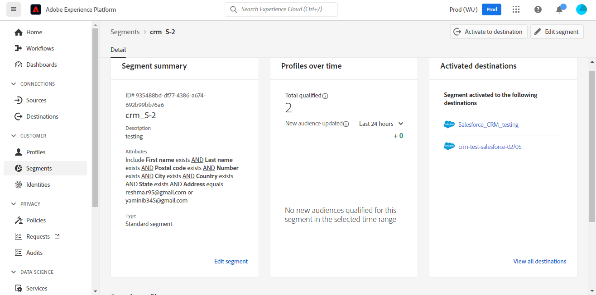

# [!DNL Salesforce CRM] 连接

## 概述 {#overview}

[[!DNL Salesforce CRM]](https://www.salesforce.com/crm/) 是一个流行的客户关系管理(CRM)平台，支持以下功能：

* [潜在客户](https://developer.salesforce.com/docs/atlas.en-us.object_reference.meta/object_reference/sforce_api_objects_lead.htm)  — 潜在顾客是指对您销售的产品或服务可能（或可能不可能）感兴趣的个人或公司。
* [联系人](https://developer.salesforce.com/docs/atlas.en-us.object_reference.meta/object_reference/sforce_api_objects_contact.htm)  — 联系人是指您的一位代表已与其建立关系并有资格成为潜在客户的个人。

此 [!DNL Adobe Experience Platform] [目标](/help/destinations/home.md) 利用 [[!DNL Salesforce composite API]](https://developer.salesforce.com/docs/atlas.en-us.api_rest.meta/api_rest/resources_composite_sobjects_collections_update.htm)，它支持上述两种类型的用户档案。

When [激活区段](#activate)，您可以在潜在客户或联系人之间进行选择，并将属性和区段数据更新到 [!DNL Salesforce CRM].

[!DNL Salesforce CRM] 使用带有密码授予的OAuth 2作为验证机制，与Salesforce REST API通信。 验证的说明 [!DNL Salesforce CRM] 实例位于下面的 [对目标进行身份验证](#authenticate) 中。

## 用例 {#use-cases}

作为营销人员，您可以根据用户Adobe Experience Platform用户档案的属性，向用户提供个性化体验。 您可以从离线数据构建区段，并将这些区段发送到Salesforce CRM，以便在Adobe Experience Platform中更新区段和配置文件后立即在用户信息源中显示。

## 先决条件 {#prerequisites}

### Experience Platform中的先决条件 {#prerequisites-in-experience-platform}

在将数据激活到Salesforce CRM目标之前，您必须具有 [模式](/help/xdm/schema/composition.md), a [数据集](https://experienceleague.adobe.com/docs/platform-learn/tutorials/data-ingestion/create-datasets-and-ingest-data.html?lang=en)和 [区段](https://experienceleague.adobe.com/docs/platform-learn/tutorials/segments/create-segments.html?lang=en) 创建于 [!DNL Experience Platform].

### 先决条件 [!DNL Salesforce CRM] {#prerequisites-destination}

请注意 [!DNL Salesforce CRM]，以便将数据从Platform导出到您的Salesforce帐户：

#### 您需要拥有Salesforce帐户 {#prerequisites-account}

转到Salesforce [试用](https://www.salesforce.com/in/form/signup/freetrial-sales/) 页面以注册和创建Salesforce帐户（如果您还没有）。

#### 配置连接的应用程序 {#prerequisites-connected-app}

接下来，您需要配置 [连接的应用程序](https://help.salesforce.com/s/articleView?id=sf.connected_app_create.htm&amp;language=en_US&amp;r=https%3A%2F%2Fhelp.salesforce.com%2F&amp;type=5) （如果您还没有）。

在连接的应用程序内，确保 [OAuth设置](https://help.salesforce.com/s/articleView?id=connected_app_create_api_integration.htm&amp;type=5&amp;language=en_US) 启用。

另外，请确保 [范围](https://help.salesforce.com/s/articleView?id=connected_app_create_api_integration.htm&amp;type=5&amp;language=en_US) 将选择下面所述的。

* ``chatter_api``
* ``lightning``
* ``visualforce``
* ``content``
* ``openid``
* ``full``
* ``api``
* ``web``
* ``refresh_token``
* ``offline_access``

#### 在Salesforce中创建自定义字段 {#prerequisites-custom-field}

创建类型的自定义字段 `Text Area Long`，该Experience Platform将用于更新 [!DNL Salesforce CRM].
请参阅Salesforce文档，以 [创建自定义字段](https://help.salesforce.com/s/articleView?id=sf.adding_fields.htm&amp;type=5) 如果您需要其他指导，请执行以下操作。

>[!IMPORTANT]
>
>确保字段名称中没有空格字符。 请改用下划线 `(_)` 字符。

>[!NOTE]
>
>* Salesforce中的对象限制为25个外部字段，请参阅 [自定义字段属性](https://help.salesforce.com/s/articleView?id=sf.custom_field_attributes.htm&amp;type=5).
>* 此限制意味着您在任何时候最多只能有25个Experience Platform区段成员关系处于活动状态。
>* 如果您在Salesforce中已达到此限制，则必须从Salesforce中删除自定义属性，该属性用于针对Experience Platform中的旧区段存储区段状态，然后才能新建 **[!UICONTROL 映射ID]** 中。

请参阅Adobe Experience Platform文档，以了解 [区段成员资格详细信息架构字段组](/help/xdm/field-groups/profile/segmentation.md) 如果您需要有关区段状态的指导，请执行以下操作：

#### 收集Salesforce凭据 {#gather-credentials}

在验证到 [!DNL Salesforce CRM] 目标：

| 凭据 | 描述 | 示例 |
| --- | --- | --- |
| <ul><li>Salesforce域前缀</li></ul> | 请参阅 [Salesforce域前缀](https://help.salesforce.com/s/articleView?id=sf.domain_name_setting_login_policy.htm&amp;type=5) 以获取其他指导。 | <ul><li>如果您的域如下所示，则需要突出显示的值。  <i>`d5i000000isb4eak-dev-ed`.my.salesforce.com</i></li></ul> |
| <ul><li>消费者密钥</li><li>消费者密码</li></ul> | 请参阅 [Salesforce文档](https://help.salesforce.com/s/articleView?id=sf.connected_app_rotate_consumer_details.htm&amp;type=5) 如果您需要其他指导，请执行以下操作。 | <ul><li>r23kxxxxxxxxx0z05xxxxx</code></li><li>ipxxxxxxxxxxxxT4xxxxxxxxxxxx</code></li></ul> |

### 护栏 {#guardrails}

Salesforce通过施加请求、费率和超时限制来平衡事务处理加载。 请参阅 [API请求限制和分配](https://developer.salesforce.com/docs/atlas.en-us.salesforce_app_limits_cheatsheet.meta/salesforce_app_limits_cheatsheet/salesforce_app_limits_platform_api.htm) 以了解详细信息。

>[!IMPORTANT]
>
>When [激活区段](#activate) 必须选择 *联系人* 或 *商机* 类型。 您需要确保区段具有根据所选类型的相应数据映射。

## 支持的身份 {#supported-identities}

[!DNL Salesforce CRM] 支持更新下表所述的身份。 详细了解 [标识](/help/identity-service/namespaces.md).

| Target标识 | 描述 | 注意事项 |
|---|---|---|
| `SalesforceId` | 的 [!DNL Salesforce CRM] 您通过区段导出或更新的联系人或潜在客户标识的标识符。 | 必需 |

## 导出类型和频度 {#export-type-frequency}

有关目标导出类型和频率的信息，请参阅下表。

| 项目 | 类型 | 注释 |
---------|----------|---------|
| 导出类型 | **[!UICONTROL 基于用户档案]** | <ul><li>您正在导出区段的所有成员，以及所需的架构字段 *(例如：电子邮件地址、电话号码、姓氏)*，则会根据字段映射。</li><li> 每个区段状态位于 [!DNL Salesforce CRM] 会根据 **[!UICONTROL 映射ID]** 值 [区段计划](#schedule-segment-export-example) 中。</li></ul> |
| 导出频度 | **[!UICONTROL 流]** | <ul><li>流目标“始终运行”基于API的连接。 在基于区段评估的Experience Platform中更新用户档案后，连接器会立即将更新发送到目标平台下游。 有关更多信息 [流目标](/help/destinations/destination-types.md#streaming-destinations).</li></ul> |

{style=&quot;table-layout:auto&quot;}

## 连接到目标 {#connect}

>[!IMPORTANT]
>
>要连接到目标，您需要 **[!UICONTROL 管理目标]** [访问控制权限](/help/access-control/home.md#permissions). 阅读 [访问控制概述](/help/access-control/ui/overview.md) 或联系您的产品管理员以获取所需的权限。

要连接到此目标，请按照 [目标配置教程](../../ui/connect-destination.md). 在配置目标工作流中，填写下面两节中列出的字段。

在 **[!UICONTROL 目标]** > **[!UICONTROL 目录]** 搜索 [!DNL Salesforce CRM]. 或者，您也可以在 **[!UICONTROL CRM]** 类别。

### 对目标进行身份验证 {#authenticate}

要对目标进行身份验证，请填写必填字段并选择 **[!UICONTROL 连接到目标]**.

* **[!UICONTROL 密码]**:您的Salesforce帐户密码。
* **[!UICONTROL 自定义域]**:您的Salesforce域。
* **[!UICONTROL 客户端ID]**:您的Salesforce连接的应用程序客户密钥。
* **[!UICONTROL 客户端密钥]**:您的Salesforce已连接应用程序客户密钥。
* **[!UICONTROL 用户名]**:您的Salesforce帐户用户名。

如果提供的详细信息有效，UI会显示 **[!UICONTROL 已连接]** 状态中显示绿色复选标记，则可以继续执行下一步。

### 填写目标详细信息 {#destination-details}

要配置目标的详细信息，请填写以下必填和可选字段。 UI中字段旁边的星号表示该字段为必填字段。

* **[!UICONTROL 名称]**:将来用于识别此目标的名称。
* **[!UICONTROL 描述]**:此描述将帮助您在将来确定此目标。
* **[!UICONTROL Salesforce ID类型]**:选择 **[!UICONTROL 联系人]** 如果要导出或更新的身份类型为 *联系人*. 选择 **[!UICONTROL 商机]** 如果要导出或更新的身份类型为 *商机*.

### 启用警报 {#enable-alerts}

您可以启用警报以接收有关目标数据流状态的通知。 从列表中选择警报以订阅接收有关数据流状态的通知。 有关警报的更多信息，请参阅 [使用UI订阅目标警报](../../ui/alerts.md).

完成提供目标连接的详细信息后，请选择 **[!UICONTROL 下一个]**.

## 将区段激活到此目标 {#activate}

>[!IMPORTANT]
>
>要激活数据，您需要 **[!UICONTROL 管理目标]**, **[!UICONTROL 激活目标]**, **[!UICONTROL 查看配置文件]**&#x200B;和 **[!UICONTROL 查看区段]** [访问控制权限](/help/access-control/home.md#permissions). 阅读 [访问控制概述](/help/access-control/ui/overview.md) 或联系您的产品管理员以获取所需的权限。

读取 [激活用户档案和区段以流式传输区段导出目标](/help/destinations/ui/activate-segment-streaming-destinations.md) 有关将受众区段激活到此目标的说明。

### 映射注意事项和示例 {#mapping-considerations-example}

要将受众数据从Adobe Experience Platform正确发送到 [!DNL Salesforce CRM] 目标，您需要完成字段映射步骤。 映射包括在Platform帐户中的体验数据模型(XDM)架构字段与目标目标中相应的对等字段之间创建一个链接。 要将XDM字段正确映射到 [!DNL Salesforce CRM] 目标字段，请执行以下步骤：

1. 在 **[!UICONTROL 映射]** 步骤，选择 **[!UICONTROL 添加新映射]**，则会在屏幕上看到一个新的映射行。
   

1. 在 **[!UICONTROL 选择源字段]** 窗口，选择 **[!UICONTROL 选择身份命名空间]** 或 **[!UICONTROL 选择属性]** 类别和选择 `crmID`.
   

1. 在 **[!UICONTROL 选择目标字段]** 窗口，选择 **[!UICONTROL 选择身份命名空间]** 类别和选择 `SalesforceId`.
   

   * 在XDM配置文件架构和 [!DNL Salesforce CRM] 实例：
   | XDM配置文件架构 | [!DNL Salesforce CRM] 实例 | 必需 |
   |---|---|---|
   | `crmID` | `SalesforceId` | 是 |

   * **[!UICONTROL 选择自定义属性]**:选择此选项可将源字段映射到您在 **[!UICONTROL 属性名称]** 字段。 请参阅 [[!DNL Salesforce CRM] 文档](https://help.salesforce.com/s/articleView?id=sf.custom_field_attributes.htm&amp;type=5) ，以获取有关受支持属性的指导。
      

   * 如果您正在使用 *联系人* 在区段中，请参阅Salesforce中的对象引用，以获取 [联系人](https://developer.salesforce.com/docs/atlas.en-us.object_reference.meta/object_reference/sforce_api_objects_contact.htm) 定义要更新的字段的映射。
   * 您可以通过搜索单词来识别必填字段 *必需*，在上述链接的字段描述中提及。
   * 根据要导出或更新的字段，在XDM配置文件架构与 [!DNL Salesforce CRM] 实例：

   | XDM配置文件架构 | [!DNL Salesforce CRM] 实例 | 注释 |
   | --- | --- | --- |
   | `person.name.lastName` | `LastName` | `Required`的问题。联系人的姓氏，最多80个字符。 |
   | `person.name.firstName` | `FirstName` | 联系人的名字最多40个字符。 |
   | `personalEmail.address` | `Email` | 联系人的电子邮件地址。 |

   * 使用这些映射的示例如下所示：
      

   * 如果您正在使用 *潜在客户* 在区段中，请参阅Salesforce中的对象引用，以获取 [商机](https://developer.salesforce.com/docs/atlas.en-us.object_reference.meta/object_reference/sforce_api_objects_lead.htm) 定义要更新的字段的映射。
   * 您可以通过搜索单词来识别必填字段 *必需*，在上述链接的字段描述中提及。
   * 根据要导出或更新的字段，在XDM配置文件架构与 [!DNL Salesforce CRM] 实例：

   | XDM配置文件架构 | [!DNL Salesforce CRM] 实例 | 注释 |
   | --- | --- | --- |
   | `person.name.lastName` | `LastName` | `Required`的问题。联系人的姓氏，最多80个字符。 |
   | `b2b.companyName` | `Company` | `Required`的问题。领导的公司。 |
   | `personalEmail.address` | `Email` | 联系人的电子邮件地址。 |

   * 使用这些映射的示例如下所示：
      

### 计划区段导出和示例 {#schedule-segment-export-example}

执行 [计划区段导出](/help/destinations/ui/activate-segment-streaming-destinations.md#scheduling) 步骤您必须在Salesforce中将Platform区段手动映射到自定义字段属性。

为此，请选择每个区段，然后在 **[!UICONTROL 映射ID]** 字段。

>[!IMPORTANT]
>
>* 用于 **[!UICONTROL 映射ID]** 应与在Salesforce中创建的自定义字段属性的名称完全匹配。
>* 确保您在Salesforce中创建的自定义字段属性的名称不使用空格字符。

示例如下所示：

## 验证数据导出 {#exported-data}

要验证您是否已正确设置目标，请执行以下步骤：

1. 选择 **[!UICONTROL 目标]** > **[!UICONTROL 浏览]** 导航到目标列表。
   

1. 选择目标并验证状态是否为 **[!UICONTROL 已启用]**.
   

1. 切换到 **[!UICONTROL 激活数据]** ，然后选择区段名称。
   

1. 监控区段摘要，并确保配置文件计数与区段内创建的计数相对应。
   

1. 最后，登录到Salesforce网站，并验证是否已添加或更新区段中的用户档案。
   * 如果你 *联系人* 在平台区段中，导航到 **[!DNL Apps]** > **[!DNL Contacts]** 页面。
      

   * 选择 *联系人* 并检查字段是否已更新。 您可以在 [!DNL Salesforce CRM] 更新时，会根据 **[!UICONTROL 映射ID]** 值 [区段计划](#schedule-segment-export-example).
      

   * 如果你 *潜在客户* ，然后导航到 **[!DNL Apps]** > **[!DNL Leads]** 页面。
      

   * 选择 *商机* 并检查字段是否已更新。 您可以在 [!DNL Salesforce CRM] 更新时，会根据 **[!UICONTROL 映射ID]** 值 [区段计划](#schedule-segment-export-example).
      

## 数据使用和管理 {#data-usage-governance}

全部 [!DNL Adobe Experience Platform] 目标在处理数据时与数据使用策略相兼容。 有关如何 [!DNL Adobe Experience Platform] 实施数据管理，请查看 [数据管理概述](/help/data-governance/home.md).

## 错误和疑难解答 {#errors-and-troubleshooting}

### 将事件推送到目标时遇到未知错误 {#unknown-errors}

检查数据流运行时，如果收到以下错误消息： `Unknown errors encountered while pushing events to the destination. Please contact the administrator and try again.`

要修复此错误，请验证 **[!UICONTROL 映射ID]** 您在 [!DNL Salesforce CRM] ，且该区段在 [!DNL Salesforce CRM].

## 其他资源 {#additional-resources}

来自 [Salesforce开发人员门户](https://developer.salesforce.com/) 如下所示：
* [快速入门](https://developer.salesforce.com/docs/atlas.en-us.api_rest.meta/api_rest/quickstart.htm)
* [创建记录](https://developer.salesforce.com/docs/atlas.en-us.api_rest.meta/api_rest/dome_sobject_create.htm)
* [自定义推荐受众](https://developer.salesforce.com/docs/atlas.en-us.236.0.chatterapi.meta/chatterapi/connect_resources_recommendation_audiences_list.htm)
* [使用复合资源](https://developer.salesforce.com/docs/atlas.en-us.api_rest.meta/api_rest/using_composite_resources.htm?q=composite)
* 此目标可利用 [重新插入多个记录](https://developer.salesforce.com/docs/atlas.en-us.api_rest.meta/api_rest/resources_composite_sobjects_collections_update.htm) API，而不是 [重新插入单个记录](https://developer.salesforce.com/docs/atlas.en-us.api_rest.meta/api_rest/dome_composite_upsert_example.htm?q=contacts) API调用。