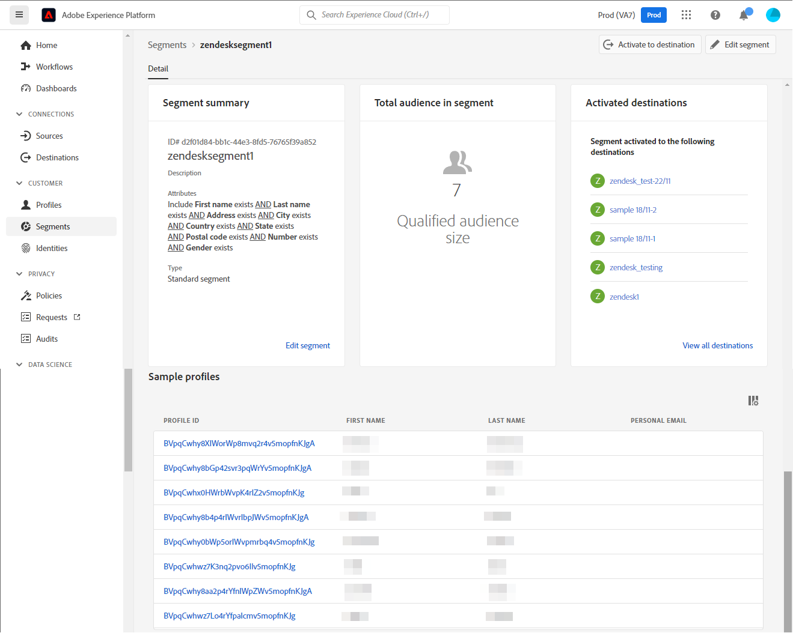

# [!DNL Zendesk]连接

[[!DNL Zendesk]](https://www.zendesk.com)是客户服务解决方案和销售工具。

此[!DNL Adobe Experience Platform] [目标](/help/destinations/home.md)利用[[!DNL Zendesk] 联系人API](https://developer.zendesk.com/api-reference/sales-crm/resources/contacts/)在受众中作为[!DNL Zendesk]中的联系人&#x200B;**创建和更新身份**。

[!DNL Zendesk]使用持有者令牌作为身份验证机制与[!DNL Zendesk]联系人API进行通信。 下面的[向目标身份验证](#authenticate)部分中进一步提供了向您的[!DNL Zendesk]实例进行身份验证的说明。

## 用例 {#use-cases}

多渠道B2C平台的客户服务部希望为其客户提供无缝的个性化体验。 该部门可根据受众自己的离线数据构建受众，以创建新用户配置文件或更新来自不同交互（例如购买、退货等）的现有配置文件信息，并将这些受众从Adobe Experience Platform发送到[!DNL Zendesk]。 在[!DNL Zendesk]中拥有更新的信息可确保客户服务代理立即获得客户的最新信息，从而加快响应和解决速度。

## 先决条件 {#prerequisites}

### Experience Platform先决条件 {#prerequisites-in-experience-platform}

在将数据激活到[!DNL Zendesk]目标之前，您必须在[!DNL Experience Platform]中创建一个[架构](/help/xdm/schema/composition.md)、[数据集](https://experienceleague.adobe.com/docs/platform-learn/tutorials/data-ingestion/create-datasets-and-ingest-data.html?lang=zh-Hans)和[区段](https://experienceleague.adobe.com/docs/platform-learn/tutorials/segments/create-segments.html?lang=zh-Hans)。

如果您需要有关受众状态的指导，请参阅Experience Platform文档，了解[受众成员资格详细信息架构字段组](/help/xdm/field-groups/profile/segmentation.md)。

### [!DNL Zendesk]先决条件 {#prerequisites-destination}

要将数据从Experience Platform导出到您的[!DNL Zendesk]帐户，您需要拥有[!DNL Zendesk]帐户。

#### 收集[!DNL Zendesk]凭据 {#gather-credentials}

在对[!DNL Zendesk]目标进行身份验证之前，请记下以下项目：

| 凭据 | 描述 | 示例 |
| --- | --- | --- |
| `Bearer token` | 您在[!DNL Zendesk]帐户中生成的访问令牌。  按照文档[生成 [!DNL Zendesk] 访问令牌](https://developer.zendesk.com/documentation/sales-crm/first-call/#1-generate-an-access-token)（如果没有）。 | `a0b1c2d3e4...v20w21x22y23z` |

## 护栏 {#guardrails}

[定价和速率限制](https://developer.zendesk.com/api-reference/sales-crm/rate-limits/#pricing)页面详细介绍了与您的帐户关联的[!DNL Zendesk] API限制。 您需要确保数据和有效负载均在这些限制之内。

## 支持的身份 {#supported-identities}

[!DNL Zendesk]支持更新下表中描述的标识。 了解有关[标识](/help/identity-service/features/namespaces.md)的更多信息。

| 目标身份 | 示例 | 描述 | 必需 |
|---|---|---|---|
| `email` | `test@test.com` | 联系人的电子邮件地址。 | 是 |

## 导出类型和频率 {#export-type-frequency}

有关目标导出类型和频率的信息，请参阅下表。

| 项目 | 类型 | 注释 |
---------|----------|---------|
| 导出类型 | **[!UICONTROL 基于配置文件]** | <ul><li>您正在根据字段映射导出区段的所有成员，以及所需的架构字段&#x200B;*（例如：电子邮件地址、电话号码、姓氏）*。</li><li> 根据[受众计划](#schedule-segment-export-example)步骤期间提供的&#x200B;**[!UICONTROL 映射ID]**&#x200B;值，[!DNL Zendesk]中的每个区段状态都将从Experience Platform更新为相应的受众状态。</li></ul> |
| 导出频率 | **[!UICONTROL 正在流式传输]** | <ul><li>流目标为基于API的“始终运行”连接。 根据受众评估在Experience Platform中更新用户档案后，连接器会立即将更新发送到下游目标平台。 阅读有关[流式目标](/help/destinations/destination-types.md#streaming-destinations)的更多信息。</li></ul> |

{style="table-layout:auto"}

## 连接到目标 {#connect}

>[!IMPORTANT]
>
>若要连接到目标，您需要&#x200B;**[!UICONTROL 查看目标]**&#x200B;和&#x200B;**[!UICONTROL 管理目标]** [访问控制权限](/help/access-control/home.md#permissions)。 阅读[访问控制概述](/help/access-control/ui/overview.md)或联系您的产品管理员以获取所需的权限。

要连接到此目标，请按照[目标配置教程](../../ui/connect-destination.md)中描述的步骤操作。 在配置目标工作流中，填写下面两个部分中列出的字段。

在&#x200B;**[!UICONTROL 目标]** > **[!UICONTROL 目录]**&#x200B;中，搜索[!DNL Zendesk]。 或者，您可以在&#x200B;**[!UICONTROL CRM]**&#x200B;类别下找到它。

### 验证目标 {#authenticate}

填写下面的必填字段。 有关任何指导，请参阅[收集 [!DNL Zendesk] 凭据](#gather-credentials)部分。
* **[!UICONTROL 持有者令牌]**：您在[!DNL Zendesk]帐户中生成的访问令牌。

要验证到目标，请选择&#x200B;**[!UICONTROL 连接到目标]**。

如果提供的详细信息有效，则UI会显示&#x200B;**[!UICONTROL 已连接]**&#x200B;状态，并带有绿色复选标记。 然后，您可以继续执行下一步。

### 填写目标详细信息 {#destination-details}

要配置目标的详细信息，请填写下面的必需和可选字段。 UI中字段旁边的星号表示该字段为必填字段。

* **[!UICONTROL 名称]**：将来用于识别此目标的名称。
* **[!UICONTROL 描述]**：可帮助您将来识别此目标的描述。

### 启用警报 {#enable-alerts}

您可以启用警报，以接收有关发送到目标的数据流状态的通知。 从列表中选择警报以订阅接收有关数据流状态的通知。 有关警报的详细信息，请参阅[使用UI订阅目标警报的指南](../../ui/alerts.md)。

完成提供目标连接的详细信息后，选择&#x200B;**[!UICONTROL 下一步]**。

## 激活此目标的受众 {#activate}

>[!IMPORTANT]
> 
>* 若要激活数据，您需要&#x200B;**[!UICONTROL 查看目标]**、**[!UICONTROL 激活目标]**、**[!UICONTROL 查看配置文件]**&#x200B;和&#x200B;**[!UICONTROL 查看区段]** [访问控制权限](/help/access-control/home.md#permissions)。 阅读[访问控制概述](/help/access-control/ui/overview.md)或联系您的产品管理员以获取所需的权限。
>* 要导出&#x200B;*标识*，您需要&#x200B;**[!UICONTROL 查看标识图形]** [访问控制权限](/help/access-control/home.md#permissions)。  {width="100" zoomable="yes"}

有关将受众激活到此目标的说明，请阅读[将配置文件和受众激活到流式受众导出目标](/help/destinations/ui/activate-segment-streaming-destinations.md)。

### 映射注意事项和示例 {#mapping-considerations-example}

要将受众数据从Adobe Experience Platform正确发送到[!DNL Zendesk]目标，您需要完成字段映射步骤。 映射包括在Experience Platform帐户中的Experience Data Model (XDM)架构字段与其与目标中的相应等效字段之间创建链接。

在&#x200B;**[!UICONTROL 目标字段]**&#x200B;中指定的属性的名称应与属性映射表中所述完全相同，因为这些属性将构成请求正文。

在&#x200B;**[!UICONTROL Source字段]**&#x200B;中指定的属性不遵循任何此类限制。 您可以根据需要进行映射，但是，如果推送到[!DNL Zendesk]时数据格式不正确，则会导致错误。

要将XDM字段正确映射到[!DNL Zendesk]目标字段，请执行以下步骤：

1. 在&#x200B;**[!UICONTROL 映射]**&#x200B;步骤中，选择&#x200B;**[!UICONTROL 添加新映射]**。 您将在屏幕上看到一个新映射行。
1. 在&#x200B;**[!UICONTROL 选择源字段]**&#x200B;窗口中，选择&#x200B;**[!UICONTROL 选择属性]**&#x200B;类别并选择XDM属性，或选择&#x200B;**[!UICONTROL 选择身份命名空间]**&#x200B;并选择身份。
1. 在&#x200B;**[!UICONTROL 选择目标字段]**&#x200B;窗口中，选择&#x200B;**[!UICONTROL 选择身份命名空间]**&#x200B;类别并选择目标身份，或选择&#x200B;**[!UICONTROL 选择属性]**&#x200B;类别并选择支持的架构属性之一。

   * 重复这些步骤以添加以下强制映射，您还可以添加任何其他要在XDM配置文件架构和[!DNL Zendesk]实例之间更新的属性：

     | 源字段 | 目标字段 | 必需 |
     |---|---|---|
     | `xdm: person.name.lastName` | `xdm: last_name` | 是 |
     | `IdentityMap: Email` | `Identity: email` | 是 |
     | `xdm: person.name.firstName` | `xdm: first_name` | |

   * 下面显示了使用这些映射的示例：

     

>[!IMPORTANT]
>
>`Attribute: last_name`和`Identity: email`目标映射对于此目标是必需的。 如果缺少这些映射，则会忽略任何其他映射，并且不会将其发送到[!DNL Zendesk]。

完成提供目标连接的映射后，请选择&#x200B;**[!UICONTROL 下一步]**。

### 计划受众导出和示例 {#schedule-segment-export-example}

在激活工作流的[[!UICONTROL 计划受众导出]](/help/destinations/ui/activate-segment-streaming-destinations.md#scheduling)步骤中，必须将Experience Platform受众手动映射到[!DNL Zendesk]中的自定义字段属性。

为此，请选择每个区段，然后在&#x200B;**[!UICONTROL 映射ID]**&#x200B;字段中输入来自[!DNL Zendesk]的相应自定义字段属性。

下面显示了一个示例：

## 验证数据导出 {#exported-data}

要验证您是否正确设置了目标，请执行以下步骤：

1. 选择&#x200B;**[!UICONTROL 目标]** > **[!UICONTROL 浏览]**&#x200B;并导航到目标列表。
1. 接下来，选择目标并切换到&#x200B;**[!UICONTROL 激活数据]**&#x200B;选项卡，然后选择受众名称。
   

1. 监控受众摘要，并确保用户档案计数对应于区段中的计数。
   

1. 登录到[!DNL Zendesk]网站，然后导航到&#x200B;**[!UICONTROL 联系人]**&#x200B;页面以检查受众中的配置文件是否已添加。 此列表可配置为显示使用受众&#x200B;**[!UICONTROL 映射ID]**&#x200B;和受众状态创建的其他字段的列。
   

1. 或者，您可以深入查看单个&#x200B;**[!UICONTROL 人员]**&#x200B;页面，并检查&#x200B;**[!UICONTROL 其他字段]**&#x200B;部分，其中显示受众名称和受众状态。
   

## 数据使用和治理 {#data-usage-governance}

在处理您的数据时，所有[!DNL Adobe Experience Platform]目标都符合数据使用策略。 有关[!DNL Adobe Experience Platform]如何实施数据治理的详细信息，请参阅[数据治理概述](/help/data-governance/home.md)。

## 其他资源 {#additional-resources}

[!DNL Zendesk]文档中的其他有用信息如下：
* [进行您的第一次通话](https://developer.zendesk.com/documentation/sales-crm/first-call/)
* [自定义字段](https://developer.zendesk.com/api-reference/sales-crm/requests/#custom-fields)

### Changelog

此部分捕获此目标连接器的功能和重要文档更新。

+++ 查看更改日志

| 发行月份 | 更新类型 | 描述 |
|---|---|---|
| 2023 年 4 月 | 文档更新 | <ul><li>我们更新了[用例](#use-cases)部分，更清楚地说明了客户何时将从使用此目标中受益。</li> <li>我们更新了[映射](#mapping-considerations-example)部分以反映正确的必需映射。 `Attribute: last_name`和`Identity: email`目标映射对于此目标是必需的。 如果缺少这些映射，则会忽略任何其他映射，并且不会将其发送到[!DNL Zendesk]。</li> <li>我们更新了[映射](#mapping-considerations-example)部分，提供了强制映射和可选映射的明确示例。</li></ul> |
| 2023 年 3 月 | 初始版本 | 初始目标版本和文档发布。 |

{style="table-layout:auto"}

+++
