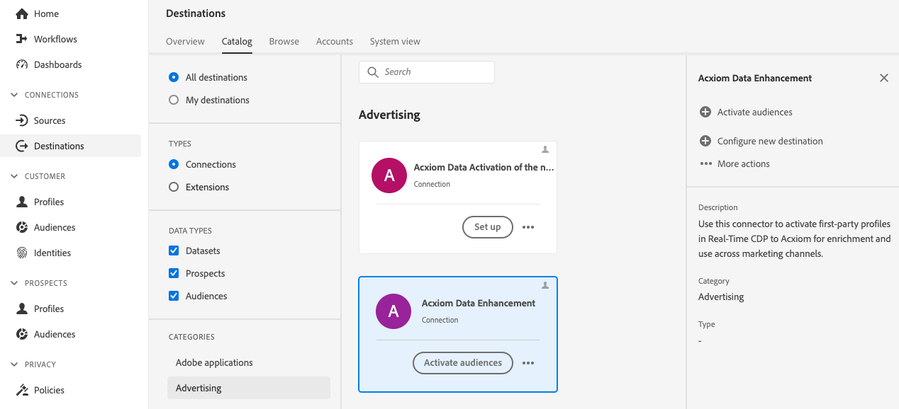

# [!DNL Acxiom Data Enhancement]目标连接

>[!NOTE]
>
>[!DNL Acxiom Data Enhancement]目标为测试版。  此目标连接器和文档页面由Acxiom团队创建和维护。 如有任何查询或更新请求，请直接通过acxiom-adobe-help@acxiom.com联系他们。

## 概述 {#overview}

使用[!DNL Acxiom Data Enhancement]连接器可向您的客户配置文件提供其他描述性数据，以用于分析、分段和定位应用程序。 由于有数百个元素可用，因此可让您更好地划分数据和建模数据，从而实现更准确的定位和预测建模。

本教程提供了使用[!DNL Acxiom Data Enhancement]用户界面创建[!DNL Adobe Experience Platform]目标连接和数据流的步骤。 此连接器使用Amazon S3作为放置点将数据发送到Acxiom增强服务。

## 用例 {#use-cases}

为了帮助您更好地了解您应如何以及何时使用[!DNL Acxiom Data Enhancement]目标，以下是[!DNL Adobe Experience Platform]客户可以通过使用此目标解决的示例用例。

### 增强客户数据 {#enhance-customer-data}

营销专业人士应使用此连接器，通过将选定的描述性元素附加到客户配置文件中，并使用这些元素更好地定位活动，以提高其外联策略的效率。

例如，作为营销人员，您可能希望通过用其他数据丰富现有受众的用户档案，从而加深对现有受众的了解。 这样做将改进分段和定位策略，从而提高营销活动的个性化和转化。

用例通过目标和源连接器的组合执行。

首先，您可以导出现有客户记录以使用此目标连接器进行扩充。 Acxiom的服务将搜索文件、检索文件、使用Acxiom的数据扩充文件并生成文件。

然后，客户将使用相应的[Acxiom数据摄取](/help/sources/connectors/data-partners/acxiom-data-ingestion.md)源卡将水合的客户配置文件摄取回Adobe [!DNL Real-Time CDP]。

## 先决条件 {#prerequisites}

>[!IMPORTANT]
>
>* 若要连接到目标，您需要&#x200B;**[!UICONTROL View Destinations]**&#x200B;和&#x200B;**[!UICONTROL Manage Destinations]**、**[!UICONTROL Activate Destinations]**、**[!UICONTROL View Profiles]**&#x200B;和&#x200B;**[!UICONTROL View Segments]** [访问控制权限](/help/access-control/home.md#permissions)。 阅读[访问控制概述](/help/access-control/ui/overview.md)或联系您的产品管理员以获取所需的权限。
>* 要导出&#x200B;*标识*，您需要&#x200B;**[!UICONTROL View Identity Graph]** [访问控制权限](/help/access-control/home.md#permissions)。  {width="100" zoomable="yes"}

## 支持的受众 {#supported-audiences}

此部分介绍可将哪种类型的受众导出到此目标。

| 受众来源 | 受支持 | 描述 |
|---------|----------|----------|
| [!DNL Segmentation Service] | 是 | 通过Experience Platform [分段服务](../../../segmentation/home.md)生成的受众。 |
| 所有其他受众来源 | 否 | 此类别包括通过[!DNL Segmentation Service]生成的受众之外的所有受众来源。 了解[各种受众源](/help/segmentation/ui/audience-portal.md#customize)。 一些示例包括： <ul><li> 自定义上传受众[从CSV文件导入](../../../segmentation/ui/audience-portal.md#import-audience)到Experience Platform，</li><li> 相似的受众， </li><li> 联合受众， </li><li> 其他Experience Platform应用程序（如[!DNL Adobe Journey Optimizer]）中生成的受众， </li><li> 等等。 </li></ul> |

{style="table-layout:auto"}

按受众数据类型划分的受众支持：

| 受众数据类型 | 受支持 | 描述 | 用例 |
|--------------------|-----------|-------------|-----------|
| [人员受众](/help/segmentation/types/people-audiences.md) | 是 | 根据客户个人资料，允许您针对特定的营销活动人群组进行定位。 | 频繁购买者，购物车放弃者 |
| [帐户受众](/help/segmentation/types/account-audiences.md) | 否 | 针对特定组织内的个人，制定基于帐户的营销策略。 | B2B营销 |
| [潜在客户受众](/help/segmentation/types/prospect-audiences.md) | 否 | 定位尚未成为客户但与目标受众具有共同特征的个人。 | 利用第三方数据发现潜在客户 |
| [数据集导出](/help/catalog/datasets/overview.md) | 否 | 存储在[!DNL Adobe Experience Platform]数据湖中的结构化数据的集合。 | 报告、数据科学工作流 |

{style="table-layout:auto"}

## 导出类型和频率 {#export-type-frequency}

有关目标导出类型和频率的信息，请参阅下表。

| 项目 | 类型 | 注释 |
|------------------|--------------------------------|------------------------------------------------------------------------------------------------------------------------------------------------------------------------------------------------------------------------------------------------------------------------------------------------------------------------|
| 导出类型 | **[!UICONTROL Profile-based]** | 您正在导出区段的所有成员，以及所需的架构字段（例如：电子邮件地址、电话号码、姓氏），如[目标激活工作流](/help/destinations/ui/activate-batch-profile-destinations.md#select-attributes)的选择配置文件属性屏幕中所选。 |
| 导出频率 | **[!UICONTROL Batch]** | 批量目标以三、六、八、十二或二十四小时的增量将文件导出到下游平台。 阅读有关[基于批处理文件的目标](/help/destinations/destination-types.md#file-based)的详细信息。 |

{style="table-layout:auto"}

## 连接到目标 {#connect}

>[!IMPORTANT]
>
>若要连接到目标，您需要&#x200B;**[!UICONTROL View Destinations]**&#x200B;和&#x200B;**[!UICONTROL Manage and Activate Dataset Destinations]** [访问控制权限](/help/access-control/home.md#permissions)。 阅读[访问控制概述](/help/access-control/ui/overview.md)或联系您的产品管理员以获取所需的权限。

要连接到此目标，请按照[目标配置教程](../../ui/connect-destination.md)中描述的步骤操作。 在目标配置工作流中，填写下面两个部分中列出的字段。

### 验证目标 {#authenticate}

要验证目标，请填写必填字段并选择&#x200B;**[!UICONTROL Connect to destination]**。

要在Experience Platform上访问存储段，您需要为以下凭据提供有效值：

| 凭据 | 描述 |
|---------------|----------------------------------------------------------------------------------------------------------|
| S3访问密钥 | 存储段的访问密钥ID。 您可以从[!DNL Acxiom]团队中检索此值。 |
| S3密钥 | 存储桶的密钥ID。 您可以从[!DNL Acxiom]团队中检索此值。 |
| 存储桶名称 | 这是将共享文件的存储段。 您可以从[!DNL Acxiom]团队中检索此值。 |

### 新建帐户 {#new-account}

要定义新的Acxiom Managed S3位置，请执行以下操作：

### 现有帐户 {#existing-account}

已使用[!DNL Acxiom Data Enhancement]目标定义的帐户将显示在列表弹出窗口中。 选中后，您可以在右边栏中查看有关帐户的详细信息。 当您导航到&#x200B;**[!UICONTROL Destinations]** > **[!UICONTROL Accounts]**&#x200B;时，从UI查看示例；

### 填写目标详细信息 {#destination-details}

要配置目标的详细信息，请填写下面的必需和可选字段。 UI中字段旁边的星号表示该字段为必填字段。

* **名称（必需）** — 目标将保存到的名称
* **描述** — 目标的简短用途说明
* **Bucket名称（必需）** - S3上设置的Amazon S3存储段的名称
* **文件夹路径（必需）** — 如果使用存储段中的子目录，则必须定义路径，或使用“/”引用根路径。
* **文件类型** — 选择Experience Platform应用于导出文件的格式。 目前，Acxiom处理所需的唯一文件类型是CSV

>[!IMPORTANT]
>
>在选择CSV选项&#x200B;*分隔符*、*引号字符*、*转义字符*、*空值*、*空值*、*压缩格式*&#x200B;和&#x200B;*包含清单文件*&#x200B;选项时，以下文档将更详细地解释这些设置[配置格式设置选项](../../ui/batch-destinations-file-formatting-options.md)。

### 启用警报 {#enable-alerts}

您可以启用警报，以接收有关发送到目标的数据流状态的通知。 从列表中选择警报以订阅接收有关数据流状态的通知。 有关警报的详细信息，请参阅[使用UI订阅目标警报的指南](../../ui/alerts.md)。

完成提供目标连接的详细信息后，选择&#x200B;**[!UICONTROL Next]**。

## 激活此目标的受众 {#activate}

>[!IMPORTANT]
>
>* 若要激活数据，您需要&#x200B;**[!UICONTROL View Destinations]**、**[!UICONTROL Activate Destinations]**、**[!UICONTROL View Profiles]**&#x200B;和&#x200B;**[!UICONTROL View Segments]** [访问控制权限](/help/access-control/home.md#permissions)。 阅读[访问控制概述](/help/access-control/ui/overview.md)或联系您的产品管理员以获取所需的权限。
>* 要导出&#x200B;*标识*，您需要&#x200B;**[!UICONTROL View Identity Graph]** [访问控制权限](/help/access-control/home.md#permissions)。  {width="100" zoomable="yes"}

有关将受众激活到此目标的说明，请阅读[将受众数据激活到批处理配置文件导出目标](/help/destinations/ui/activate-batch-profile-destinations.md)。

### 映射建议 {#mapping-suggestions}

在Acxiom端正确处理文件需要名称和地址元素。 虽然并非所有元素都是必需的，但尽可能多地提供将有助于成功匹配。

下表列出了目标端的属性，这些属性由Acxiom处理使用，客户可将配置文件属性映射到这些属性。 将这些元素视为建议，因为并非所有元素都是必需的，并且源值将取决于帐户的需求。

| 目标字段 | Source描述 |
|--------------|-------------------------------------------------------------|
| name | Experience Platform中的`person.name.fullName`值。 |
| firstName | Experience Platform中的`person.name.firstName`值。 |
| 姓氏 | Experience Platform中的`person.name.lastName`值。 |
| address1 | Experience Platform中的`mailingAddress.street1`值。 |
| address2 | Experience Platform中的`mailingAddress.street2`值。 |
| 城市 | Experience Platform中的`mailingAddress.city`值。 |
| state | Experience Platform中的`mailingAddress.state`值。 |
| zip | Experience Platform中的`mailingAddress.postalCode`值。 |

>[!NOTE]
>
>如果映射数据流中未列出的其他字段，这些字段将包含在数据导出中，但Acxiom处理会忽略这些字段。

## 验证数据导出 {#exported-data}

要验证数据是否已成功导出，请检查您的[!DNL Amazon S3 Storage]存储段并确保导出的文件包含预期的配置文件人口。

## 后续步骤 {#next-steps}

通过学习本教程，您已成功创建数据流以将配置文件数据从Experience Platform导出到[!DNL Acxiom]托管的S3位置。 接下来，您需要联系Acxiom代表，提供帐户名称、文件名和存储段路径，以便能够设置处理。

## 数据使用和治理 {#data-usage-governance}

在处理您的数据时，所有[!DNL Adobe Experience Platform]目标都符合数据使用策略。 有关[!DNL Adobe Experience Platform]如何实施数据治理的详细信息，请阅读[数据治理概述](/help/data-governance/home.md)。

## 其他资源 {#additional-resources}

*Acxiom Infobase：* https://www.acxiom.com/wp-content/uploads/2022/02/fs-acxiom-infobase_AC-0268-22.pdf
