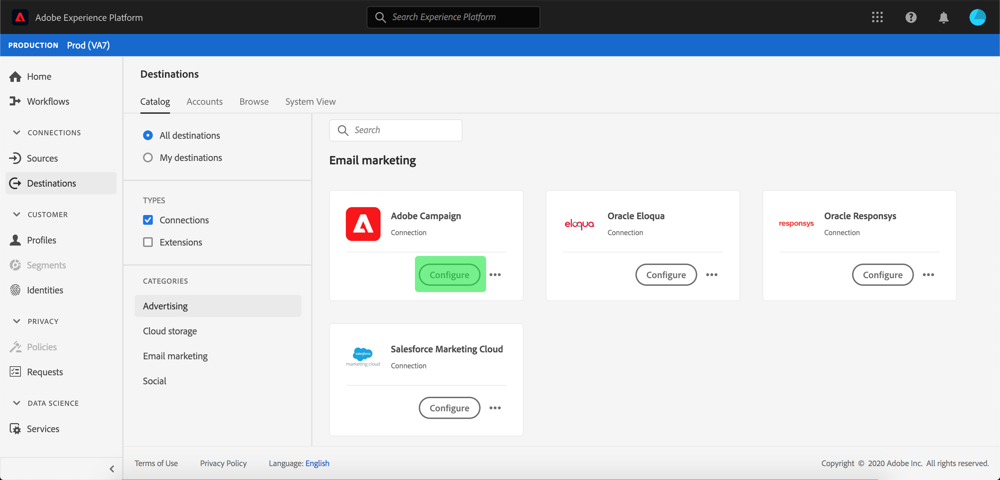

# Adobe Campaign连接

Adobe Campaign是一套解决方案，可帮助您在所有线上和线下渠道个性化和投放活动。 有关详细信息，请参阅[Campaign Classic](https://experienceleague.adobe.com/docs/campaign-classic/using/getting-started/starting-with-adobe-campaign/about-adobe-campaign-classic.html)快速入门。

要向Adobe Campaign发送区段数据，您必须先在Adobe Experience Platform中[连接目标](#connect-destination)，然后[设置从存储位置导入](#import-data-into-campaign)的Adobe Campaign。

## 导出类型{#export-type}

**基于用户档案**  — 您正在导出区段的所有成员，以及所需的模式字段(例如：电子邮件地址、电话号码、姓氏)，在目标激活工 **[!UICONTROL Select attributes]** 作流的步骤 [中选择](../../ui/activate-destinations.md#select-attributes)。

## 连接目标{#connect-destination}

在&#x200B;**[!UICONTROL Connections]** > **[!UICONTROL Destinations]**&#x200B;中，选择“Adobe Campaign”，然后选择&#x200B;**[!UICONTROL Configure]**。

>[!NOTE]
>
>如果与此目标的连接已存在，您可以在目标卡上看到&#x200B;**[!UICONTROL Activate]**&#x200B;按钮。 有关[!UICONTROL Activate]和[!UICONTROL Configure]之间差异的详细信息，请参阅目标工作区文档的[目录](../../ui/destinations-workspace.md#catalog)部分。

在Connect目标工作流的&#x200B;**[!UICONTROL Account]**&#x200B;步骤中，为存储位置选择&#x200B;**[!UICONTROL Connection type]**。 对于Adobe Campaign，您可以选择&#x200B;**[!UICONTROL Amazon S3]**、**[!UICONTROL SFTP with Password]**、**[!UICONTROL SFTP with SSH Key]**&#x200B;和&#x200B;**[!UICONTROL Azure Blob]**。 向Adobe Campaign发送数据的首选方法是通过[!DNL Amazon S3]或[!DNL Azure Blob]。 根据连接类型，填写以下信息，然后选择&#x200B;**[!UICONTROL Connect]**。

- 对于&#x200B;**[!UICONTROL Amazon S3]**&#x200B;连接，必须提供访问密钥ID和密钥访问密钥。
- 对于&#x200B;**[!UICONTROL SFTP with Password]**&#x200B;连接，必须提供域、端口、用户名和密码。
- 对于&#x200B;**[!UICONTROL SFTP with SSH Key]**&#x200B;连接，必须提供域、端口、用户名和密码。
- 对于&#x200B;**[!UICONTROL Azure Blob]**&#x200B;连接，必须提供连接字符串。

或者，您也可以附加RSA格式的公钥，以便将PGP/GPG加密添加到&#x200B;**[!UICONTROL Key]**&#x200B;部分下的导出文件。 请注意，此公钥&#x200B;**必须**&#x200B;写入为Base64编码字符串。

在&#x200B;**[!UICONTROL Account authentication]**&#x200B;中，填写目标的相关信息，如下所示：
- **[!UICONTROL Name]**:为目标选择相关名称。
- **[!UICONTROL Description]**:输入目标的说明。
- **[!UICONTROL Bucket Name]**: *对于S3连接*。输入S3存储段的位置，其中[!DNL Platform]会将导出数据存储为CSV或制表符分隔的文件。
- **[!UICONTROL Folder Path]**:在存储位置提供将导出数 [!DNL Platform] 据存储为CSV或制表符分隔文件的路径。
- **[!UICONTROL Container]**: *用于Blob连接*。包含文件夹路径的Blob的容器在中。
- **[!UICONTROL File Format]**: **CSV** 或 **TAB_DELIMITED**。选择要导出到存储位置的文件格式。
- **[!UICONTROL Marketing actions]**:营销活动指示要将数据导出到目标的目的。您可以从Adobe定义的营销活动中进行选择，也可以创建自己的营销活动。 有关营销操作的详细信息，请参阅[数据使用策略概述](../../../data-governance/policies/overview.md)页。 另请参阅同一文档中的[Adobe定义的营销操作](../../../data-governance/policies/overview.md#core-actions)。

填写上面的字段后选择&#x200B;**[!UICONTROL Create destination]**。 目标现已连接，您可以[将区段](../../ui/activate-destinations.md)激活到目标。

## 激活区段{#activate-segments}

有关区段用户档案工作流的信息，请参阅[将激活和区段激活到目标](../../ui/activate-destinations.md)。

## 目标属性{#destination-attributes}

当[将区段](../../ui/activate-destinations.md)激活到Adobe Campaign目标时，建议您从[合并模式](../../../profile/home.md#profile-fragments-and-union-schemas)中选择唯一标识符。 选择唯一标识符以及要导出到目标的任何其他XDM字段。 有关详细信息，请参阅电子邮件营销目标文档中的[选择要用作导出文件中目标属性的模式字段](./overview.md#destination-attributes)。

## 导出的数据{#exported-data}

对于[!DNL Adobe Campaign]目标，[!DNL Platform]会在您提供的存储位置创建制表符分隔的`.txt`或`.csv`文件。 有关这些文件的详细信息，请参阅区段存储教程中的[电子邮件营销目标和云激活目标](../../ui/activate-destinations.md#esp-and-cloud-storage)。

## 设置Adobe Campaign{#import-data-into-campaign}中的数据导入

>[!IMPORTANT]
>
>- 执行此集成时，请记住SFTP存储限制、数据库存储限制和Adobe Campaign合同中的有效用户档案限制。
>- 您需要使用[!DNL Campaign]工作流在Adobe Campaign中计划、导入和映射导出的区段。 请参阅Adobe Campaign Classic文档中的[设置循环导入](https://experienceleague.adobe.com/docs/campaign-classic/using/automating-with-workflows/use-cases/data-management/recurring-import-workflow.html)和Adobe Campaign Standard文档中的[关于数据管理活动](https://experienceleague.adobe.com/docs/campaign-standard/using/managing-processes-and-data/data-management-activities/about-data-management-activities.html)。
>- 向Adobe Campaign发送数据的首选方法是通过[!DNL Amazon S3]或[!DNL Azure Blob]。

将[!DNL Platform]连接到[!DNL Amazon S3]或[!DNL Azure Blob]存储后，必须将存储位置中的数据导入设置为Adobe Campaign。 要了解如何完成此操作，请参阅以下Adobe Campaign文档页：
- [开始使用Adobe Campaign Classic文档中](https://experienceleague.adobe.com/docs/campaign-classic/using/getting-started/importing-and-exporting-data/get-started-data-import-export.html) 的 [数据导入和](https://experienceleague.adobe.com/docs/campaign-classic/using/automating-with-workflows/action-activities/data-loading--file-.html) 导出数据加载（文件）。
- [开始使用Adobe Campaign Standard文档中](https://experienceleague.adobe.com/docs/campaign-standard/using/managing-processes-and-data/get-started-workflows.html) 的流 [程和](https://experienceleague.adobe.com/docs/campaign-standard/using/managing-processes-and-data/data-management-activities/load-file.html) 数据管理和加载文件。