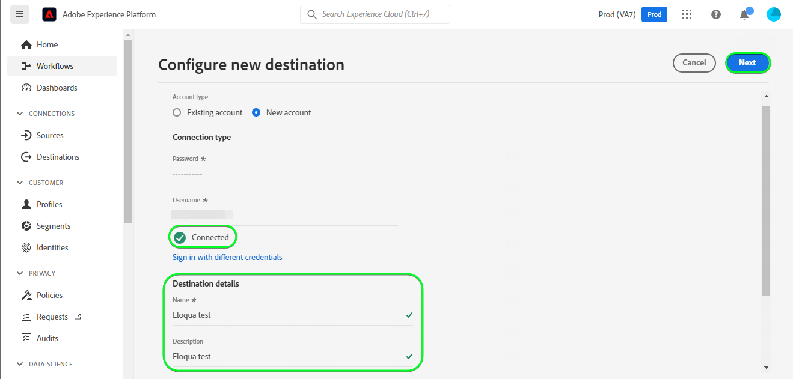

# [!DNL (API) Oracle Eloqua]连接

[[!DNL Oracle Eloqua]](https://www.oracle.com/cx/marketing/automation/)使营销人员能够计划和执行营销活动，同时为其潜在客户提供个性化的客户体验。 借助集成的商机管理和轻松的营销活动创建，它可帮助营销人员在其购买者的历程中在正确的时间吸引正确的受众，并进行优雅的扩展以跨渠道（包括电子邮件、显示搜索、视频和移动设备）触及受众。 销售团队能够以更快的速度完成更多交易，从而通过实时洞察提高营销投资回报率。

此[!DNL Adobe Experience Platform] [目标](/help/destinations/home.md)利用[!DNL Oracle Eloqua] REST API中的[更新联系人](https://docs.oracle.com/en/cloud/saas/marketing/eloqua-rest-api/op-api-rest-1.0-data-contact-id-put.html)操作，该操作允许您&#x200B;**将受众中的身份**&#x200B;更新为[!DNL Oracle Eloqua]。

[!DNL Oracle Eloqua]使用[基本身份验证](https://docs.oracle.com/en/cloud/saas/marketing/eloqua-rest-api/Authentication_Basic.html)与[!DNL Oracle Eloqua] REST API通信。 下面的[向目标身份验证](#authenticate)部分中进一步提供了向您的[!DNL Oracle Eloqua]实例进行身份验证的说明。

## 用例 {#use-cases}

在线平台的营销部门希望向策划的潜在客户受众广播基于电子邮件的营销活动。 该平台的营销团队可以通过Adobe Experience Platform更新现有潜在客户信息，根据受众自己的离线数据构建受众，并将这些受众发送到[!DNL Oracle Eloqua]，然后可以使用这些受众发送营销活动电子邮件。

## 先决条件 {#prerequisites}

### Experience Platform先决条件 {#prerequisites-in-experience-platform}

在将数据激活到[!DNL Oracle Eloqua]目标之前，您必须在[!DNL Experience Platform]中创建一个[架构](/help/xdm/schema/composition.md)、[数据集](https://experienceleague.adobe.com/docs/platform-learn/tutorials/data-ingestion/create-datasets-and-ingest-data.html?lang=zh-Hans)和[区段](https://experienceleague.adobe.com/docs/platform-learn/tutorials/segments/create-segments.html?lang=zh-Hans)。

如果您需要受众状态指南，请参阅Experience Platform有关[受众成员资格详细信息架构字段组](/help/xdm/field-groups/profile/segmentation.md)的文档。

### [!DNL Oracle Eloqua]先决条件 {#prerequisites-destination}

要将数据从Experience Platform导出到您的[!DNL Oracle Eloqua]帐户，您需要拥有[!DNL Oracle Eloqua]帐户。

此外，您至少需要[!DNL Oracle Eloqua]实例的&#x200B;*“高级用户 — 营销权限”*。 有关指导，请参阅[安全用户访问](https://docs.oracle.com/en/cloud/saas/marketing/eloqua-user/Help/SecurityOverview/SecuredUserAccess.htm)页面上的&#x200B;*“安全组”*&#x200B;部分。 目标需要在调用[!DNL Oracle Eloqua] API时以编程方式[确定您的基本URL](https://docs.oracle.com/en/cloud/saas/marketing/eloqua-rest-api/DeterminingBaseURL.html)，也需要该访问权限。

#### 收集[!DNL Oracle Eloqua]凭据 {#gather-credentials}

在对[!DNL Oracle Eloqua]目标进行身份验证之前，请记下以下项目：

| 凭据 | 描述 |
| --- | --- |
| `Company Name` | 与您的[!DNL Oracle Eloqua]帐户关联的公司名称。 <br>您稍后将使用`Company Name`和[!DNL Oracle Eloqua] `Username`作为连接字符串，在[对目标](#authenticate)进行身份验证时用作&#x200B;**[!UICONTROL 用户名]**。 |
| `Username` | [!DNL Oracle Eloqua]帐户的用户名。 |
| `Password` | [!DNL Oracle Eloqua]帐户的密码。 |
| `Pod` | [!DNL Oracle Eloqua]支持多个数据中心，每个数据中心具有唯一的域名。 [!DNL Oracle Eloqua]将这些称为“pods”，目前共有7个，即p01、p02、p03、p04、p06、p07和p08。 要获取您所在的POD，请登录到[!DNL Oracle Eloqua]，并在成功登录后记下浏览器中的URL。 例如，如果浏览器URL为`secure.p01.eloqua.com`，则`pod`为`p01`。 有关其他指导，请参阅[确定POD](https://community.oracle.com/topliners/discussion/4470225/determining-your-pod-number-for-oracle-eloqua)页面。 |

请参阅[登录 [!DNL Oracle Eloqua]](https://docs.oracle.com/en/cloud/saas/marketing/eloqua-user/Help/Administration/Tasks/SigningInToEloqua.htm#Signing)以获取指导。

## 护栏 {#guardrails}

>[!NOTE]
>
>* 使用在&#x200B;**[!UICONTROL 选择区段]**&#x200B;步骤期间选择的受众的名称自动创建[!DNL Oracle Eloqua]自定义联系人字段。

* [!DNL Oracle Eloqua]的最大限制为250个自定义联系人字段。
* 在导出新受众之前，请确保[!DNL Oracle Eloqua]内的Experience Platform受众数和现有受众数不超过此限制。
* 如果超过此限制，您将在Experience Platform中遇到错误。 这是因为[!DNL Oracle Eloqua] API无法验证请求，并以 — *400做出响应：存在验证错误* — 描述问题的错误消息。
* 如果您已达到以上指定的限制，则需要从目标中删除现有映射，并删除[!DNL Oracle Eloqua]帐户中相应的自定义联系人字段，然后才能导出更多区段。

* 有关其他限制的信息，请参阅[[!DNL Oracle Eloqua] 创建联系人字段](https://docs.oracle.com/en/cloud/saas/marketing/eloqua-user/Help/ContactFields/Tasks/CreatingContactFields.htm)页面。

## 支持的身份 {#supported-identities}

[!DNL Oracle Eloqua]支持更新下表中描述的标识。 了解有关[标识](/help/identity-service/features/namespaces.md)的更多信息。

| 目标身份 | 描述 | 必需 |
|---|---|---|
| `EloquaId` | 联系人的唯一标识符。 | 是 |

## 导出类型和频率 {#export-type-frequency}

有关目标导出类型和频率的信息，请参阅下表。

| 项目 | 类型 | 注释 |
---------|----------|---------|
| 导出类型 | **[!UICONTROL 基于配置文件]** | <ul><li>您正在根据字段映射导出区段的所有成员，以及所需的架构字段&#x200B;*（例如：电子邮件地址、电话号码、姓氏）*。</li><li> 对于Experience Platform中的每个选定受众，相应的[!DNL Oracle Eloqua]区段状态将从Experience Platform中更新为其受众状态。</li></ul> |
| 导出频率 | **[!UICONTROL 正在流式传输]** | <ul><li>流目标为基于API的“始终运行”连接。 根据受众评估在Experience Platform中更新用户档案后，连接器会立即将更新发送到下游目标平台。 阅读有关[流式目标](/help/destinations/destination-types.md#streaming-destinations)的更多信息。</li></ul> |

{style="table-layout:auto"}

## 连接到目标 {#connect}

>[!IMPORTANT]
>
>若要连接到目标，您需要&#x200B;**[!UICONTROL 查看目标]**&#x200B;和&#x200B;**[!UICONTROL 管理目标]** [访问控制权限](/help/access-control/home.md#permissions)。 阅读[访问控制概述](/help/access-control/ui/overview.md)或联系您的产品管理员以获取所需的权限。

要连接到此目标，请按照[目标配置教程](../../ui/connect-destination.md)中描述的步骤操作。 在配置目标工作流中，填写下面两个部分中列出的字段。

在&#x200B;**[!UICONTROL 目标]** > **[!UICONTROL 目录]**&#x200B;中，搜索[!DNL (API) Oracle Eloqua]。 或者，您可以在&#x200B;**[!UICONTROL 电子邮件营销]**&#x200B;类别下找到它。

### 验证目标 {#authenticate}

>[!CONTEXTUALHELP]
>id="platform_destinations_apioracleeloqua_companyname_username"
>title="公司名称\用户名"
>abstract="在此字段中填写您的公司名称和来自 Oracle Eloqua 的用户名，格式为 `{COMPANY_NAME}\{USERNAME}`"

填写下面的必填字段。 有关任何指导，请参阅[收集 [!DNL Oracle Eloqua] 凭据](#gather-credentials)部分。
* **[!UICONTROL 密码]**： [!DNL Oracle Eloqua]帐户的密码。
* **[!UICONTROL 用户名]**：由[!DNL Oracle Eloqua]公司名称和[!DNL Oracle Eloqua]用户名组成的连接字符串。<br>连接值采用`{COMPANY_NAME}\{USERNAME}`的形式。<br>注意，不要使用任何大括号或空格并保留`\`。 <br>例如，如果您的[!DNL Oracle Eloqua]公司名称为`MyCompany`，[!DNL Oracle Eloqua]用户名为`Username`，则您在&#x200B;**[!UICONTROL 用户名]**&#x200B;字段中使用的串联值为`MyCompany\Username`。

要验证到目标，请选择&#x200B;**[!UICONTROL 连接到目标]**。


如果提供的详细信息有效，则UI会显示&#x200B;**[!UICONTROL 已连接]**&#x200B;状态，并带有绿色复选标记。 然后，您可以继续执行下一步。

### 填写目标详细信息 {#destination-details}

>[!CONTEXTUALHELP]
>id="platform_destinations_apioracleeloqua_pod"
>title="Pod"
>abstract="要查找您的 Pod 编号，请登录到 Oracle Eloqua。成功登录后，记下浏览器中的 URL。 "

<!-- >additional-url="https://support.oracle.com/knowledge/Oracle%20Cloud/2307176_1.html" text="Oracle Knowledge base - find out your Pod number" -->

要配置目标的详细信息，请填写下面的必需和可选字段。 UI中字段旁边的星号表示该字段为必填字段。


* **[!UICONTROL 名称]**：将来用于识别此目标的名称。
* **[!UICONTROL 描述]**：可帮助您将来识别此目标的描述。
* **[!UICONTROL Pod]**：若要获取您所在的`pod`，请登录到[!DNL Oracle Eloqua]，并在成功登录后记下浏览器中的URL。 例如，如果您的浏览器URL为`secure.p01.eloqua.com`，则需要选择的`pod`值为`p01`。 有关其他指导，请参阅[收集 [!DNL Oracle Eloqua] 凭据](#gather-credentials)部分。

### 启用警报 {#enable-alerts}

您可以启用警报，以接收有关发送到目标的数据流状态的通知。 从列表中选择警报以订阅接收有关数据流状态的通知。 有关警报的详细信息，请参阅[使用UI订阅目标警报的指南](../../ui/alerts.md)。

完成提供目标连接的详细信息后，选择&#x200B;**[!UICONTROL 下一步]**。

## 激活此目标的受众 {#activate}

>[!IMPORTANT]
> 
>* 若要激活数据，您需要&#x200B;**[!UICONTROL 查看目标]**、**[!UICONTROL 激活目标]**、**[!UICONTROL 查看配置文件]**&#x200B;和&#x200B;**[!UICONTROL 查看区段]** [访问控制权限](/help/access-control/home.md#permissions)。 阅读[访问控制概述](/help/access-control/ui/overview.md)或联系您的产品管理员以获取所需的权限。
>* 要导出&#x200B;*标识*，您需要&#x200B;**[!UICONTROL 查看标识图形]** [访问控制权限](/help/access-control/home.md#permissions)。<br> {width="100" zoomable="yes"}

有关将受众激活到此目标的说明，请阅读[将配置文件和受众激活到流式受众导出目标](/help/destinations/ui/activate-segment-streaming-destinations.md)。

### 映射注意事项和示例 {#mapping-considerations-example}

要将受众数据从Adobe Experience Platform正确发送到[!DNL Oracle Eloqua]目标，您需要完成字段映射步骤。 映射包括在Experience Platform帐户中的Experience Data Model (XDM)架构字段与其与目标中的相应等效字段之间创建链接。

要将XDM字段映射到[!DNL Oracle Eloqua]目标字段，请执行以下步骤：

1. 在&#x200B;**[!UICONTROL 映射]**&#x200B;步骤中，选择&#x200B;**[!UICONTROL 添加新映射]**。 您将在屏幕上看到一个新映射行。
1. 在&#x200B;**[!UICONTROL 选择源字段]**&#x200B;窗口中，选择&#x200B;**[!UICONTROL 选择属性]**&#x200B;类别并选择XDM属性，或选择&#x200B;**[!UICONTROL 选择身份命名空间]**&#x200B;并选择身份。
1. 在&#x200B;**[!UICONTROL 选择目标字段]**&#x200B;窗口中，选择&#x200B;**[!UICONTROL 选择标识命名空间]**&#x200B;并选择标识，或选择&#x200B;**[!UICONTROL 选择自定义属性]**&#x200B;并在&#x200B;**[!UICONTROL 属性名称]**&#x200B;字段中键入所需的属性名称。 您提供的属性名称应与[!DNL Oracle Eloqua]中的现有联系人属性匹配。 有关您可以在[!DNL Oracle Eloqua]中使用的确切属性名称，请参阅[[!DNL create a contact]](https://docs.oracle.com/en/cloud/saas/marketing/eloqua-rest-api/op-api-rest-1.0-data-contact-post.html)。

   * 重复这些步骤以在XDM配置文件架构和[!DNL Oracle Eloqua]之间添加所需的和任何所需的属性映射：

     | 源字段 | 目标字段 | 必需 |
     |---|---|---|
     | `IdentityMap: Eid` | `Identity: EloquaId` | 是 |
     | `xdm: personalEmail.address` | `Attribute: emailAddress` | 是 |
     | `xdm: personName.firstName` | `Attribute: firstName` | |
     | `xdm: personName.lastName` | `Attribute: lastName` | |
     | `xdm: workAddress.street1` | `Attribute: address1` | |
     | `xdm: workAddress.street2` | `Attribute: address2` | |
     | `xdm: workAddress.street3` | `Attribute: address3` | |
     | `xdm: workAddress.postalCode` | `Attribute: postalCode` | |
     | `xdm: workAddress.country` | `Attribute: country` | |
     | `xdm: workAddress.city` | `Attribute: city` | |

   * 下面显示了具有上述映射的示例：

     

>[!IMPORTANT]
>
>* 在&#x200B;**[!UICONTROL 目标字段]**&#x200B;中指定的属性的名称应该与[[!DNL Create a contact]](https://docs.oracle.com/en/cloud/saas/marketing/eloqua-rest-api/op-api-rest-1.0-data-contact-post.html)中指定的名称完全相同，因为这些属性将构成请求正文。
>* 在&#x200B;**[!UICONTROL Source字段]**&#x200B;中指定的属性不遵循任何此类限制。 您可以根据需要进行映射，但是，如果推送到[!DNL Oracle Eloqua]时数据格式不正确，则会导致错误。 例如，您可以映射&#x200B;**[!UICONTROL Source字段]**&#x200B;标识命名空间`contact key`、`ABC ID`等。 到&#x200B;**[!UICONTROL 目标字段]** ：在确保ID值与[!DNL Oracle Eloqua]接受的格式匹配后，`EloquaId`。
>* `EloquaID`映射是更新与标识对应的属性的必备项。
>* 需要`emailAddress`映射。 如果不使用这项调用，API将引发如下所示的错误：
>
>```json
>{
>     "type":"ObjectValidationError",
>     "container":{
>           "type":"ObjectKey",
>           "objectType":"Contact"
>     },
>     "property":"emailAddress",
>     "requirement":{
>           "type":"EmailAddressRequirement"
>     },
>     "value":"<null>"
>}
>```

完成提供目标连接的映射后，请选择&#x200B;**[!UICONTROL 下一步]**。

>[!NOTE]
>
>在向[!DNL Oracle Eloqua]发送联系人字段信息时，目标会在每次执行时自动为所选受众名称添加唯一标识符的后缀。 这可确保与受众名称对应的联系人字段名称不重叠。 请参阅包含使用受众名称创建的自定义联系人字段的[!DNL Oracle Eloqua]联系人详细信息页面的[验证数据导出](#exported-data)部分屏幕快照示例。

## 验证数据导出 {#exported-data}

要验证您是否正确设置了目标，请执行以下步骤：

1. 选择&#x200B;**[!UICONTROL 目标]** > **[!UICONTROL 浏览]**&#x200B;并导航到目标列表。
1. 接下来，选择目标并切换到&#x200B;**[!UICONTROL 激活数据]**&#x200B;选项卡，然后选择受众名称。
   

1. 监控受众摘要，并确保用户档案计数对应于区段中的计数。
   

1. 登录到[!DNL Oracle Eloqua]网站，然后导航到&#x200B;**[!UICONTROL 联系人概述]**&#x200B;页面以检查是否已添加受众中的配置文件。 要查看受众状态，请深入到&#x200B;**[!UICONTROL 联系人详细信息]**&#x200B;页面，并检查是否创建了以选定受众名称作为其前缀的联系人字段。


## 数据使用和治理 {#data-usage-governance}

在处理您的数据时，所有[!DNL Adobe Experience Platform]目标都符合数据使用策略。 有关[!DNL Adobe Experience Platform]如何实施数据治理的详细信息，请参阅[数据治理概述](/help/data-governance/home.md)。

## 错误和故障排除 {#errors-and-troubleshooting}

创建目标时，您可能会收到以下错误消息之一： `400: There was a validation error`或`400 BAD_REQUEST`。 当您超过[护栏](#guardrails)部分中所述的250个自定义联系人字段限制时，会发生这种情况。 要修复此错误，请确保在[!DNL Oracle Eloqua]中未超出自定义联系人字段限制。


请参阅[[!DNL Oracle Eloqua] HTTP状态代码](https://docs.oracle.com/en/cloud/saas/marketing/eloqua-rest-api/APIRequests_HTTPStatusCodes.html)和[[!DNL Oracle Eloqua] 验证错误](https://docs.oracle.com/en/cloud/saas/marketing/eloqua-rest-api/APIRequests_HTTPValidationErrors.html)页，获取包含说明的状态和错误代码的完整列表。

## 其他资源 {#additional-resources}

有关其他详细信息，请参阅[!DNL Oracle Eloqua]文档：

* [Oracle Eloqua Marketing Automation](https://docs.oracle.com/en/cloud/saas/marketing/eloqua.html)
* [适用于Oracle Eloqua Marketing Cloud服务的REST API](https://docs.oracle.com/en/cloud/saas/marketing/eloqua-rest-api/rest-endpoints.html)

### Changelog

此部分捕获此目标连接器的功能和重要文档更新。

+++ 查看更改日志

| 发行月份 | 更新类型 | 描述 |
|---|---|---|
| 2023 年 4 月 | 文档更新 | <ul><li>我们更新了[用例](#use-cases)部分，更清楚地说明了客户何时将从使用此目标中受益。</li> <li>我们更新了[映射](#mapping-considerations-example)部分，提供了强制映射和可选映射的明确示例。</li> <li>我们更新了[连接到目标](#connect)部分，并提供有关如何使用[!DNL Oracle Eloqua]公司名称和[!DNL Oracle Eloqua]用户名构造&#x200B;**[!UICONTROL 用户名]**&#x200B;字段的串联值的示例。 (PLATIR-28343)</li><li>我们更新了[收集 [!DNL Oracle Eloqua] 凭据](#gather-credentials)和[填写目标详细信息](#destination-details)部分，其中包含有关[!DNL Oracle Eloqua] **[!UICONTROL Pod]**&#x200B;选择的指导。 目标使用&#x200B;*“Pod”*&#x200B;值来构造API调用的基本URL。 [[!DNL Oracle Eloqua] 先决条件](#prerequisites-destination)部分也已更新，其中包含将&#x200B;*“高级用户 — 营销权限”*&#x200B;分配为[!DNL Oracle Eloqua]实例所需的&#x200B;*“安全组”*&#x200B;的指南。</li></ul> |
| 2023 年 3 月 | 初始版本 | 初始目标版本和文档发布。 |

{style="table-layout:auto"}

+++