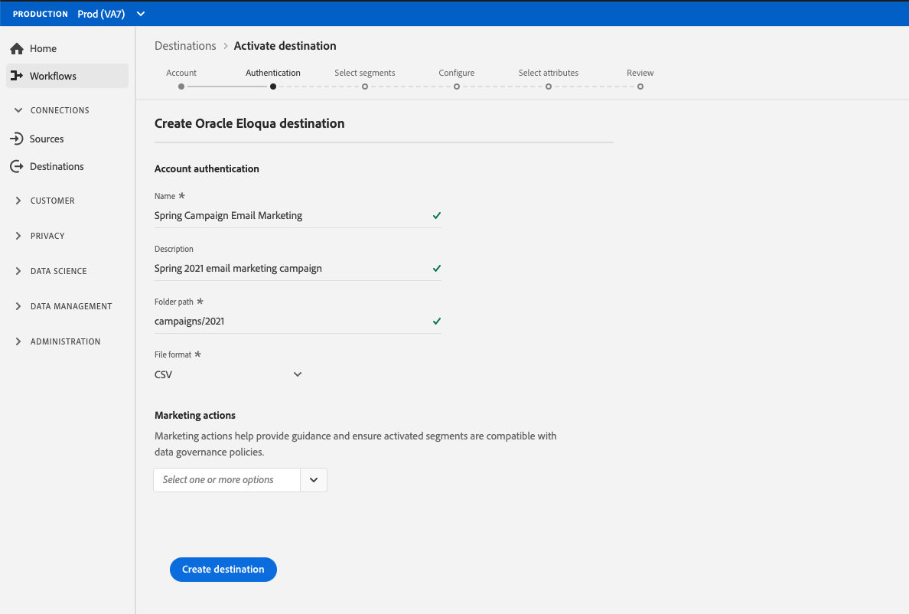

# [!DNL Oracle Eloqua]

## 概述

[[!DNL Oracle Eloqua]](https://www.oracle.com/marketingcloud/products/marketing-automation/) 是由B2B营销人员和组织提供的用于营销自动化的软 [!DNL Oracle] 件即服务(SaaS)平台，旨在帮助B2B营销人员和组织管理营销活动和销售线索生成。

要向[!DNL Oracle Eloqua]发送段数据，您必须先[连接Adobe Experience Platform的目标](#connect-destination)，然后[设置从存储位置导入](#import-data-into-eloqua)的数据。[!DNL Oracle Eloqua]

## 导出类型{#export-type}

**基于用户档案** -您正在导出区段的所有成员，以及所需的模式字段(例如：电子邮件地址、电话号码、姓氏)，从目标激活工作流的“选择属性”屏幕 [中进行选择](../../ui/activate-destinations.md#select-attributes)。

## 连接到目标{#connect-destination}

在&#x200B;**[!UICONTROL 连接]** > **[!UICONTROL 目标]**&#x200B;中，选择[!DNL Oracle Eloqua]，然后选择&#x200B;**[!UICONTROL 连接目标]**。

[连接到Elovica](../../assets/catalog/email-marketing/oracle-eloqua/catalog.png)

在&#x200B;**[!UICONTROL 身份验证]**&#x200B;步骤中，如果您之前已设置到云存储目标的连接，请选择&#x200B;**[!UICONTROL 现有帐户]**&#x200B;并选择现有连接之一。 或者，您也可以选择&#x200B;**[!UICONTROL 新建帐户]**&#x200B;来设置新连接。 填写帐户身份验证凭据，然后选择&#x200B;**[!UICONTROL 连接到目标]**。 对于[!DNL Oracle Eloqua]，可以在&#x200B;**[!UICONTROL SFTP with Password]**&#x200B;和&#x200B;**[!UICONTROL SFTP with SSH Key]**&#x200B;之间进行选择。 根据连接类型填写以下信息，然后选择&#x200B;**[!UICONTROL 连接到目标]**。

对于具有密码&#x200B;]**连接的**[!UICONTROL  SFTP，必须提供域、端口、用户名和密码。
对于具有SSH密钥]**连接的**[!UICONTROL  SFTP，必须提供域、端口、用户名和SSH密钥。

在&#x200B;**[!UICONTROL 设置]**&#x200B;步骤中，填写目标的相关信息，如下所示：
- **[!UICONTROL 名称]**:为目标选择相关名称。
- **[!UICONTROL 描述]**:输入目标的说明。
- **[!UICONTROL 文件夹路径]**:在您的存储位置提供路径，平台会将导出数据存储为CSV或制表符分隔的文件。
- **[!UICONTROL 文件格式]**: **CSV** 或 **TAB_DELIMITED**。选择要导出到存储位置的文件格式。

填写上面的字段后，单击&#x200B;**[!UICONTROL 创建目标]**。 您的目标现在已创建，您可以[将区段](../../ui/activate-destinations.md)激活到目标。

## 激活区段{#activate-segments}

有关区段用户档案工作流的信息，请参阅[将激活和区段激活到目标](../../ui/activate-destinations.md)。

## 目标属性{#destination-attributes}

当[将区段](../../ui/activate-destinations.md)激活到[!DNL Oracle Eloqua]目标时，建议您从[合并模式](../../../profile/home.md#profile-fragments-and-union-schemas)中选择唯一标识符。 选择唯一标识符以及要导出到目标的任何其他XDM字段。 有关详细信息，请参阅[在电子邮件营销目标中选择要用作导出文件中目标属性的模式字段](./overview.md#destination-attributes)。

## 导出的数据{#exported-data}

对于[!DNL Oracle Eloqua]目标，平台会在您提供的存储位置创建制表符分隔的`.txt`或`.csv`文件。 有关这些文件的详细信息，请参阅区段存储教程中的[电子邮件营销目标和云激活目标](../../ui/activate-destinations.md#esp-and-cloud-storage)。

## 将数据导入[!DNL Oracle Eloqua] {#import-data-into-eloqua}

将平台连接到您的AmazonS3或SFTP存储后，您必须设置从存储位置导入到[!DNL Oracle Eloqua]的数据。 要了解如何实现此目的，请参阅[!DNL Oracle Eloqua Help Center]中的[导入联系人或帐户](https://docs.oracle.com/cloud/latest/marketingcs_gs/OMCAA/Help/DataImportExport/Tasks/ImportingContactsOrAccounts.htm)。