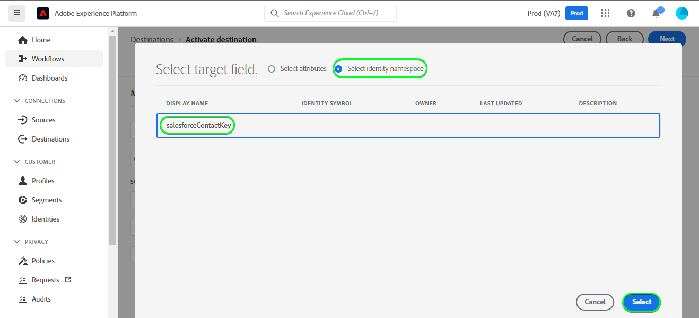

# [!DNL (API) Salesforce Marketing Cloud] 连接

## 概述 {#overview}

[[!DNL Salesforce Marketing Cloud]](https://www.salesforce.com/products/marketing-cloud/overview/) （以前称为ExactTarget）是一个数字营销套件，它允许您为访客和客户构建和自定义历程，以个性化其体验。

>[!IMPORTANT]
> 
> 请注意此连接与 [SalesforceMarketing Cloud连接](https://experienceleague.adobe.com/docs/experience-platform/destinations/catalog/email-marketing/salesforce-marketing-cloud.html?lang=en) 电子邮件营销目录部分中存在的问题。 其他SalesforceMarketing Cloud连接允许您将文件导出到指定的存储位置，而这是基于API的流连接。

此 [!DNL Adobe Experience Platform] [目标](/help/destinations/home.md) 利用 [Salesforce更新联系人REST API](https://developer.salesforce.com/docs/marketing/marketing-cloud/guide/updateContacts.html)，用于在新的Salesforce区段中激活联系人/更新联系人数据以满足您的业务需求。

SalesforceMarketing Cloud使用带有客户端凭据的OAuth 2作为验证机制，与Salesforce REST API通信。 下面进一步说明了如何验证您的Salesforce实例，如 [对目标进行身份验证](#authenticate) 中。

## 用例 {#use-cases}

为了帮助您更好地了解您应如何以及何时使用SalesforceMarketing Cloud目标，以下是Adobe Experience Platform客户可通过使用此目标解决的示例用例。

### 向营销活动的联系人发送电子邮件 {#use-case-send-emails}

家庭租赁平台的销售部门希望向目标客户受众广播营销电子邮件。 平台的营销团队可以添加新联系人/更新现有联系人 *（及其电子邮件地址）* 通过Adobe Experience Platform，从自己的离线数据构建区段，并将这些区段发送到SalesforceMarketing Cloud，然后用于发送营销活动电子邮件。

## 先决条件 {#prerequisites}

### Experience Platform中的先决条件 {#prerequisites-in-experience-platform}

在将数据激活到SalesforceMarketing Cloud目标之前，您必须具有 [模式](/help/xdm/schema/composition.md), a [数据集](https://experienceleague.adobe.com/docs/platform-learn/tutorials/data-ingestion/create-datasets-and-ingest-data.html?lang=en)和 [区段](https://experienceleague.adobe.com/docs/platform-learn/tutorials/segments/create-segments.html?lang=en) 创建于 [!DNL Experience Platform].

### Salesforce CRM中的先决条件 {#prerequisites-destination}

在Salesforce中，请注意以下先决条件，以便将数据从Platform导出到您的SalesforceMarketing Cloud帐户：

#### 您需要拥有Salesforce帐户 {#prerequisites-account}

转到Salesforce [试用](https://www.salesforce.com/in/form/signup/freetrial-sales/) 页面以注册和创建Salesforce帐户（如果您还没有）。

#### 在Salesforce中创建自定义字段 {#prerequisites-custom-field}

您必须创建类型的自定义属性 `Text Area Long`，该Experience Platform将用于更新SalesforceMarketing Cloud中的区段状态。 在将区段激活到目标的工作流中，通过 **[区段计划](#schedule-segment-export-example)** 步骤中，您将使用自定义属性作为激活的每个区段的映射ID。

请参阅SalesforceMarketing Cloud文档，以 [创建自定义字段](https://help.salesforce.com/s/articleView?id=mc_cab_create_an_attribute.htm&amp;type=5&amp;language=en_US) 如果您需要其他指导，请执行以下操作。

>[!IMPORTANT]
>
> 确保在SalesforceMarketing Cloud帐户中的“电子邮件人口统计信息”属性集下创建自定义属性。

>[!NOTE]
>
> * 每个对象允许的自定义属性数量因您的Salesforce版本而异。 有关信息，请参阅Salesforce文档 [每个对象允许的自定义字段](https://help.salesforce.com/s/articleView?id=sf.custom_field_allocations.htm&amp;type=5) 如果您需要其他指导，请执行以下操作。
> * 如果您在Salesforce中已达到此限制，则需要从Salesforce中删除自定义属性，该属性用于在使用新mappingId之前，针对Experience Platform中的旧区段存储区段状态。

请参阅Adobe Experience Platform文档，以了解 [区段成员资格详细信息架构字段组](/help/xdm/field-groups/profile/segmentation.md) 如果您需要有关区段状态的指导，请执行以下操作：

#### 收集Salesforce凭据 {#gather-credentials}

在您验证到SalesforceMarketing Cloud目标之前，请记下以下项目。

| 凭据 | 描述 | 示例 |
| --- | --- | --- |
| <ul><li>SalesforceMarketing Cloud前缀</li></ul> | 请参阅 [SalesforceMarketing Cloud域前缀](https://help.salesforce.com/s/articleView?id=sf.domain_name_setting_login_policy.htm&amp;type=5) 以获取其他指导。 | <ul><li>如果您的域如下所示，则需要突出显示的值。  <i>`mcq4jrssqdlyc4lph19nnqgzzs84`.login.exacttarget.com</i></li></ul> |
| <ul><li>客户端ID</li><li>客户端密钥</li></ul> | 请参阅 [Salesforce文档](https://developer.salesforce.com/docs/marketing/marketing-cloud/guide/access-token-s2s.html) 如果您需要其他指导，请执行以下操作。 | <ul><li>r23kxxxxxxxxx0z05xxxxx</li><li>ipxxxxxxxxxxxxT4xxxxxxxxxxxx</li></ul> |

{style=&quot;table-layout:auto&quot;}

## 支持的身份 {#supported-identities}

SalesforceMarketing Cloud支持激活下表中描述的身份。 详细了解 [标识](/help/identity-service/namespaces.md).

| Target标识 | 描述 | 注意事项 |
|---|---|---|
| contactKey | Salesforce联系人密钥。 请参阅 [Salesforce文档](https://help.salesforce.com/s/articleView?id=sf.mc_cab_contact_builder_best_practices.htm&amp;type=5) 如果您需要其他指导，请执行以下操作。 | 必需 |

## 导出类型和频度 {#export-type-frequency}

有关目标导出类型和频率的信息，请参阅下表。

| 项目 | 类型 | 注释 |
---------|----------|---------|
| 导出类型 | **[!UICONTROL 基于用户档案]** | 您要导出区段的所有成员，以及所需的架构字段(例如：电子邮件地址、电话号码、姓氏)，在 [目标激活工作流](/help/destinations/ui/activate-batch-profile-destinations.md#select-attributes). |
| 导出频度 | **[!UICONTROL 流]** | 流目标“始终运行”基于API的连接。 在基于区段评估的Experience Platform中更新用户档案后，连接器会立即将更新发送到目标平台下游。 有关更多信息 [流目标](/help/destinations/destination-types.md#streaming-destinations). |

{style=&quot;table-layout:auto&quot;}

## 连接到目标 {#connect}

>[!IMPORTANT]
> 
>要连接到目标，您需要 **[!UICONTROL 管理目标]** [访问控制权限](/help/access-control/home.md#permissions). 阅读 [访问控制概述](/help/access-control/ui/overview.md) 或联系您的产品管理员以获取所需的权限。

要连接到此目标，请按照 [目标配置教程](../../ui/connect-destination.md). 在配置目标工作流中，填写下面两节中列出的字段。

### 对目标进行身份验证 {#authenticate}

要对目标进行身份验证，请填写必填字段并选择 **[!UICONTROL 连接到目标]**.

* **[!UICONTROL 子域]**:您的SalesforceMarketing Cloud域前缀。 例如，如果您的域为 *`mcq4jrssqdlyc4lph19nnqgzzs84`.login.exacttarget.com*，则需要突出显示的值。
* **[!UICONTROL 客户端ID]**:您的Salesforce客户ID。
* **[!UICONTROL 客户端密钥]**:您的Salesforce客户端密钥。

如果提供的详细信息有效，UI会显示 **已连接** 状态中显示绿色复选标记，则可以继续执行下一步。

### 填写目标详细信息 {#destination-details}

要配置目标的详细信息，请填写以下必填和可选字段。 UI中字段旁边的星号表示该字段为必填字段。

* **[!UICONTROL 名称]**:将来用于识别此目标的名称。
* **[!UICONTROL 描述]**:此描述将帮助您在将来确定此目标。
* **[!UICONTROL 客户名称]**:这可以是任何值，但是必须指定一个值。 否则，目标激活将失败。

### 启用警报 {#enable-alerts}

您可以启用警报以接收有关目标数据流状态的通知。 从列表中选择警报以订阅接收有关数据流状态的通知。 有关警报的更多信息，请参阅 [使用UI订阅目标警报](../../ui/alerts.md).

完成提供目标连接的详细信息后，请选择 **[!UICONTROL 下一个]**.

## 将区段激活到此目标 {#activate}

>[!IMPORTANT]
> 
>要激活数据，您需要 **[!UICONTROL 管理目标]**, **[!UICONTROL 激活目标]**, **[!UICONTROL 查看配置文件]**&#x200B;和 **[!UICONTROL 查看区段]** [访问控制权限](/help/access-control/home.md#permissions). 阅读 [访问控制概述](/help/access-control/ui/overview.md) 或联系您的产品管理员以获取所需的权限。

读取 [激活用户档案和区段以流式传输区段导出目标](/help/destinations/ui/activate-segment-streaming-destinations.md) 有关将受众区段激活到此目标的说明。

### 映射注意事项和示例 {#mapping-considerations-example}

要将受众数据从Adobe Experience Platform正确发送到SalesforceMarketing Cloud目标，您需要完成字段映射步骤。 映射包括在Platform帐户中的体验数据模型(XDM)架构字段与目标目标中相应的对等字段之间创建一个链接。 要将XDM字段正确映射到SalesforceMarketing Cloud目标字段，请执行以下步骤。

可以为 [Salesforce REST API](https://developer.salesforce.com/docs/atlas.en-us.api_rest.meta/api_rest/dome_composite_upsert_example.htm?q=contacts) 下面提供了。 目标使用 [Salesforce搜索属性集定义REST API](https://developer.salesforce.com/docs/marketing/marketing-cloud/guide/retrieveAttributeSetDefinitions.html) 用于检索在Salesforce中为您的联系人定义且特定于您帐户的属性。

>[!IMPORTANT]
> 
> 尽管属性名称与Salesforce帐户的属性名称相同，但 `contactKey` 和 `personalEmail.address` 为必填项。

1. 在映射步骤中，单击 **[!UICONTROL 添加新映射]**. 您现在可以在屏幕上看到新的映射行。
   

1. 在“选择源”字段窗口中，选择源字段时，请选择 **[!UICONTROL 选择属性]** 类别，并添加所需的映射。
   

1. 在“选择目标”字段窗口中，选择目标字段，然后选择 **[!UICONTROL 选择身份命名空间]** 类别，并添加所需的映射。
   

1. 要映射任何自定义属性，请选择“目标”字段窗口，选择“目标”字段，然后选择 **[!UICONTROL 选择属性]** > **电子邮件人口统计** 类别。 接下来，提供所需的目标属性名称并添加所需的映射。
   

1. 例如，您可以在XDM配置文件架构和 [!DNL Salesforce Marketing Cloud] 实例：

   |  | XDM配置文件架构 | [!DNL Salesforce Marketing Cloud] 实例 | 必需 |
   |---|---|---|---|
   | 属性 | <ul><li>person.name.firstName</code></li><li>personalEmail.address</code></li></ul> | <ul><li>电子邮件人口统计。名字</code></li><li>电子邮件地址。电子邮件地址</code></li></ul> | <ul><li>-</li><li>是</code></li></ul> |
   | 标识 | <ul><li>contactKey</code></li></ul> | <ul><li>salesforceContactKey</code></li></ul> | 是 |

1. 使用这些映射的示例如下所示：
   

### 计划区段导出和示例 {#schedule-segment-export-example}

执行 [计划区段导出](/help/destinations/ui/activate-segment-streaming-destinations.md#scheduling) 步骤中，您必须手动将Platform区段映射到Salesforce中的自定义属性。

为此，请选择每个区段，然后在 **[!UICONTROL 映射ID]** 字段。

>[!IMPORTANT]
>
> 用于映射ID的值应与Salesforce中在“电子邮件人口统计”属性集下创建的自定义属性的名称完全匹配。

示例如下所示：

## 验证数据导出 {#exported-data}

要验证您是否已正确设置目标，请执行以下步骤：

1. 选择 **[!UICONTROL 目标]** > **[!UICONTROL 浏览]** 导航到目标列表。

   

1. 选择目标并验证状态是否为 **[!UICONTROL 已启用]**.

   

1. 切换到 **[!DNL Activation data]** ，然后选择区段名称。

   

1. 监控区段摘要，并确保配置文件计数与区段内创建的计数相对应。

   

1. 登录到SalesforceMarketing Cloud网站。 然后，导航到 **[!DNL Audience Builder]** > **[!DNL Contact Builder]** > **[!DNL All contacts]** > **[!DNL Email]** 页面，并检查是否已添加区段中的用户档案。

   

1. 要检查是否更新了任何用户档案，请导航至 **[!DNL Email]** 页面检查区段中配置文件的属性值是否已更新。

   

## 数据使用和管理 {#data-usage-governance}

全部 [!DNL Adobe Experience Platform] 目标在处理数据时与数据使用策略相兼容。 有关如何 [!DNL Adobe Experience Platform] 实施数据管理，请查看 [数据管理概述](/help/data-governance/home.md).

## 错误和疑难解答 {#errors-and-troubleshooting}

### 将事件推送到SalesforceMarketing Cloud时遇到未知错误 {#unknown-errors}

检查数据流运行时，如果看到以下错误消息，请验证您在 [!DNL Salesforce CRM] ，且该区段在 [!DNL Salesforce CRM].

## 其他资源 {#additional-resources}

* [Salesforce开发人员门户](https://developer.salesforce.com/)

### 限制 {#limits}

* Salesforce强加了 [速率限制](https://developer.salesforce.com/docs/marketing/marketing-cloud/guide/rate-limiting.html).
* 请参阅 [速率限制错误](https://developer.salesforce.com/docs/marketing/marketing-cloud/guide/rate-limiting-errors.html) 页面来检查您可能遇到的任何错误。
* 请参阅 [SalesforceMarketing Cloud参与定价](https://www.salesforce.com/editions-pricing/marketing-cloud/email/) 页面 *下载完整版比较图* 作为pdf，其中详细列出了您的计划所施加的限制。
* 的 [API概述](https://developer.salesforce.com/docs/marketing/marketing-cloud/guide/apis-overview.html) 页面详细信息其他限制。
* 可以查看整理这些详细信息的知识库项目 [此处](https://salesforce.stackexchange.com/questions/205898/marketing-cloud-api-limits#:~:text=Day%2FHour%2FMinute%20Limit&amp;text=We%20recommend%20a%20limit%20of,per%20minute%20for%20SOAP%20calls.&amp;text=As%20has%20beadd%20in，interacting%20with%20the%20REST%2DAPI).
