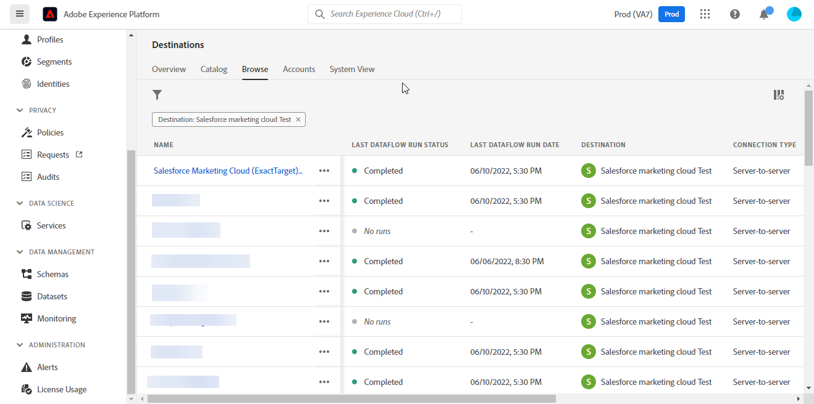

# [!DNL (API) Salesforce Marketing Cloud]连接

## 概述 {#overview}

[[!DNL (API) Salesforce Marketing Cloud]](https://www.salesforce.com/products/marketing-cloud/engagement/) （以前称为[!DNL ExactTarget]）是一个数字营销套件，它允许您为访客和客户构建和自定义历程，以个性化其体验。

>[!IMPORTANT]
>
> 请注意此连接与电子邮件营销目录分区中存在的其他[[!DNL Salesforce Marketing Cloud] 连接](/help/destinations/catalog/email-marketing/salesforce-marketing-cloud.md)之间的区别。 另一个Salesforce Marketing Cloud连接允许您将文件导出到指定的存储位置，而这是一个基于API的流连接。

与更面向&#x200B;**B2B**&#x200B;营销的[!DNL Salesforce Marketing Cloud Account Engagement]相比，[!DNL (API) Salesforce Marketing Cloud]目标更适合于事务性决策周期较短的&#x200B;**B2C**&#x200B;用例。 您可以合并表示目标受众行为的较大数据集，以通过优先排序和划分联系人（尤其是来自[!DNL Salesforce]外部的数据集）来调整和改进营销活动。 *注意，Experience Platform也具有[[!DNL Salesforce Marketing Cloud Account Engagement]](/help/destinations/catalog/email-marketing/salesforce-marketing-cloud-account-engagement.md).*&#x200B;的连接

此[!DNL Adobe Experience Platform] [目标](/help/destinations/home.md)使用[!DNL Salesforce Marketing Cloud] [更新联系人](https://developer.salesforce.com/docs/marketing/marketing-cloud/guide/updateContacts.html) API，这允许您在新[!DNL Salesforce Marketing Cloud]区段中激活联系人后，针对您的业务需求&#x200B;**添加联系人并更新联系人数据**。

[!DNL Salesforce Marketing Cloud]使用带有客户端凭据的OAuth 2作为身份验证机制来与[!DNL Salesforce Marketing Cloud] API通信。 下面的[向目标身份验证](#authenticate)部分中进一步提供了向您的[!DNL Salesforce Marketing Cloud]实例进行身份验证的说明。

## 用例 {#use-cases}

为了帮助您更好地了解您应如何以及何时使用[!DNL (API) Salesforce Marketing Cloud]目标，以下是Adobe Experience Platform客户可以使用此目标解决的示例用例。

### 向营销活动的联系人发送电子邮件 {#use-case-send-emails}

家庭租赁平台的销售部门希望向目标客户受众广播营销电子邮件。 平台的营销团队可以通过Adobe Experience Platform添加新联系人/更新现有联系人&#x200B;*（及其电子邮件地址）*，使用他们自己的离线数据构建受众，并将这些受众发送到[!DNL Salesforce Marketing Cloud]，然后可以使用这些受众发送营销活动电子邮件。

## 先决条件 {#prerequisites}

### Experience Platform中的先决条件 {#prerequisites-in-experience-platform}

在将数据激活到[!DNL (API) Salesforce Marketing Cloud]目标之前，您必须在[!DNL Experience Platform]中创建一个[架构](/help/xdm/schema/composition.md)、[数据集](https://experienceleague.adobe.com/docs/platform-learn/tutorials/data-ingestion/create-datasets-and-ingest-data.html)和[区段](https://experienceleague.adobe.com/docs/platform-learn/tutorials/segments/create-segments.html)。

### [!DNL (API) Salesforce Marketing Cloud]中的先决条件 {#prerequisites-destination}

请注意以下先决条件，以便将数据从Experience Platform导出到您的[!DNL Salesforce Marketing Cloud]帐户：

#### 您需要拥有[!DNL Salesforce Marketing Cloud]帐户 {#prerequisites-account}

必须有一个订阅[[!DNL Marketing Cloud Engagement]](https://www.salesforce.com/products/marketing-cloud/engagement/)产品的[!DNL Salesforce Marketing Cloud]帐户才能继续。

如果您没有[!DNL Salesforce Marketing Cloud]帐户或帐户缺少[!DNL Marketing Cloud Engagement]产品订阅，请联系[[!DNL Salesforce] 支持](https://www.salesforce.com/company/contact-us/?d=cta-glob-footer-10)。

#### 在[!DNL Salesforce Marketing Cloud]中创建属性 {#prerequisites-attribute}

将受众激活到[!DNL (API) Salesforce Marketing Cloud]目标时，必须在&#x200B;**[受众计划](#schedule-segment-export-example)**&#x200B;步骤中为每个激活的受众在&#x200B;**[!UICONTROL 映射ID]**&#x200B;字段中输入值。

[!DNL Salesforce]需要此值才能正确读取和解释从Experience Platform传入的受众，并在[!DNL Salesforce Marketing Cloud]中更新其受众状态。 如果您需要受众状态指南，请参阅Experience Platform有关[受众成员资格详细信息架构字段组](/help/xdm/field-groups/profile/segmentation.md)的文档。

对于从Experience Platform激活到[!DNL Salesforce]的每个受众，您必须在[!DNL Salesforce Marketing Cloud]内具有链接到[!DNL Email Demographics]数据扩展的`Text`类型的属性。 使用[!DNL Salesforce Marketing Cloud] [!DNL Contact Builder]创建属性。 如果您需要有关创建属性的指导，请参阅[!DNL Salesforce Marketing Cloud]文档以[创建属性](https://help.salesforce.com/s/articleView?id=mc_cab_create_an_attribute.htm&amp;type=5&amp;language=en_US)。

在&#x200B;**[!UICONTROL 映射]**&#x200B;步骤期间，[!DNL (API) Salesforce Marketing Cloud]目标字段使用了属性字段名称。 您可以根据业务需求定义最多4000个字符的字段字符。 有关属性类型的更多信息，请参阅[!DNL Salesforce Marketing Cloud] [数据扩展数据类型](https://help.salesforce.com/s/articleView?id=sf.mc_es_data_extension_data_types.htm&amp;type=5)文档页面。

[!DNL Salesforce Marketing Cloud]中的数据设计器屏幕的示例（您将向其中添加属性）如下所示：

下面显示了[!DNL Salesforce Marketing Cloud] [!DNL Email Data]属性组的视图，该属性组的属性与[!DNL Email Demographics]数据扩展中的受众状态相对应：

[!DNL (API) Salesforce Marketing Cloud]目标使用[!DNL Salesforce Marketing Cloud] [!DNL Search Attribute-Set Definitions REST] [API](https://developer.salesforce.com/docs/marketing/marketing-cloud/guide/retrieveAttributeSetDefinitions.html)动态检索[!DNL Salesforce Marketing Cloud]中定义的数据扩展及其链接属性。

当您在工作流中设置[映射](#mapping-considerations-example)到[将受众激活到目标](#activate)时，这些内容显示在&#x200B;**[!UICONTROL 目标字段]**&#x200B;选择窗口中。

>[!IMPORTANT]
>
> 在[!DNL Salesforce Marketing Cloud]内，您必须为每个激活的Experience Platform区段创建与&#x200B;**[!UICONTROL 映射ID]**&#x200B;中指定的值完全匹配的&#x200B;**[!UICONTROL 字段名称]**&#x200B;属性。 例如，下面的屏幕截图显示了名为`salesforce_mc_segment_1`的属性。 将受众激活到此目标时，请将`salesforce_mc_segment_1`添加为&#x200B;**[!UICONTROL 映射ID]**，以将Experience Platform中的受众填充到此属性中。

下面显示了[!DNL Salesforce Marketing Cloud]中属性创建的示例：

>[!TIP]
>
> * 创建属性时，请勿在字段名称中包含空白字符。 请改用下划线`(_)`字符作为分隔符。
> * 为了区分用于Experience Platform受众的属性和[!DNL Salesforce Marketing Cloud]内的其他属性，您可以为用于Adobe区段的属性包含一个可识别的前缀或后缀。 例如，使用`Adobe_test_segment`或`test_segment_Adobe`，而不是`test_segment`。
> * 如果您已在[!DNL Salesforce Marketing Cloud]中创建了其他属性，则可以使用与Experience Platform区段相同的名称，以便轻松地识别[!DNL Salesforce Marketing Cloud]中的受众。

#### 在[!DNL Salesforce Marketing Cloud]中分配用户角色和权限 {#prerequisites-roles-permissions}

由于[!DNL Salesforce Marketing Cloud]支持自定义角色（取决于您的用例），因此应该为您的用户分配相关角色，以更新[!DNL Salesforce Marketing Cloud]中的属性。 下面显示了分配给用户的角色示例：

根据您的[!DNL Salesforce Marketing Cloud]用户被分配的角色，您还需要向[!DNL Salesforce Marketing Cloud]数据扩展分配权限，这些权限链接到您要更新的字段。

由于此目标需要访问`[!DNL data extension]`，因此您需要允许这些访问。 例如，对于`Email` [!DNL data extension]，您需要允许，如下所示：

要限制访问级别，您还可以使用粒度权限覆盖单个访问。

有关详细指导，请参阅[[!DNL Marketing Cloud Roles]](https://help.salesforce.com/s/articleView?language=en_US&amp;id=sf.mc_overview_marketing_cloud_roles.htm&amp;type=5)和[[!DNL Marketing Cloud Roles and Permissions]](https://help.salesforce.com/s/articleView?language=en_US&amp;id=sf.mc_overview_roles.htm&amp;type=5)页。

#### 收集[!DNL Salesforce Marketing Cloud]凭据 {#gather-credentials}

在对[!DNL (API) Salesforce Marketing Cloud]目标进行身份验证之前，请记下以下项目。

| 凭据 | 描述 | 示例 |
| --- | --- | --- |
| 子域 | 请参阅[[!DNL Salesforce Marketing Cloud domain prefix]](https://developer.salesforce.com/docs/marketing/marketing-cloud/guide/your-subdomain-tenant-specific-endpoints.html)以了解如何从[!DNL Salesforce Marketing Cloud]接口获取此值。 | 如果您的[!DNL Salesforce Marketing Cloud]域是  *`mcq4jrssqdlyc4lph19nnqgzzs84`.login.exacttarget.com*， 您需要提供`mcq4jrssqdlyc4lph19nnqgzzs84`作为值。 |
| 客户端 ID | 请参阅[!DNL Salesforce Marketing Cloud] [文档](https://developer.salesforce.com/docs/marketing/marketing-cloud/guide/access-token-s2s.html)以了解如何从[!DNL Salesforce Marketing Cloud]界面获取此值。 | r23kxxxxxxxx0z05xxxxxx |
| 客户端密码 | 请参阅[!DNL Salesforce Marketing Cloud] [文档](https://developer.salesforce.com/docs/marketing/marketing-cloud/guide/access-token-s2s.html)以了解如何从[!DNL Salesforce Marketing Cloud]界面获取此值。 | ipxxxxxxxxxxT4xxxxxxxxxx |

{style="table-layout:auto"}

### 护栏 {#guardrails}

* Salesforce施加某些[速率限制](https://developer.salesforce.com/docs/marketing/marketing-cloud/guide/rate-limiting.html)。
   * 请参阅[!DNL Salesforce Marketing Cloud] [文档](https://developer.salesforce.com/docs/marketing/marketing-cloud/guide/rate-limiting-errors.html)以解决您在执行过程中可能遇到的任何限制并减少错误。
   * 请参阅[[!DNL Salesforce Marketing Cloud] 参与定价](https://www.salesforce.com/editions-pricing/marketing-cloud/email/)页以&#x200B;*以PDF格式下载完整版比较表*，其中详细说明了计划规定的限制。
   * [API概述](https://developer.salesforce.com/docs/marketing/marketing-cloud/guide/apis-overview.html)页面详细介绍了其他限制。
   * 有关整理这些详细信息的页面，请参阅[此处](https://salesforce.stackexchange.com/questions/205898/marketing-cloud-api-limits)。
* 每个对象&#x200B;*允许的*&#x200B;自定义字段的计数因您的Salesforce版本而异。
   * 有关其他指导，请参阅[!DNL Salesforce] [文档](https://help.salesforce.com/s/articleView?id=sf.custom_field_allocations.htm&amp;type=5)。
   * 如果已达到[!DNL Salesforce Marketing Cloud]内每个对象&#x200B;*允许的*&#x200B;自定义字段定义的限制，您将需要
      * 在[!DNL Salesforce Marketing Cloud]中添加新属性之前，请先删除旧属性。
      * 在[受众计划](#schedule-segment-export-example)步骤期间，更新或删除Experience Platform目标中任何使用这些旧属性名称作为&#x200B;**[!UICONTROL 映射ID]**&#x200B;提供的值的激活受众。

## 支持的身份 {#supported-identities}

[!DNL (API) Salesforce Marketing Cloud]支持激活下表中描述的标识。 了解有关[标识](/help/identity-service/features/namespaces.md)的更多信息。

| 目标身份 | 描述 | 注意事项 |
|---|---|---|
| contactKey | [!DNL Salesforce Marketing Cloud]联系人密钥。 如需其他指导，请参阅[!DNL Salesforce Marketing Cloud] [文档](https://help.salesforce.com/s/articleView?id=sf.mc_cab_contact_builder_best_practices.htm&amp;type=5)。 | 必需 |

## 支持的受众 {#supported-audiences}

此部分介绍哪些类型的受众可以导出到此目标。

| 受众来源 | 支持 | 描述 |
|---------|----------|----------|
| [!DNL Segmentation Service] | ✓ | 通过Experience Platform [分段服务](../../../segmentation/home.md)生成的受众。 |
| 自定义上传 | X | 受众[已从CSV文件将](../../../segmentation/ui/audience-portal.md#import-audience)导入Experience Platform。 |

{style="table-layout:auto"}

## 导出类型和频率 {#export-type-frequency}

有关目标导出类型和频率的信息，请参阅下表。

| 项目 | 类型 | 注释 |
---------|----------|---------|
| 导出类型 | **[!UICONTROL 基于配置文件]** | <ul><li>您正在根据字段映射导出区段的所有成员，以及所需的架构字段&#x200B;*（例如：电子邮件地址、电话号码、姓氏）*。</li><li> 根据[受众计划](#schedule-segment-export-example)步骤期间提供的&#x200B;**[!UICONTROL 映射ID]**&#x200B;值，[!DNL Salesforce Marketing Cloud]中的每个区段状态都将从Experience Platform更新为相应的受众状态。</li></ul> |
| 导出频率 | **[!UICONTROL 正在流式传输]** | 流目标为基于API的“始终运行”连接。 根据受众评估在Experience Platform中更新用户档案后，连接器会立即将更新发送到下游目标平台。 阅读有关[流式目标](/help/destinations/destination-types.md#streaming-destinations)的更多信息。 |

{style="table-layout:auto"}

## 连接到目标 {#connect}

>[!IMPORTANT]
>
> 若要连接到目标，您需要&#x200B;**[!UICONTROL 管理目标]** [访问控制权限](/help/access-control/home.md#permissions)。 阅读[访问控制概述](/help/access-control/ui/overview.md)或联系您的产品管理员以获取所需的权限。

要连接到此目标，请按照[目标配置教程](../../ui/connect-destination.md)中描述的步骤操作。 在配置目标工作流中，填写下面两个部分中列出的字段。

在&#x200B;**[!UICONTROL 目标]** > **[!UICONTROL 目录]**&#x200B;中，搜索[!DNL (API) Salesforce Marketing Cloud]。 或者，您可以在&#x200B;**[!UICONTROL 电子邮件营销]**&#x200B;类别下找到它。

### 验证目标 {#authenticate}

要验证到目标，请填写下面的必填字段，然后选择&#x200B;**[!UICONTROL 连接到目标]**。 有关任何指导，请参阅[收集 [!DNL Salesforce Marketing Cloud] 凭据](#gather-credentials)部分。

| [!DNL (API) Salesforce Marketing Cloud]目标 | [!DNL Salesforce Marketing Cloud] |
| --- | --- |
| **[!UICONTROL 子域]** | 您的[!DNL Salesforce Marketing Cloud]域前缀。  例如，如果您的域是  *`mcq4jrssqdlyc4lph19nnqgzzs84`.login.exacttarget.com*， 您需要提供`mcq4jrssqdlyc4lph19nnqgzzs84`作为值。 |
| **[!UICONTROL 客户端ID]** | 您的[!DNL Salesforce Marketing Cloud] `Client ID`。 |
| **[!UICONTROL 客户端密码]** | 您的[!DNL Salesforce Marketing Cloud] `Client Secret`。 |

如果提供的详细信息有效，则UI会以绿色复选标记显示&#x200B;**[!UICONTROL 已连接]**&#x200B;状态，然后您可以继续执行下一步。

### 填写目标详细信息 {#destination-details}

要配置目标的详细信息，请填写下面的必需和可选字段。 UI中字段旁边的星号表示该字段为必填字段。

* **[!UICONTROL 名称]**：将来用于识别此目标的名称。
* **[!UICONTROL 描述]**：可帮助您将来识别此目标的描述。

### 启用警报 {#enable-alerts}

您可以启用警报，以接收有关发送到目标的数据流状态的通知。 从列表中选择警报以订阅接收有关数据流状态的通知。 有关警报的详细信息，请参阅[使用UI订阅目标警报的指南](../../ui/alerts.md)。

完成提供目标连接的详细信息后，选择&#x200B;**[!UICONTROL 下一步]**。

## 激活此目标的受众 {#activate}

>[!IMPORTANT]
> 
> * 若要激活数据，您需要&#x200B;**[!UICONTROL 查看目标]**、**[!UICONTROL 激活目标]**、**[!UICONTROL 查看配置文件]**&#x200B;和&#x200B;**[!UICONTROL 查看区段]** [访问控制权限](/help/access-control/home.md#permissions)。 阅读[访问控制概述](/help/access-control/ui/overview.md)或联系您的产品管理员以获取所需的权限。
> * 要导出&#x200B;*标识*，您需要&#x200B;**[!UICONTROL 查看标识图形]** [访问控制权限](/help/access-control/home.md#permissions)。  {width="100" zoomable="yes"}

有关将受众激活到此目标的说明，请阅读[将配置文件和受众激活到流式受众导出目标](/help/destinations/ui/activate-segment-streaming-destinations.md)。

### 映射注意事项和示例 {#mapping-considerations-example}

要将受众数据从Adobe Experience Platform正确发送到[!DNL (API) Salesforce Marketing Cloud]目标，您需要完成字段映射步骤。 映射包括在Experience Platform帐户中的Experience Data Model (XDM)架构字段与其与目标中的相应等效字段之间创建链接。

要将XDM字段正确映射到[!DNL (API) Salesforce Marketing Cloud]目标字段，请执行以下步骤。

>[!IMPORTANT]
>
> * 尽管您的属性名称与您的[!DNL Salesforce Marketing Cloud]帐户相同，但`contactKey`和`personalEmail.address`的映射是必需的。
>
> * 与[!DNL Salesforce Marketing Cloud] API的集成受Experience Platform可以从Salesforce检索的属性数量的分页限制。 这意味着，在&#x200B;**[!UICONTROL 映射]**&#x200B;步骤中，目标字段架构最多可以显示2000个Salesforce帐户属性。

1. 在&#x200B;**[!UICONTROL 映射]**&#x200B;步骤中，选择&#x200B;**[!UICONTROL 添加新映射]**。 您将在屏幕上看到一个新映射行。
   
1. 在&#x200B;**[!UICONTROL 选择源字段]**&#x200B;窗口中，选择&#x200B;**[!UICONTROL 选择属性]**&#x200B;类别并选择XDM属性，或选择&#x200B;**[!UICONTROL 选择身份命名空间]**&#x200B;并选择身份。
1. 在&#x200B;**[!UICONTROL 选择目标字段]**&#x200B;窗口中，选择&#x200B;**[!UICONTROL 选择身份命名空间]**&#x200B;并选择身份，或者选择&#x200B;**[!UICONTROL 选择属性]**&#x200B;类别并从根据需要显示的数据扩展中选择属性。 [!DNL (API) Salesforce Marketing Cloud]目标使用[!DNL Salesforce Marketing Cloud] [!DNL Search Attribute-Set Definitions REST] [API](https://developer.salesforce.com/docs/marketing/marketing-cloud/guide/retrieveAttributeSetDefinitions.html)动态检索[!DNL Salesforce Marketing Cloud]中定义的数据扩展及其链接属性。 当您在[激活受众工作流](#activate)中设置[映射](#mapping-considerations-example)时，这些内容会显示在&#x200B;**[!UICONTROL 目标字段]**&#x200B;弹出窗口中。

   * 重复这些步骤以在XDM配置文件架构和[!DNL (API) Salesforce Marketing Cloud]之间添加以下映射：

     | 源字段 | 目标字段 | 必需 |
     |---|---|---|
     | `IdentityMap: contactKey` | `Identity: salesforceContactKey` | `Mandatory` |
     | `xdm: personalEmail.address` | 来自[!DNL Salesforce Marketing Cloud] [!DNL Email Addresses]数据扩展的`Attribute: Email Address`。 | `Mandatory`，添加新联系人时。 |
     | `xdm: person.name.firstName` | 所需[!DNL Salesforce Marketing Cloud]数据扩展中的`Attribute: First Name`。 | - |

   * 下面显示了使用这些映射的示例：

     

完成提供目标连接的映射后，请选择&#x200B;**[!UICONTROL 下一步]**。

### 计划受众导出和示例 {#schedule-segment-export-example}

执行[计划受众导出](/help/destinations/ui/activate-segment-streaming-destinations.md#scheduling)步骤时，必须手动将Experience Platform受众映射到[!DNL Salesforce Marketing Cloud]中的[属性](#prerequisites-attribute)。

为此，请选择每个区段，然后在[!DNL (API) Salesforce Marketing Cloud] **[!UICONTROL 映射ID]**&#x200B;字段中输入[!DNL Salesforce Marketing Cloud]中属性的名称。 有关在[!DNL Salesforce Marketing Cloud]中创建属性的指导和最佳实践，请参阅[在 [!DNL Salesforce Marketing Cloud]](#prerequisites-custom-field)中创建属性。

例如，如果您的[!DNL Salesforce Marketing Cloud]属性是`salesforce_mc_segment_1`，请在[!DNL (API) Salesforce Marketing Cloud] **[!UICONTROL 映射ID]**&#x200B;中指定此值以将受众受众从Experience Platform填充到此属性中。

以下显示了[!DNL Salesforce Marketing Cloud]中的示例属性：

下面显示了一个示例，用于指示[!DNL (API) Salesforce Marketing Cloud] **[!UICONTROL 映射ID]**&#x200B;的位置：

如图所示，[!DNL (API) Salesforce Marketing Cloud] **[!UICONTROL 映射ID]**&#x200B;应与[!DNL Salesforce Marketing Cloud] **[!UICONTROL FIELD NAME]**&#x200B;中指定的值完全匹配。

对每个激活的Experience Platform区段重复此部分。

基于上述图像的典型示例可能是。

| [!DNL (API) Salesforce Marketing Cloud]区段名称 | [!DNL Salesforce Marketing Cloud] **[!UICONTROL 字段名称]** | [!DNL (API) Salesforce Marketing Cloud] **[!UICONTROL 映射ID]** |
| --- | --- | --- |
| salesforce mc audience 1 | `salesforce_mc_segment_1` | `salesforce_mc_segment_1` |
| salesforce mc audience 2 | `salesforce_mc_segment_2` | `salesforce_mc_segment_2` |

## 验证数据导出 {#exported-data}

要验证您是否正确设置了目标，请执行以下步骤：

1. 选择&#x200B;**[!UICONTROL 目标]** > **[!UICONTROL 浏览]**&#x200B;以导航到目标列表。
   

1. 选择目标并验证状态为&#x200B;**[!UICONTROL 已启用]**。
   

1. 切换到&#x200B;**[!DNL Activation data]**&#x200B;选项卡，然后选择受众名称。
   

1. 监控受众摘要，并确保用户档案计数对应于在区段内创建的计数。
   

1. 登录到[[!DNL Salesforce Marketing Cloud]](https://mc.exacttarget.com/)网站。 然后导航到&#x200B;**[!DNL Audience Builder]** > **[!DNL Contact Builder]** > **[!DNL All contacts]** > **[!DNL Email]**&#x200B;页面，并检查受众中的配置文件是否已添加。
   

1. 要检查是否已更新任何配置文件，请导航到&#x200B;**[!UICONTROL 电子邮件]**&#x200B;页面，并验证受众中配置文件的属性值是否已更新。 如果成功，您可以看到根据[受众计划](#schedule-segment-export-example)步骤中提供的&#x200B;**[!UICONTROL 映射ID]**&#x200B;值，[!DNL Salesforce Marketing Cloud]中的每个受众状态都已更新为Experience Platform中的相应受众状态。
   

## 数据使用和治理 {#data-usage-governance}

在处理您的数据时，所有[!DNL Adobe Experience Platform]目标都符合数据使用策略。 有关[!DNL Adobe Experience Platform]如何实施数据治理的详细信息，请参阅[数据治理概述](/help/data-governance/home.md)。

## 错误和故障排除 {#errors-and-troubleshooting}

### 将事件推送到Salesforce Marketing Cloud时遇到未知错误 {#unknown-errors}

* 检查数据流运行时，您可能会遇到以下错误消息： `Unknown errors encountered while pushing events to the destination. Please contact the administrator and try again.`
  

   * 要修复此错误，请验证您在激活工作流中提供的&#x200B;**[!UICONTROL 映射ID]**&#x200B;到[!DNL (API) Salesforce Marketing Cloud]目标的名称是否与您在[!DNL Salesforce Marketing Cloud]中创建的属性的名称完全匹配。 有关指导，请参阅[在 [!DNL Salesforce Marketing Cloud]](#prerequisites-custom-field)中创建属性。

* 激活区段时，您可能会收到错误消息：`The client's IP address is unauthorized for this account. Allowlist the client's IP address...`
   * 若要修复此错误，请与[!DNL Salesforce Marketing Cloud]帐户管理员联系，将[Experience Platform IP地址](/help/destinations/catalog/streaming/ip-address-allow-list.md)添加到您的[!DNL Salesforce Marketing Cloud]帐户的受信任IP范围。 列入允许列表如果您需要其他指导，请参阅Marketing Cloud[&#128279;](https://help.salesforce.com/s/articleView?id=sf.mc_es_ip_addresses_for_inclusion.htm&amp;type=5)文档中的[!DNL Salesforce Marketing Cloud]个包含的IP地址。

## 其他资源 {#additional-resources}

* [!DNL Salesforce Marketing Cloud] [API](https://developer.salesforce.com/docs/marketing/marketing-cloud/guide/apis-overview.html)
* [!DNL Salesforce Marketing Cloud] [文档](https://developer.salesforce.com/docs/marketing/marketing-cloud/guide/updateContacts.html)说明如何使用指定的信息更新联系人。

### Changelog {#changelog}

此部分捕获此目标连接器的功能和重要文档更新。

+++ 查看更改日志

| 发行月份 | 更新类型 | 描述 |
|---|---|---|
| 2023 年 10 月 | 文档更新 | <ul><li>我们更新了(API) Salesforce Marketing Cloud [&#128279;](#prerequisites-destination)中的先决条件部分，并且通常删除了文档中对属性组的不必要的引用。</li> <li>更新了文档以指示受众状态的属性应仅在[!DNL Email Demographics]数据扩展内的[!DNL Salesforce Marketing Cloud]内创建。</li> <li>我们更新了[映射注意事项和示例](#mapping-considerations-example)部分中的映射表，`Email Addresses`数据扩展中`Email Address`属性的映射标记为必需，标有IMPORTANT的标注中提到了此要求，但表中忽略了该要求。</li></ul> |
| 2023 年 4 月 | 文档更新 | <ul><li>我们更正了[Salesforce Marketing Cloud (API)中的先决条件](#prerequisites-destination)部分中的语句和引用链接，以指出[!DNL Salesforce Marketing Cloud Engagement]是使用此目标的必需订阅。 部分之前错误地指出用户需要订阅Marketing Cloud **帐户**&#x200B;参与才能继续。</li> <li>我们在[先决条件](#prerequisites)下添加了一个部分，用于将[角色和权限](#prerequisites-roles-permissions)分配给要工作的此目标的[!DNL Salesforce]用户。 (PLATIR-26299)</li></ul> |
| 2023 年 2 月 | 文档更新 | 我们更新了(API) Salesforce Marketing Cloud中的[先决条件](#prerequisites-destination)部分，以包含一个引用链接，指出[!DNL Salesforce Marketing Cloud Engagement]是使用此目标的必需订阅。 |
| 2023 年 2 月 | 功能更新 | 我们修复了目标中的错误配置导致向Salesforce发送格式错误的JSON的问题。 这导致某些用户看到大量激活时失败的身份。 (PLATIR-26299) |
| 2023 年 1 月 | 文档更新 | <ul><li>我们更新了 [!DNL Salesforce][&#128279;](#prerequisites-destination)中的先决条件部分，以指出需要在[!DNL Salesforce]端创建属性。 此部分现在包含有关如何执行此操作的详细说明以及有关命名[!DNL Salesforce]中的属性的最佳实践。 (PLATIR-25602)</li><li>我们在[受众计划](#schedule-segment-export-example)步骤中添加了有关如何为每个激活的受众使用映射ID的明确说明。 (PLATIR-25602)</li></ul> |
| 2022 年 10 月 | 初始版本 | 初始目标版本和文档发布。 |

{style="table-layout:auto"}

+++
