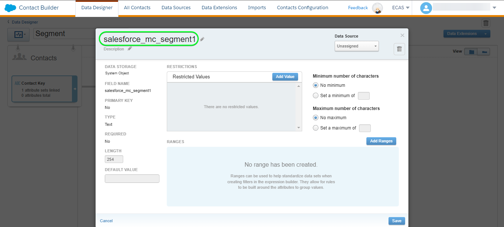

# [!DNL (API) Salesforce Marketing Cloud] 连接

## 概述 {#overview}

[[!DNL (API) Salesforce Marketing Cloud]](https://www.salesforce.com/products/marketing-cloud/engagement/) (以前称为 [!DNL ExactTarget])是一款数字营销套件，可让您为访客和客户构建和自定义历程，以个性化其体验。

>[!IMPORTANT]
>
> 请注意此连接与其他连接的区别 [[!DNL Salesforce Marketing Cloud] 连接](/help/destinations/catalog/email-marketing/salesforce-marketing-cloud.md) 电子邮件营销目录部分中存在的电子邮件营销目录。 另一个SalesforceMarketing Cloud连接允许您将文件导出到指定的存储位置，而这是一个基于API的流连接。

比较对象 [!DNL Salesforce Marketing Cloud Account Engagement] 更加面向 **B2B** 营销， [!DNL (API) Salesforce Marketing Cloud] 目标非常适合 **B2C** 事务性决策周期较短的用例。 您可以合并表示目标受众行为的较大数据集，以通过优先排序和划分联系人（尤其是来自外部数据集）来调整和改进营销活动 [!DNL Salesforce]. *请注意，Experience Platform还连接了 [[!DNL Salesforce Marketing Cloud Account Engagement]](/help/destinations/catalog/email-marketing/salesforce-marketing-cloud-account-engagement.md).*

此 [!DNL Adobe Experience Platform] [目标](/help/destinations/home.md) 利用 [!DNL Salesforce Marketing Cloud] [更新联系人](https://developer.salesforce.com/docs/marketing/marketing-cloud/guide/updateContacts.html) API，允许您 **添加联系人并更新联系人数据** 满足贵机构的业务需求，并在新版本中激活它们 [!DNL Salesforce Marketing Cloud] 区段。

[!DNL Salesforce Marketing Cloud] 使用带有客户端凭据的OAuth 2作为身份验证机制以与 [!DNL Salesforce Marketing Cloud] API。 向您的验证的说明 [!DNL Salesforce Marketing Cloud] 实例位于 [向目标进行身份验证](#authenticate) 部分。

## 用例 {#use-cases}

为了帮助您更好地了解您应该如何以及何时使用 [!DNL (API) Salesforce Marketing Cloud] 目标，以下是Adobe Experience Platform客户可以使用此目标解决的示例用例。

### 向营销活动的联系人发送电子邮件 {#use-case-send-emails}

家庭租赁平台的销售部门希望向目标客户受众广播营销电子邮件。 平台的营销团队可以添加新联系人/更新现有联系人 *（及其电子邮件地址）* 通过Adobe Experience Platform，根据受众自己的离线数据构建受众，并将这些受众发送至 [!DNL Salesforce Marketing Cloud]，然后将其用于发送营销活动电子邮件。

## 先决条件 {#prerequisites}

### Experience Platform中的先决条件 {#prerequisites-in-experience-platform}

将数据激活到之前 [!DNL (API) Salesforce Marketing Cloud] 目标，您必须拥有 [架构](/help/xdm/schema/composition.md)， a [数据集](https://experienceleague.adobe.com/docs/platform-learn/tutorials/data-ingestion/create-datasets-and-ingest-data.html)、和 [区段](https://experienceleague.adobe.com/docs/platform-learn/tutorials/segments/create-segments.html) 创建于 [!DNL Experience Platform].

### 中的先决条件 [!DNL (API) Salesforce Marketing Cloud] {#prerequisites-destination}

请注意以下先决条件，以便将数据从Platform导出到 [!DNL Salesforce Marketing Cloud] 帐户：

#### 您需要拥有 [!DNL Salesforce Marketing Cloud] 帐户 {#prerequisites-account}

A [!DNL Salesforce Marketing Cloud] 订购 [[!DNL Marketing Cloud Engagement]](https://www.salesforce.com/products/marketing-cloud/engagement/) 必须提供产品才能继续。

联系 [[!DNL Salesforce] 支持](https://www.salesforce.com/company/contact-us/?d=cta-glob-footer-10) 如果您没有 [!DNL Salesforce Marketing Cloud] 帐户或您的帐户缺少 [!DNL Marketing Cloud Engagement] 产品订阅。

#### 在中创建属性 [!DNL Salesforce Marketing Cloud] {#prerequisites-attribute}

将受众激活到 [!DNL (API) Salesforce Marketing Cloud] 目标，则必须在 **[!UICONTROL 映射Id]** 每个已激活受众的字段，位于 **[受众计划](#schedule-segment-export-example)** 步骤。

[!DNL Salesforce] 需要此值才能正确读取和解释从Experience Platform传入的受众，并在中更新其受众状态 [!DNL Salesforce Marketing Cloud]. 请参阅Experience Platform文档，了解 [受众成员资格详细信息架构字段组](/help/xdm/field-groups/profile/segmentation.md) 如果您需要有关受众状态的指南。

对于从Platform激活的每个受众 [!DNL Salesforce]，您必须具有类型为的属性 `Text` 链接到 [!DNL Email Demographics] 内的数据扩展 [!DNL Salesforce Marketing Cloud]. 使用 [!DNL Salesforce Marketing Cloud] [!DNL Contact Builder] 创建属性。 请参阅 [!DNL Salesforce Marketing Cloud] 文档目标 [创建属性](https://help.salesforce.com/s/articleView?id=mc_cab_create_an_attribute.htm&amp;type=5&amp;language=en_US) 如果您需要有关创建属性的指导。

属性字段名称用于 [!DNL (API) Salesforce Marketing Cloud] 以下时间内的目标字段 **[!UICONTROL 映射]** 步骤。 您可以根据业务需求定义最多4000个字符的字段字符。 请参阅 [!DNL Salesforce Marketing Cloud] [数据扩展数据类型](https://help.salesforce.com/s/articleView?id=sf.mc_es_data_extension_data_types.htm&amp;type=5) 文档页面，以了解有关属性类型的更多信息。

中的数据设计器屏幕示例 [!DNL Salesforce Marketing Cloud]，您将向其中添加属性，如下所示：

视图 [!DNL Salesforce Marketing Cloud] [!DNL Email Data] 属性组，其属性对应于 [!DNL Email Demographics] 数据扩展如下所示：

此 [!DNL (API) Salesforce Marketing Cloud] 目标使用 [!DNL Salesforce Marketing Cloud] [!DNL Search Attribute-Set Definitions REST] [API](https://developer.salesforce.com/docs/marketing/marketing-cloud/guide/retrieveAttributeSetDefinitions.html) 以动态检索中定义的数据扩展及其链接属性 [!DNL Salesforce Marketing Cloud].

这些组件显示在 **[!UICONTROL 目标字段]** 选择窗口 [映射](#mapping-considerations-example) 在至的工作流中 [将受众激活到目标](#activate).

>[!IMPORTANT]
>
> 范围 [!DNL Salesforce Marketing Cloud]，您必须使用创建属性 **[!UICONTROL 字段名称]** 完全匹配 **[!UICONTROL 映射Id]** 每个已激活的Platform区段。 例如，下面的屏幕截图显示了一个名为的属性 `salesforce_mc_segment_1`. 将受众激活到此目标时，添加 `salesforce_mc_segment_1` 作为 **[!UICONTROL 映射Id]** 用于将Experience Platform中的受众填充到此属性中。

中的属性创建示例 [!DNL Salesforce Marketing Cloud]，如下所示：

>[!TIP]
>
> * 创建属性时，请勿在字段名称中包含空白字符。 请改用下划线 `(_)` 字符。
> * 区分用于Platform受众的属性以及中的其他属性 [!DNL Salesforce Marketing Cloud]中，您可以为用于Adobe区段的属性包含一个可识别的前缀或后缀。 例如，而不是 `test_segment`，使用 `Adobe_test_segment` 或 `test_segment_Adobe`.
> * 如果您已在中创建其他属性 [!DNL Salesforce Marketing Cloud]，您可以使用与Platform区段相同的名称，以轻松地识别中的受众 [!DNL Salesforce Marketing Cloud].

#### 在中分配用户角色和权限 [!DNL Salesforce Marketing Cloud] {#prerequisites-roles-permissions}

作为 [!DNL Salesforce Marketing Cloud] 支持自定义角色根据您的用例，应该为您的用户分配相关的角色，以更新您的属性，在 [!DNL Salesforce Marketing Cloud]. 下面显示了分配给用户的角色示例：

根据您所使用的角色 [!DNL Salesforce Marketing Cloud] 用户已分配，您还需要将权限分配给 [!DNL Salesforce Marketing Cloud] 链接到要更新的字段的数据扩展。

由于此目标需要访问 `[!DNL data extension]`，您需要允许这些实例。 例如， `Email` [!DNL data extension] 您需要允许，如下所示：

要限制访问级别，您还可以使用粒度权限覆盖单个访问。

请参阅 [[!DNL Marketing Cloud Roles]](https://help.salesforce.com/s/articleView?language=en_US&amp;id=sf.mc_overview_marketing_cloud_roles.htm&amp;type=5) 和 [[!DNL Marketing Cloud Roles and Permissions]](https://help.salesforce.com/s/articleView?language=en_US&amp;id=sf.mc_overview_roles.htm&amp;type=5) 详细指导页面。

#### 收集 [!DNL Salesforce Marketing Cloud] 凭据 {#gather-credentials}

在对进行身份验证之前，请记下以下各项 [!DNL (API) Salesforce Marketing Cloud] 目标。

| 凭据 | 描述 | 示例 |
| --- | --- | --- |
| Subdomain | 请参阅 [[!DNL Salesforce Marketing Cloud domain prefix]](https://developer.salesforce.com/docs/marketing/marketing-cloud/guide/your-subdomain-tenant-specific-endpoints.html) 以了解如何从获取此值 [!DNL Salesforce Marketing Cloud] 界面。 | 如果您的 [!DNL Salesforce Marketing Cloud] 域为  *`mcq4jrssqdlyc4lph19nnqgzzs84`.login.exacttarget.com*，  您需要提供 `mcq4jrssqdlyc4lph19nnqgzzs84` 作为值。 |
| 客户端ID | 请参阅 [!DNL Salesforce Marketing Cloud] [文档](https://developer.salesforce.com/docs/marketing/marketing-cloud/guide/access-token-s2s.html) 以了解如何从获取此值 [!DNL Salesforce Marketing Cloud] 界面。 | r23kxxxxxxxx0z05xxxxxx |
| 客户端密码 | 请参阅 [!DNL Salesforce Marketing Cloud] [文档](https://developer.salesforce.com/docs/marketing/marketing-cloud/guide/access-token-s2s.html) 以了解如何从获取此值 [!DNL Salesforce Marketing Cloud] 界面。 | ipxxxxxxxxxxT4xxxxxxxxxx |

{style="table-layout:auto"}

### 护栏 {#guardrails}

* Salesforce施加了特定的 [速率限制](https://developer.salesforce.com/docs/marketing/marketing-cloud/guide/rate-limiting.html).
   * 请参阅 [!DNL Salesforce Marketing Cloud] [文档](https://developer.salesforce.com/docs/marketing/marketing-cloud/guide/rate-limiting-errors.html) 解决您可能会遇到的任何可能限制并减少执行过程中的错误。
   * 请参阅 [[!DNL Salesforce Marketing Cloud] 参与定价](https://www.salesforce.com/editions-pricing/marketing-cloud/email/) 页面至 *下载完整版比较表* 作为一个pdf，详细说明您的计划所施加的限制。
   * 此 [API概述](https://developer.salesforce.com/docs/marketing/marketing-cloud/guide/apis-overview.html) 页面详细信息其他限制。
   * 参考 [此处](https://salesforce.stackexchange.com/questions/205898/marketing-cloud-api-limits) 用于整理这些详细信息的页面。
* 计数 *每个对象允许的自定义字段* 因您的Salesforce版本而异。
   * 请参阅 [!DNL Salesforce] [文档](https://help.salesforce.com/s/articleView?id=sf.custom_field_allocations.htm&amp;type=5) 以获取更多指导。
   * 如果您已达到为定义的限制 *每个对象允许的自定义字段* 范围 [!DNL Salesforce Marketing Cloud] 您将需要
      * 在中添加新属性之前，请删除旧属性 [!DNL Salesforce Marketing Cloud].
      * 更新或删除Platform目标中的任何激活受众，这些受众会使用这些较旧的属性名称作为提供的值 **[!UICONTROL 映射Id]** 时段 [受众调度](#schedule-segment-export-example) 步骤。

## 支持的身份 {#supported-identities}

[!DNL (API) Salesforce Marketing Cloud] 支持激活下表中描述的标识。 了解有关 [身份](/help/identity-service/namespaces.md).

| 目标身份 | 描述 | 注意事项 |
|---|---|---|
| contactKey | [!DNL Salesforce Marketing Cloud] 联系键。 请参阅 [!DNL Salesforce Marketing Cloud] [文档](https://help.salesforce.com/s/articleView?id=sf.mc_cab_contact_builder_best_practices.htm&amp;type=5) 如果您需要其他指导。 | 必需 |

## 支持的受众 {#supported-audiences}

此部分介绍可将哪种类型的受众导出到此目标。

| 受众来源 | 受支持 | 描述 |
---------|----------|----------|
| [!DNL Segmentation Service] | ✓ {\f13 } | 通过Experience Platform生成的受众 [分段服务](../../../segmentation/home.md). |
| 自定义上传 | X | 受众 [已导入](../../../segmentation/ui/overview.md#import-audience) 从CSV文件Experience Platform到。 |

{style="table-layout:auto"}

## 导出类型和频率 {#export-type-frequency}

有关目标导出类型和频率的信息，请参阅下表。

| 项目 | 类型 | 注释 |
---------|----------|---------|
| 导出类型 | **[!UICONTROL 基于配置文件]** | <ul><li>您正在导出区段的所有成员以及所需的架构字段 *（例如：电子邮件地址、电话号码、姓氏）*，根据您的字段映射。</li><li> 中的每个区段状态 [!DNL Salesforce Marketing Cloud] 将根据 **[!UICONTROL 映射Id]** 值在 [受众调度](#schedule-segment-export-example) 步骤。</li></ul> |
| 导出频率 | **[!UICONTROL 流]** | 流目标为基于API的“始终运行”连接。 一旦根据受众评估在Experience Platform中更新了用户档案，连接器就会将更新发送到下游目标平台。 详细了解 [流目标](/help/destinations/destination-types.md#streaming-destinations). |

{style="table-layout:auto"}

## 连接到目标 {#connect}

>[!IMPORTANT]
>
> 要连接到目标，您需要 **[!UICONTROL 管理目标]** [访问控制权限](/help/access-control/home.md#permissions). 阅读 [访问控制概述](/help/access-control/ui/overview.md) 或与产品管理员联系以获取所需的权限。

要连接到此目标，请按照 [目标配置教程](../../ui/connect-destination.md). 在配置目标工作流中，填写下面两个部分中列出的字段。

范围 **[!UICONTROL 目标]** > **[!UICONTROL 目录]**，搜索 [!DNL (API) Salesforce Marketing Cloud]. 或者，您可以将其定位到 **[!UICONTROL 电子邮件营销]** 类别。

### 验证目标 {#authenticate}

要向目标进行身份验证，请填写以下必填字段并选择 **[!UICONTROL 连接到目标]**. 请参阅 [收集 [!DNL Salesforce Marketing Cloud] 凭据](#gather-credentials) 部分获取任何指导。

| [!DNL (API) Salesforce Marketing Cloud] 目标 | [!DNL Salesforce Marketing Cloud] |
| --- | --- |
| **[!UICONTROL Subdomain]** | 您的 [!DNL Salesforce Marketing Cloud] 域前缀。  例如，如果您的域是   *`mcq4jrssqdlyc4lph19nnqgzzs84`.login.exacttarget.com*，   您需要提供 `mcq4jrssqdlyc4lph19nnqgzzs84` 作为值。 |
| **[!UICONTROL 客户端ID]** | 您的 [!DNL Salesforce Marketing Cloud] `Client ID`. |
| **[!UICONTROL 客户端密码]** | 您的 [!DNL Salesforce Marketing Cloud] `Client Secret`. |

如果提供的详细信息有效，UI将显示 **[!UICONTROL 已连接]** 状态，带有绿色复选标记，您可以继续执行下一步。

### 填写目标详细信息 {#destination-details}

要配置目标的详细信息，请填写下面的必需和可选字段。 UI中字段旁边的星号表示该字段为必填字段。

* **[!UICONTROL 名称]**：将来用于识别此目标的名称。
* **[!UICONTROL 描述]**：可帮助您将来识别此目标的描述。

### 启用警报 {#enable-alerts}

您可以启用警报，以接收有关发送到目标的数据流状态的通知。 从列表中选择警报以订阅接收有关数据流状态的通知。 有关警报的详细信息，请参阅以下内容中的指南： [使用UI订阅目标警报](../../ui/alerts.md).

完成提供目标连接的详细信息后，选择 **[!UICONTROL 下一个]**.

## 激活此目标的受众 {#activate}

>[!IMPORTANT]
> 
> * 要激活数据，您需要 **[!UICONTROL 管理目标]**， **[!UICONTROL 激活目标]**， **[!UICONTROL 查看配置文件]**、和 **[!UICONTROL 查看区段]** [访问控制权限](/help/access-control/home.md#permissions). 阅读 [访问控制概述](/help/access-control/ui/overview.md) 或与产品管理员联系以获取所需的权限。
> * 要导出 *身份*，您需要 **[!UICONTROL 查看身份图]** [访问控制权限](/help/access-control/home.md#permissions).   {width="100" zoomable="yes"}

读取 [将用户档案和受众激活到流式受众导出目标](/help/destinations/ui/activate-segment-streaming-destinations.md) 有关将受众激活到此目标的说明。

### 映射注意事项和示例 {#mapping-considerations-example}

要正确地将受众数据从Adobe Experience Platform发送到 [!DNL (API) Salesforce Marketing Cloud] 目标，您需要执行字段映射步骤。 映射包括在您的Platform帐户中的Experience Data Model (XDM)架构字段与其在目标目标中的相应等效字段之间创建链接。

要将XDM字段正确映射到 [!DNL (API) Salesforce Marketing Cloud] 目标字段，请执行以下步骤。

>[!IMPORTANT]
>
> * 尽管您的属性名称将根据 [!DNL Salesforce Marketing Cloud] 帐户，两者的映射 `contactKey` 和 `personalEmail.address` 是必填项。
>
> * 与集成 [!DNL Salesforce Marketing Cloud] API受Experience Platform可以从Salesforce检索的属性数量的分页限制的约束。 这意味着 **[!UICONTROL 映射]** 步骤，目标字段架构最多可显示2000个Salesforce帐户属性。

1. 在 **[!UICONTROL 映射]** 步骤，选择 **[!UICONTROL 添加新映射]**. 您将在屏幕上看到一个新映射行。
   
1. 在 **[!UICONTROL 选择源字段]** 窗口中，选择 **[!UICONTROL 选择属性]** 类别并选择XDM属性或选择 **[!UICONTROL 选择身份命名空间]** 并选择身份。
1. 在 **[!UICONTROL 选择目标字段]** 窗口中，选择 **[!UICONTROL 选择身份命名空间]** 并选择身份或选择 **[!UICONTROL 选择属性]** 类别，并根据需要从显示的数据扩展中选择属性。 此 [!DNL (API) Salesforce Marketing Cloud] 目标使用 [!DNL Salesforce Marketing Cloud] [!DNL Search Attribute-Set Definitions REST] [API](https://developer.salesforce.com/docs/marketing/marketing-cloud/guide/retrieveAttributeSetDefinitions.html) 以动态检索中定义的数据扩展及其链接属性 [!DNL Salesforce Marketing Cloud]. 这些组件显示在 **[!UICONTROL 目标字段]** 设置时弹出窗口 [映射](#mapping-considerations-example) 在 [激活受众工作流](#activate).

   * 重复这些步骤以在XDM配置文件架构和 [!DNL (API) Salesforce Marketing Cloud]：

     | 源字段 | 目标字段 | 必需 |
     |---|---|---|
     | `IdentityMap: contactKey` | `Identity: salesforceContactKey` | `Mandatory` |
     | `xdm: personalEmail.address` | `Attribute: Email Address` 从 [!DNL Salesforce Marketing Cloud] [!DNL Email Addresses] 数据扩展。 | `Mandatory`，添加新联系人时。 |
     | `xdm: person.name.firstName` | `Attribute: First Name` 从所需 [!DNL Salesforce Marketing Cloud] 数据扩展。 | - |

   * 下面显示了使用这些映射的示例：
     

完成提供目标连接的映射后，选择 **[!UICONTROL 下一个]**.

### 计划受众导出和示例 {#schedule-segment-export-example}

执行 [计划受众导出](/help/destinations/ui/activate-segment-streaming-destinations.md#scheduling) 步骤，您必须手动将Platform受众映射到 [属性](#prerequisites-attribute) 在 [!DNL Salesforce Marketing Cloud].

要执行此操作，请选择每个区段，然后输入属性名称，该属性来自 [!DNL Salesforce Marketing Cloud] 在 [!DNL (API) Salesforce Marketing Cloud] **[!UICONTROL 映射Id]** 字段。 请参阅 [在中创建属性 [!DNL Salesforce Marketing Cloud]](#prerequisites-custom-field) 有关在中创建属性的指导和最佳实践的部分 [!DNL Salesforce Marketing Cloud].

例如，如果您的 [!DNL Salesforce Marketing Cloud] 属性为 `salesforce_mc_segment_1`，请在 [!DNL (API) Salesforce Marketing Cloud] **[!UICONTROL 映射Id]** 用于将Experience Platform中的受众填充到此属性中。

示例属性来自 [!DNL Salesforce Marketing Cloud] 如下所示：

一个示例，指示 [!DNL (API) Salesforce Marketing Cloud] **[!UICONTROL 映射Id]** 如下所示：

如所示 [!DNL (API) Salesforce Marketing Cloud] **[!UICONTROL 映射Id]** 应当完全匹配中指定的值 [!DNL Salesforce Marketing Cloud] **[!UICONTROL 字段名称]**.

对每个激活的Platform区段重复此部分。

基于上述图像的典型示例可能是。
| [!DNL (API) Salesforce Marketing Cloud] 区段名称 | [!DNL Salesforce Marketing Cloud] **[!UICONTROL 字段名称]** | [!DNL (API) Salesforce Marketing Cloud] **[!UICONTROL 映射Id]** | | — | — | — | | salesforce mc audience 1 | `salesforce_mc_segment_1` | `salesforce_mc_segment_1` | | salesforce mc audience 2 | `salesforce_mc_segment_2` | `salesforce_mc_segment_2` |

## 验证数据导出 {#exported-data}

要验证您是否正确设置了目标，请执行以下步骤：

1. 选择 **[!UICONTROL 目标]** > **[!UICONTROL 浏览]** 导航到目标列表。
   

1. 选择目标并验证状态为 **[!UICONTROL 已启用]**.
   

1. 切换到 **[!DNL Activation data]** 选项卡，然后选择受众名称。
   

1. 监控受众摘要，并确保用户档案计数对应于在区段内创建的计数。
   

1. 登录到 [[!DNL Salesforce Marketing Cloud]](https://mc.exacttarget.com/) 网站。 然后导航到 **[!DNL Audience Builder]** > **[!DNL Contact Builder]** > **[!DNL All contacts]** > **[!DNL Email]** 页面，并检查是否已添加受众中的配置文件。
   

1. 要检查是否已更新任何用户档案，请导航到 **[!UICONTROL 电子邮件]** 页面，并验证受众中配置文件的属性值是否已更新。 如果成功，您可以在中看到每个受众状态 [!DNL Salesforce Marketing Cloud] 已根据，从Platform更新了相应的受众状态 **[!UICONTROL 映射Id]** 值在 [受众调度](#schedule-segment-export-example) 步骤。
   

## 数据使用和治理 {#data-usage-governance}

全部 [!DNL Adobe Experience Platform] 目标在处理您的数据时符合数据使用策略。 有关如何执行操作的详细信息 [!DNL Adobe Experience Platform] 强制执行数据管理，请参见 [数据管理概述](/help/data-governance/home.md).

## 错误和故障排除 {#errors-and-troubleshooting}

### 将事件推送到SalesforceMarketing Cloud时遇到未知错误 {#unknown-errors}

* 检查数据流运行时，您可能会遇到以下错误消息： `Unknown errors encountered while pushing events to the destination. Please contact the administrator and try again.`
  

   * 要修复此错误，请验证 **[!UICONTROL 映射Id]** 您在激活工作流中提供的电子邮件至 [!DNL (API) Salesforce Marketing Cloud] 目标与您在中创建的属性的名称完全匹配 [!DNL Salesforce Marketing Cloud]. 请参阅 [在中创建属性 [!DNL Salesforce Marketing Cloud]](#prerequisites-custom-field) 部分提供指导。

* 激活区段时，您可能会收到一条错误消息： `The client's IP address is unauthorized for this account. Allowlist the client's IP address...`
   * 要修复此错误，请联系贵机构的 [!DNL Salesforce Marketing Cloud] 要添加的客户管理员 [Experience PlatformIP地址](/help/destinations/catalog/streaming/ip-address-allow-list.md) 敬您的 [!DNL Salesforce Marketing Cloud] 帐户的受信任IP范围。 请参阅 [!DNL Salesforce Marketing Cloud] [列入允许列表 Marketing Cloud中包含的IP地址](https://help.salesforce.com/s/articleView?id=sf.mc_es_ip_addresses_for_inclusion.htm&amp;type=5) 文档（如果您需要其他指导）。

## 其他资源 {#additional-resources}

* [!DNL Salesforce Marketing Cloud] [API](https://developer.salesforce.com/docs/marketing/marketing-cloud/guide/apis-overview.html)
* [!DNL Salesforce Marketing Cloud] [文档](https://developer.salesforce.com/docs/marketing/marketing-cloud/guide/updateContacts.html) 说明如何使用指定的信息更新联系人。

### Changelog {#changelog}

此部分捕获此目标连接器的功能和重要文档更新。

+++ 查看更改日志

| 发行月份 | 更新类型 | 描述 |
|---|---|---|
| 2023 年 10 月 | 文档更新 | <ul><li>我们更新了 [(API) SalesforceMarketing Cloud中的先决条件](#prerequisites-destination) 通常，和部分会删除在文档中属性组的不必要的引用。</li> <li>更新了文档以指示应在其中创建受众状态的属性 [!DNL Salesforce Marketing Cloud] 内部 [!DNL Email Demographics] 仅限数据扩展。</li> <li>我们更新了 [映射注意事项和示例](#mapping-considerations-example) 部分，的映射 `Email Address` 中的属性 `Email Addresses` 数据扩展标记为强制，此要求已在标记为IMPORTANT的标注中提及，但在表中被忽略。</li></ul> |
| 2023 年 4 月 | 文档更新 | <ul><li>我们更正了 [(API) SalesforceMarketing Cloud中的先决条件](#prerequisites-destination) 部分以指出 [!DNL Salesforce Marketing Cloud Engagement] 是使用此目标的必需订阅。 之前错误地指出用户需要订阅Marketing Cloud的部分 **帐户** 参与以继续。</li> <li>我们在下添加了一个部分 [先决条件](#prerequisites) 对象 [角色和权限](#prerequisites-roles-permissions) 将分配给 [!DNL Salesforce] 用户才能使此目标正常工作。 (PLATIR-26299)</li></ul> |
| 2023 年 2 月 | 文档更新 | 我们更新了 [(API) SalesforceMarketing Cloud中的先决条件](#prerequisites-destination) 部分，以包括一个引用链接，调用 [!DNL Salesforce Marketing Cloud Engagement] 是使用此目标的必需订阅。 |
| 2023 年 2 月 | 功能更新 | 我们修复了目标中的错误配置导致向Salesforce发送格式错误的JSON的问题。 这导致某些用户看到大量激活时失败的身份。 (PLATIR-26299) |
| 2023 年 1 月 | 文档更新 | <ul><li>我们更新了 [中的先决条件 [!DNL Salesforce]](#prerequisites-destination) 部分，用于标注需要在 [!DNL Salesforce] 侧面。 现在，此部分包含有关如何执行此操作的详细说明以及有关在中命名属性的最佳实践 [!DNL Salesforce]. (PLATIR-25602)</li><li>我们为如何在中为每个激活的受众使用映射ID添加了明确说明 [受众调度](#schedule-segment-export-example) 步骤。 (PLATIR-25602)</li></ul> |
| 2022 年 10 月 | 初始版本 | 初始目标版本和文档发布。 |

{style="table-layout:auto"}

+++
