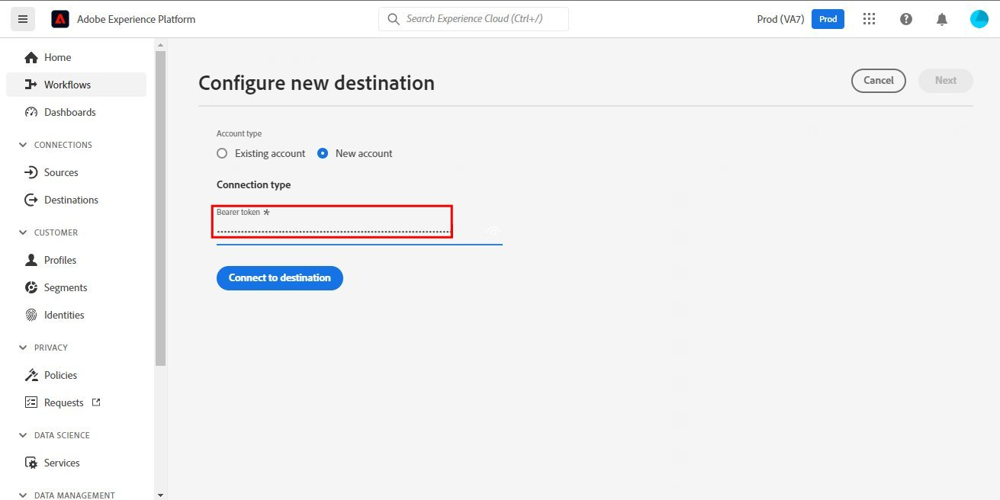
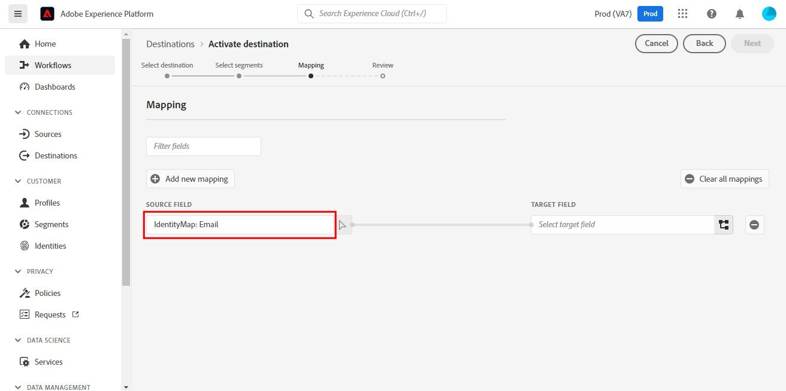
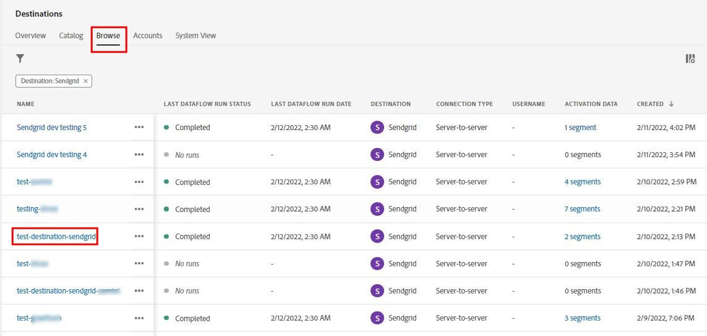

# [!DNL SendGrid]连接

## 概述 {#overview}

[SendGrid](https://www.sendgrid.com)是用于交易和营销电子邮件的常用客户通信平台。

此[!DNL Adobe Experience Platform] [目标](/help/destinations/home.md)利用[[!DNL SendGrid Marketing Contacts API]](https://api.sendgrid.com/v3/marketing/contacts)，允许您导出第一方电子邮件配置文件，并在新的SendGrid受众中激活它们，以满足您的业务需求。

SendGrid使用API持有者令牌作为与SendGrid API通信的身份验证机制。

## 先决条件 {#prerequisites}

在开始配置目标之前，需要以下项目。

1. 您需要具有SendGrid帐户。
   * 转到SendGrid [注册](https://signup.sendgrid.com/)页面以注册并创建SendGrid帐户（如果尚未注册）。
1. 登录到SendGrid门户后，您还需要生成API令牌。
1. 导航到SendGrid网站并访问&#x200B;**[!DNL Settings]** > **[!DNL API Keys]**&#x200B;页面。 或者，请参阅[SendGrid文档](https://app.sendgrid.com/settings/api_keys)以访问SendGrid应用程序中的相应部分。
1. 最后，选择&#x200B;**[!DNL Create API Key]**&#x200B;按钮。
   * 如果需要有关要执行哪些操作的指导，请参阅[SendGrid文档](https://docs.sendgrid.com/ui/account-and-settings/api-keys#creating-an-api-key)。
   * 如果要以编程方式生成API密钥，请参阅[SendGrid文档](https://docs.sendgrid.com/api-reference/api-keys/create-api-keys)。

在将数据激活到SendGrid目标之前，您必须在[中创建](https://experienceleague.adobe.com/docs/experience-platform/xdm/schema/composition.html)架构[、](https://experienceleague.adobe.com/docs/platform-learn/tutorials/data-ingestion/create-datasets-and-ingest-data.html)数据集[和](https://experienceleague.adobe.com/docs/platform-learn/tutorials/segments/create-segments.html)区段[!DNL Experience Platform]。 另请参阅此页面下面的[限制](#limits)部分。

>[!IMPORTANT]
>
>* 用于从电子邮件配置文件创建邮件列表的SendGrid API要求在每个配置文件中提供唯一的电子邮件地址。 这与其是否用作&#x200B;*电子邮件*&#x200B;或&#x200B;*备用电子邮件*&#x200B;的值无关。 由于SendGrid连接支持电子邮件和备用电子邮件值的映射，因此请确保在&#x200B;*数据集*&#x200B;的每个配置文件中使用的所有电子邮件地址都应是唯一的。 否则，在将电子邮件配置文件发送到SendGrid时，这将导致错误，并且数据导出中不会出现该电子邮件配置文件。
>
>* 目前，从Experience Platform中的受众删除配置文件时，没有相应的功能可从SendGrid中删除这些配置文件。

## 支持的身份 {#supported-identities}

SendGrid支持激活下表中描述的标识。 了解有关[标识](/help/identity-service/features/namespaces.md)的更多信息。

| 目标身份 | 描述 | 注意事项 |
|---|---|---|
| 电子邮件 | 电子邮件地址 | 请注意，[!DNL Adobe Experience Platform]支持纯文本和SHA256哈希电子邮件地址。 如果Experience Platform源字段包含未哈希处理的属性，请选中&#x200B;**[!UICONTROL Apply transformation]**&#x200B;选项，以便在激活时让[!DNL Experience Platform]自动对数据进行哈希处理。  请注意，**SendGrid**&#x200B;不支持经过哈希处理的电子邮件地址，因此只会将未经转换的纯文本数据发送到目标。 |

{style="table-layout:auto"}

## 导出类型和频率 {#export-type-frequency}

有关目标导出类型和频率的信息，请参阅下表。

| 项目 | 类型 | 注释 |
|---------|----------|---------|
| 导出类型 | **[!UICONTROL Profile-based]** | 您正在导出区段的所有成员，以及所需的架构字段（例如：电子邮件地址、电话号码、姓氏），如[目标激活工作流](/help/destinations/ui/activate-batch-profile-destinations.md#select-attributes)的选择配置文件属性屏幕中所选。 |
| 导出频率 | **[!UICONTROL Streaming]** | 流目标为基于API的“始终运行”连接。 根据受众评估在Experience Platform中更新用户档案后，连接器会立即将更新发送到下游目标平台。 阅读有关[流式目标](/help/destinations/destination-types.md#streaming-destinations)的更多信息。 |

{style="table-layout:auto"}

## 用例 {#use-cases}

为了帮助您更好地了解应如何以及何时使用SendGrid目标，以下是[!DNL Experience Platform]客户可以通过使用此目标解决的示例用例。

### 为多个营销活动创建营销列表

使用SendGrid的营销团队可以在SendGrid中创建邮件列表，并使用电子邮件地址填充该列表。 现在，在SendGrid内创建的邮件列表随后可用于多个营销活动。

## 连接到目标 {#connect}

>[!IMPORTANT]
> 
>若要连接到目标，您需要&#x200B;**[!UICONTROL View Destinations]**&#x200B;和&#x200B;**[!UICONTROL Manage Destinations]** [访问控制权限](/help/access-control/home.md#permissions)。 阅读[访问控制概述](/help/access-control/ui/overview.md)或联系您的产品管理员以获取所需的权限。

要连接到此目标，请按照[目标配置教程](../../ui/connect-destination.md)中描述的步骤操作。 在配置目标工作流中，填写下面两个部分中列出的字段。

### 验证目标 {#authenticate}

1. 在[!DNL Adobe Experience Platform]控制台中，导航到&#x200B;**目标**。

1. 选择&#x200B;**目录**&#x200B;选项卡并搜索&#x200B;*SendGrid*。 然后选择&#x200B;**设置**。 建立与目标之间的连接后，UI标签将更改为&#x200B;**激活区段**。
   

1. 此时将显示一个向导，可帮助您配置SendGrid目标。 通过选择&#x200B;**配置新目标**&#x200B;来创建新目标。
   

1. 选择&#x200B;**新帐户**&#x200B;选项并填写&#x200B;**持有者令牌**&#x200B;值。 此值是以前在&#x200B;*先决条件部分*&#x200B;中提到的SendGrid [API密钥](#prerequisites)。
   

1. 选择&#x200B;**连接到目标**。 如果您提供的SendGrid *API密钥*&#x200B;有效，则UI显示带有绿色复选标记的&#x200B;**已连接**&#x200B;状态，然后您可以继续下一步以填写其他信息字段。

### 填写目标详细信息 {#destination-details}

在[设置](https://experienceleague.adobe.com/docs/experience-platform/destinations/ui/connect-destination.html)此目标时，必须提供以下信息：

* **[!UICONTROL Name]**：将来用于识别此目标的名称。
* **[!UICONTROL Description]**：一个可选描述，可帮助您以后识别此目标。

### 启用警报 {#enable-alerts}

您可以启用警报，以接收有关发送到目标的数据流状态的通知。 从列表中选择警报以订阅接收有关数据流状态的通知。 有关警报的详细信息，请参阅[使用UI订阅目标警报的指南](../../ui/alerts.md)。

完成提供目标连接的详细信息后，选择&#x200B;**[!UICONTROL Next]**。

## 激活此目标的受众 {#activate}

>[!IMPORTANT]
> 
>* 若要激活数据，您需要&#x200B;**[!UICONTROL View Destinations]**、**[!UICONTROL Activate Destinations]**、**[!UICONTROL View Profiles]**&#x200B;和&#x200B;**[!UICONTROL View Segments]** [访问控制权限](/help/access-control/home.md#permissions)。 阅读[访问控制概述](/help/access-control/ui/overview.md)或联系您的产品管理员以获取所需的权限。
>* 要导出&#x200B;*标识*，您需要&#x200B;**[!UICONTROL View Identity Graph]** [访问控制权限](/help/access-control/home.md#permissions)。  {width="100" zoomable="yes"}

有关将受众激活到此目标的说明，请阅读[将配置文件和受众激活到流式受众导出目标](/help/destinations/ui/activate-segment-streaming-destinations.md)。

有关特定于该目标的详细信息，请参阅以下图像。

1. 选择一个或多个要导出到SendGrid的受众。
   

1. 在&#x200B;**[!UICONTROL Mapping]**&#x200B;步骤中，选择&#x200B;**[!UICONTROL Add new mapping]**&#x200B;后，将显示映射页面，以将源XDM字段映射到SendGrid API目标字段。 下图演示了如何在Experience Platform和SendGrid之间映射身份命名空间。 请确保&#x200B;**[!UICONTROL Source field]** *电子邮件*&#x200B;应映射到&#x200B;**[!UICONTROL Target field]** *external_id*，如下所示。
   
   
   
   

1. 同样，将所需的要导出的[!DNL Adobe Experience Platform]属性映射到SendGrid目标。
   
   

1. 完成映射后，选择&#x200B;**[!UICONTROL Next]**&#x200B;进入审阅屏幕。
   

1. 选择&#x200B;**[!UICONTROL Finish]**&#x200B;以完成设置。
   

可以为[SendGrid营销联系人>添加或更新联系人API](https://docs.sendgrid.com/api-reference/contacts/add-or-update-a-contact)设置的受支持属性映射的完整列表如下。

| 源字段 | 目标字段 | 类型 | 描述 | 限制 |
|---|---|---|---|---|
| xdm：  homeAddress.street1 | xdm：  address_line_1 | 字符串 | 地址的第一行。 | 最大长度：  100个字符 |
| xdm：  homeAddress.street2 | xdm：  address_line_2 | 字符串 | 地址的可选第二行。 | 最大长度：  100个字符 |
| xdm：  _extconndev.alternate_emails | xdm： 备用电子邮件 | 字符串数组 | 与联系人关联的其他电子邮件。 | <ul><li>最大：5项</li><li>最小值： 0个项目</li></ul> |
| xdm：  homeAddress.city | xdm： 城市 | 字符串 | 联系人的城市。 | 最大长度：  60个字符 |
| xdm：  homeAddress.country | xdm： 国家/地区 | 字符串 | 联系人所在的国家/地区。 可以是全名或缩写。 | 最大长度：  50个字符 |
| identityMap： 电子邮件 | 标识：  external_id | 字符串 | 联系人的主电子邮件。 这必须是有效的电子邮件。 | 最大长度：  254个字符 |
| xdm： 人员。姓名。名字 | xdm： 名字 | 字符串 | 联系人的姓名 | 最大长度：  50个字符 |
| xdm：  person.name.lastName | xdm：  last_name | 字符串 | 联系人的姓氏 | 最大长度：  50个字符 |
| xdm：  homeAddress.postalCode | xdm：  postal_code | 字符串 | 联系人的邮政编码。 | |
| xdm：  homeAddress.stateProvidle | xdm：  state_providle_region | 字符串 | 联系人的省/市/自治区或地区。 | 最大长度：  50个字符 |

## 验证SendGrid中的数据导出 {#validate}

要验证您是否正确设置了目标，请执行以下步骤：

1. 选择&#x200B;**[!UICONTROL Destinations]** > **[!UICONTROL Browse]**&#x200B;以导航到目标列表。
   

1. 选择目标并验证状态为&#x200B;**[!UICONTROL enabled]**。
   

1. 切换到&#x200B;**[!DNL Activation data]**&#x200B;选项卡，然后选择受众名称。
   

1. 监测受众摘要，并检查与数据集内创建的计数对应的用户档案计数。
   

1. [SendGrid营销列表>创建列表API](https://docs.sendgrid.com/api-reference/lists/create-list)用于通过联接&#x200B;*list_name*属性的值和数据导出的时间戳，在SendGrid中创建唯一的联系人列表。 导航到SendGrid站点，并检查是否创建了符合名称模式的新联系人列表。
   
   

1. 选择新创建的联系人列表，并检查新联系人列表中是否正在填充来自您创建的数据集的新电子邮件记录。

1. 此外，还检查一些电子邮件以验证字段映射是否正确。
   
   

## 数据使用和治理 {#data-usage-governance}

在处理您的数据时，所有[!DNL Adobe Experience Platform]目标都符合数据使用策略。 有关[!DNL Adobe Experience Platform]如何实施数据治理的详细信息，请参阅[数据治理概述](/help/data-governance/home.md)。

## 其他资源 {#additional-resources}

此SendGrid目标利用以下API：

* [SendGrid营销列表>创建列表API](https://docs.sendgrid.com/api-reference/lists/create-list)
* [SendGrid营销联系人>添加或更新联系人API](https://docs.sendgrid.com/api-reference/contacts/add-or-update-a-contact)

### 限制 {#limits}

* [SendGrid营销联系人>添加或更新联系人API](https://api.sendgrid.com/v3/marketing/contacts)可以接受30,000个联系人或6 MB的数据（以较低者为准）。
