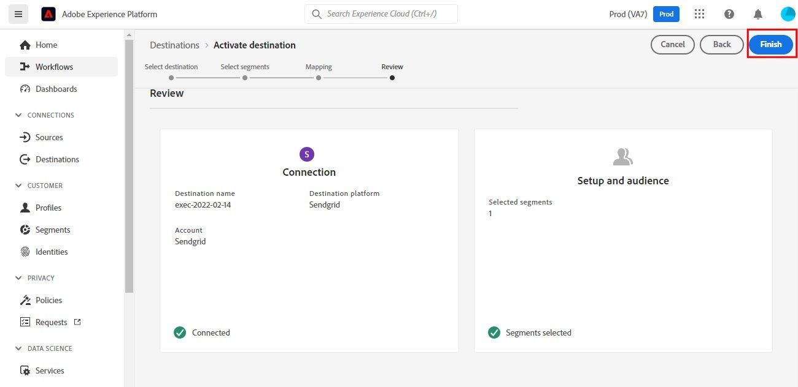
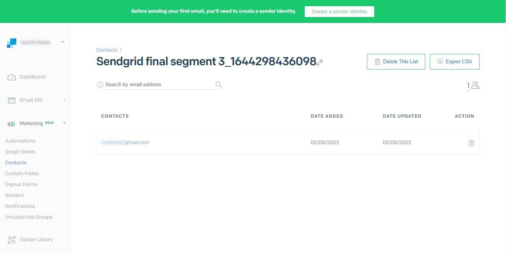

# [!DNL SendGrid] 连接

## 概述 {#overview}

[SendGrid](https://www.sendgrid.com) 是用于交易和营销电子邮件的常用客户通信平台。

此 [!DNL Adobe Experience Platform] [目标](/help/destinations/home.md) 利用 [[!DNL SendGrid Marketing Contacts API]](https://api.sendgrid.com/v3/marketing/contacts)，用于导出第一方电子邮件用户档案，并在新的SendGrid区段中激活它们以满足您的业务需求。

SendGrid使用API载体令牌作为与SendGrid API通信的身份验证机制。

## 先决条件 {#prerequisites}

在开始配置目标之前，需要使用以下项目。

1. 您需要拥有SendGrid帐户。
   * 转到SendGrid [注册](https://signup.sendgrid.com/) 页面以注册和创建SendGrid帐户（如果尚未）。
1. 登录到SendGrid门户后，您还需要生成API令牌。
1. 导航到SendGrid网站并访问 **[!DNL Settings]** > **[!DNL API Keys]** 页面。 或者，请参阅 [SendGrid文档](https://app.sendgrid.com/settings/api_keys) 以访问SendGrid应用程序中的相应部分。
1. 最后，选择 **[!DNL Create API Key]** 按钮。
   * 请参阅 [SendGrid文档](https://docs.sendgrid.com/ui/account-and-settings/api-keys#creating-an-api-key)，如果您需要有关要执行哪些操作的指导。
   * 如果您希望以编程方式生成API密钥，请参阅 [SendGrid文档](https://docs.sendgrid.com/api-reference/api-keys/create-api-keys).

在将数据激活到SendGrid目标之前，您必须具有 [模式](https://experienceleague.adobe.com/docs/experience-platform/xdm/schema/composition.html?lang=zh-Hans), a [数据集](https://experienceleague.adobe.com/docs/platform-learn/tutorials/data-ingestion/create-datasets-and-ingest-data.html?lang=en)和 [区段](https://experienceleague.adobe.com/docs/platform-learn/tutorials/segments/create-segments.html?lang=en) 创建于 [!DNL Experience Platform]. 另请参阅 [限制](#limits) 部分。

>[!IMPORTANT]
>
>* 用于从电子邮件用户档案创建邮件列表的SendGrid API要求在每个用户档案中提供唯一的电子邮件地址。 无论它是否用作 *电子邮件* 或 *备用电子邮件*. 由于SendGrid连接支持电子邮件和替代电子邮件值的映射，因此请确保所用的所有电子邮件地址在 *数据集*. 否则，在将电子邮件用户档案发送到SendGrid时，将导致错误，并且该电子邮件用户档案将不存在于数据导出中。
>
>* 目前，在从SendGrid的区段中删除用户档案时，尚无从SendGrid中删除这些用户档案的功能。Experience Platform

## 支持的身份 {#supported-identities}

SendGrid支持激活下表中描述的身份。 详细了解 [标识](/help/identity-service/namespaces.md).

| Target标识 | 描述 | 注意事项 |
|---|---|---|
| 电子邮件 | 电子邮件地址 | 请注意，支持纯文本和SHA256经过哈希处理的电子邮件地址 [!DNL Adobe Experience Platform]. 如果Experience Platform源字段包含未哈希属性，请检查 **[!UICONTROL 应用转换]** 选项， [!DNL Platform] 自动对激活时的数据进行哈希处理。   请注意 **SendGrid** 不支持经过哈希处理的电子邮件地址，因此只会将没有转换的纯文本数据发送到目标。 |

{style=&quot;table-layout:auto&quot;}

## 导出类型和频度 {#export-type-frequency}

有关目标导出类型和频率的信息，请参阅下表。

| 项目 | 类型 | 注释 |
---------|----------|---------|
| 导出类型 | **[!UICONTROL 基于用户档案]** | 您要导出区段的所有成员，以及所需的架构字段(例如：电子邮件地址、电话号码、姓氏)，在 [目标激活工作流](/help/destinations/ui/activate-batch-profile-destinations.md#select-attributes). |
| 导出频度 | **[!UICONTROL 流]** | 流目标“始终运行”基于API的连接。 在基于区段评估的Experience Platform中更新用户档案后，连接器会立即将更新发送到目标平台下游。 有关更多信息 [流目标](/help/destinations/destination-types.md#streaming-destinations). |

{style=&quot;table-layout:auto&quot;}

## 用例 {#use-cases}

为了帮助您更好地了解应如何以及何时使用SendGrid目标，以下是示例用例 [!DNL Experience Platform] 客户可以使用此目标来解决。

### 为多个营销活动创建营销列表

使用SendGrid的营销团队可以在SendGrid中创建邮件列表，并使用电子邮件地址对其进行填充。 现在在SendGrid中创建的邮件列表随后可用于多个营销活动。

## 连接到目标 {#connect}

>[!IMPORTANT]
> 
>要连接到目标，您需要 **[!UICONTROL 管理目标]** [访问控制权限](/help/access-control/home.md#permissions). 阅读 [访问控制概述](/help/access-control/ui/overview.md) 或联系您的产品管理员以获取所需的权限。

要连接到此目标，请按照 [目标配置教程](../../ui/connect-destination.md). 下面详细介绍了特定于此目标的步骤。

1. 在 [!DNL Adobe Experience Platform] 控制台，导航到 **目标**.

1. 选择 **目录** 选项卡和搜索 *SendGrid*. 然后选择 **设置**. 在您建立与目标的连接后，UI标签会更改为 **激活区段**.
   

1. 将向您显示一个向导，帮助您配置SendGrid目标。 通过选择 **配置新目标**.
   

1. 选择 **新帐户** 选项并填写 **载体令牌** 值。 此值为SendGrid *API密钥* 之前在 [先决条件部分](#prerequisites).
   

1. 选择 **连接到目标**. 如果SendGrid *API密钥* 您提供的UI是有效的，则UI会显示 **已连接** 状态中显示绿色复选标记，然后您可以继续执行下一步以填写其他信息字段。

### 连接参数 {#parameters}

While [设置](https://experienceleague.adobe.com/docs/experience-platform/destinations/ui/connect-destination.html?lang=en) 此目标中，您必须提供以下信息：

* **[!UICONTROL 名称]**:将来用于识别此目标的名称。
* **[!UICONTROL 描述]**:可选描述，可帮助您在将来确定此目标。

## 将区段激活到此目标 {#activate}

>[!IMPORTANT]
> 
>要激活数据，您需要 **[!UICONTROL 管理目标]**, **[!UICONTROL 激活目标]**, **[!UICONTROL 查看配置文件]**&#x200B;和 **[!UICONTROL 查看区段]** [访问控制权限](/help/access-control/home.md#permissions). 阅读 [访问控制概述](/help/access-control/ui/overview.md) 或联系您的产品管理员以获取所需的权限。

读取 [激活用户档案和区段以流式传输区段导出目标](/help/destinations/ui/activate-segment-streaming-destinations.md) 有关将受众区段激活到此目标的说明。

有关特定于此目标的详细信息，请参阅以下图像。

1. 选择一个或多个要导出到SendGrid的区段。
   

1. 在 **[!UICONTROL 映射]** 步骤，在选择 **[!UICONTROL 添加新映射]**，则会显示映射页面，以将源XDM字段映射到SendGrid API目标字段。 下图演示了如何在Experience Platform和SendGrid之间映射身份命名空间。 请确保 **[!UICONTROL 源字段]** *电子邮件* 应映射到 **[!UICONTROL 目标字段]** *external_id* 如下所示。
   

   
   
   

1. 同样，映射所需的 [!DNL Adobe Experience Platform] 要导出到SendGrid目标的属性。
   

   

1. 完成映射后，选择 **[!UICONTROL 下一个]** 进入审阅屏幕。
   

1. 选择 **[!UICONTROL 完成]** 以完成设置。
   

可以为 [SendGrid营销联系人>添加或更新联系人API](https://docs.sendgrid.com/api-reference/contacts/add-or-update-a-contact) 中。

| 源字段 | 目标字段 | 类型 | 描述 | 限制 |
|---|---|---|---|---|
| xdm:  homeAddress.street1 | xdm:  address_line_1 | 字符串 | 地址的第一行。 | 最大长度：  100个字符 |
| xdm:  homeAddress.street2 | xdm:  address_line_2 | 字符串 | 地址的可选第二行。 | 最大长度：  100个字符 |
| xdm:  _extcondev.alternate_emails | xdm:  alternate_emails | 字符串数组 | 与联系人关联的其他电子邮件。 | <ul><li>最大：5件</li><li>最低：0项</li></ul> |
| xdm:  homeAddress.city | xdm:  城市 | 字符串 | 联系人所在的城市。 | 最大长度：  60个字符 |
| xdm:  homeAddress.country | xdm:  国家 | 字符串 | 联系人所在的国家/地区。 可以是全名或缩写。 | 最大长度：  50个字符 |
| identityMap:  电子邮件 | 身份：  external_id | 字符串 | 联系人的主要电子邮件。 这必须是有效的电子邮件。 | 最大长度：  254个字符 |
| xdm:  person.name.firstName | xdm:  first_name | 字符串 | 联系人的姓名 | 最大长度：  50个字符 |
| xdm:  person.name.lastName | xdm:  last_name | 字符串 | 联系人的姓氏 | 最大长度：  50个字符 |
| xdm:  homeAddress.postalCode | xdm:  postal_code | 字符串 | 联系人的邮政编码或其他邮政编码。 |  |
| xdm:  homeAddress.stateProviance | xdm:  state_province_region | 字符串 | 联系人所在的州、省或地区。 | 最大长度：  50个字符 |

## 验证SendGrid中的数据导出 {#validate}

要验证您是否已正确设置目标，请执行以下步骤：

1. 选择 **[!UICONTROL 目标]** > **[!UICONTROL 浏览]** 导航到目标列表。
   

1. 选择目标并验证状态是否为 **[!UICONTROL 已启用]**.
   

1. 切换到 **[!DNL Activation data]** ，然后选择区段名称。
   

1. 监控区段摘要，并检查与数据集内创建的计数相对应的配置文件计数。
   

1. 的 [SendGrid营销列表>创建列表API](https://docs.sendgrid.com/api-reference/lists/create-list) 用于通过连接 *list_name* 属性和数据导出的时间戳。 导航到SendGrid网站，并检查是否创建了符合名称模式的新联系人列表。
   

   

1. 选择新创建的联系人列表，并检查新联系人列表中是否填充了您创建数据集中的新电子邮件记录。

1. 此外，还可以检查几封电子邮件以验证字段映射是否正确。
   

   

## 数据使用和管理 {#data-usage-governance}

全部 [!DNL Adobe Experience Platform] 目标在处理数据时与数据使用策略相兼容。 有关如何 [!DNL Adobe Experience Platform] 实施数据管理，请查看 [数据管理概述](/help/data-governance/home.md).

## 其他资源 {#additional-resources}

此SendGrid目标可利用以下API:
* [SendGrid营销列表>创建列表API](https://docs.sendgrid.com/api-reference/lists/create-list)
* [SendGrid营销联系人>添加或更新联系人API](https://docs.sendgrid.com/api-reference/contacts/add-or-update-a-contact)

### 限制 {#limits}

* 的 [SendGrid营销联系人>添加或更新联系人API](https://api.sendgrid.com/v3/marketing/contacts) 可以接受30,000个联系人，或6MB的数据（以较低者为准）。
