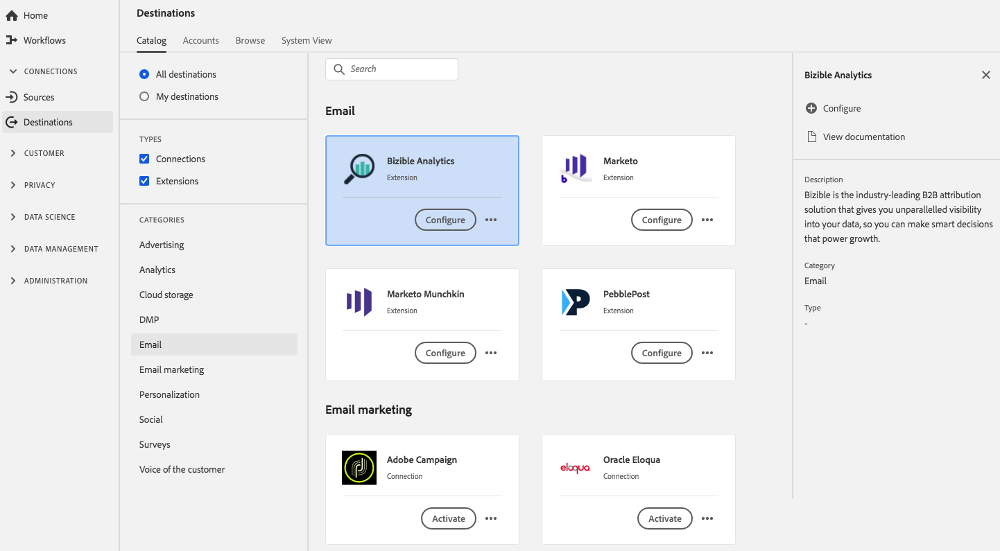

# [!DNL Bizible] 扩展 {#bizible-extension}

## 概述 {#overview}

[!DNL Bizible] 是行业领先的B2B归因解决方案，可让您以无与伦比的方式查看数据，从而做出明智的决策，推动数据增长。

[!DNL Bizible] 是Adobe Experience Platform中的电子邮件扩展。有关Bizible的更多信息，请阅读Bizible概述资源中的[营销归因](https://experienceleague.adobe.com/docs/bizible/using/introduction-to-bizible/overview-resources/marketing-attribution.html?lang=en) 。

此目标是一个标记扩展。 有关标记扩展在Platform中工作方式的更多信息，请参阅[标记扩展概述](../launch-extensions/overview.md)。

## 先决条件 {#prerequisites}

[!DNL Destinations]目录中提供了此扩展，可供已购买Platform的所有客户使用。

要使用此扩展，您需要访问Adobe Experience Platform中的标记。 标记作为内置增值功能提供给Adobe Experience Cloud客户。 请联系您的组织管理员以获取对标记的访问权限，并要求他们授予您&#x200B;**[!UICONTROL manage_properties]**&#x200B;权限，以便您可以安装扩展。

## 安装扩展 {#install-extension}

要安装[!DNL Bizible]扩展，请执行以下操作：

在[Platform接口](https://platform.adobe.com/)中，转到&#x200B;**[!UICONTROL 目标]** > **[!UICONTROL Catalog]**。

从目录中选择扩展或使用搜索栏。

单击目标以将其突出显示，然后选择右边栏中的&#x200B;**[!UICONTROL 配置]**。 如果&#x200B;**[!UICONTROL Configure]**&#x200B;控件呈灰显状态，则您缺少&#x200B;**[!UICONTROL manage_properties]**&#x200B;权限。 请参阅[先决条件](#prerequisites)。

选择要在其中安装扩展的标记属性。 您还可以选择创建新资产。 资产是规则、数据元素、配置的扩展、环境和库的集合。了解[标记文档](../../../tags/ui/administration/companies-and-properties.md)中的属性。

利用工作流，可转到数据收集UI以完成安装。

您还可以直接在[数据收集UI](https://experience.adobe.com/#/data-collection/)中安装扩展。 有关更多信息，请参阅[添加新扩展](../../../tags/ui/managing-resources/extensions/overview.md#add-a-new-extension)的指南。

## 如何使用扩展 {#how-to-use}

安装扩展后，您可以开始设置规则。 在数据收集UI中，您可以为已安装的扩展设置规则，以便仅在某些情况下将事件数据发送到扩展目标。 有关为扩展设置规则的更多信息，请参阅标记文档中关于[rules](../../../tags/ui/managing-resources/rules.md)的概述。

## 配置、升级和删除扩展 {#configure-upgrade-delete}

您可以在数据收集UI中配置、升级和删除扩展。

>[!TIP]
>
>如果您的其中一个资产上已安装扩展，则UI仍会显示该扩展的&#x200B;**[!UICONTROL Install]**。 按照[Install extension](#install-extension)中所述启动安装工作流，以配置或删除您的扩展。

要升级扩展，请参阅标记文档中[扩展升级过程](../../../tags/ui/managing-resources/extensions/extension-upgrade.md)中的指南。
