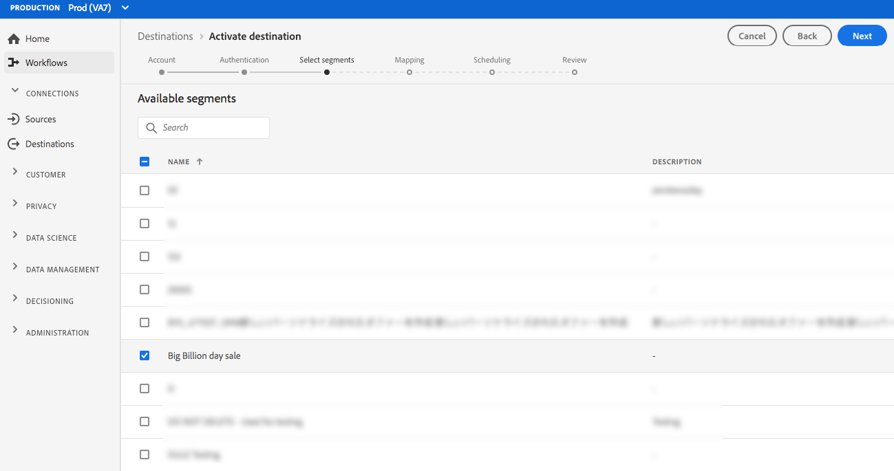

# （测试版）[!DNL Airship Attributes]连接{#airship-attributes-destination}

>[!IMPORTANT]
>
>Adobe Experience Platform中的[!DNL Airship Attributes]目标当前处于测试状态。 文档和功能可能会发生变化。

[!DNL Airship] 是领先的客户互动平台，可帮助您在客户生命周期的每个阶段向用户提供有意义的个性化全渠道消息。

此集成将Adobe用户档案数据作为[属性](https://docs.airship.com/guides/audience/attributes/)传递到[!DNL Airship]中以进行定位或触发。

要了解有关[!DNL Airship]的更多信息，请参阅[飞艇文档](https://docs.airship.com)。

>[!TIP]
>
>此文档页面由[!DNL Airship]团队创建。 如有任何查询或更新请求，请直接通过[support.airship.com](https://support.airship.com/)与他们联系。

## 先决条件 {#prerequisites}

在将受众区段发送到[!DNL Airship]之前，您必须：

* 在[!DNL Airship]项目中启用属性。
* 生成用于身份验证的承载令牌。

>[!TIP]
>
>如果尚未通过[此注册链接](https://go.airship.eu/accounts/register/plan/starter/)创建[!DNL Airship]帐户。

## 启用属性{#enable-attributes}

Adobe Experience Platform 用户档案属性与[!DNL Airship]属性类似，可使用本页下面进一步演示的映射工具在平台中轻松映射到彼此。

[!DNL Airship] 项目具有多个预定义和默认属性。如果您有自定义属性，则必须首先在[!DNL Airship]中定义它。 有关详细信息，请参阅[设置和管理属性](https://docs.airship.com/tutorials/audience/attributes/)。

## 生成承载令牌{#bearer-token}

转到[飞艇仪表板](https://go.airship.com)中的&#x200B;**[!UICONTROL Settings]**&quot; **[!UICONTROL APIs & Integrations]**，然后在左侧菜单中选择&#x200B;**[!UICONTROL Tokens]**。

单击 **[!UICONTROL Create Token]**。

为令牌提供用户友好名称，例如“Adobe属性目标”，然后为角色选择“全部访问”。

单击&#x200B;**[!UICONTROL Create Token]**&#x200B;并将详细信息另存为机密。

## 用例 {#use-cases}

为了帮助您更好地了解应如何以及何时使用[!DNL Airship Attributes]目标，以下是Adobe Experience Platform客户可通过使用此目标解决的示例使用案例。

### 用例#1

利用在Adobe Experience Platform中收集的用户档案数据，在[!DNL Airship]的任何渠道中个性化消息和丰富内容。 例如，利用[!DNL Experience Platform]用户档案数据在[!DNL Airship]中设置位置属性。 这样，酒店品牌就可以为每个用户显示最近酒店位置的图像。

### 用例#2

利用Adobe Experience Platform的属性进一步丰富[!DNL Airship]用户档案，并将其与SDK或[!DNL Airship]预测数据结合。 例如，零售商可以创建一个具有忠诚度状态和位置数据（平台属性）的细分，并且[!DNL Airship]预计会影响数据的流失，以向生活在内华达州拉斯维加斯的黄金忠诚度状态用户发送高度定向的消息，这些用户很可能会频繁转发。

## 连接到[!DNL Airship Attributes] {#connect-airship-attributes}

在&#x200B;**[!UICONTROL Destinations]** > **[!UICONTROL Catalog]**&#x200B;中，滚动到&#x200B;**[!UICONTROL Mobile Engagement]**&#x200B;类别。 选择&#x200B;**[!DNL Airship Attributes]**，然后选择&#x200B;**[!UICONTROL Configure]**。

>[!NOTE]
>
>如果与此目标的连接已存在，您可以在目标卡上看到&#x200B;**[!UICONTROL Activate]**&#x200B;按钮。 有关&#x200B;**[!UICONTROL Activate]**&#x200B;和&#x200B;**[!UICONTROL Configure]**&#x200B;之间差异的详细信息，请参阅目标工作区文档的[目录](../../ui/destinations-workspace.md#catalog)部分。

在&#x200B;**帐户**&#x200B;步骤中，如果您之前已设置到[!DNL Airship Attributes]目标的连接，请选择&#x200B;**[!UICONTROL Existing Account]**&#x200B;并选择您的现有连接。 或者，您可以选择&#x200B;**[!UICONTROL New Account]**&#x200B;来设置到[!DNL Airship Attributes]的新连接。 选择&#x200B;**[!UICONTROL Connect to destination]**&#x200B;以使用您从[!DNL Airship]仪表板生成的载体令牌将Adobe Experience Platform连接到您的[!DNL Airship]项目。

>[!NOTE]
>
>Adobe Experience Platform支持身份验证过程中的凭据验证，如果您向[!DNL Airship]帐户输入了不正确的凭据，则会显示错误消息。 这可确保您没有使用不正确的凭据完成工作流。

确认您的凭据并将Adobe Experience Platform连接到您的[!DNL Airship]项目后，您可以选择&#x200B;**[!UICONTROL Next]**&#x200B;继续执行&#x200B;**[!UICONTROL Setup]**&#x200B;步骤。

在&#x200B;**[!UICONTROL Authentication]**&#x200B;步骤中，输入&#x200B;**[!UICONTROL Name]**&#x200B;和&#x200B;**[!UICONTROL Description]**&#x200B;作为激活流。

此外，在此步骤中，您还可以选择美国或欧盟数据中心，具体取决于哪个[!DNL Airship]数据中心适用于此目标。 最后，选择一个或多个&#x200B;**[!UICONTROL Marketing Actions]**，数据将导出到目标。 您可以从Adobe定义的营销活动中进行选择，也可以创建您自己的营销活动。 有关营销操作的详细信息，请参阅[数据使用策略概述](../../../data-governance/policies/overview.md)。

在填写上面的字段后选择&#x200B;**[!UICONTROL Create Destination]**。

您的目标现在已创建。 如果您希望稍后激活区段，则可以选择&#x200B;**[!UICONTROL Save & Exit]**，也可以选择&#x200B;**[!UICONTROL Next]**&#x200B;继续工作流，然后选择要激活的区段。 在任一情况下，请参阅工作流其余部分的下一节[激活区段](#activate-segments)。

## 激活区段{#activate-segments}

要将区段激活到[!DNL Airship Attributes]，请执行以下步骤：

在&#x200B;**[!UICONTROL Destinations > Browse]**&#x200B;中，选择要激活区段的[!DNL Airship Attributes]目标。

单击目标的名称。 此操作将带您进入激活流程。

请注意，如果目标激活流已存在，您可以看到当前正发送到目标的区段。 选择右边栏中的&#x200B;**[!UICONTROL Edit activation]**，然后按照以下步骤修改激活详细信息。

选择 **[!UICONTROL Activate]**。在&#x200B;**[!UICONTROL Activate destination]**&#x200B;工作流的&#x200B;**[!UICONTROL Select Segments]**&#x200B;页面上，选择要发送到[!DNL Airship Attributes]的区段。

在&#x200B;**[!UICONTROL Mapping]**&#x200B;步骤中，从[XDM](../../../xdm/home.md)模式中选择要映射到目标模式的属性和标识。 选择&#x200B;**[!UICONTROL Add new mapping]**&#x200B;以浏览您的模式并将其映射到相应的目标标识。

[!DNL Airship] 可以在表示设备实例（如iPhone）的渠道或将用户的所有设备映射到通用标识符（如客户ID）的指定用户上设置属性。如果您的模式中有纯文本（未哈希化）电子邮件地址作为主要标识，请选择&#x200B;**[!UICONTROL Source Attributes]**&#x200B;中的电子邮件字段，并映射到&#x200B;**[!UICONTROL Target Identities]**&#x200B;下右列中的[!DNL Airship]指定用户，如下所示。

对于应映射到渠道（即设备）的标识符，根据源映射到相应的渠道。 下图显示了如何创建两个映射：

* [!DNL Airship] iOS渠道的IDFA iOS广告ID
* Adobe`fullName`属性为[!DNL Airship] &quot;Full Name&quot;属性

>[!NOTE]
>
>使用[!DNL Airship]仪表板中显示的用户友好名称，当为属性映射选择目标字段时。

**映射标识**

选择源字段：

选择目标字段：

**映射属性**

选择源属性：

选择目标属性：

验证映射：

在&#x200B;**[!UICONTROL Segment schedule]**&#x200B;页面上，当前已禁用计划。 单击&#x200B;**[!UICONTROL Next]**&#x200B;继续执行审阅步骤。

在&#x200B;**[!UICONTROL Review]**&#x200B;页面上，您可以看到所选内容的摘要。 选择&#x200B;**[!UICONTROL Cancel]**&#x200B;以划分流，选择&#x200B;**[!UICONTROL Back]**&#x200B;以修改设置，或选择&#x200B;**[!UICONTROL Finish]**&#x200B;以确认您的选择，并将开始发送到目标。

>[!IMPORTANT]
>
>在此步骤中，Adobe Experience Platform将检查数据使用策略违规。 下面显示了违反策略的示例。 在解决违规之前，您无法完成区段激活工作流。 有关如何解决策略违规的信息，请参阅数据治理文档部分中的[策略实施](../../../data-governance/enforcement/auto-enforcement.md)。

如果未检测到任何策略违规，请选择&#x200B;**[!UICONTROL Finish]**&#x200B;以确认您的选择，并开始将数据发送到目标。

## 数据使用和管理{#data-usage-governance}

处理数据时，所有[!DNL Adobe Experience Platform]目标都符合数据使用策略。 有关[!DNL Adobe Experience Platform]如何实施数据治理的详细信息，请参阅[数据治理概述](../../../data-governance/home.md)。
