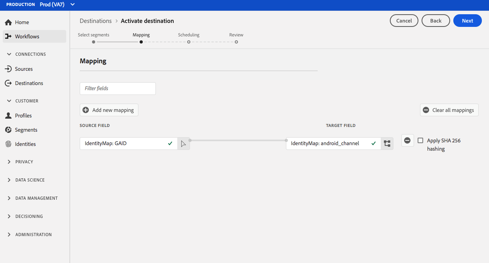

# [!DNL Airship Tags] 连接 {#airship-tags-destination}

## 概述

[!DNL Airship] 是领先的客户参与平台，帮助您在客户生命周期的每个阶段都向用户传递有意义、个性化的全渠道信息。

此集成将Adobe Experience Platform受众数据传递到 [!DNL Airship] 作为 [标记](https://docs.airship.com/guides/audience/tags/) 用于定位或触发。

要了解有关 [!DNL Airship]，请参见 [飞艇文档](https://docs.airship.com).

>[!TIP]
>
>此目标连接器和文档页面由 [!DNL Airship] 团队。 如有任何查询或更新请求，请直接通过以下电子邮件联系他们： [support.airship.com](https://support.airship.com/).

## 先决条件

将Adobe Experience Platform受众发送至 [!DNL Airship]，您必须：

* 在中创建标记组 [!DNL Airship] 项目。
* 生成持有者令牌以进行身份验证。

>[!TIP]
> 
>创建 [!DNL Airship] 帐户透过 [此注册链接](https://go.airship.eu/accounts/register/plan/starter/) 如果你还没有的话。

## 支持的受众 {#supported-audiences}

此部分介绍可将哪种类型的受众导出到此目标。

| 受众来源 | 受支持 | 描述 |
---------|----------|----------|
| [!DNL Segmentation Service] | ✓ {\f13 } | 通过Experience Platform生成的受众 [分段服务](../../../segmentation/home.md). |
| 自定义上传 | ✓ | 受众 [已导入](../../../segmentation/ui/overview.md#import-audience) 从CSV文件Experience Platform到。 |

{style="table-layout:auto"}

## 导出类型和频率 {#export-type-frequency}

有关目标导出类型和频率的信息，请参阅下表。

| 项目 | 类型 | 注释 |
---------|----------|---------|
| 导出类型 | **[!UICONTROL 受众导出]** | 您正在导出具有飞艇标记目标中所用标识符的受众的所有成员。 |
| 导出频率 | **[!UICONTROL 流]** | 流目标为基于API的“始终运行”连接。 一旦根据受众评估在Experience Platform中更新了用户档案，连接器就会将更新发送到下游目标平台。 详细了解 [流目标](/help/destinations/destination-types.md#streaming-destinations). |

{style="table-layout:auto"}

## 标记组

AdobeExperience Platform中的受众概念类似于 [标记](https://docs.airship.com/guides/audience/tags/) 在飞行任务中，实施方面略有不同。 此集成映射用户 [Experience Platform区段中的成员资格](../../../xdm/field-groups/profile/segmentation.md) 存在或不存在 [!DNL Airship] 标记之前。 例如，在Platform受众中， `xdm:status` 更改为 `realized`，则标记将添加到 [!DNL Airship] 此配置文件映射到的渠道或命名用户。 如果 `xdm:status` 更改为 `exited`，则标记会被删除。

要启用此集成，请创建 *标记组* 在 [!DNL Airship] 已命名 `adobe-segments`.

>[!IMPORTANT]
>
>创建新标记组时 **不检查** 单选按钮上显示“[!DNL Allow these tags to be set only from your server]“。 这样做会导致Adobe标记集成失败。

请参阅 [管理标记组](https://docs.airship.com/tutorials/manage-project/messaging/tag-groups) 以获取有关创建标记组的说明。

## 生成持有者令牌

转到 **[!UICONTROL 设置]** &quot; **[!UICONTROL API和集成]** 在 [飞艇仪表板](https://go.airship.com) 并选择 **[!UICONTROL 令牌]** 在左侧菜单中。

单击 **[!UICONTROL 创建令牌]**.

为您的令牌提供用户友好的名称，例如“Adobe标记目标”，并为角色选择“完全访问”。

单击 **[!UICONTROL 创建令牌]** 并将详细信息保存为机密。

## 用例

为了帮助您更好地了解您应该如何以及何时使用 [!DNL Airship Tags] 目标，以下是Adobe Experience Platform客户可以使用此目标解决的示例用例。

### 用例#1

零售商或娱乐平台可以创建关于忠诚客户的用户配置文件，并将这些受众传递到 [!DNL Airship] 用于移动营销活动上的消息定位。

### 用例#2

当用户归属或退出Adobe Experience Platform中的特定受众时，实时触发一对一消息。

例如，零售商在Platform中设置特定于牛仔裤品牌的受众。 现在，只要用户将其牛仔裤首选项设置为特定品牌，该零售商就会触发移动消息。

## 连接到目标 {#connect}

>[!IMPORTANT]
> 
>要连接到目标，您需要 **[!UICONTROL 管理目标]** [访问控制权限](/help/access-control/home.md#permissions). 阅读 [访问控制概述](/help/access-control/ui/overview.md) 或与产品管理员联系以获取所需的权限。

要连接到此目标，请按照 [目标配置教程](../../ui/connect-destination.md). 在配置目标工作流中，填写下面两个部分中列出的字段。

### 向目标进行身份验证 {#authenticate}

要向目标进行身份验证，请填写必填字段并选择 **[!UICONTROL 连接到目标]**.

* **[!UICONTROL 持有者令牌]**：您从生成的持有者令牌 [!DNL Airship] 仪表板。

### 填写目标详细信息 {#destination-details}

要配置目标的详细信息，请填写下面的必需和可选字段。 UI中字段旁边的星号表示该字段为必填字段。

* **[!UICONTROL 名称]**：输入可帮助您识别此目标的名称。
* **[!UICONTROL 描述]**：输入此目标的描述。
* **[!UICONTROL 域]**：选择美国或欧盟的数据中心，具体取决于哪个 [!DNL Airship] 数据中心适用于此目标。

### 启用警报 {#enable-alerts}

您可以启用警报，以接收有关发送到目标的数据流状态的通知。 从列表中选择警报以订阅接收有关数据流状态的通知。 有关警报的详细信息，请参阅以下内容中的指南： [使用UI订阅目标警报](../../ui/alerts.md).

完成提供目标连接的详细信息后，选择 **[!UICONTROL 下一个]**.

## 将受众激活到此目标 {#activate}

>[!IMPORTANT]
> 
>要激活数据，您需要 **[!UICONTROL 管理目标]**， **[!UICONTROL 激活目标]**， **[!UICONTROL 查看配置文件]**、和 **[!UICONTROL 查看区段]** [访问控制权限](/help/access-control/home.md#permissions). 阅读 [访问控制概述](/help/access-control/ui/overview.md) 或与产品管理员联系以获取所需的权限。

请参阅 [将受众数据激活到流式受众导出目标](../../ui/activate-segment-streaming-destinations.md) 有关将受众激活到此目标的说明。

## 映射注意事项 {#mapping-considerations}

[!DNL Airship] 标记可以在表示设备实例(如iPhone)的渠道上设置，也可以设置命名用户（将用户的所有设备映射到通用标识符，如客户ID）。 如果您的架构中将纯文本（未散列）电子邮件地址作为主要身份，请在 **[!UICONTROL 源属性]** 并将映射到 [!DNL Airship] 下右列的指定用户 **[!UICONTROL 目标身份]**，如下所示。

对于应映射到通道（即设备）的标识符，请根据源映射到相应的通道。 下图显示了如何将Google Advertising ID映射到 [!DNL Airship] Android渠道。

## 数据使用和治理 {#data-usage-governance}

全部 [!DNL Adobe Experience Platform] 目标在处理您的数据时符合数据使用策略。 有关如何执行操作的详细信息 [!DNL Adobe Experience Platform] 实施数据管理，请参阅 [数据管理概述](../../../data-governance/home.md).
