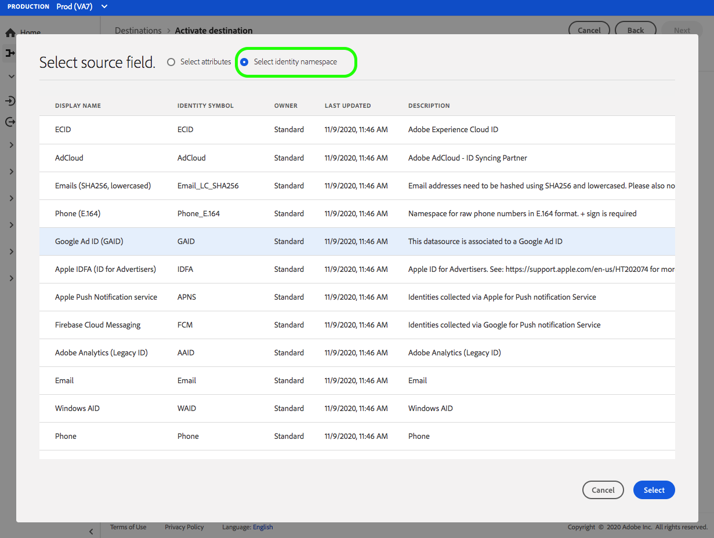

# （测试版）[!DNL Airship Tags]连接 {#airship-tags-destination}

>[!IMPORTANT]
>
>Adobe Experience Platform中的[!DNL Airship Tags]目标当前处于测试阶段。 文档和功能可能会发生变化。

## 概述

[!DNL Airship] 是领先的客户参与平台，可帮助您在客户生命周期的每个阶段向用户提供有意义的个性化全方位消息。

此集成将Adobe Experience Platform区段数据作为[Tags](https://docs.airship.com/guides/audience/tags/)传递到[!DNL Airship]中，以进行定位或触发。

要了解有关[!DNL Airship]的更多信息，请参阅[Airship Docs](https://docs.airship.com)。

>[!TIP]
>
>本文档页面由[!DNL Airship]团队创建。 如有任何查询或更新请求，请直接通过[support.airship.com](https://support.airship.com/)联系。

## 先决条件

在将Adobe Experience Platform区段发送到[!DNL Airship]之前，您必须：

* 在[!DNL Airship]项目中创建标签组。
* 生成用于身份验证的载体令牌。

>[!TIP]
> 
>通过[此注册链接](https://go.airship.eu/accounts/register/plan/starter/)创建[!DNL Airship]帐户（如果尚未创建）。

## 标签组

Adobe Experience Platform中区段的概念与Airship中的[Tags](https://docs.airship.com/guides/audience/tags/)类似，只是实施方面略有不同。 此集成将Experience Platform区段](../../../xdm/field-groups/profile/segmentation.md)中用户[成员身份的状态映射到[!DNL Airship]标记的存在与否。 例如，在`xdm:status`更改为`realized`的平台区段中，将标记添加到[!DNL Airship]渠道或此配置文件映射到的已命名用户。 如果`xdm:status`更改为`exited`，则会删除标记。

要启用此集成，请在[!DNL Airship]中创建名为`adobe-segments`的&#x200B;*标签组*。

>[!IMPORTANT]
>
>创建新标签组&#x200B;**请勿选中**&#x200B;显示“[!DNL Allow these tags to be set only from your server]”的单选按钮。 这样做会导致Adobe标记集成失败。

有关创建标签组的说明，请参阅[管理标签组](https://docs.airship.com/tutorials/manage-project/messaging/tag-groups)。

## 生成载体令牌

转到[Airship仪表板](https://go.airship.com)中的&#x200B;**[!UICONTROL Settings]**&quot; **[!UICONTROL API和集成]**，然后在左侧菜单中选择&#x200B;**[!UICONTROL 令牌]**。

单击&#x200B;**[!UICONTROL 创建令牌]**。

为令牌提供用户友好名称(例如“Adobe标记目标”)，然后为角色选择“全部访问”。

单击&#x200B;**[!UICONTROL 创建令牌]**&#x200B;并将详细信息另存为机密。

## 用例

为了帮助您更好地了解应如何以及何时使用[!DNL Airship Tags]目标，以下是Adobe Experience Platform客户可通过使用此目标解决的示例用例。

### 用例#1

零售商或娱乐平台可以根据忠诚客户创建用户配置文件，并将这些区段传递到[!DNL Airship]中，以便在移动营销活动上定位消息。

### 用例#2

当用户进入或退出Adobe Experience Platform中的特定区段时，会实时触发一对一消息。

例如，一家零售商在Platform中设置一个特定于牛仔裤品牌的区段。 现在，当某人将其牛仔裤首选项设置为特定品牌时，该零售商可以触发移动消息。

## 连接到目标 {#connect}

要连接到此目标，请按照[目标配置教程](../../ui/connect-destination.md)中描述的步骤操作。

### 连接参数 {#parameters}

在[设置](../../ui/connect-destination.md)此目标时，必须提供以下信息：

* **[!UICONTROL 载体令牌]**:您从功能板生成的载体令 [!DNL Airship] 牌。
* **[!UICONTROL 名称]**:输入一个名称，以帮助您标识此目标。
* **[!UICONTROL 描述]**:输入此目标的描述。
* **[!UICONTROL 域]**:选择美国或欧盟的数据中心，具体取决于哪 [!DNL Airship] 个数据中心适用于此目标。

## 将区段激活到此目标 {#activate}

有关将受众区段激活到此目标的说明，请参阅[将受众数据激活到流区段导出目标](../../ui/activate-segment-streaming-destinations.md)。

## 映射注意事项 {#mapping-considerations}

[!DNL Airship] 可以在渠道（表示设备实例，如iPhone）或指定用户（将用户的所有设备映射到通用标识符，如客户ID）上设置标记。如果您的架构中将纯文本（未经过哈希处理）的电子邮件地址作为主标识，请选择&#x200B;**[!UICONTROL 源属性]**&#x200B;中的email字段，然后映射到&#x200B;**[!UICONTROL 目标标识]**&#x200B;下右列中的[!DNL Airship]指定用户，如下所示。

对于应映射到渠道（即设备）的标识符，请根据源映射到相应的渠道。 以下图像显示如何将Google广告ID映射到[!DNL Airship] Android渠道。

## 数据使用和管理 {#data-usage-governance}

处理数据时，所有[!DNL Adobe Experience Platform]目标都符合数据使用策略。 有关[!DNL Adobe Experience Platform]如何实施数据管理的详细信息，请参阅[数据管理概述](../../../data-governance/home.md)。
