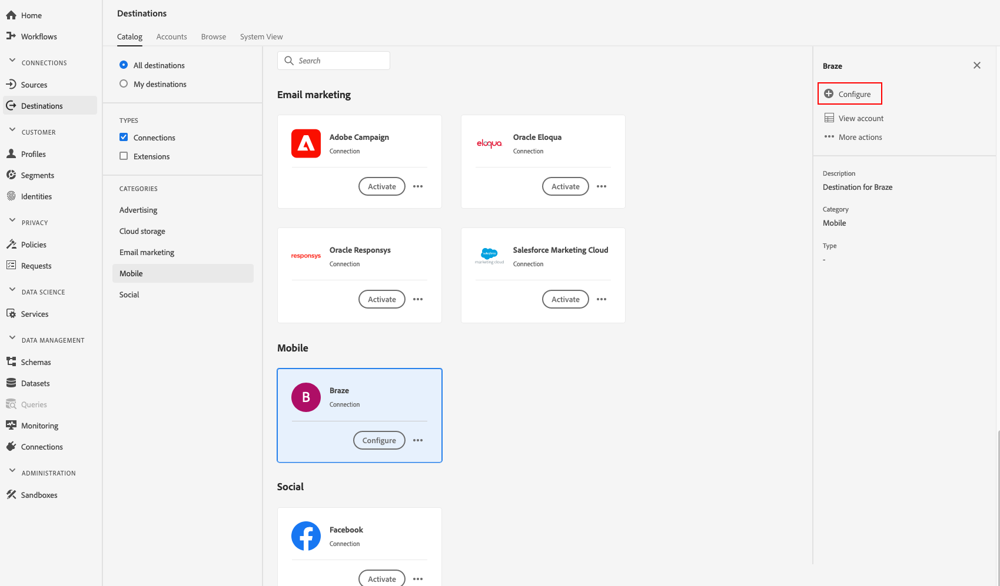
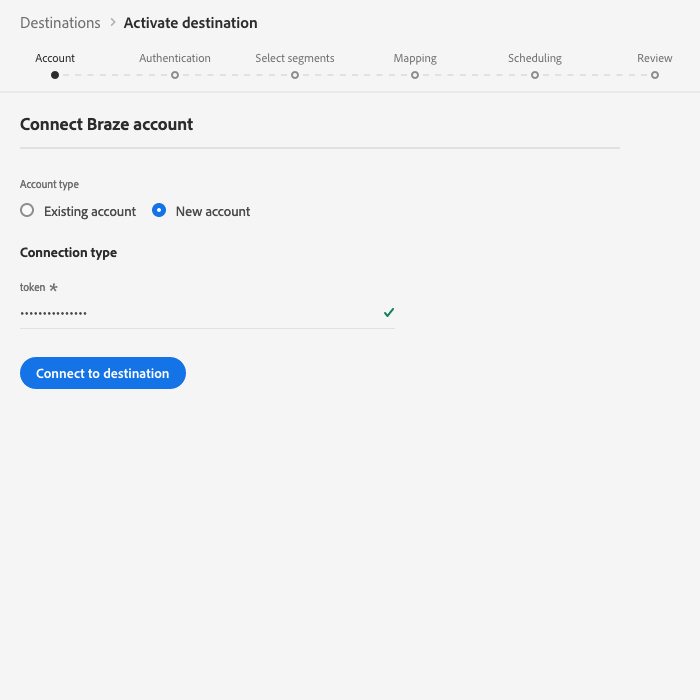

# （测试版）目 [!DNL Braze] 标

>[!IMPORTANT]
>
>Adobe Experience Platform的Braze目的地目前为Beta。 文档和功能可能会发生变化。

## 概述 {#overview}

目 [!DNL Braze] 标可帮助您将用户档案数据发送 [!DNL Braze]到。

[!DNL Braze] 是一个全面的客户互动平台，可为客户和他们喜爱的品牌提供相关而难忘的体验。

要将用户档案数据发 [!DNL Braze]送到，必须先连接到目标。

## 目标规范 {#destination-specs}

请注意特定于目标的以下详细 [!DNL Braze] 信息：

* 只要将任何 [身份](../../../identity-service/namespaces.md) 映射 [!DNL Braze] 到目标，即可将其发送到目标 [!DNL Braze][`external_id`](https://www.braze.com/docs/api/basics/#external-user-id-explanation)。
* [!DNL Adobe Experience Platform] 段将导出到属 [!DNL Braze] 性下的 `AdobeExperiencePlatformSegments` 属性。

>[!NOTE]
>
>请记住，发送附加的自定义属性 [!DNL Braze] 可能会增加您的 [!DNL Braze] 数据点消耗。 在发送其他自定义 [!DNL Braze] 属性之前，请咨询客户经理。

## 用例 {#use-cases}

作为营销人员，我希望在移动互动目标中目标用户，并内置细分 [!DNL Adobe Experience Platform]。 此外，我希望在中更新细分和用户档案后，根据用户档案的 [!DNL Adobe Experience Platform] 属性，为他们提供个性化体验 [!DNL Adobe Experience Platform]。

## 导出类型 {#export-type}

**[!DNL Profile-based]** -您正在导出区段的所有成员，以及所需的模式字段(例如：根据您的字段映射，发送电子邮件地址、电话号码、姓氏)和／或身份。
[!DNL Adobe Experience Platform] 段将导出到属 [!DNL Braze] 性下的 `AdobeExperiencePlatformSegments` 属性。

## 连接到目标 {#connect-destination}

在“ **[!UICONTROL 连接]** ”>“ **[!UICONTROL 目标]**”中 [!DNL Braze]，选 **[!UICONTROL 择并选择“]**&#x200B;配置”。

>[!NOTE]
>
>如果与此目标的连接已存在，您可以在目标卡 **[!UICONTROL 上看到]** “激活”按钮。 有关激活和配置之 **[!UICONTROL 间差异]** 的详 **[!UICONTROL 细信]**&#x200B;息，请参 [阅目标工](../../ui/destinations-workspace.md#catalog) 作区文档的“目录”部分。
>
>

在“帐 [!UICONTROL 户] ”步骤中，您需要提供您的 [!DNL Braze] 帐户令牌。 这是你的 [!DNL Braze] 钥 [!DNL API] 匙。 您可以在以下网址找到如何获取密钥的详 [!DNL API] 细说明： [REST API密钥概述](https://www.braze.com/docs/api/api_key/)。 输入令牌，然后单 **[!UICONTROL 击连接到目标]**。

单击&#x200B;**[!UICONTROL 下一步]**。在身份验证 [!UICONTROL 步骤] ，您需要输入连接详细 [!DNL Braze] 信息：
* **[!UICONTROL 名称]**:输入一个名称，您将通过该名称在将来识别此目标。
* **[!UICONTROL 描述]**:输入将帮助您在将来识别此目标的描述。
* **[!UICONTROL 端点实例]**:询问您 [!DNL Braze] 的代表您应使用哪个端点实例。
* **[!UICONTROL 营销用例]**:市场营销用例指明将数据导出到目标的目的。 您可以从Adobe定义的营销用例中进行选择，也可以创建自己的营销用例。 有关市场营销用例的更多信息，请参 [阅Adobe Experience Platform的数据管](../../../rtcdp/privacy/data-governance-overview.md#destinations) 理页。 有关各个Adobe定义的营销用例的信息，请参阅数据 [使用策略概述](../../../data-governance/policies/overview.md#core-actions)。

单击“ **[!UICONTROL 创建目标]**”。 您的目标现在已创建。 如果希望以 **[!UICONTROL 后激活区段]** ，则可以单击保存并退出，也可以选择 **[!UICONTROL 下一步]** ，继续工作流并选择要激活的区段。 在任一情况下，请参阅下一 [节激活](#activate-segments)“区段”，了解工作流的其余部分。

## 激活区段 {#activate-segments}

有关 [区段用户档案工作流的信息](../../ui/activate-destinations.md#select-attributes) ，请参阅将激活和区段激活到目标。

## 字段映射 {#field-mapping}

要将受众数据正确 [!DNL Adobe Experience Platform] 从目 [!DNL Braze] 标发送到目标，您需要完成字段映射步骤。

映射包括在帐户中的(XDM) [!DNL Experience Data Model] 模式字段与目标中 [!DNL Platform] 对应的目标字段之间创建链接。

要正确将XDM字段映射到目 [!DNL Braze] 标字段，请执行以下步骤：

在“映 [!UICONTROL 射] ”步骤中， **[!UICONTROL 单击“添加新映射]**”。

在“源 [!UICONTROL 字段] ”部分，单击空字段旁的箭头按钮。

在“选 [!UICONTROL 择源字段] ”窗口中，您可以选择两类别XDM字段：
* [!UICONTROL 选择属性]:使用此选项将特定字段从XDM模式映射到属 [!DNL Braze] 性。

* [!UICONTROL 选择标识命名空间]:使用此选项将标识 [!DNL Platform] 命名空间映射到 [!DNL Braze] 命名空间。

选择源字段，然后单击“ **[!UICONTROL 选择]**”。

在“ [!UICONTROL 目标字段] ”部分，单击字段右侧的映射图标。

在“选 [!UICONTROL 择目标字段] ”窗口中，您可以选择三类别目标字段：
* [!UICONTROL 选择属性]:使用此选项可将XDM属性映射到标准 [!DNL Braze] 属性。
* [!UICONTROL 选择标识命名空间]:使用此选项可将标识 [!DNL Platform] 命名空间映射到标 [!DNL Braze] 识命名空间。
* [!UICONTROL 选择自定义属性]:使用此选项可将XDM属性映射到您在帐 [!DNL Braze] 户中定义的自定义 [!DNL Braze] 属性。
* 您还可以使用此选项将现有XDM属性重命名为 [!DNL Braze]。 例如，将XDM属 `lastName` 性映射到中的自定义 `Last_Name` 属性 [!DNL Braze]，将在中创建该属性(如果该 `Last_Name` 属性尚不 [!DNL Braze]存在)，并将该XDM属性映射到该 `lastName` 属性。

选择目标字段，然后单击 **[!UICONTROL 选择]**。

您现在应该可以在列表中看到字段映射。

要添加更多映射，请重复上述步骤。

### 示例 {#mapping-example}

假设您的XDM用户档案模式和实例 [!DNL Braze] 包含以下属性和标识：

|  | XDM用户档案模式 | [!DNL Braze] 实例 |
|---|---|---|
| 属性 | <ul><li>person.name.firstName</code></li><li>person.name.lastName</code></li><li>mobilePhone.number</code></li></ul> | <ul><li>名字</code></li><li>姓氏</code></li><li>电话号码</code></li></ul> |
| 身份 | <ul><li>电子邮件</code></li><li>Google广告ID(GAID)</code></li><li>面向广告商的Apple ID(IDFA)</code></li></ul> | <ul><li>external_id</code></li></ul> |

正确的映射如下所示：

## 导出的数据 {#exported-data}

要验证数据是否已成功导出到目 [!DNL Braze] 标，请检查您的 [!DNL Braze] 帐户。 [!DNL Adobe Experience Platform] 段将导出到属 [!DNL Braze] 性下的 `AdobeExperiencePlatformSegments` 属性。

## 数据使用和管理 {#data-usage-governance}

处理 [!DNL Adobe Experience Platform] 数据时，所有目标都符合数据使用策略。 有关如何实施数 [!DNL Adobe Experience Platform] 据治理的详细信 [息，请参阅实时CDP中的数据治理](../../../rtcdp/privacy/data-governance-overview.md)。

