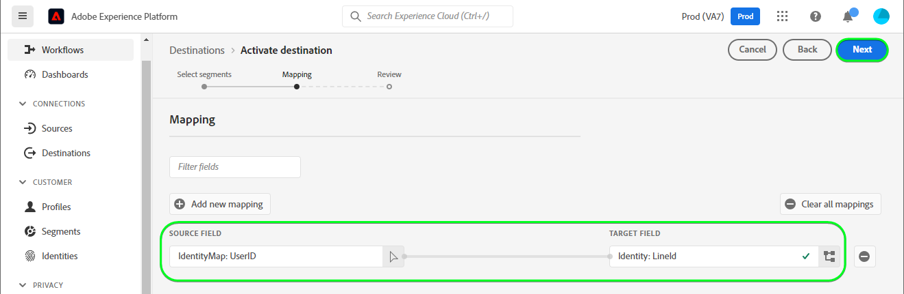
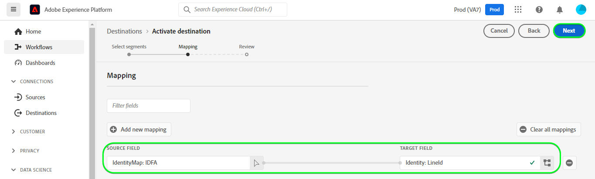

# [!DNL LINE]连接

## 概述 {#overview}

[[!DNL LINE]](https://line.me/en/)是一个连接人员、服务和信息的常用通信平台，已从聊天应用发展为娱乐、社交和日常活动的中心。

此[!DNL Adobe Experience Platform] [目标](/help/destinations/home.md)利用[[!DNL LINE] 消息传送API](https://developers.line.biz/en/reference/messaging-api/)。 您可以在[!DNL LINE]内激活来自Experience Platform受众的配置文件作为连接，以满足您的业务需求。

[!DNL LINE]使用持有者令牌作为与[!DNL LINE]消息传送API通信的身份验证机制。 下面在[向目标身份验证](#authenticate)部分中进一步提供了向您的[!DNL LINE]实例进行身份验证的说明。

## 用例 {#use-cases}

作为营销人员，您可以在[!DNL Adobe Experience Platform]中内置受众的移动参与目标中定位用户。 此外，一旦在[!DNL Adobe Experience Platform]中更新了受众和配置文件，即可根据其[!DNL Adobe Experience Platform]配置文件中的属性向他们提供个性化体验。

## 先决条件 {#prerequisites}

### [!DNL LINE]先决条件 {#prerequisites-destination}

请注意[!DNL LINE]中的以下先决条件，以便将数据从Experience Platform导出到您的[!DNL LINE]帐户：

#### 您需要拥有[!DNL LINE]帐户 {#prerequisites-account}

如果您还没有帐户，则需要注册并创建一个[!DNL LINE]帐户。 要创建帐户，请执行以下操作：

1. 导航到[!DNL LINE] [帐户登录](https://account.line.biz/login?redirectUri=https%3A%2F%2Fmanager.line.biz%2F)页面
2. 选择&#x200B;**[!UICONTROL 创建帐户]**。

#### 从[!DNL LINE]开发人员控制台收集[!DNL LINE channel access token (long-lived)] {#gather-credentials}

要允许Experience Platform访问[!DNL LINE]资源，您需要从所需的[!DNL LINE] *消息传送API*&#x200B;渠道获取&#x200B;*[!DNL Channel access token (long-lived)]*。

1. 使用您的[!DNL LINE]帐户登录到[[!DNL LINE] 开发人员控制台](https://developers.line.biz/console)。
1. 接下来，访问&#x200B;*[!DNL Providers]*&#x200B;列表，然后选择感兴趣的&#x200B;*[!DNL Provider]*，最后选择&#x200B;*消息传送API*&#x200B;渠道以访问其设置。 如果您是首次访问开发人员控制台，请按照[[!DNL LINE] 文档](https://developers.line.biz/en/docs/messaging-api/getting-started/)完成创建提供程序所需的步骤。
1. 最后，导航到&#x200B;***[!DNL Channel access token]***&#x200B;部分并复制[向目标进行身份验证](#authenticate)步骤中所需的&#x200B;***[!DNL Channel access token (long-lived)]***&#x200B;值。

| 凭据 | 描述 | 示例 |
| --- | --- | --- |
| `[!DNL Channel access token (long-lived)]` | 您的[!DNL LINE Channel access token (long-lived)]。 | `aaa2112XSMWqLXR7..........nyilFU=` |

有关通过[!DNL LINE]开发人员控制台创建渠道或将渠道添加到现有[!DNL LINE]帐户的指导，请参阅[[!DNL LINE] 文档](https://developers.line.biz/en/docs/messaging-api/getting-started/)。

## 支持的身份 {#supported-identities}

[!DNL LINE]支持更新和导出下表中描述的标识。 了解有关[标识](/help/identity-service/features/namespaces.md)的更多信息。

| 目标身份 | 描述 |
|---|---|
| 广告商ID(IFA) | 当源标识为IFA *(广告商的Apple ID)*&#x200B;或GAID *(Google Advertising ID)命名空间时，选择广告商(IFA)目标标识的ID。 |
| 行用户ID | 当源标识为LINE用户ID时，选择UserID目标标识。 |

## 导出类型和频率 {#export-type-frequency}

有关目标导出类型和频率的信息，请参阅下表。

| 项目 | 类型 | 注释 |
---------|----------|---------|
| 导出类型 | **[!UICONTROL 基于配置文件]** | 您正在导出具有[!DNL LINE]目标中使用的标识符（姓名、电话号码或其他）的受众的所有成员。 |
| 导出频率 | **[!UICONTROL 正在流式传输]** | 流目标为基于API的“始终运行”连接。 根据受众评估在Experience Platform中更新用户档案后，连接器会立即将更新发送到下游目标平台。 阅读有关[流式目标](/help/destinations/destination-types.md#streaming-destinations)的更多信息。 |

{style="table-layout:auto"}

## 连接到目标 {#connect}

>[!IMPORTANT]
>
>若要连接到目标，您需要&#x200B;**[!UICONTROL 查看目标]**&#x200B;和&#x200B;**[!UICONTROL 管理目标]** [访问控制权限](/help/access-control/home.md#permissions)。 阅读[访问控制概述](/help/access-control/ui/overview.md)或联系您的产品管理员以获取所需的权限。

要连接到此目标，请按照[目标配置教程](../../ui/connect-destination.md)中描述的步骤操作。 在配置目标工作流中，填写下面两个部分中列出的字段。

在&#x200B;**[!UICONTROL 目标]** > **[!UICONTROL 目录]**&#x200B;中，搜索[!DNL LINE]。 或者，您可以在&#x200B;**[!UICONTROL 移动参与]**&#x200B;类别下找到它。

### 验证目标 {#authenticate}

要验证到目标，请选择&#x200B;**[!UICONTROL 连接到目标]**。

填写下面的必填字段。
* **[!UICONTROL 持有者令牌]**：从[!DNL LINE]开发人员控制台中[!DNL LINE Channel access token (long-lived)]。 请参阅[收集凭据](#gather-credentials)部分。

如果提供的详细信息有效，则UI会显示&#x200B;**[!UICONTROL 已连接]**&#x200B;状态，并带有绿色复选标记。 然后，您可以继续执行下一步。

### 填写目标详细信息 {#destination-details}

要配置目标的详细信息，请填写下面的必需和可选字段。 UI中字段旁边的星号表示该字段为必填字段。

* **[!UICONTROL 名称]**：将来用于识别此目标的名称。
* **[!UICONTROL 描述]**：可帮助您将来识别此目标的描述。
* **[!UICONTROL 受众类型]**：如果您要导出的标识属于广告商(IFA)*的* ID类型，请选择广告商(IFA)]**的**[!UICONTROL  ID。 如果要导出的标识的类型为&#x200B;*LINE用户ID*，请选择&#x200B;**[!UICONTROL LINE用户ID]**。 有关身份类型的详细信息，请参阅[支持的身份](#supported-identities)部分。

### 启用警报 {#enable-alerts}

您可以启用警报，以接收有关发送到目标的数据流状态的通知。 从列表中选择警报以订阅接收有关数据流状态的通知。 有关警报的详细信息，请参阅[使用UI订阅目标警报的指南](../../ui/alerts.md)。

完成提供目标连接的详细信息后，选择&#x200B;**[!UICONTROL 下一步]**。

## 激活此目标的受众 {#activate}

>[!IMPORTANT]
> 
>* 若要激活数据，您需要&#x200B;**[!UICONTROL 查看目标]**、**[!UICONTROL 激活目标]**、**[!UICONTROL 查看配置文件]**&#x200B;和&#x200B;**[!UICONTROL 查看区段]** [访问控制权限](/help/access-control/home.md#permissions)。 阅读[访问控制概述](/help/access-control/ui/overview.md)或联系您的产品管理员以获取所需的权限。
>* 要导出&#x200B;*标识*，您需要&#x200B;**[!UICONTROL 查看标识图形]** [访问控制权限](/help/access-control/home.md#permissions)。  {width="100" zoomable="yes"}

有关将受众激活到此目标的说明，请阅读[将配置文件和受众激活到流式受众导出目标](/help/destinations/ui/activate-segment-streaming-destinations.md)。

### 映射属性和身份 {#map}

要将受众数据从Adobe Experience Platform正确发送到[!DNL LINE]目标，您需要完成字段映射步骤。 映射包括在Experience Platform帐户中的Experience Data Model (XDM)架构字段与其与目标中的相应等效字段之间创建链接。 要将XDM字段正确映射到[!DNL LINE]目标字段，请执行以下步骤：

根据您的源身份，必须映射以下目标身份命名空间：

| 目标身份 | 源字段 | 目标字段 |
| --- | --- | --- |
| 广告商ID(IFA) | `IDFA`或`GAID` | `LineId` |
| 行用户ID | `UserID` | `LineId` |

如果您的目标身份是&#x200B;*LINE用户ID的*，则需要以下项：

如果您的目标标识是广告商(IFA)*的*ID，则需要以下项：

## 验证数据导出 {#exported-data}

成功从Experience Platform导出数据后，[!DNL LINE]目标将使用所选受众名称在[!DNL LINE]内创建新受众。

要验证您是否正确设置了目标，请执行以下步骤：

1. 在[!DNL LINE]中，登录到[管理器控制台](https://manager.line.biz/)。

1. 接下来，导航到&#x200B;**[!UICONTROL 数据控制]** > **[!UICONTROL 受众]**，并检查&#x200B;**[!UICONTROL 受众名称]**&#x200B;列中选定受众是否匹配。

1. 更新的卷将匹配区段中的计数。

1. 如果您导出的标识的类型为&#x200B;*UserID*，则&#x200B;*Type*&#x200B;列将提及&#x200B;**[!UICONTROL UserID]**。 同样，如果您导出的标识的类型为&#x200B;*IDFA*，则&#x200B;*Type*&#x200B;列将提及&#x200B;**[!UICONTROL 移动设备广告ID]**。

[!DNL LINE]中的示例设置如下所示：

## 数据使用和治理 {#data-usage-governance}

在处理您的数据时，所有[!DNL Adobe Experience Platform]目标都符合数据使用策略。 有关[!DNL Adobe Experience Platform]如何实施数据治理的详细信息，请参阅[数据治理概述](/help/data-governance/home.md)。
