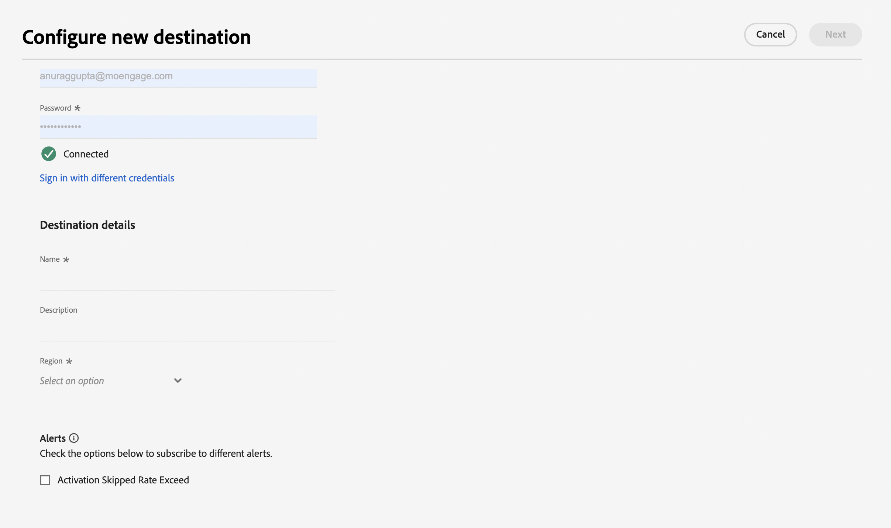
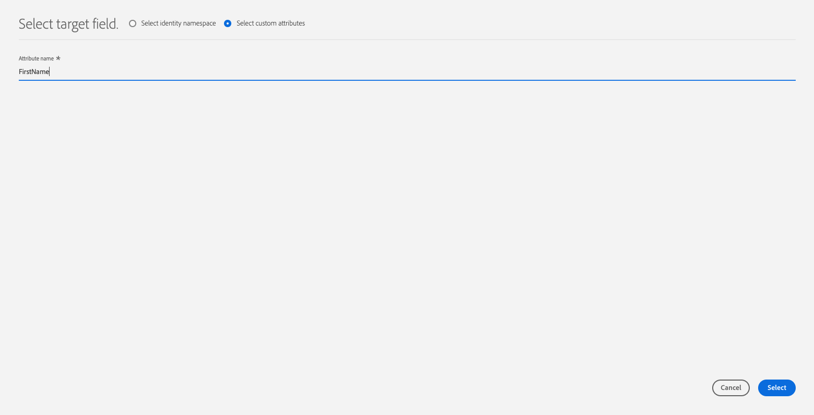

# [!DNL Moengage]连接

## 概述 {#overview}

使用[!DNL Moengage]目标将您的Adobe数据（用户属性、区段和事件）实时连接并映射到MoEngage。 然后，客户可以根据这些数据采取行动，提供个性化、有针对性的体验。

与Adobe的集成非常简单直观。 只需获取任何Adobe用户配置文件，并将其映射到MoEngage用户属性。

>[!IMPORTANT]
>
>此目标连接器和文档页面由&#x200B;*Moengage*&#x200B;团队创建和维护。 如有任何查询或更新请求，请直接通过&#x200B;*`https://help.moengage.com/hc/en-us`.*&#x200B;联系他们

## 用例 {#use-cases}

营销人员希望通过[!DNL Moengage]营销活动来定位用户区段(内置于Adobe Experience Platform)。 此外，他们希望根据Adobe Experience Platform用户档案中的属性个性化营销活动内容。 利用此集成，一旦在Adobe Experience Platform中更新区段和用户档案，用户和属性就会在MoEngage中更新。

## 先决条件 {#prerequisites}

在将Adobe Experience Platform数据发送到[!DNL Moengage]之前，请注意以下先决条件：

* 要将MoEngage目标与Adobe Experience Platform结合使用，用户必须首先有权访问其[!DNL Moengage]帐户。 请访问以下页面以注册或登录您的MoEngage帐户：https://app.moengage.com

## 支持的身份 {#supported-identities}

[!DNL Moengage]支持激活下表中描述的标识。

| 目标身份 | 描述 | 注意事项 |
|---|------------------------------------------------------------------------------------------|----------------------------------------------------------------------------------------|
| user_id | 唯一标识[!DNL Moengage]系统中用户配置文件的标识符。 | 此标识符支持字符串类型。 需要user_id或anonymous_id之一 |
| anonymous_id | 未知用户配置文件的另一个标识符 — 表示系统中不存在配置文件。 | 此标识符支持字符串类型。 需要user_id或anonymous_id之一 |

{style="table-layout:auto"}

## 导出类型和频率 {#export-type-frequency}

有关目标导出类型和频率的信息，请参阅下表。

| 项目 | 类型 | 注释 |
|---------|----------|------------------------------------------------------------------------------------------------------------------------------------------------------------------------------------------------------------------------------------------------------------------------------------------------------------------------------------|
| 导出类型 | **[!UICONTROL Profile-based]** | 您正在导出区段（受众）的所有成员，这些成员具有标识符(user_id、anonymous_id)以及您导出到[!DNL Moengage]时定义的自定义属性。 |
| 导出频率 | **[!UICONTROL Streaming]** | 流目标为基于API的“始终运行”连接。 一旦根据区段评估在Experience Platform中更新了用户档案，连接器就会将更新发送到下游目标平台。 阅读有关[流式目标](/help/destinations/destination-types.md#streaming-destinations)的更多信息。 |

{style="table-layout:auto"}

## 连接到目标 {#connect}

>[!IMPORTANT]
> 
>若要连接到目标，您需要&#x200B;**[!UICONTROL View Destinations]**&#x200B;和&#x200B;**[!UICONTROL Manage Destinations]** [访问控制权限](/help/access-control/home.md#permissions)。 阅读[访问控制概述](/help/access-control/ui/overview.md)或联系您的产品管理员以获取所需的权限。

要连接到此目标，请按照[目标配置教程](../../ui/connect-destination.md)中描述的步骤操作。 在配置目标工作流中，填写下面两个部分中列出的字段。

### 验证目标 {#authenticate}

要验证目标，请填写必填字段并选择&#x200B;**[!UICONTROL Connect to destination]**。

### 填写目标详细信息 {#destination-details}

要配置目标的详细信息，请填写下面的必需和可选字段。 UI中字段旁边的星号表示该字段为必填字段。

* **[!UICONTROL USERNAME]**： [!DNL Moengage]仪表板的设置页面的数据应用程序ID。
* **[!UICONTROL PASSWORD]**： [!DNL Moengage]仪表板的设置页面中的数据应用程序密钥。

* **[!UICONTROL Name]**：将来用于识别此目标的名称。
* **[!UICONTROL Description]**：可帮助您将来识别此目标的描述。
* **[!UICONTROL Region]**：您的应用程序&#x200B;*数据中心*。

### 启用警报 {#enable-alerts}

您可以启用警报，以接收有关发送到目标的数据流状态的通知。 从列表中选择警报以订阅接收有关数据流状态的通知。 有关警报的详细信息，请参阅[使用UI订阅目标警报的指南](../../ui/alerts.md)。

完成提供目标连接的详细信息后，选择&#x200B;**[!UICONTROL Next]**。

## 将区段激活到此目标 {#activate}

>[!IMPORTANT]
> 
>若要激活数据，您需要&#x200B;**[!UICONTROL View Destinations]**、**[!UICONTROL Activate Destinations]**、**[!UICONTROL View Profiles]**&#x200B;和&#x200B;**[!UICONTROL View Segments]** [访问控制权限](/help/access-control/home.md#permissions)。 阅读[访问控制概述](/help/access-control/ui/overview.md)或联系您的产品管理员以获取所需的权限。

有关将受众区段激活到此目标的说明，请参阅[将受众数据激活到流式区段导出目标](../../ui/activate-segment-streaming-destinations.md)。

### 映射属性和身份 {#map}

要将受众数据从[!DNL Adobe Experience Platform]正确发送到[!DNL Moengage]目标，您需要执行字段映射步骤。

映射包括在[!DNL Experience Data Model]帐户中的[!DNL Experience Platform] (XDM)架构字段及其来自目标目标的对应项之间创建链接。

要将XDM字段正确映射到[!DNL Moengage]目标字段，请执行以下步骤：

在[!UICONTROL Mapping]步骤中，选择&#x200B;**[!UICONTROL Checkbox]**。

在[!UICONTROL Mapping]步骤中，选择&#x200B;**[!UICONTROL Add new mapping]**。

在[!UICONTROL Source Field]部分中，选择空字段旁边的箭头按钮。

在[!UICONTROL Select source field]窗口中，您可以选择以下两种类别的XDM字段：

* [!UICONTROL Select attributes]：使用此选项将特定字段从XDM架构映射到[!DNL Moengage]属性。

选择源字段，然后选择&#x200B;**[!UICONTROL Select]**。

在[!UICONTROL Target Field]部分中，选择字段右侧的映射图标。

在[!UICONTROL Select target field]窗口中，您可以选择以下两种目标字段类别：

* [!UICONTROL Select identity namespace]：使用此选项将[!DNL Experience Platform]身份命名空间映射到[!DNL Moengage]身份命名空间。
* [!UICONTROL Select custom attributes]：使用此选项将XDM属性映射到您在[!DNL Moengage]帐户中定义的自定义[!DNL Moengage]属性。  您还可以使用此选项将现有XDM属性重命名为[!DNL Moengage]。 例如，将`lastName` XDM属性映射到`Last_Name`中的自定义[!DNL Moengage]属性，将在`Last_Name`中创建[!DNL Moengage]属性（如果该属性不存在），并将`lastName` XDM属性映射到它。

选择您的目标字段，然后选择&#x200B;**[!UICONTROL Select]**。

您现在应在列表中看到字段映射。

要添加更多映射，请重复上述步骤。

## 导出的数据/验证数据导出 {#exported-data}

要验证数据是否已成功导出到[!DNL Moengage]目标，请转到您[!DNL Moengage]帐户中的用户配置文件。 在这里，您应该找到名为`AEPSegments`的用户属性（自动创建）以及已在Adobe Experience Platform的前面步骤中映射的其他自定义属性。

`AEPSegments`是[!DNL Moengage]中的数组类型特性。 其中列出了用户在Experience Platform中关联的所有Adobe受众名称。

## 数据使用和治理 {#data-usage-governance}

在处理您的数据时，所有[!DNL Adobe Experience Platform]目标都符合数据使用策略。 有关[!DNL Adobe Experience Platform]如何实施数据治理的详细信息，请阅读[数据治理概述](/help/data-governance/home.md)。
