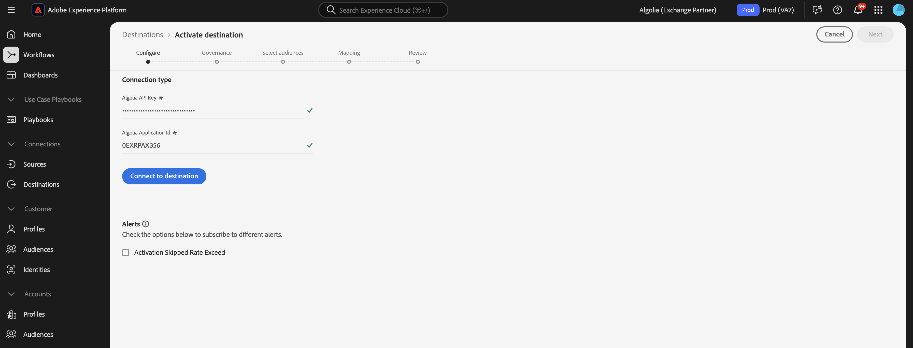
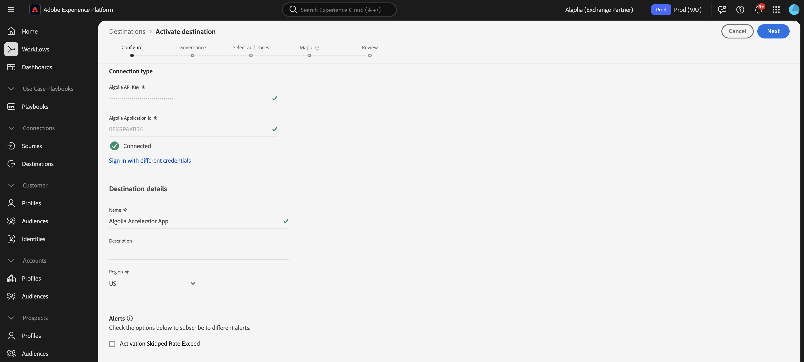

# [!DNL Algolia]连接

## 概述 {#overview}

>[!IMPORTANT]
>
>[!DNL Algolia]目标连接器和文档页面由Algolia Integration Services团队创建和维护。 有关查询或更新请求，请通过[adobe-algolia-solutions@algolia.com](adobe-algolia-solutions@algolia.com)联系他们。

使用[!DNL Algolia]目标连接将Adobe Experience Platform受众发送到阿尔及利亚，以进行个性化搜索和推荐。 必须先设置[[!DNL Algolia User Profiles]](/help/sources/connectors/data-partners/algolia-user-profiles.md)源连接器，然后才能使用[!DNL Algolia]目标连接器。 在源连接器设置教程中，您将创建Algolia用户令牌身份。 配置目标连接器时，映射需要此标识。

本教程提供了使用Adobe Experience Platform用户界面创建[!DNL Algolia]目标连接和数据流的步骤。

## 用例 {#use-cases}

为了帮助您更好地了解您应如何以及何时使用[!DNL Algolia]目标，以下是Adobe Experience Platform客户可以使用此目标解决的示例用例。

### Personalization一致性 {#personalization-consistency}

使用此目标连接器可在您的站点上通过主页提供一致的个性化以进行搜索。

例如，作为营销人员，您可能希望在Adobe Experience Platform中通过多个用户数据源（包括Algolia）构建丰富的受众。 您可以使用[!DNL Algolia]目标连接器共享定位策略的受众，从而提高营销活动的个性化和转化。

要实施此用例，必须同时使用[[!DNL Algolia User Profiles]](/help/sources/connectors/data-partners/algolia-user-profiles.md)源连接器和[!DNL Algolia]目标连接器。

首先，将现有[!DNL Algolia]用户配置文件导入Adobe Experience Platform Real-Time CDP和其他源，以开始使用源连接器创建丰富受众。 营销人员会使用可发送到阿尔及利亚的配置文件数据创建受众，以进行搜索和推荐个性化。

然后，使用相应的[[!DNL Algolia User Profiles]](/help/sources/connectors/data-partners/algolia-user-profiles.md)源连接器将客户配置文件摄取并充回Real-Time CDP。

## 先决条件 {#prerequisites}

>[!IMPORTANT]
>
>* 若要连接到目标，您需要&#x200B;**[!UICONTROL 查看目标]**&#x200B;和&#x200B;**[!UICONTROL 管理目标]**、**[!UICONTROL 激活目标]**、**[!UICONTROL 查看配置文件]**&#x200B;和&#x200B;**[!UICONTROL 查看区段]** [访问控制权限](/help/access-control/home.md#permissions)。 阅读[访问控制概述](/help/access-control/ui/overview.md)或联系您的产品管理员以获取所需的权限。
>* 要导出&#x200B;*标识*，您需要&#x200B;**[!UICONTROL 查看标识图形]** [访问控制权限](/help/access-control/home.md#permissions)。  {width="100" zoomable="yes"}

## 支持的身份 {#supported-identities}

[!DNL Algolia]支持激活下表中描述的标识。 了解有关[标识](https://experienceleague.adobe.com/zh-hans/docs/experience-platform/identity/features/namespaces)的更多信息。

| 目标身份 | 描述 | 注意事项 |
|---------|---------|----------|
| userId | [!DNL Algolia]用户令牌 | 选择此目标标识以将`AlgoliaUserToken`源标识映射到[!DNL Algolia]平台中的`userToken`。 |

{style="table-layout:auto"}

## 支持的受众 {#supported-audiences}

此部分介绍可将哪种类型的受众导出到此目标。

| 受众来源 | 支持 | 描述 |
|---------|---------|----------|
| [!DNL Segmentation Service] | ✓ | 通过Experience Platform [分段服务](../../../segmentation/home.md)生成的受众。 |
| 自定义上传 | ✓ | 受众[已从CSV文件将](../../../segmentation/ui/audience-portal.md#import-audience)导入Experience Platform。 |

{style="table-layout:auto"}

## 导出类型和频率 {#export-type-frequency}

有关目标导出类型和频率的信息，请参阅下表。

| 项目 | 类型 | 注释 |
|---------|----------|---------|
| 导出类型 | **[!DNL Audience export]** | 您正在导出具有[!DNL Algolia]目标中使用的标识符（姓名、电话号码或其他）的受众的所有成员。 |
| 导出频率 | **[!UICONTROL 正在流式传输]** | 流目标为基于API的“始终运行”连接。 根据受众评估在Experience Platform中更新用户档案后，连接器会立即将更新发送到下游目标平台。 阅读有关[流式目标](/help/destinations/destination-types.md#streaming-destinations)的更多信息。 |

{style="table-layout:auto"}

## 连接到目标 {#connect}

>[!IMPORTANT]
>
>若要连接到目标，您需要&#x200B;**[!UICONTROL 查看目标]**&#x200B;和&#x200B;**[!UICONTROL 管理和激活数据集目标]** [访问控制权限](/help/access-control/home.md#permissions)。 阅读[访问控制概述](/help/access-control/ui/overview.md)或联系您的产品管理员以获取所需的权限。

要连接到此目标，请按照[目标配置教程](../../ui/connect-destination.md)中描述的步骤操作。 在目标配置工作流中，填写下面两个部分中列出的字段。

### 验证目标 {#authenticate}

要验证到目标，请填写必填字段并选择&#x200B;**[!UICONTROL 连接到目标]**。

* **[!UICONTROL 应用程序ID]**： [!DNL Algolia]应用程序ID是分配给您[!DNL Algolia]帐户的唯一标识符。
* **[!UICONTROL API密钥]**： [!DNL Algolia] API密钥是用于向[!DNL Algolia]的搜索和索引服务验证和授权API请求的凭据。

有关这些凭据的详细信息，请参阅[!DNL Algolia] [身份验证文档](https://www.algolia.com/doc/tools/cli/get-started/authentication/)。

### 填写目标详细信息

要配置目标的详细信息，请填写下面的必需和可选字段。 UI中字段旁边的星号表示该字段为必填字段。

* **[!UICONTROL 名称]**：填写此目标的首选名称。
* **[!UICONTROL 描述]**：目标的简短用途说明。
* **[!UICONTROL 地区]**：选项为&#x200B;**US**&#x200B;或&#x200B;**EU**。 选择存储客户数据的区域。

### 启用警报 {#enable-alerts}

您可以启用警报，以接收有关发送到目标的数据流状态的通知。 从列表中选择警报以订阅接收有关数据流状态的通知。 有关警报的详细信息，请参阅[使用UI订阅目标警报的指南](../../ui/alerts.md)。

完成提供目标连接的详细信息后，选择&#x200B;**[!UICONTROL 下一步]**。

## 激活此目标的受众 {#activate}

>[!IMPORTANT]
> 
>* 若要激活数据，您需要&#x200B;**[!UICONTROL 查看目标]**、**[!UICONTROL 激活目标]**、**[!UICONTROL 查看配置文件]**&#x200B;和&#x200B;**[!UICONTROL 查看区段]** [访问控制权限](/help/access-control/home.md#permissions)。 阅读[访问控制概述](/help/access-control/ui/overview.md)或联系您的产品管理员以获取所需的权限。
>* 要导出身份，您需要查看身份图形[访问控制权限](https://experienceleague.adobe.com/en/docs/experience-platform/access-control/home#permissions)。

有关将受众激活到此目标的说明，请阅读[将配置文件和受众激活到流式受众导出目标](https://experienceleague.adobe.com/en/docs/experience-platform/destinations/ui/activate/activate-segment-streaming-destinations)。

### 映射属性和身份 {#mapping-attributes-identities}

在[!UICONTROL 映射步骤]期间，必须将AlgoliaUserToken源标识映射到userId目标标识。

## 验证数据导出 {#exported-data}

要验证受众是否已成功导出到用户配置文件，请检查您的[!DNL Algolia]仪表板并导航到&#x200B;**[!UICONTROL 高级Personalization]**，然后单击&#x200B;**[!UICONTROL 用户检查器]**。 查找与导出的Adobe Experience Platform受众关联的用户配置文件，并在用户检查器中搜索它。 您将在区段部分看到受众ID。

## 数据使用和治理 {#data-usage-governance}

在处理您的数据时，所有[!DNL Adobe Experience Platform]目标都符合数据使用策略。 有关[!DNL Adobe Experience Platform]如何实施数据治理的详细信息，请阅读[数据治理概述](https://experienceleague.adobe.com/docs/experience-platform/data-governance/home.html?lang=zh-Hans)。

## 其他资源 {#additional-resources}

有关详细信息，请参阅以下[!DNL Algolia]文档：

* [什么是高级Personalization？](https://www.algolia.com/doc/guides/personalization/advanced-personalization/what-is-advanced-personalization/)
* [用户配置文件](https://www.algolia.com/doc/guides/personalization/advanced-personalization/what-is-advanced-personalization/concepts/user-profiles/)
* [对具有规则上下文的用户进行分段](https://www.algolia.com/doc/guides/personalization/advanced-personalization/implement/guides/segment-users-with-rule-contexts/#assign-a-segment-context-at-query-time)

## 后续步骤 {#next-steps}

通过学习本教程，您已成功创建了一个数据流以将受众从Experience Platform导出到[!DNL Algolia]应用程序。 有关[!DNL Algolia]平台的更多信息，请参阅[Algolia文档](https://www.algolia.com/doc/)。