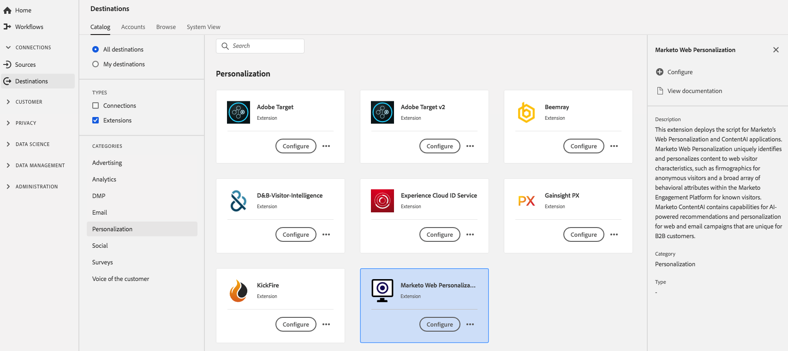

# [!DNL Marketo Web Personalization] 扩展 {#marketo-web-personalization-extension}

## 概述 {#overview}

此扩展部署脚本 [!DNL Marketo’s] Web个性化和内容人工智能应用程序。 [!DNL Marketo] Web个性化可唯一地根据Web访客特征标识和个性化内容，例如，匿名访客的图片以及 [!DNL Marketo] 已知访客参与平台。 [!DNL Marketo] ContentAI包含用于Web和电子邮件营销活动的AI支持的推荐和个性化功能，这些功能对于B2B客户来说是独一无二的。

[!DNL Marketo Web Personalization] 是Adobe Experience Platform中的个性化扩展。 有关Marketo中Web个性化和ContentAI的更多信息，请阅读 [Web个性化概述](https://experienceleague.adobe.com/docs/marketo/using/product-docs/web-personalization/understanding-web-personalization/web-personalization-overview.html?lang=en).

此目标是标记扩展。 有关标记扩展如何在Platform中工作的更多信息，请参阅 [标记扩展概述](../launch-extensions/overview.md).

## 先决条件 {#prerequisites}

此扩展位于 [!DNL Destinations] 适用于已购买Platform的所有客户的目录。

要使用此扩展，您需要访问Adobe Experience Platform中的标记。 标记以内置增值功能的方式提供给Adobe Experience Cloud客户。 请联系您的组织管理员以获取对标记的访问权限，并要求他们授予您 **[!UICONTROL manage_properties]** 权限，以便您可以安装扩展。

## 安装扩展 {#install-extension}

安装 [!DNL Marketo Web Personalization] 扩展名：

在 [平台界面](https://platform.adobe.com/)，转到 **[!UICONTROL 目标]** > **[!UICONTROL 目录]**.

从目录中选择扩展或使用搜索栏。

单击目标以将其突出显示，然后选择 **[!UICONTROL 配置]** 在右边栏中。 如果 **[!UICONTROL 配置]** 控件呈灰显状态，您缺少的是 **[!UICONTROL manage_properties]** 许可。 参见 [先决条件](#prerequisites).

选择要安装扩展的资产。 您还可以选择创建新资产。 资产是规则、数据元素、配置的扩展、环境和库的集合。了解中的属性 [“属性”页部分](../../../tags/ui/administration/companies-and-properties.md#properties-page) ，位于标记文档中的。

该工作流将引导您完成安装步骤。

您还可以直接在中安装扩展 [数据收集UI](https://experience.adobe.com/#/data-collection/). 有关更多信息，请参阅以下部分： [添加新扩展](../../../tags/ui/managing-resources/extensions/overview.md#add-a-new-extension) 标记文档中的。

## 如何使用扩展 {#how-to-use}

安装扩展后，即可开始设置规则。

您可以为已安装的扩展设置规则，以便仅在特定情况下将事件数据发送到扩展目标。 有关为扩展设置规则的更多信息，请参阅 [标记文档](../../../tags/ui/managing-resources/rules.md).

## 配置、升级和删除扩展 {#configure-upgrade-delete}

您可以在数据收集UI中配置、升级和删除扩展。

>[!TIP]
>
>如果某个资产上已安装该扩展，则仍会显示平台UI **[!UICONTROL 安装]** 作为扩展。 启动安装工作流，如中所述 [安装扩展](#install-extension) 以配置或删除扩展。

要升级扩展，请参阅 [扩展升级过程](../../../tags/ui/managing-resources/extensions/extension-upgrade.md) 标记文档中的。
