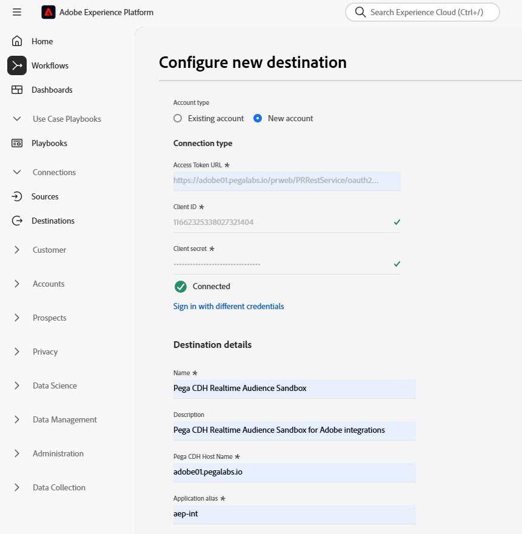

# (V2) Pega CDH实时受众连接

## 概述 {#overview}

使用Adobe Experience Platform中的(V2) [!DNL Pega CDH Realtime Audience]目标将配置文件属性和受众成员资格数据发送到[!DNL Pega Customer Decision Hub]，以便做出下一个最佳操作决策。

Adobe Experience Platform中的配置文件受众成员资格在加载到[!DNL Pega Customer Decision Hub]中时，可用作自适应模型中的预测器，并帮助提供正确的上下文和行为数据，以实现次优行动决策。

>[!IMPORTANT]
>
>此目标连接器和文档页面由Pegasystems创建和维护。 如有任何查询或更新请求，请直接在[此处](mailto:support@pega.com)联系Pega。

## 用例 {#use-cases}

为了帮助您更好地了解您应如何以及何时使用[!DNL Customer Decision Hub]目标，以下是Adobe Experience Platform客户可以使用此目标解决的示例用例。

### 电信 {#telecommunications}

营销人员希望利用[!DNL Pega Customer Decision Hub]提供的基于数据科学模型的下一个最佳操作的见解来吸引客户参与。 [!DNL Pega Customer Decision Hub]在很大程度上依赖于客户意图，如“Interest_In_5G”、“Interest_in_Unlimited_Dataplan”或“Interest_in_iPhone_accessories”，以确定出站频道中的下一个最佳操作(NBA)决策。

### 金融服务 {#financial-services}

营销人员希望优化为订阅或取消订阅退休金计划或退休计划快讯的客户提供的优惠。 金融服务公司可以从自己的CRM中将多个客户ID摄取到Adobe Experience Platform，从自己的离线数据构建受众，并将进入和退出受众的个人资料发送到[!DNL Pega Customer Decision Hub]，以在出站渠道中做出次优行动(NBA)决策。

## 先决条件 {#prerequisites}

使用此目标将数据导出到Adobe Experience Platform之前，请确保在[!DNL Pega Customer Decision Hub]中完成以下先决条件：

* 在您的[!DNL Pega Customer Decision Hub]实例中配置[Adobe Experience Platform配置文件和受众成员资格集成组件](https://docs.pega.com/bundle/components/page/customer-decision-hub/components/adobe-membership-component.html)。
* 在[!DNL Pega Customer Decision Hub]实例中使用客户端凭据[&#128279;](https://docs.pega.com/bundle/platform/page/platform/security/configure-oauth-2-client-registration.html)授权类型配置OAuth 2.0 客户端注册。
* 在[!DNL Pega Customer Decision Hub]实例中为Adobe受众成员资格数据流配置[实时运行数据流](https://docs.pega.com/bundle/platform/page/platform/decision-management/data-flow-run-real-time-create.html)。

## 支持的身份 {#supported-identities}

[!DNL Pega Customer Decision Hub]支持激活下表中描述的自定义用户ID。 有关详细信息，请参阅[标识](/help/identity-service/features/namespaces.md)。

| 目标身份 | 描述 | 注意事项 |
|---|---|---|
| `CustomerID` | 客户ID | 通用用户标识符，用于唯一标识[!DNL Pega Customer Decision Hub]和Adobe Experience Platform中的配置文件。 |

{style="table-layout:auto"}

## 导出类型和频率 {#export-type-frequency}

有关目标导出类型和频率的信息，请参阅下表。

| 项目 | 类型 | 注释 |
---------|----------|---------|
| 导出类型 | **[!UICONTROL 基于配置文件]** | 导出具有标识符(*CustomerID*)、属性（姓氏、名字、位置等）和受众成员资格数据的受众的所有成员。 |
| 导出频率 | **[!UICONTROL 正在流式传输]** | 流式目标始终基于API连接。 根据受众评估，在Experience Platform中更新用户档案后，连接器会立即将更新发送到下游目标平台。 有关详细信息，请参阅[流式目标](/help/destinations/destination-types.md#streaming-destinations)。 |

{style="table-layout:auto"}

## 连接到目标 {#connect}

要连接到此目标，请按照[目标配置教程](../../ui/connect-destination.md)中描述的步骤操作。 在配置目标工作流中，填写下面两个部分中列出的字段。

### 验证目标 {#authenticate}

#### OAuth 2客户端凭据身份验证 {#oauth-2-client-credentials-authentication}

填写下面的字段并选择&#x200B;**[!UICONTROL 连接到目标]**：

* **[!UICONTROL 访问令牌URL]**： [!DNL Pega Customer Decision Hub]实例上的OAuth 2访问令牌URL。
* **[!UICONTROL 客户端ID]**：您在[!DNL Pega Customer Decision Hub]实例中生成的OAuth 2 [!DNL client ID]。
* **[!UICONTROL 客户端密钥]**：您在[!DNL Pega Customer Decision Hub]实例中生成的OAuth 2 [!DNL client secret]。

### 填写目标详细信息 {#destination-details}

在建立与[!DNL Pega Customer Decision Hub]的身份验证连接后，提供目标的以下信息：

要配置目标的详细信息，请填写必填字段并选择&#x200B;**[!UICONTROL 下一步]**。

* **[!UICONTROL 名称]**：将来用于识别此目标的名称。
* **[!UICONTROL 描述]**：可帮助您将来识别此目标的描述。
* **[!UICONTROL Pega CDH主机名]**：配置文件将导出为JSON数据的Pega客户决策中心主机名。
* **[!UICONTROL 应用程序别名]**：您为客户决策中心帐户配置的应用程序别名。 有关详细信息，请参阅[在您的[!DNL Pega Customer Decision Hub]实例中添加应用程序URL别名](https://docs.pega.com/bundle/platform/page/platform/user-experience/adding-application-url-alias.html)。

## 激活此目标的受众 {#activate}

>[!IMPORTANT]
> 
>* 若要激活数据，您需要&#x200B;**[!UICONTROL 查看目标]**、**[!UICONTROL 激活目标]**、**[!UICONTROL 查看配置文件]**&#x200B;和&#x200B;**[!UICONTROL 查看区段]** [访问控制权限](/help/access-control/home.md#permissions)。 阅读[访问控制概述](/help/access-control/ui/overview.md)或联系您的产品管理员以获取所需的权限。
>* 要导出&#x200B;*标识*，您需要&#x200B;**[!UICONTROL 查看标识图形]** [访问控制权限](/help/access-control/home.md#permissions)。  {width="100" zoomable="yes"}

有关将受众激活到此目标的说明，请参阅[将受众数据激活到流式配置文件导出目标](../../ui/activate-streaming-profile-destinations.md)。

### 映射 {#mapping}

在[!UICONTROL 映射]步骤中，从合并架构和任何其他要导出到目标的XDM字段中选择一个唯一标识符。

### 映射示例：在[!DNL Pega Customer Decision Hub]中激活配置文件更新 {#mapping-example}

下面是将配置文件导出到[!DNL Pega Customer Decision Hub]时正确标识映射的示例。

* 选择在Adobe Experience Platform和[!DNL Pega Customer Decision Hub]中唯一标识配置文件的源标识。 例如： `CustomerID`。
* 选择要将所选源配置文件属性映射到的目标配置文件属性。

## 导出的数据/验证数据导出 {#exported-data}

成功更新用户档案的受众成员资格会在Pega营销受众成员资格数据存储中插入受众标识符、名称和状态。 会员资格数据在[!DNL Pega Customer Decision Hub]中使用Customer Profile Designer与客户相关联，如下所示。

受众会员资格数据用于Pega下一最佳操作Designer参与策略中，以实现下一最佳操作决策，如下所示。

客户受众会员资格数据字段在自适应模型中作为预测项添加，如下所示。

## 其他资源 {#additional-resources}

有关详细信息，请参阅以下[!DNL Pega]文档：

* [设置OAuth 2.0客户端注册](https://docs.pega.com/bundle/platform/page/platform/security/configure-oauth-2-client-registration.html)
* [为数据流创建实时运行](https://docs.pega.com/bundle/platform/page/platform/decision-management/data-flow-run-real-time-create.html)
* [在客户资料Designer中管理客户记录](https://docs.pega.com/bundle/customer-decision-hub/page/customer-decision-hub/implement/profile-designer-data-management.html)

## 数据使用和治理 {#data-usage-governance}

在处理您的数据时，所有[!DNL Adobe Experience Platform]目标都符合数据使用策略。 有关[!DNL Adobe Experience Platform]如何实施数据治理的详细信息，请参阅[数据治理概述](/help/data-governance/home.md)。
