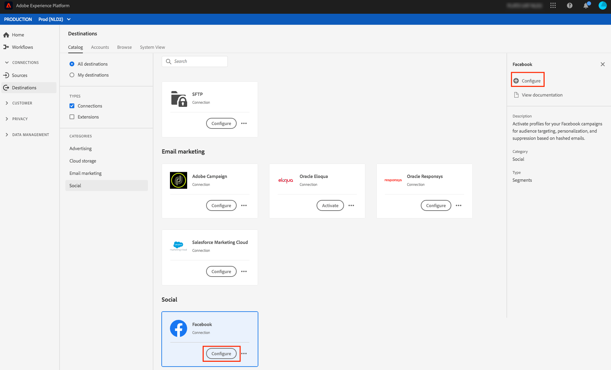
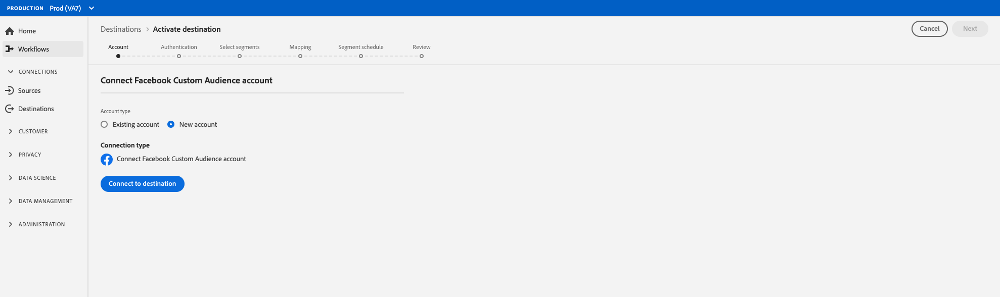

# 社交网络目标身份验证工作流{#social-network-destinations-workflow}

## 创建社交网络目标的工作流

本教程以[!DNL Facebook]为例，但Adobe Experience Platform的工作流对于所有社交网络目标将保持不变，再添加到产品中。

在&#x200B;**[!UICONTROL 目标]** > **[!UICONTROL 目录]**&#x200B;中，滚动到&#x200B;**[!UICONTROL 社交]**&#x200B;类别。 选择首选社交网络目标，然后选择&#x200B;**[!UICONTROL 配置]**。

>[!NOTE]
>
>如果与此目标的连接已存在，您可以在目标卡上看到&#x200B;**[!UICONTROL 激活]**&#x200B;按钮。 有关&#x200B;**[!UICONTROL Activate]**&#x200B;和&#x200B;**[!UICONTROL Configure]**&#x200B;之间差异的详细信息，请参阅目标工作区文档的[Catalog](../../ui/destinations-workspace.md#catalog)部分。

在&#x200B;**身份验证**&#x200B;步骤中，如果您之前已设置到社交网络目标的连接，请选择&#x200B;**[!UICONTROL 现有帐户]**&#x200B;并选择现有连接。 或者，您也可以选择&#x200B;**[!UICONTROL 新帐户]**&#x200B;来设置到社交网络目标的新连接。 选择&#x200B;**[!UICONTROL 连接到目标]**，此操作将带您进入选定的社交网络目标以登录，并将Adobe Experience Cloud连接到您的社交网络广告帐户。

>[!NOTE]
>
>平台支持身份验证过程中的凭据验证，如果您向社交网络帐户ID输入了不正确的凭据，则会显示错误消息。 这可确保您没有使用错误的凭据完成工作流。

确认您的凭据并将Adobe Experience Cloud连接到您的社交网络后，您可以选择&#x200B;**[!UICONTROL Next]**&#x200B;以继续执行&#x200B;**[!UICONTROL 设置]**&#x200B;步骤。

在&#x200B;**[!UICONTROL 设置]**&#x200B;步骤中，为激活流输入[!UICONTROL 名称]和[!UICONTROL 说明]，并填写社交网络和帐户的[!UICONTROL 帐户ID]。

此外，在此步骤中，您还可以选择应用于此目标的任何&#x200B;**[!UICONTROL 营销用例]**。 市场营销用例指明要将数据导出到目标的目的。 您可以从Adobe定义的营销用例中进行选择，也可以创建自己的营销用例。 有关市场营销用例的详细信息，请参阅[数据使用策略概述](../../../data-governance/policies/overview.md)。

在填写上述字段后，选择&#x200B;**[!UICONTROL 创建目标]**。

>[!IMPORTANT]
>
> * 对于[!DNL Facebook]目标。 **[!UICONTROL 帐]** 户ID是您 [!DNL Facebook Ad Account ID]的。您可以在[!DNL Facebook Ads Manager]中找到此ID。 在ID前加上`act_`前缀，如下所示：

您的目标现在已创建。 如果您希望稍后激活区段，可以选择&#x200B;**[!UICONTROL 保存并退出]**，也可以选择&#x200B;**[!UICONTROL 下一步]**&#x200B;继续工作流并选择要激活的区段。 在任一情况下，请参阅下一节[将区段激活到社交网络](#activate-segments)，以了解工作流的其余部分。

## 将区段激活到社交网络{#activate-segments}

有关如何将区段激活到社交网络的说明，请参阅[将数据激活到目标](../../ui/activate-destinations.md)。