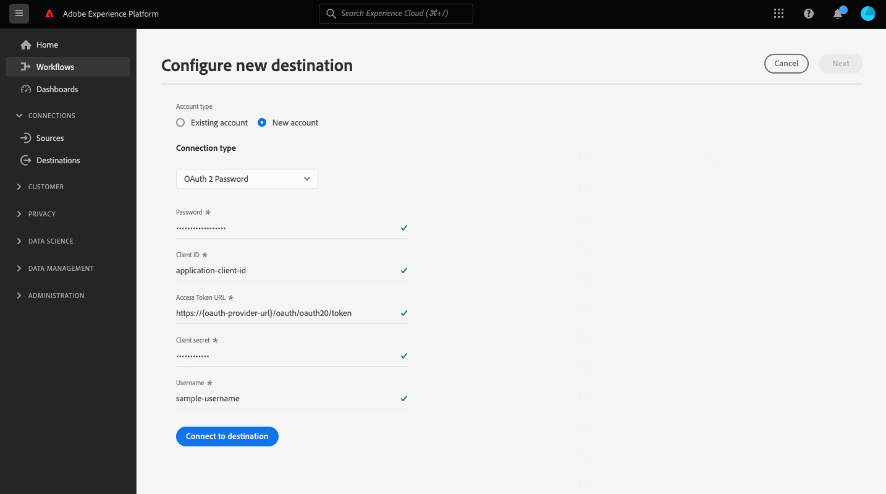

# HTTP API连接

## 概述 {#overview}

>[!IMPORTANT]
>
> 此目标仅适用于 [Adobe Real-time Customer Data Platform Ultimate](https://helpx.adobe.com/legal/product-descriptions/real-time-customer-data-platform.html) 客户。

HTTP API目标是 [!DNL Adobe Experience Platform] 可帮助您将配置文件数据发送到第三方HTTP端点的流式目标。

要将配置文件数据发送到HTTP端点，您必须首先 [连接到目标](#connect-destination) 在 [!DNL Adobe Experience Platform].

## 用例 {#use-cases}

HTTP API目标允许您将XDM配置文件数据和受众导出到通用HTTP端点。 在那里，您可以运行自己的Analytics，或对从Experience Platform中导出的配置文件数据执行任何其他您可能需要的操作。

HTTP端点可以是客户自己的系统或第三方解决方案。

## 支持的受众 {#supported-audiences}

此部分介绍哪些类型的受众可以导出到此目标。

| 受众来源 | 支持 | 描述 |
|---------|----------|----------|
| [!DNL Segmentation Service] | ✓ {\f13 } | 通过Experience Platform生成的受众 [分段服务](../../../segmentation/home.md). |
| 自定义上传 | ✓ {\f13 } | 受众 [已导入](../../../segmentation/ui/audience-portal.md#import-audience) 从CSV文件Experience Platform到。 |

{style="table-layout:auto"}

## 导出类型和频率 {#export-type-frequency}

有关目标导出类型和频率的信息，请参阅下表。

| 项目 | 类型 | 注释 |
---------|----------|---------|
| 导出类型 | **[!UICONTROL 基于配置文件]** | 您正在导出区段的所有成员，以及所需的架构字段（例如：电子邮件地址、电话号码、姓氏），如在的映射屏幕中所选。 [目标激活工作流](../../ui/activate-segment-streaming-destinations.md#mapping). |
| 导出频率 | **[!UICONTROL 流]** | 流目标为基于API的“始终运行”连接。 一旦根据受众评估在Experience Platform中更新了用户档案，连接器就会将更新发送到下游目标平台。 详细了解 [流目标](/help/destinations/destination-types.md#streaming-destinations). |

{style="table-layout:auto"}

## 先决条件 {#prerequisites}

要使用HTTP API目标从Experience Platform中导出数据，您必须满足以下先决条件：

* 您必须具有支持REST API的HTTP端点。
* 您的HTTP端点必须支持Experience Platform配置文件架构。 HTTP API目标不支持转换到第三方有效负载架构。 请参阅 [导出的数据](#exported-data) 部分中的Experience Platform输出模式示例。
* 您的HTTP端点必须支持标头。

>[!TIP]
>
> 您还可以使用 [Adobe Experience Platform Destination SDK](/help/destinations/destination-sdk/overview.md) 以设置集成并将Experience Platform配置文件数据发送到HTTP端点。

## mTLS协议支持和证书 {#mtls-protocol-support}

您可以使用 [!DNL Mutual Transport Layer Security] ([!DNL mTLS])以确保到HTTP API目标连接的出站连接中的增强安全性。

[!DNL mTLS] 是一种用于相互身份验证的端到端安全方法，可确保共享信息的双方在共享数据之前都是声明的身份。 [!DNL mTLS] 包括额外的步骤，与 [!DNL TLS]，其中服务器还会请求客户端的证书，并在其末尾验证它。

如果您要使用 [!DNL mTLS] 替换为 [!DNL HTTP API] 目标，您输入到 [目标详细信息](#destination-details) 页面必须具有 [!DNL TLS] 仅禁用协议 [!DNL mTLS] 已启用。 如果 [!DNL TLS] 1.2协议在端点上仍处于启用状态，不会发送用于客户端身份验证的证书。 这意味着要使用 [!DNL mTLS] 与您的 [!DNL HTTP API] 目标，您的“接收”服务器端点必须为 [!DNL mTLS]-only启用连接端点。

### 下载证书 {#certificate}

如果您想检查 [!DNL Common Name] (CN)和 [!DNL Subject Alternative Names] (SAN)要执行其他第三方验证，您可以下载以下证书：

* [HTTP API mTLS公共证书](../../../landing/images/governance-privacy-security/encryption/destinations-public-certificate.zip)

## IP地址允许列表 {#ip-address-allowlist}

为了满足客户的安全性和合规性要求，Experience Platform提供了您可以允许列表以用于HTTP API目标的静态IP列表。 请参阅 [列入允许列表流目的地的IP地址](/help/destinations/catalog/streaming/ip-address-allow-list.md) 要允许列表的IP的完整列表。

## 支持的身份验证类型 {#supported-authentication-types}

HTTP API目标支持对HTTP端点使用多种身份验证类型：

* 没有身份验证的HTTP端点；
* 持有者令牌认证；
* [OAuth 2.0客户端凭据](https://www.oauth.com/oauth2-servers/access-tokens/client-credentials/) 使用body表单进行身份验证，使用 [!DNL client ID]， [!DNL client secret]、和 [!DNL grant type] （在HTTP请求正文中，如以下示例所示）。

```shell
curl --location --request POST '<YOUR_API_ENDPOINT>' \
--header 'Content-Type: application/x-www-form-urlencoded' \
--data-urlencode 'grant_type=client_credentials' \
--data-urlencode 'client_id=<CLIENT_ID>' \
--data-urlencode 'client_secret=<CLIENT_SECRET>'
```

* [OAuth 2.0客户端凭据](https://www.oauth.com/oauth2-servers/access-tokens/client-credentials/) 具有基本授权，并具有包含URL编码的授权标头 [!DNL client ID] 和 [!DNL client secret].

```shell
curl --location --request POST 'https://some-api.com/token' \
--header 'Authorization: Basic base64(clientId:clientSecret)' \
--header 'Content-type: application/x-www-form-urlencoded; charset=UTF-8' \
--data-urlencode 'grant_type=client_credentials'
```

* [OAuth 2.0密码授予](https://www.oauth.com/oauth2-servers/access-tokens/password-grant/).

## 连接到目标 {#connect-destination}

>[!IMPORTANT]
> 
>要连接到目标，您需要 **[!UICONTROL 查看目标]** 和 **[!UICONTROL 管理目标]** [访问控制权限](/help/access-control/home.md#permissions). 阅读 [访问控制概述](/help/access-control/ui/overview.md) 或与产品管理员联系以获取所需的权限。

要连接到此目标，请按照 [目标配置教程](../../ui/connect-destination.md). 连接到此目标时，必须提供以下信息：

### 身份验证信息 {#authentication-information}

>[!CONTEXTUALHELP]
>id="platform_destinations_connect_http_clientcredentialstype"
>title="客户端凭据类型"
>abstract="选择&#x200B;**编码的正文形式**&#x200B;以在请求正文中包含客户端 ID 和客户端密码，或选择&#x200B;**基本授权**&#x200B;以在授权标头中包含客户端 ID 和客户端密码。查看文档中的示例。"

#### 持有者令牌身份验证 {#bearer-token-authentication}

如果您选择 **[!UICONTROL 持有者令牌]** 要连接到HTTP端点的身份验证类型，请输入以下字段并选择 **[!UICONTROL 连接到目标]**：


* **[!UICONTROL 持有者令牌]**：插入持有者令牌以对HTTP位置进行身份验证。

#### 无身份验证 {#no-authentication}

如果您选择 **[!UICONTROL 无]** 要连接到HTTP端点的身份验证类型：


当选择此身份验证打开时，您只需选择 **[!UICONTROL 连接到目标]** 并且已建立与端点的连接。

#### OAuth 2密码身份验证 {#oauth-2-password-authentication}

如果您选择 **[!UICONTROL OAuth 2密码]** 要连接到HTTP端点的身份验证类型，请输入以下字段并选择 **[!UICONTROL 连接到目标]**：



* **[!UICONTROL 访问令牌URL]**：您颁发访问令牌以及（可选）刷新令牌的URL。
* **[!UICONTROL 客户端ID]**：和 [!DNL client ID] 系统分配给Adobe Experience Platform的区段。
* **[!UICONTROL 客户端密码]**：和 [!DNL client secret] 系统分配给Adobe Experience Platform的区段。
* **[!UICONTROL 用户名]**：用于访问HTTP端点的用户名。
* **[!UICONTROL 密码]**：用于访问HTTP端点的密码。

#### OAuth 2客户端凭据身份验证 {#oauth-2-client-credentials-authentication}

如果您选择 **[!UICONTROL OAuth 2客户端凭据]** 要连接到HTTP端点的身份验证类型，请输入以下字段并选择 **[!UICONTROL 连接到目标]**：


* **[!UICONTROL 访问令牌URL]**：您颁发访问令牌以及（可选）刷新令牌的URL。
* **[!UICONTROL 客户端ID]**：和 [!DNL client ID] 系统分配给Adobe Experience Platform的区段。
* **[!UICONTROL 客户端密码]**：和 [!DNL client secret] 系统分配给Adobe Experience Platform的区段。
* **[!UICONTROL 客户端凭据类型]**：选择您的端点支持的OAuth2客户端凭据授权类型：
   * **[!UICONTROL 正文表单已编码]**：在本例中， [!DNL client ID] 和 [!DNL client secret] 包括 *在请求正文中* 发送至您的目标。 有关示例，请参见 [支持的身份验证类型](#supported-authentication-types) 部分。
   * **[!UICONTROL 基本授权]**：在本例中， [!DNL client ID] 和 [!DNL client secret] 包括 *在 `Authorization` 标题* 进行base64编码并发送到目标之后。 有关示例，请参见 [支持的身份验证类型](#supported-authentication-types) 部分。

### 填写目标详细信息 {#destination-details}

>[!CONTEXTUALHELP]
>id="platform_destinations_connect_http_headers"
>title="标头"
>abstract="按照以下格式输入要包含在目标调用中的任何自定义标头：`header1:value1,header2:value2,...headerN:valueN`"

>[!CONTEXTUALHELP]
>id="platform_destinations_connect_http_endpoint"
>title="HTTP 端点"
>abstract="要将配置文件数据发送到的 HTTP 端点的 URL。"

>[!CONTEXTUALHELP]
>id="platform_destinations_connect_http_includesegmentnames"
>title="包括区段名称"
>abstract="如果您希望数据导出包括正在导出的受众的名称，请进行切换。在选中此选项后查看数据导出示例的文档。"

>[!CONTEXTUALHELP]
>id="platform_destinations_connect_http_includesegmenttimestamps"
>title="包括区段时间戳"
>abstract="如果您希望数据导出包括受众创建时间和更新时间的 Unix 时间戳，以及受众映射到用于激活的目标时的 Unix 时间戳，请进行切换。在选中此选项后查看数据导出示例的文档。"

>[!CONTEXTUALHELP]
>id="platform_destinations_connect_http_queryparameters"
>title="查询参数"
>abstract="（可选）您可以将查询参数添加到 HTTP 端点 URL。格式化您使用的查询参数，如下所示：`parameter1=value&parameter2=value`。"

要配置目标的详细信息，请填写下面的必需和可选字段。 UI中字段旁边的星号表示该字段为必填字段。


* **[!UICONTROL 名称]**：输入一个名称，您将在将来通过名称识别此目标。
* **[!UICONTROL 描述]**：输入可帮助您将来识别此目标的描述。
* **[!UICONTROL 标题]**：输入要包含在目标调用中的任何自定义标头，格式如下： `header1:value1,header2:value2,...headerN:valueN`.
* **[!UICONTROL HTTP端点]**：要将配置文件数据发送到的HTTP端点的URL。
* **[!UICONTROL 查询参数]**：或者，您也可以将查询参数添加到HTTP端点URL。 格式化您使用的查询参数，如下所示：`parameter1=value&parameter2=value`。
* **[!UICONTROL 包括区段名称]**：如果您希望数据导出包含所导出受众的名称，请进行切换。 有关选中此选项的数据导出示例，请参阅 [导出的数据](#exported-data) 部分。
* **[!UICONTROL 包括区段时间戳]**：如果您希望数据导出包括创建和更新受众时的UNIX时间戳，以及将受众映射到目标以供激活时的UNIX时间戳，则可以进行切换。 有关选中此选项的数据导出示例，请参阅 [导出的数据](#exported-data) 部分。

### 启用警报 {#enable-alerts}

您可以启用警报，以接收有关发送到目标的数据流状态的通知。 从列表中选择警报以订阅接收有关数据流状态的通知。 有关警报的详细信息，请参阅以下内容中的指南： [使用UI订阅目标警报](../../ui/alerts.md).

完成提供目标连接的详细信息后，选择 **[!UICONTROL 下一个]**.

## 激活此目标的受众 {#activate}

>[!IMPORTANT]
> 
>* 要激活数据，您需要 **[!UICONTROL 查看目标]**， **[!UICONTROL 激活目标]**， **[!UICONTROL 查看配置文件]**、和 **[!UICONTROL 查看区段]** [访问控制权限](/help/access-control/home.md#permissions). 阅读 [访问控制概述](/help/access-control/ui/overview.md) 或与产品管理员联系以获取所需的权限。
>* [同意政策评估](/help/data-governance/enforcement/auto-enforcement.md#consent-policy-evaluation) 当前在导出到HTTP API目标时不支持。 [了解详情](/help/destinations/ui/activate-streaming-profile-destinations.md#consent-policy-evaluation)。

请参阅 [将受众数据激活到流式配置文件导出目标](../../ui/activate-streaming-profile-destinations.md) 有关将受众激活到此目标的说明。

### 目标属性 {#attributes}

在 [[!UICONTROL 选择属性]](../../ui/activate-streaming-profile-destinations.md#select-attributes) 步骤，Adobe建议您从 [合并架构](../../../profile/home.md#profile-fragments-and-union-schemas). 选择要导出到目标的唯一标识符和任何其他XDM字段。

## 配置文件导出行为 {#profile-export-behavior}

Experience Platform可优化将配置文件导出到HTTP API目标的行为，以便仅在符合受众资格或其他重要事件后对配置文件进行了相关更新时将数据导出到API端点。 在以下情况下，会将配置文件导出到您的目标：

* 配置文件更新取决于映射到目标的至少一个受众的受众成员身份发生更改。 例如，配置文件已符合映射到目标的其中一个受众的条件，或已退出映射到目标的其中一个受众。
* 用户档案更新由 [身份映射](/help/xdm/field-groups/profile/identitymap.md). 例如，对于已经符合映射到目标的其中一个受众资格的用户档案，在身份映射属性中添加了一个新身份。
* 配置文件更新由映射到目标的至少一个属性的更改确定。 例如，将映射步骤中映射到目标的某个属性添加到配置文件中。

在上述所有情况中，只会将已发生相关更新的用户档案导出到您的目标。 例如，如果映射到目标流的受众具有一百个成员，并且有五个新配置文件符合该区段的条件，则导出到目标的操作将以增量方式进行，并且只包括五个新配置文件。

请注意，所有映射的属性都会导出到配置文件，无论更改位于何处。 因此，在上面的示例中，将导出这五个新配置文件的所有映射属性，即使属性本身未发生更改也是如此。

### 决定数据导出的因素以及导出中包含的内容 {#what-determines-export-what-is-included}

对于为给定用户档案导出的数据，了解 *确定导出到HTTP API目标的数据的方法* 和 *哪些数据包含在导出中*.

| 决定目标导出的因素 | 目标导出中包含的内容 |
|---------|----------|
| <ul><li>映射的属性和受众会作为目标导出的提示。 这意味着，如果任何映射的受众更改状态(从 `null` 到 `realized` 或从 `realized` 到 `exiting`)或者更新任何映射的属性，则将会启动目标导出。</li><li>由于身份当前无法映射到HTTP API目标，因此给定配置文件上任何身份的更改也将决定目标导出。</li><li>属性的更改被定义为属性上的任何更新，无论其是否为相同的值。 这意味着即使值本身未发生更改，也会将覆盖属性视为更改。</li></ul> | <ul><li>此 `segmentMembership` 对象包括在激活数据流中映射的受众，对于该受众，在资格或受众退出事件后，用户档案的状态已发生更改。 请注意，如果配置文件符合条件的其他未映射受众属于同一受众，则这些受众也可以作为目标导出的一部分 [合并策略](/help/profile/merge-policies/overview.md) 与激活数据流中映射的受众相同。 </li><li>中的所有标识 `identityMap` 对象也包含在内(Experience Platform当前不支持HTTP API目标中的标识映射)。</li><li>目标导出中只包含映射的属性。</li></ul> |

{style="table-layout:fixed"}

例如，考虑将此数据流映射到HTTP目标，其中在数据流中选择了三个受众，并且四个属性映射到目标。


导出到目标的配置文件可由符合或退出其中一个配置文件来确定 *三个映射区段*. 但是，在数据导出中，将 `segmentMembership` 对象(请参阅 [导出的数据](#exported-data) 如果特定配置文件是其他未映射受众的成员，并且这些受众与触发导出的受众共享相同的合并策略，则可能会显示其他未映射受众。 如果配置文件符合 **拥有DeLorean Cars的客户** 区段，但同时也是 **观看了《回到未来》** 电影和 **科幻迷们** 然后，其他这两个受众也将出现在中 `segmentMembership` 数据导出的对象，即使这些对象未在数据流中映射，只要它们与共享相同的合并策略 **拥有DeLorean Cars的客户** 区段。

从配置文件属性的角度来看，对上述四个映射属性所做的任何更改都将决定目标导出，并且配置文件中存在的四个映射属性中的任何一个都会出现在数据导出中。

## 历史数据回填 {#historical-data-backfill}

在将新受众添加到现有目标时，或者创建新目标并将受众映射到该目标时，Experience Platform会将历史受众资格数据导出到该目标。 符合受众资格的用户档案 *早于* 向目标添加的受众会在大约一小时内导出到目标。

## 导出的数据 {#exported-data}

已导出 [!DNL Experience Platform] 数据登陆到 [!DNL HTTP] JSON格式的目标。 例如，以下导出包含一个符合某个区段资格条件的配置文件，该配置文件是另一个区段的成员，并且已退出另一个区段。 导出还包括配置文件属性名字、姓氏、出生日期和个人电子邮件地址。 此配置文件的身份为ECID和电子邮件。

```json
{
  "person": {
    "birthDate": "YYYY-MM-DD",
    "name": {
      "firstName": "John",
      "lastName": "Doe"
    }
  },
  "personalEmail": {
    "address": "john.doe@acme.com"
  },
  "segmentMembership": {
   "ups":{
      "7841ba61-23c1-4bb3-a495-00d3g5fe1e93":{
         "lastQualificationTime":"2022-01-11T21:24:39Z",
         "status":"exited"
      },
      "59bd2fkd-3c48-4b18-bf56-4f5c5e6967ae":{
         "lastQualificationTime":"2022-01-02T23:37:33Z",
         "status":"realized"
      },
      "947c1c46-008d-40b0-92ec-3af86eaf41c1":{
         "lastQualificationTime":"2021-08-25T23:37:33Z",
         "status":"realized"
      },
      "5114d758-ce71-43ba-b53e-e2a91d67b67f":{
         "lastQualificationTime":"2022-01-11T23:37:33Z",
         "status":"realized"
      }
   }
},
  "identityMap": {
    "ecid": [
      {
        "id": "14575006536349286404619648085736425115"
      },
      {
        "id": "66478888669296734530114754794777368480"
      }
    ],
    "email_lc_sha256": [
      {
        "id": "655332b5fa2aea4498bf7a290cff017cb4"
      },
      {
        "id": "66baf76ef9de8b42df8903f00e0e3dc0b7"
      }
    ]
  }
}
```

以下是导出数据的更多示例，具体取决于您在的连接目标流中选择的UI设置 **[!UICONTROL 包括区段名称]** 和 **[!UICONTROL 包括区段时间戳]** 选项：

+++ 以下数据导出示例包括 `segmentMembership` 部分

```json
"segmentMembership": {
        "ups": {
          "5b998cb9-9488-4ec3-8d95-fa8338ced490": {
            "lastQualificationTime": "2019-04-15T02:41:50+0000",
            "status": "realized",
            "createdAt": 1648553325000,
            "updatedAt": 1648553330000,
            "mappingCreatedAt": 1649856570000,
            "mappingUpdatedAt": 1649856570000,
            "name": "First name equals John"
          }
        }
      }
```

+++

+++ 以下数据导出示例包括 `segmentMembership` 部分

```json
"segmentMembership": {
        "ups": {
          "5b998cb9-9488-4ec3-8d95-fa8338ced490": {
            "lastQualificationTime": "2019-04-15T02:41:50+0000",
            "status": "realized",
            "createdAt": 1648553325000,
            "updatedAt": 1648553330000,
            "mappingCreatedAt": 1649856570000,
            "mappingUpdatedAt": 1649856570000,
          }
        }
      }
```

+++

## 限制和重试策略 {#limits-retry-policy}

在95%的时间中，Experience Platform会尝试为成功发送的消息提供少于10分钟的吞吐量延迟，每个数据流向HTTP目的地的请求速率每秒少于10,000次。

如果对HTTP API目标的请求失败，Experience Platform将存储失败的请求，并重试两次以将请求发送到您的端点。