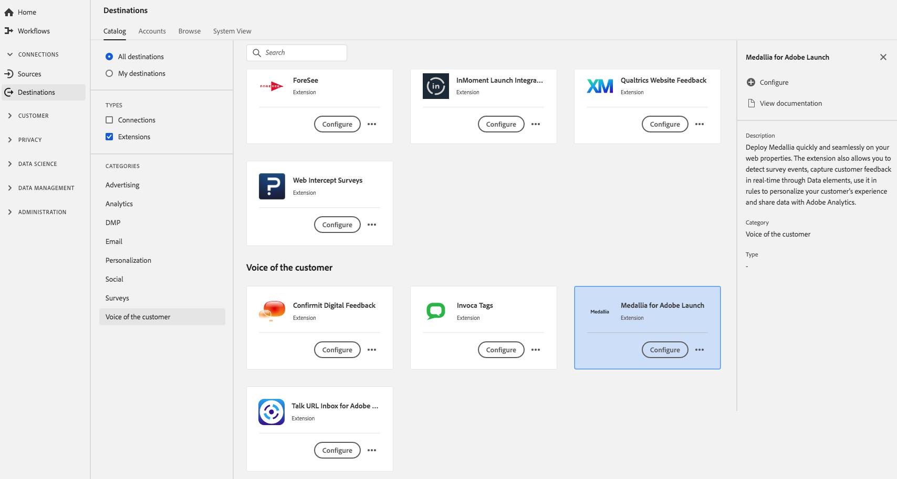

# [!DNL Medallia] 扩展 {#medallia-extension}

## 概述 {#overview}

在Web资产上快速、无缝地部署[!DNL Medallia]。 该扩展还允许您检测调查事件，通过数据元素实时捕获客户反馈，在规则中使用它来个性化客户体验并与Adobe Analytics共享数据。

[!DNL Medallia]是Adobe Experience Platform中客户分机的声音。 有关扩展功能的更多信息，请参阅[Adobe Exchange](https://exchange.adobe.com/experiencecloud.details.103279.medallia-for-adobe-launch.html)上的扩展页面。

此目标是标记扩展。 有关标记扩展如何在Experience Platform中工作的更多信息，请参阅[标记扩展概述](../launch-extensions/overview.md)。

## 先决条件 {#prerequisites}

此扩展位于[!DNL Destinations]目录中，适用于已购买Experience Platform的所有客户。

要使用此扩展，您需要具有对Adobe Experience Platform中标记的访问权限。 标记以内置增值功能的方式提供给Adobe Experience Cloud客户。 请联系您的组织管理员以获取对标记的访问权限，并要求他们授予您&#x200B;**[!UICONTROL manage_properties]**&#x200B;权限，以便您能够安装扩展。

## 安装扩展 {#install-extension}

要安装[!DNL Medallia]扩展，请执行以下操作：

在[Experience Platform界面](https://platform.adobe.com/)中，转到&#x200B;**[!UICONTROL 目标]** > **[!UICONTROL 目录]**。

从目录中选择扩展或使用搜索栏。

单击目标以将其突出显示，然后在右边栏中选择&#x200B;**[!UICONTROL 配置]**。 如果&#x200B;**[!UICONTROL Configure]**&#x200B;控件呈灰显状态，则表示您缺少&#x200B;**[!UICONTROL manage_properties]**&#x200B;权限。 请参阅[先决条件](#prerequisites)。

选择要安装扩展的资产。 您还可以选择创建新资产。 资产是规则、数据元素、配置的扩展、环境和库的集合。在标记文档的[属性页面](../../../tags/ui/administration/companies-and-properties.md#properties-page)部分中了解属性。

该工作流将指导您完成安装步骤。

有关扩展配置选项和安装支持的信息，请参阅Adobe Exchange[&#128279;](https://exchange.adobe.com/experiencecloud.details.103279.medallia-for-adobe-launch.html)上的Medallia页面。

您还可以直接在[数据收集UI](https://experience.adobe.com/#/data-collection/)中安装该扩展。 有关详细信息，请参阅标记文档中有关[添加新扩展](../../../tags/ui/managing-resources/extensions/overview.md#add-a-new-extension)的部分。

## 如何使用扩展 {#how-to-use}

安装扩展后，您可以开始设置规则。

您可以为已安装的扩展设置规则，以便仅在特定情况下将事件数据发送到扩展目标。 有关为扩展设置规则的更多信息，请参阅[标记文档](../../../tags/ui/managing-resources/rules.md)。

## 配置、升级和删除扩展 {#configure-upgrade-delete}

您可以在数据收集UI中配置、升级和删除扩展。

>[!TIP]
>
>如果某个资产上已安装该扩展，则Experience Platform UI仍会显示该扩展的&#x200B;**[!UICONTROL Install]**。 按照[安装扩展](#install-extension)中的说明启动安装工作流，以配置或删除您的扩展。

要升级扩展，请参阅标记文档中的[扩展升级过程](../../../tags/ui/managing-resources/extensions/extension-upgrade.md)指南。
