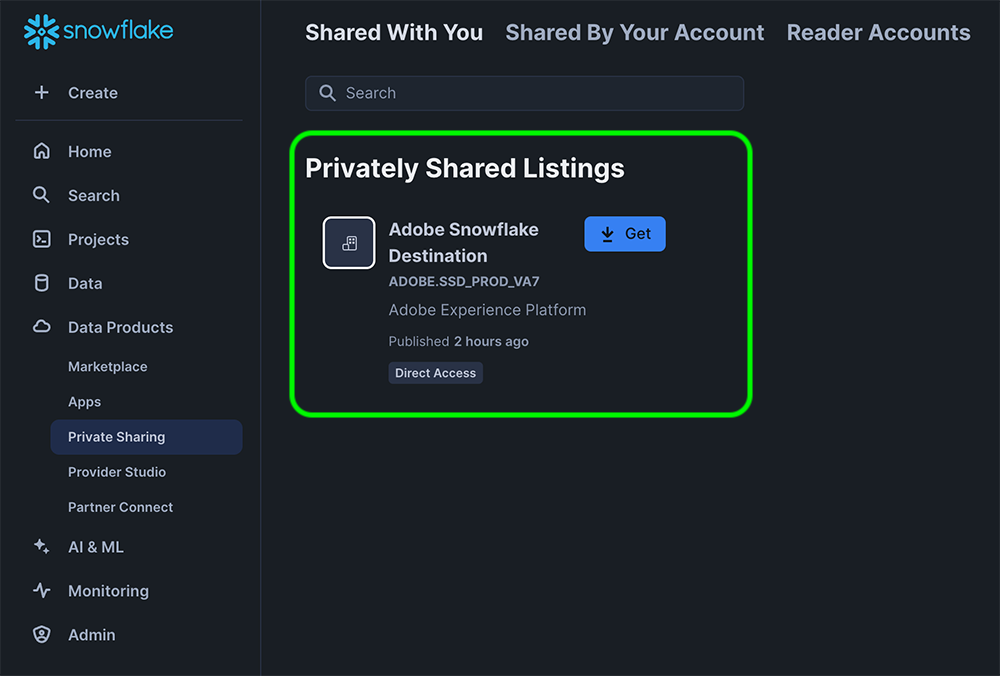

# Snowflake批量连接 {#snowflake-destination}

>[!AVAILABILITY]
>
>此目标连接器的可用性有限，仅适用于[VA7区域](/help/landing/multi-cloud.md#azure-regions)中配置的Real-Time CDP Ultimate客户。

## 概述 {#overview}

使用此目标可将受众数据发送到Snowflake帐户的动态表中。 动态表无需物理数据拷贝即可提供对数据的访问。

请阅读以下部分，了解Snowflake目标的工作方式以及数据在Adobe和Snowflake之间的传输方式。

### Snowflake数据共享的工作原理 {#data-sharing}

此目标使用[!DNL Snowflake]数据共享，这意味着不会向您自己的Snowflake实例实际导出或传输任何数据。 Adobe而是会授予您对Adobe Snowflake环境中托管的活动表的只读访问权限。 您可以直接从Snowflake帐户查询此共享表，但您不是该表的所有者，并且无法在指定的保留期之外修改或保留该表。 Adobe可完全管理共享表的生命周期和结构。

首次设置从Adobe到Snowflake帐户的数据流后，系统会提示您接受来自Adobe的私有列表。

### 数据保留和生存时间(TTL) {#ttl}

通过此集成共享的所有数据的固定生存时间(TTL)为7天。 上次导出后七天，无论数据流是否仍处于活动状态，动态表都会自动过期并变为无法访问状态。 如果您需要将数据保留超过7天，则必须在TTL过期之前将这些内容复制到您自己的Snowflake实例中拥有的表中。

>[!IMPORTANT]
>
>删除Experience Platform中的数据流将导致动态表从您的Snowflake帐户中消失。

### 受众更新行为 {#audience-update-behavior}

如果您的受众在[批处理模式](../../../segmentation/methods/batch-segmentation.md)下评估，则共享表中的数据每24小时刷新一次。 这意味着，在受众成员身份发生更改后，这些更改会延迟最多24小时，并且这些更改会反映在共享表中。

### 批量数据共享逻辑 {#batch-data-sharing}

首次针对受众运行数据流时，它将执行回填并共享所有当前符合条件的用户档案。 在此初始回填之后，目标会定期提供完整受众成员资格的快照。 每个快照都会替换共享表中的先前数据，确保您始终能够看到受众的最新完整视图，而无需历史数据。

## 流数据共享与批量数据共享 {#batch-vs-streaming}

Experience Platform提供两种类型的Snowflake目标：[Snowflake Streaming](snowflake.md)和[Snowflake Batch](snowflake-batch.md)。

虽然两个目标均允许您以零复制方式访问Snowflake中的数据，但在每个连接器的用例方面仍有一些推荐的最佳实践。

下表将概述每种数据共享方法最适合的场景，帮助您确定要使用的连接器。

|  | 根据需要选择[Snowflake批次](snowflake-batch.md) | 根据需要选择[Snowflake流](snowflake.md) |
|--------|-------------------|----------------------|
| **更新频率** | 定期快照 | 实时连续更新 |
| **数据演示** | 替换以前数据的完整受众快照 | 基于配置文件更改的增量更新 |
| **用例集中** | 延迟不重要的分析/ML工作负载 | 需要实时更新的即时操作方案 |
| **数据管理** | 始终查看最新的完整快照 | 基于受众成员资格更改的增量更新 |
| **示例场景** | 业务报告、数据分析、ML模型训练 | 营销活动抑制、实时个性化 |

有关流式数据共享的更多信息，请参阅[Snowflake流式连接](snowflake.md)文档。

## 用例 {#use-cases}

批量数据共享非常适合需要受众完整快照且不需要实时更新的情况，例如：

* **分析工作负载**：执行需要全面了解受众成员资格的数据分析、报告或业务智能任务时
* **机器学习工作流**：用于训练ML模型或运行可从完整的受众快照中获益的预测分析
* **数据仓库**：需要在本身Snowflake实例中维护受众数据的当前副本时
* **定期报告**：对于常规业务报告，您需要最新的受众状态而没有历史更改跟踪
* **ETL进程**：需要批量转换或处理受众数据时

批量数据共享通过提供完整的快照简化了数据管理，无需管理增量更新或手动合并更改。

## 先决条件 {#prerequisites}

在配置Snowflake连接之前，请确保您满足以下先决条件：

* 您有权访问[!DNL Snowflake]帐户。
* 您的Snowflake帐户已订阅私人列表。 您或您公司中拥有Snowflake帐户管理员权限的人员可以配置此配置。

有关必要权限的更多信息，请阅读[[!DNL Snowflake] 文档](https://docs.snowflake.com/en/collaboration/consumer-listings-access#access-a-private-listing)。

## 支持的受众 {#supported-audiences}

此部分介绍哪些类型的受众可以导出到此目标。 以下两个表按受众中包含的&#x200B;_受众来源_&#x200B;和&#x200B;_配置文件类型_&#x200B;指明了此连接器支持的受众：

| 受众来源 | 支持 | 描述 |
|---------|----------|----------|
| [!DNL Segmentation Service] | ✓ | 通过Experience Platform [分段服务](../../../segmentation/home.md)生成的受众。 |
| 所有其他受众来源 | ✓ | 此类别包括通过[!DNL Segmentation Service]生成的受众之外的所有受众来源。 了解[各种受众源](/help/segmentation/ui/audience-portal.md#customize)。 一些示例包括： <ul><li> 自定义上传受众[从CSV文件导入](../../../segmentation/ui/audience-portal.md#import-audience)到Experience Platform，</li><li> 相似的受众， </li><li> 联合受众， </li><li> 在其他Experience Platform应用程序(如Adobe Journey Optimizer)中生成的受众， </li><li> 等等。 </li></ul> |

{style="table-layout:auto"}

按受众数据类型划分的受众支持：

| 受众数据类型 | 支持 | 描述 | 用例 |
|--------------------|-----------|-------------|-----------|
| [人员受众](/help/segmentation/types/people-audiences.md) | ✓ | 根据客户个人资料，允许您针对特定的营销活动人群组进行定位。 | 频繁购买者，购物车放弃者 |
| [帐户受众](/help/segmentation/types/account-audiences.md) | 否 | 针对特定组织内的个人，制定基于帐户的营销策略。 | B2B营销 |
| [潜在客户受众](/help/segmentation/types/prospect-audiences.md) | 否 | 定位尚未成为客户但与目标受众具有共同特征的个人。 | 利用第三方数据发现潜在客户 |
| [数据集导出](/help/catalog/datasets/overview.md) | 否 | 存储在Adobe Experience Platform数据湖中的结构化数据的集合。 | 报告、数据科学工作流 |

{style="table-layout:auto"}

## 导出类型和频率 {#export-type-frequency}

有关目标导出类型和频率的信息，请参阅下表。

| 项目 | 类型 | 注释 |
---------|----------|---------|
| 导出类型 | **[!UICONTROL Audience export]** | 您正在导出具有[!DNL Snowflake]目标中使用的标识符（姓名、电话号码或其他）的受众的所有成员。 |
| 导出频率 | **[!UICONTROL Batch]** | 此目标通过Snowflake数据共享提供完整受众成员资格的定期快照。 每个快照都会替换以前的数据，确保您始终拥有受众的最新完整视图。 |

{style="table-layout:auto"}

## 连接到目标 {#connect}

>[!IMPORTANT]
> 
>若要连接到目标，您需要&#x200B;**[!UICONTROL View Destinations]**&#x200B;和&#x200B;**[!UICONTROL Manage Destinations]** [访问控制权限](/help/access-control/home.md#permissions)。 阅读[访问控制概述](/help/access-control/ui/overview.md)或联系您的产品管理员以获取所需的权限。

要连接到此目标，请按照[目标配置教程](../../ui/connect-destination.md)中描述的步骤操作。 在配置目标工作流中，填写下面两个部分中列出的字段。

### 验证目标 {#authenticate}

要向目标进行身份验证，请选择&#x200B;**[!UICONTROL Connect to destination]**&#x200B;并提供帐户名和帐户说明（可选）。

### 填写目标详细信息 {#destination-details}

>[!CONTEXTUALHELP]
>id="platform_destinations_snowflake_batch_accountID"
>title="输入您的 Snowflake 帐户 ID"
>abstract="如果您的帐户已链接到某个组织，请使用以下格式：`OrganizationName.AccountName`   如果您的帐户未链接到某个组织，请使用以下格式：`AccountName`"

要配置目标的详细信息，请填写下面的必需和可选字段。 UI中字段旁边的星号表示该字段为必填字段。

* **[!UICONTROL Name]**：将来用于识别此目标的名称。
* **[!UICONTROL Description]**：可帮助您将来识别此目标的描述。
* **[!UICONTROL Snowflake Account ID]**：您的Snowflake帐户ID。 根据您的帐户是否链接到组织，使用以下帐户ID格式：
   * 如果您的帐户链接到组织： `OrganizationName.AccountName`。
   * 如果您的帐户未链接到组织： `AccountName`。
* **[!UICONTROL Account acknowledgment]**：打开Snowflake帐户ID确认，以确认您的帐户ID正确且属于您。

>[!IMPORTANT]
>
> 目标名称和Experience Platform沙盒名称中使用的特殊字符会自动转换为Snowflake中的下划线(`_`)。 为避免混淆，请勿在您的目标和沙盒名称中使用任何特殊字符。

### 启用警报 {#enable-alerts}

您可以启用警报，以接收有关发送到目标的数据流状态的通知。 从列表中选择警报以订阅接收有关数据流状态的通知。 有关警报的详细信息，请阅读有关使用UI订阅目标警报[的指南](../../ui/alerts.md)。

完成提供目标连接的详细信息后，选择&#x200B;**[!UICONTROL Next]**。

## 激活此目标的受众 {#activate}

>[!IMPORTANT]
> 
>* 若要激活数据，您需要&#x200B;**[!UICONTROL View Destinations]**、**[!UICONTROL Activate Destinations]**、**[!UICONTROL View Profiles]**&#x200B;和&#x200B;**[!UICONTROL View Segments]** [访问控制权限](/help/access-control/home.md#permissions)。 阅读[访问控制概述](/help/access-control/ui/overview.md)或联系您的产品管理员以获取所需的权限。
>* 要导出&#x200B;*标识*，您需要&#x200B;**[!UICONTROL View Identity Graph]** [访问控制权限](/help/access-control/home.md#permissions)。  {width="100" zoomable="yes"}

有关将受众激活到此目标的说明，请阅读[将受众数据激活到批处理配置文件导出目标](/help/destinations/ui/activate-batch-profile-destinations.md)。

### 映射属性 {#map}

您可以将身份和配置文件属性导出到此目标。

您可以使用[计算字段控件](../../ui/data-transformations-calculated-fields.md)导出数组，并在数组上执行操作。

使用您在&#x200B;**[!UICONTROL Attribute name]**&#x200B;字段中提供的属性名称，在Snowflake中自动创建目标属性。

## 导出的数据/验证数据导出 {#exported-data}

数据通过动态表暂存到您的Snowflake帐户中。 检查您的Snowflake帐户，验证是否已正确导出数据。

### 数据结构 {#data-structure}

动态表包含以下列：

* **TS**：表示每个行上次更新的时间戳列
* **映射属性**：在激活工作流期间选择的每个映射属性在Snowflake中均表示为列标题
* **受众成员资格**：通过相应单元格中的`active`条目指示映射到数据流的任何受众的成员资格

## 已知限制 {#known-limitations}

### 默认合并策略限制 {#default-merge-policy-restriction}

目前，只能导出映射到默认合并策略的受众。

### 地区可用性 {#regional-availability}

[!DNL Snowflake]批处理目标当前仅适用于Experience Platform VA7区域中配置的Real-Time CDP客户。

## 数据使用和治理 {#data-usage-governance}

在处理您的数据时，所有[!DNL Adobe Experience Platform]目标都符合数据使用策略。 有关[!DNL Adobe Experience Platform]如何实施数据治理的详细信息，请阅读[数据治理概述](/help/data-governance/home.md)。
