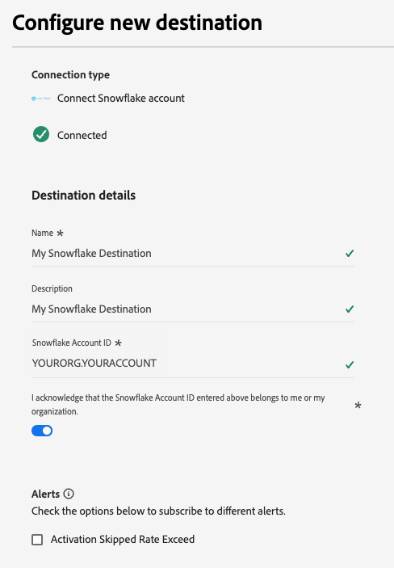

# Snowflake流连接 {#snowflake-destination}

>[!AVAILABILITY]
>
>此目标连接器的可用性有限，仅适用于[!DNL Real-Time CDP]VA7区域[中设置的](/help/landing/multi-cloud.md#azure-regions)个Ultimate客户。

## 概述 {#overview}

使用Snowflake目标连接器将数据导出到Adobe的Snowflake实例，Adobe随后通过[私有列表](https://other-docs.snowflake.com/en/collaboration/collaboration-listings-about)与您的实例共享。

请阅读以下部分，了解Snowflake目标的工作方式以及数据在Adobe和Snowflake之间的传输方式。

### Snowflake数据共享的工作原理 {#data-sharing}

此目标使用[!DNL Snowflake]数据共享，这意味着不会向您自己的Snowflake实例实际导出或传输任何数据。 Adobe而是会授予您对Adobe Snowflake环境中托管的活动表的只读访问权限。 您可以直接从Snowflake帐户查询此共享表，但您不是该表的所有者，并且无法在指定的保留期之外修改或保留该表。 Adobe可完全管理共享表的生命周期和结构。

首次将Snowflake实例中的数据共享到您的实例时，系统会提示您接受Adobe的私有列表。

### 数据保留和生存时间(TTL) {#ttl}

通过此集成共享的所有数据的固定生存时间(TTL)为7天。 上次导出后七天，无论数据流是否仍处于活动状态，共享表都会自动过期并变为无法访问状态。 如果您需要将数据保留超过7天，则必须在TTL过期之前将这些内容复制到您自己的Snowflake实例中拥有的表中。

### 受众更新行为 {#audience-update-behavior}

如果您的受众在[批处理模式](../../../segmentation/methods/batch-segmentation.md)下评估，则共享表中的数据每24小时刷新一次。 这意味着，在受众成员身份发生更改后，这些更改会延迟最多24小时，并且这些更改会反映在共享表中。

### 增量导出逻辑 {#incremental-export}

首次针对受众运行数据流时，它将执行回填并共享所有当前符合条件的用户档案。 在此初始回填之后，只有增量更新会反映在共享表中。 这意味着向受众添加配置文件或从受众删除配置文件。 此方法可确保高效更新，并使共享表格保持最新。

## 流数据共享与批量数据共享 {#batch-vs-streaming}

[!DNL Adobe Experience Platform]提供两种类型的[!DNL Snowflake]目标：[Snowflake Streaming](snowflake.md)和[Snowflake Batch](snowflake-batch.md)。

下表将概述每种数据共享方法最适用的场景，帮助您确定要使用的目标。

|  | 根据需要选择[Snowflake批次](snowflake-batch.md) | 根据需要选择[Snowflake流](snowflake.md) |
|--------|-------------------|----------------------|
| **更新频率** | 定期快照 | 实时连续更新 |
| **数据演示** | 替换以前数据的完整受众快照 | 基于配置文件更改的增量更新 |
| **用例集中** | 延迟不重要的分析/ML工作负载 | 需要实时更新的即时操作方案 |
| **数据管理** | 始终查看最新的完整快照 | 基于受众成员资格更改的增量更新 |
| **示例场景** | 业务报告、数据分析、ML模型训练 | 营销活动抑制、实时个性化 |

有关批量数据共享的详细信息，请参阅[Snowflake批量连接](snowflake-batch.md)文档。

## 用例 {#use-cases}

流式数据共享适用于配置文件更改其成员资格或其他属性时需要立即更新的情况。 这对于需要实时响应的用例至关重要，例如：

* **营销活动抑制**：立即抑制已执行特定操作（如注册服务或购买）的用户的营销活动
* **实时个性化**：在配置文件属性发生更改时（例如，当用户访问网站、查看产品页面或将项目添加到购物车时），立即更新用户体验
* **立即操作方案**：根据实时数据执行快速抑制和重新定位以减少延迟，并确保营销活动更相关、更及时
* **效率和细微差别**：通过允许快速响应用户行为变化，提高营销工作的效率和细微差别
* **实时客户历程优化**：在区段成员资格或配置文件属性发生更改时立即更新客户体验

流式数据共享根据区段更改、身份映射更改或属性更改提供持续更新，使其适用于低延迟情况很重要的情况。

## 先决条件 {#prerequisites}

在配置Snowflake连接之前，请确保您满足以下先决条件：

* 您有权访问[!DNL Snowflake]帐户。
* 您的[!DNL Snowflake]帐户已订阅私人列表。 您或您公司中拥有[!DNL Snowflake]帐户管理员权限的人员可以配置此项。
* 您知道您的[!DNL Snowflake]帐户区域，在连接到目标时将从下拉列表中进行选择。

有关必要权限的更多信息，请阅读[[!DNL Snowflake] 文档](https://docs.snowflake.com/en/collaboration/consumer-listings-access#access-a-private-listing)。

## 支持的受众 {#supported-audiences}

此部分介绍哪些类型的受众可以导出到此目标。 以下两个表按受众中包含的&#x200B;_受众来源_&#x200B;和&#x200B;_配置文件类型_&#x200B;指明了此连接器支持的受众：

| 受众来源 | 受支持 | 描述 |
|---------|----------|----------|
| [!DNL Segmentation Service] | 是 | 通过[!DNL Adobe Experience Platform] [分段服务](../../../segmentation/home.md)生成的受众。 |
| 所有其他受众来源 | 是 | 此类别包括通过[!DNL Segmentation Service]生成的受众之外的所有受众来源。 了解[各种受众源](/help/segmentation/ui/audience-portal.md#customize)。 一些示例包括： <ul><li> 自定义上传受众[从CSV文件导入](../../../segmentation/ui/audience-portal.md#import-audience)，[!DNL Adobe Experience Platform]</li><li> 相似的受众， </li><li> 联合受众， </li><li> 在其他[!DNL Adobe Experience Platform]应用（如[!DNL Adobe Journey Optimizer]）中生成的受众， </li><li> 等等。 </li></ul> |

{style="table-layout:auto"}

按受众数据类型划分的受众支持：

| 受众数据类型 | 受支持 | 描述 | 用例 |
|--------------------|-----------|-------------|-----------|
| [人员受众](/help/segmentation/types/people-audiences.md) | 是 | 根据客户个人资料，允许您针对特定的营销活动人群组进行定位。 | 频繁购买者，购物车放弃者 |
| [帐户受众](/help/segmentation/types/account-audiences.md) | 否 | 针对特定组织内的个人，制定基于帐户的营销策略。 | B2B营销 |
| [潜在客户受众](/help/segmentation/types/prospect-audiences.md) | 否 | 定位尚未成为客户但与目标受众具有共同特征的个人。 | 利用第三方数据发现潜在客户 |
| [数据集导出](/help/catalog/datasets/overview.md) | 否 | 存储在[!DNL Adobe Experience Platform]数据湖中的结构化数据的集合。 | 报告、数据科学工作流 |

{style="table-layout:auto"}

## 导出类型和频率 {#export-type-frequency}

有关目标导出类型和频率的信息，请参阅下表。

| 项目 | 类型 | 注释 |
|---------|----------|---------|
| 导出类型 | **[!UICONTROL Audience export]** | 您正在导出具有[!DNL Snowflake]目标中使用的标识符（姓名、电话号码或其他）的受众的所有成员。 |
| 导出频率 | **[!UICONTROL Streaming]** | 流目标为基于API的“始终运行”连接。 一旦根据受众评估在[!DNL Adobe Experience Platform]中更新了配置文件，连接器就会将更新发送到下游目标平台。 阅读有关[流式目标](/help/destinations/destination-types.md#streaming-destinations)的更多信息。 |

{style="table-layout:auto"}

## 连接到目标 {#connect}

>[!IMPORTANT]
>
>若要连接到目标，您需要&#x200B;**[!UICONTROL View Destinations]**&#x200B;和&#x200B;**[!UICONTROL Manage Destinations]** [访问控制权限](/help/access-control/home.md#permissions)。 阅读[访问控制概述](/help/access-control/ui/overview.md)或联系您的产品管理员以获取所需的权限。

要连接到此目标，请按照[目标配置教程](../../ui/connect-destination.md)中描述的步骤操作。 在配置目标工作流中，填写下面两个部分中列出的字段。

### 验证目标 {#authenticate}

要验证目标，请选择&#x200B;**[!UICONTROL Connect to destination]**。

### 填写目标详细信息 {#destination-details}

>[!CONTEXTUALHELP]
>id="platform_destinations_snowflake_accountID"
>title="输入您的 Snowflake 帐户 ID"
>abstract="如果您的帐户已关联到某个组织，请使用以下格式：`OrganizationName.AccountName`   如果您的帐户未关联到任何组织，请使用以下格式：`AccountName` "

要配置目标的详细信息，请填写下面的必需和可选字段。 UI中字段旁边的星号表示该字段为必填字段。

* **[!UICONTROL Name]**：将来用于识别此目标的名称。
* **[!UICONTROL Description]**：可帮助您将来识别此目标的描述。
* **[!UICONTROL Snowflake Account ID]**：您的Snowflake帐户ID。 根据您的帐户是否链接到组织，使用以下帐户ID格式：
   * 如果您的帐户链接到组织： `OrganizationName.AccountName`。
   * 如果您的帐户未链接到组织： `AccountName`。
* **[!UICONTROL Account acknowledgment]**：打开Snowflake帐户ID确认，以确认您的帐户ID正确且属于您。

>[!NOTE]
>
> 创建目标后，无法通过&#x200B;**[!UICONTROL Snowflake Account ID]**&#x200B;编辑目标[工作流编辑](../../ui/edit-destination.md)。 若要使用其他帐户，请[创建新的目标连接](../../ui/connect-destination.md)。

>[!IMPORTANT]
>
> 目标名称和[!DNL Adobe Experience Platform]沙盒名称中使用的特殊字符在`_`中自动转换为下划线([!DNL Snowflake])。 为避免混淆，请勿在您的目标和沙盒名称中使用任何特殊字符。

### 启用警报 {#enable-alerts}

您可以启用警报，以接收有关发送到目标的数据流状态的通知。 从列表中选择警报以订阅接收有关数据流状态的通知。 有关警报的详细信息，请阅读有关使用UI订阅目标警报[的指南](../../ui/alerts.md)。

完成提供目标连接的详细信息后，选择&#x200B;**[!UICONTROL Next]**。

## 激活此目标的受众 {#activate}

>[!IMPORTANT]
>
>* 若要激活数据，您需要&#x200B;**[!UICONTROL View Destinations]**、**[!UICONTROL Activate Destinations]**、**[!UICONTROL View Profiles]**&#x200B;和&#x200B;**[!UICONTROL View Segments]** [访问控制权限](/help/access-control/home.md#permissions)。 阅读[访问控制概述](/help/access-control/ui/overview.md)或联系您的产品管理员以获取所需的权限。
>* 要导出&#x200B;*标识*，您需要&#x200B;**[!UICONTROL View Identity Graph]** [访问控制权限](/help/access-control/home.md#permissions)。  {width="100" zoomable="yes"}

有关将受众激活到此目标的说明，请阅读[将配置文件和受众激活到流式受众导出目标](/help/destinations/ui/activate-segment-streaming-destinations.md)。

### 映射属性 {#map}

Snowflake目标支持将配置文件属性映射到自定义属性。

使用您在&#x200B;**[!UICONTROL Attribute name]**&#x200B;字段中提供的属性名称，在Snowflake中自动创建目标属性。

## 导出的数据/验证数据导出 {#exported-data}

数据将通过共享表共享到您的Snowflake帐户中。 检查您的Snowflake帐户，验证是否已正确导出数据。

以下示例显示了共享表中的示例行：某些列将身份和区段成员资格存储为JSON；映射的配置文件属性显示为单独的字符串列。

 {align="center" zoomable="yes"}

### 数据结构 {#data-structure}

上面的屏幕截图显示了以下列：

* **IDENTITYMAP**：每个配置文件标识映射的JSON对象。
* **SEGMENT_MEMBERSHIP**：数据流上激活的每个受众的JSON对象。 值包括`lastQualificationTime`和`status`（例如，当配置文件符合区段资格时`realized`）。
* **映射属性**：在激活工作流期间选择的每个映射属性都表示为[!DNL Snowflake]中的列标题。

## 数据使用和治理 {#data-usage-governance}

在处理您的数据时，所有[!DNL Adobe Experience Platform]目标都符合数据使用策略。 有关[!DNL Adobe Experience Platform]如何实施数据治理的详细信息，请阅读[数据治理概述](/help/data-governance/home.md)。
