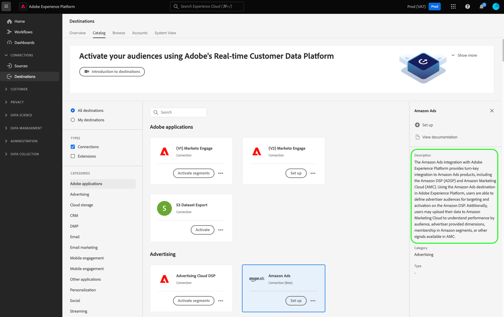

# 创建目标配置

此页面展示了可用于使用`/authoring/destinations` API端点创建自己的目标配置的API请求和有效负荷。

有关可通过此端点配置的功能的详细说明，请参阅以下文章：

* [客户身份验证配置](../../functionality/destination-configuration/customer-authentication.md)
* [OAuth2授权](../../functionality/destination-configuration/oauth2-authorization.md)
* [客户数据字段](../../functionality/destination-configuration/customer-data-fields.md)
* [UI属性](../../functionality/destination-configuration/ui-attributes.md)
* [架构配置](../../functionality/destination-configuration/schema-configuration.md)
* [身份命名空间配置](../../functionality/destination-configuration/identity-namespace-configuration.md)
* [目标投放](../../functionality/destination-configuration/destination-delivery.md)
* [受众元数据配置](../../functionality/destination-configuration/audience-metadata-configuration.md)
* [受众元数据配置](../../functionality/destination-configuration/audience-metadata-configuration.md)
* [聚合策略](../../functionality/destination-configuration/aggregation-policy.md)
* [批次配置](../../functionality/destination-configuration/batch-configuration.md)
* [历史配置文件资格](../../functionality/destination-configuration/historical-profile-qualifications.md)

>[!IMPORTANT]
>
>Destination SDK支持的所有参数名称和值均区分大小写&#x200B;**&#x200B;**。 为避免出现区分大小写错误，请完全按照文档中的说明使用参数名称和值。

## 目标配置API操作快速入门 {#get-started}

在继续之前，请查看[入门指南](../../getting-started.md)以了解成功调用API所需了解的重要信息，包括如何获取所需的目标创作权限和所需的标头。

## 创建目标配置 {#create}

您可以通过向`/authoring/destinations`端点发出POST请求来创建新的目标配置。

>[!TIP]
>
>**API终结点**： `platform.adobe.io/data/core/activation/authoring/destinations`

**API格式**

```http
POST /authoring/destinations
```

以下请求创建一个新的[!DNL Amazon S3]目标配置，该配置由有效负载中提供的参数配置。 以下有效负载包含`/authoring/destinations`端点接受的基于文件的目标的所有参数。

请注意，您不必将所有参数添加到API调用，并且负载可以根据您的API要求进行自定义。

+++请求

```shell
curl -X POST https://platform.adobe.io/data/core/activation/authoring/destinations \
 -H 'Authorization: Bearer {ACCESS_TOKEN}' \
 -H 'Content-Type: application/json' \
 -H 'x-gw-ims-org-id: {ORG_ID}' \
 -H 'x-api-key: {API_KEY}' \
 -H 'x-sandbox-name: {SANDBOX_NAME}' \
 -d '
{
   "name":"Amazon S3 destination with predefined CSV formatting options",
   "description":"Amazon S3 destination with predefined CSV formatting options",
   "status":"TEST",
   "customerAuthenticationConfigurations":[
      {
         "authType":"S3"
      }
   ],
   "customerDataFields":[
      {
         "name":"bucket",
         "title":"Enter the name of your Amazon S3 bucket",
         "description":"Amazon S3 bucket name",
         "type":"string",
         "isRequired":true,
         "readOnly":false,
         "hidden":false
      },
      {
         "name":"path",
         "title":"Enter the path to your S3 bucket folder",
         "description":"Enter the path to your S3 bucket folder",
         "type":"string",
         "isRequired":true,
         "pattern":"^[A-Za-z]+$",
         "readOnly":false,
         "hidden":false
      },
      {
         "name":"compression",
         "title":"Compression format",
         "description":"Select the desired file compression format.",
         "type":"string",
         "isRequired":true,
         "readOnly":false,
         "enum":[
            "SNAPPY",
            "GZIP",
            "DEFLATE",
            "NONE"
         ]
      },
      {
         "name":"fileType",
         "title":"Select a fileType",
         "description":"Select fileType",
         "type":"string",
         "isRequired":true,
         "readOnly":false,
         "hidden":false,
         "enum":[
            "csv",
            "json",
            "parquet"
         ],
         "default":"csv"
      }
   ],
   "uiAttributes":{
      "documentationLink":"https://www.adobe.com/go/destinations-amazon-s3-en",
      "category":"cloudStorage",
      "icon":{
         "key":"amazonS3"
      },
      "connectionType":"S3",
      "frequency":"Batch"
   },
   "destinationDelivery":[
      {
         "deliveryMatchers":[
            {
               "type":"SOURCE",
               "value":[
                  "batch"
               ]
            }
         ],
         "authenticationRule":"CUSTOMER_AUTHENTICATION",
         "destinationServerId":"{{destinationServerId}}"
      }
   ],
   "schemaConfig":{
      "profileRequired":true,
      "segmentRequired":true,
      "identityRequired":true
   },
   "batchConfig":{
      "allowMandatoryFieldSelection":true,
      "allowDedupeKeyFieldSelection":true,
      "defaultExportMode":"DAILY_FULL_EXPORT",
      "allowedExportMode":[
         "DAILY_FULL_EXPORT",
         "FIRST_FULL_THEN_INCREMENTAL"
      ],
      "allowedScheduleFrequency":[
         "DAILY",
         "EVERY_3_HOURS",
         "EVERY_6_HOURS",
         "EVERY_8_HOURS",
         "EVERY_12_HOURS",
         "ONCE"
      ],
      "defaultFrequency":"DAILY",
      "defaultStartTime":"00:00",
      "filenameConfig":{
         "allowedFilenameAppendOptions":[
            "SEGMENT_NAME",
            "DESTINATION_INSTANCE_ID",
            "DESTINATION_INSTANCE_NAME",
            "ORGANIZATION_NAME",
            "SANDBOX_NAME",
            "DATETIME",
            "CUSTOM_TEXT"
         ],
         "defaultFilenameAppendOptions":[
            "DATETIME"
         ],
         "defaultFilename":"%DESTINATION%_%SEGMENT_ID%"
      },
      "backfillHistoricalProfileData":true
   }
}'
```

| 参数 | 类型 | 描述 |
|---------|----------|------|
| `name` | 字符串 | 指示Experience Platform目录中的目标标题。 |
| `description` | 字符串 | 提供Adobe将在目标卡的Experience Platform目标目录中使用的描述。 目标不超过4到5句。 {width="100" zoomable="yes"} |
| `status` | 字符串 | 指示目标卡的生命周期状态。 接受的值为`TEST`、`PUBLISHED`和`DELETED`。 首次配置目标时使用`TEST`。 |
| `customerAuthenticationConfigurations.authType` | 字符串 | 指示用于向目标服务器验证Experience Platform客户的配置。 有关支持的身份验证类型的详细信息，请参阅[客户身份验证配置](../../functionality/destination-configuration/customer-authentication.md)。 |
| `customerDataFields.name` | 字符串 | 为您即将介绍的自定义字段提供一个名称。 <br/><br/>有关这些设置的详细信息，请参阅[客户数据字段](../../functionality/destination-configuration/customer-data-fields.md)。 {width="100" zoomable="yes"} |
| `customerDataFields.type` | 字符串 | 指示您即将引入的自定义字段的类型。 接受的值为`string`、`object`、`integer`。 <br/><br/>有关这些设置的详细信息，请参阅[客户数据字段](../../functionality/destination-configuration/customer-data-fields.md)。 |
| `customerDataFields.title` | 字符串 | 指示字段的名称，如客户在Experience Platform用户界面中所看到的。 <br/><br/>有关这些设置的详细信息，请参阅[客户数据字段](../../functionality/destination-configuration/customer-data-fields.md)。 |
| `customerDataFields.description` | 字符串 | 提供自定义字段的描述。 有关这些设置的详细信息，请参阅[客户数据字段](../../functionality/destination-configuration/customer-data-fields.md)。 |
| `customerDataFields.isRequired` | 布尔值 | 指示目标设置工作流中是否需要此字段。 <br/><br/>有关这些设置的详细信息，请参阅[客户数据字段](../../functionality/destination-configuration/customer-data-fields.md)。 |
| `customerDataFields.enum` | 字符串 | 将自定义字段呈现为下拉菜单，并列出用户可用的选项。 <br/><br/>有关这些设置的详细信息，请参阅[客户数据字段](../../functionality/destination-configuration/customer-data-fields.md)。 |
| `customerDataFields.default` | 字符串 | 从`enum`列表中定义默认值。 |
| `customerDataFields.pattern` | 字符串 | 如果需要，为自定义字段实施模式。 使用正则表达式可强制实施模式。 例如，如果您的客户ID不包含数字或下划线，请在此字段中输入`^[A-Za-z]+$`。 <br/><br/>有关这些设置的详细信息，请参阅[客户数据字段](../../functionality/destination-configuration/customer-data-fields.md)。 |
| `uiAttributes.documentationLink` | 字符串 | 请参阅目标的[目标目录](https://experienceleague.adobe.com/docs/experience-platform/destinations/catalog/overview.html?lang=zh-Hans#catalog)中的文档页面。 使用`https://www.adobe.com/go/destinations-YOURDESTINATION-en`，其中`YOURDESTINATION`是目标的名称。 对于名为Moviestar的目标，您将使用`https://www.adobe.com/go/destinations-moviestar-en`。 请注意，只有在Adobe将您的目标设置为实时状态并发布文档后，此链接才有效。 <br/><br/>有关这些设置的详细信息，请参阅[UI属性](../../functionality/destination-configuration/ui-attributes.md)。 {width="100" zoomable="yes"} |
| `uiAttributes.category` | 字符串 | 是指在Adobe Experience Platform中分配给目标的类别。 有关详细信息，请阅读[目标类别](https://experienceleague.adobe.com/docs/experience-platform/rtcdp/destinations/destination-types.html?lang=zh-Hans#destination-categories)。 使用以下值之一： `adobeSolutions, advertising, analytics, cdp, cloudStorage, crm, customerSuccess, database, dmp, ecommerce, email, emailMarketing, enrichment, livechat, marketingAutomation, mobile, personalization, protocols, social, streaming, subscriptions, surveys, tagManagers, voc, warehouses, payments`。 <br/><br/>有关这些设置的详细信息，请参阅[UI属性](../../functionality/destination-configuration/ui-attributes.md)。 |
| `uiAttributes.connectionType` | 字符串 | 连接的类型，具体取决于目标。 支持的值： <ul><li>`Server-to-server`</li><li>`Cloud storage`</li><li>`Azure Blob`</li><li>`Azure Data Lake Storage`</li><li>`S3`</li><li>`SFTP`</li><li>`DLZ`</li></ul> |
| `uiAttributes.frequency` | 字符串 | 是指目标支持的数据导出类型。 对于基于API的集成，设置为`Streaming`；或者，在将文件导出到目标时，设置为`Batch`。 |
| `identityNamespaces.externalId.acceptsAttributes` | 布尔值 | 指示客户是否可以将标准配置文件属性映射到您配置的身份。 |
| `identityNamespaces.externalId.acceptsCustomNamespaces` | 布尔值 | 指示客户是否可以将属于[自定义命名空间](/help/identity-service/features/namespaces.md#manage-namespaces)的标识映射到您配置的标识。 |
| `identityNamespaces.externalId.transformation` | 字符串 | _未在示例配置中显示_。 例如，当[!DNL Experience Platform]客户将纯电子邮件地址作为属性并且您的平台仅接受经过哈希处理的电子邮件时使用。 在这里，您可以提供需要应用的转换（例如，将电子邮件转换为小写，然后进行哈希处理）。 |
| `identityNamespaces.externalId.acceptedGlobalNamespaces` | - | 指示客户可以将哪些[标准身份命名空间](/help/identity-service/features/namespaces.md#standard)（例如IDFA）映射到您配置的身份。 <br>当您使用`acceptedGlobalNamespaces`时，可以使用`"requiredTransformation":"sha256(lower($))"`将电子邮件地址或电话号码转换为小写和哈希值。 |
| `destinationDelivery.authenticationRule` | 字符串 | 指示[!DNL Experience Platform]客户如何连接到您的目标。 接受的值为`CUSTOMER_AUTHENTICATION`、`PLATFORM_AUTHENTICATION`、`NONE`。<br> <ul><li>如果Experience Platform客户通过用户名和密码、持有者令牌或其他身份验证方法登录您的系统，请使用`CUSTOMER_AUTHENTICATION`。 例如，如果您还在`customerAuthenticationConfigurations`中选择了`authType: OAUTH2`或`authType:BEARER`，则可以选择此选项。 </li><li> 如果Adobe与您的目标之间存在全局身份验证系统，并且[!DNL Experience Platform]客户不需要提供任何身份验证凭据即可连接到您的目标，则使用`PLATFORM_AUTHENTICATION`。 在这种情况下，您必须使用[凭据API](../../credentials-api/create-credential-configuration.md)配置创建凭据对象。 </li><li>如果不需要身份验证即可将数据发送到目标平台，请使用`NONE`。 </li></ul> |
| `destinationDelivery.destinationServerId` | 字符串 | [目标服务器模板](../destination-server/create-destination-server.md)的`instanceId`用于此目标。 |
| `backfillHistoricalProfileData` | 布尔值 | 控制将受众激活到目标时是否导出历史配置文件数据。 始终将此项设置为`true`。 |
| `segmentMappingConfig.mapUserInput` | 布尔值 | 控制用户是否输入目标激活工作流中的受众映射ID。 |
| `segmentMappingConfig.mapExperiencePlatformSegmentId` | 布尔值 | 控制目标激活工作流中的受众映射ID是否为Experience Platform受众ID。 |
| `segmentMappingConfig.mapExperiencePlatformSegmentName` | 布尔值 | 控制目标激活工作流中的受众映射ID是否为Experience Platform受众名称。 |
| `segmentMappingConfig.audienceTemplateId` | 字符串 | [受众元数据模板](../../metadata-api/create-audience-template.md)的`instanceId`用于此目标。 |
| `schemaConfig.profileFields` | 数组 | 添加如上配置所示的预定义`profileFields`时，用户可以选择将Experience Platform属性映射到目标端的预定义属性。 |
| `schemaConfig.profileRequired` | 布尔值 | 如果用户应能够将Experience Platform中的配置文件属性映射到目标端的自定义属性，则使用`true`，如上面的示例配置所示。 |
| `schemaConfig.segmentRequired` | 布尔值 | 始终使用`segmentRequired:true`。 |
| `schemaConfig.identityRequired` | 布尔值 | 如果用户应能够从Experience Platform将身份命名空间映射到所需的架构，请使用`true`。 |

{style="table-layout:auto"}

+++

+++响应

成功的响应会返回HTTP状态200以及新创建的目标配置的详细信息。

+++

## API错误处理

Destination SDK API端点遵循常规Experience Platform API错误消息原则。 请参阅Experience Platform疑难解答指南中的[API状态代码](../../../../landing/troubleshooting.md#api-status-codes)和[请求标头错误](../../../../landing/troubleshooting.md#request-header-errors)。

## 后续步骤

阅读本文档后，您现在知道如何通过Destination SDK `/authoring/destinations` API端点创建新的目标配置。

要了解有关可使用此端点执行的操作的更多信息，请参阅以下文章：

* [检索目标配置](retrieve-destination-configuration.md)
* [更新目标配置](update-destination-configuration.md)
* [删除目标配置](delete-destination-configuration.md)

要了解此端点在目标创作过程中的位置，请参阅以下文章：

* [使用Destination SDK配置流目标](../../guides/configure-destination-instructions.md#create-destination-configuration)
* [使用Destination SDK配置基于文件的目标](../../guides/configure-file-based-destination-instructions.md#create-destination-configuration)
