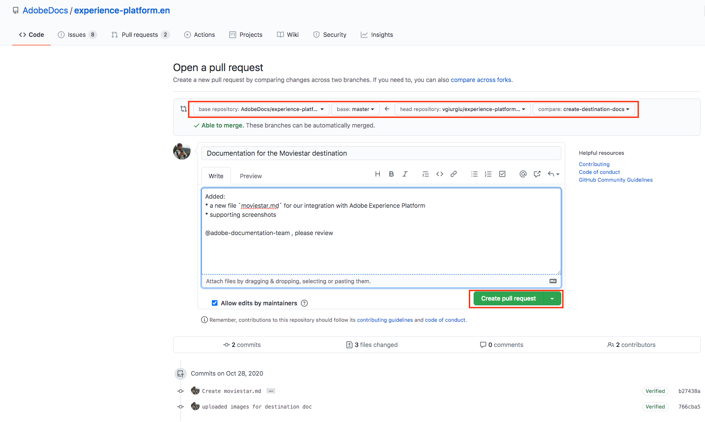

# 使用GitHub Web界面创建目标文档页面 {#github-interface}

以下说明将向您展示如何使用GitHub Web界面创作文档和提交拉取请求(PR)。 在完成此处指示的步骤之前，请确保已阅读[在Adobe Experience Platform目标中记录目标](./documentation-instructions.md)。

>[!TIP]
>
>另请参阅Adobe参与者指南中的支持文档：
>* [安装Git和Markdown创作工具](https://experienceleague.adobe.com/docs/contributor/contributor-guide/setup/install-tools.html?lang=en)
>* [在本地设置适用于文档的 Git 存储库](https://experienceleague.adobe.com/docs/contributor/contributor-guide/setup/local-repo.html?lang=en)
>* [针对主要更改的 GitHub 参与工作流](https://experienceleague.adobe.com/docs/contributor/contributor-guide/setup/full-workflow.html?lang=en).

## 设置GitHub创作环境 {#set-up-environment}

1. 在浏览器中，导航到`https://github.com/AdobeDocs/experience-platform.en`。
2. 要分支[存储库](https://experienceleague.adobe.com/docs/contributor/contributor-guide/setup/local-repo.html?lang=en#fork-the-repository)，请单击&#x200B;**分支**，如下图所示。

   

3. 在存储库的分支中，为项目创建新分支，如下所示。 将这个新分支用于您的工作。

   

4. 在分支存储库的GitHub文件夹结构中，导航到`experience-platform.en/help/destinations/catalog/[...]`，其中`[...]`是目标的所需类别。 例如，如果要将个性化目标添加到Experience Platform，请选择`personalization`类别。 选择&#x200B;**添加文件>创建新文件**。

   

5. 将目标命名为`YOURDESTINATION.md`，其中YOURDESTINATION是您在Adobe Experience Platform中的目标名称。 例如，如果您的公司名为Moviestar，则需要将文件命名为`moviestar.md`。

## 为您的目标创作文档页面 {#author-documentation}

1. 您将根据[文档自助模板](./self-service-template.md)创建目标页面的内容。 **** 下载模板并解压缩以提取文 `.md` 件模板。
2. 在在线Markdown编辑器中粘贴和编辑模板的内容以及目标的相关信息，如[dillinger.io](https://dillinger.io/)。 有关应填写哪些内容以及可以删除哪些段落的详细信息，请按照模板中的说明进行操作。
3. 将内容从Markdown编辑器复制到GitHub中的新文件中。
4. 对于您计划使用的任何屏幕截图或图像，请使用GitHub界面将文件上传到`experience-platform.en/help/destinations/assets/catalog/[...]`，其中`[...]`是目标的所需类别。 例如，如果要将个性化目标添加到Experience Platform，请选择`personalization`类别。 您需要从要创作的页面链接到图像。 请参阅[说明如何链接到图像](https://experienceleague.adobe.com/docs/contributor/contributor-guide/writing-essentials/linking.html?lang=en#link-to-images)。

   

5. 准备就绪后，将文件保存在分支中。

## 提交文档以供审核 {#submit-review}

1. 保存文件并上传所需的图像后，您可以打开拉取请求(PR)，以将工作分支合并到Adobe文档存储库的主控分支中。 确保已选择您处理的分支，并选择&#x200B;**拉取请求**。

1. 确保基分支和比较分支正确无误。 在PR中添加注释以描述您的更新，然后选择&#x200B;**创建拉取请求**。 此操作将打开一个PR，将分支的工作分支合并到Adobe存储库的主控分支中。

   >[!TIP]
   >
   >保持选中&#x200B;**允许维护者编辑**&#x200B;复选框，以便Adobe文档团队可以对PR进行编辑。

   

1. 此时会显示一则通知，提示您签署Adobe参与者许可协议(CLA)。 这是强制步骤。 签署CLA后，刷新PR页面并提交拉取请求。

1. 您可以通过检查`https://github.com/AdobeDocs/experience-platform.en`中的&#x200B;**拉取请求**&#x200B;选项卡，确认已提交拉取请求。

   

1. 谢谢！Adobe文档团队将在PR中联系，以防需要进行任何编辑，并告知您文档何时发布。

>[!TIP]
>
>要添加图像和文档链接，以及有关Markdown的任何其他问题，请阅读Adobe协作编写指南中的[Using Markdown](https://experienceleague.adobe.com/docs/contributor/contributor-guide/writing-essentials/markdown.html?lang=en)。
