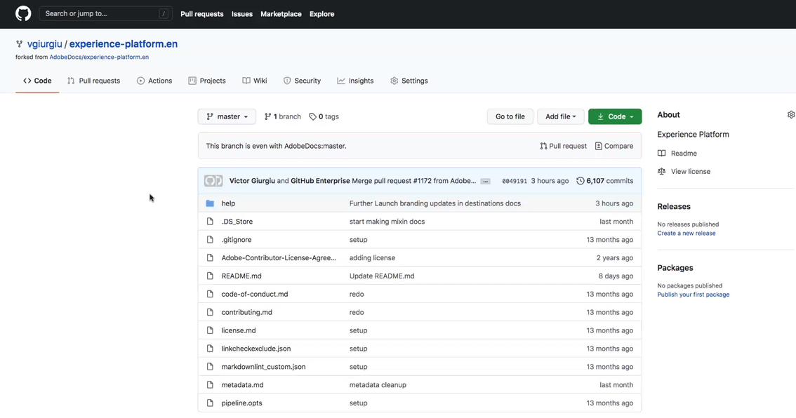

# 使用GitHub Web界面创建目标文档页面 {#github-interface}

以下说明向您展示了如何使用GitHub Web界面创作文档并提交拉取请求(PR)。 在执行以下指示的步骤之前，请确保已阅读 [在Adobe Experience Platform目标中记录您的目标](./documentation-instructions.md).

>[!TIP]
>
>另请参阅Adobe参与者指南中的支持文档：
>* [安装Git和Markdown创作工具](https://experienceleague.adobe.com/docs/contributor/contributor-guide/setup/install-tools.html)
>* [在本地设置适用于文档的 Git 存储库](https://experienceleague.adobe.com/docs/contributor/contributor-guide/setup/local-repo.html)
>* [针对主要更改的 GitHub 参与工作流](https://experienceleague.adobe.com/docs/contributor/contributor-guide/setup/full-workflow.html).

## 设置GitHub创作环境 {#set-up-environment}

1. 在浏览器中，导航到 `https://github.com/AdobeDocs/experience-platform.en`.
2. 至 [分支](https://experienceleague.adobe.com/docs/contributor/contributor-guide/setup/local-repo.html#fork-the-repository) 存储库中，单击 **分支** 如下所示。 这会在您自己的GitHub帐户中创建Experience Platform存储库的副本。

   

3. 在分支存储库中，为您的项目创建一个新分支，如下所示。 将此新分支用于您的工作。

   

4. 在分支存储库的GitHub文件夹结构中，导航到 `experience-platform.en/help/destinations/catalog/[...]`，其中 `[...]` 是您目标的所需类别。 例如，如果要向Experience Platform添加个性化目标，请选择 `personalization` 类别。 选择 **“添加文件”>“创建新文件”**.

   

5. 命名您的目标 `YOURDESTINATION.md`，其中YOURDESTINATION是您在Adobe Experience Platform中的目标的名称。 例如，如果公司名为Moviestar ，则应该命名您的文件 `moviestar.md`.

## 为您的目标创作文档页面 {#author-documentation}

1. 您将根据 [文档自助服务模板](./self-service-template.md). **[下载](../assets/docs-framework/yourdestination-template.zip)** 并解压缩该模板以提取 `.md` 文件模板。
2. 在联机Markdown编辑器中粘贴并编辑模板内容以及目标的相关信息，例如 [dillinger.io](https://dillinger.io/). 有关您应填写的内容以及哪些段落可以移除的详细信息，请按照模板中的说明进行操作。

   >[!TIP]
   >
   >您可以随时关闭浏览器窗口，稍后再重新打开。 您的工作会自动保存，并在您重新打开浏览器时等待您。
3. 将内容从Markdown编辑器复制到GitHub中的新文件中。
4. 对于您计划使用的任何屏幕截图或图像，请使用GitHub界面将文件上传到 `experience-platform.en/help/destinations/assets/catalog/[...]`，其中 `[...]` 是您目标的所需类别。 例如，如果要向Experience Platform添加个性化目标，请选择 `personalization` 类别。 您需要从正在创作的页面链接到图像。 请参阅 [说明如何链接到图像](https://experienceleague.adobe.com/docs/contributor/contributor-guide/writing-essentials/linking.html#link-to-images).

   

5. 准备就绪后，将文件保存在分支中。

## 提交文档以供审阅 {#submit-review}

>[!TIP]
>
>请注意，此处没有任何可破坏的内容。 按照本节中的说明，您只是建议更新文档。 您建议的更新将由Adobe Experience Platform文档团队批准或编辑。

1. 保存文件并上传所需图像后，您可以打开拉取Adobe(PR)，将工作分支合并到请求文档存储库的主分支中。 确保已选择您处理的分支，然后选择 **Contribute >打开提取请求**.

1. 确保基础分支和比较分支正确。 向PR添加注释，描述您的更新，然后选择 **创建拉取请求**. 这将打开一个PR，以将分支的工作分支合并到Adobe存储库的主分支。

   >[!TIP]
   >
   >离开 **允许维护者编辑** 复选框，以便Adobe文档团队可以对PR进行编辑。

   

1. 此时，将显示一条通知，提示您签署Adobe参与者许可协议(CLA)。 这是强制步骤。 签署CLA后，刷新PR页面并提交拉取请求。

1. 您可以通过检查 **拉取请求** tab in `https://github.com/AdobeDocs/experience-platform.en`.

   

1. 谢谢！如果需要编辑，Adobe文档团队将在PR中联系，并告知您文档何时发布。

>[!TIP]
>
>若要在文档中添加图像和链接，以及询问有关Markdown的任何其他问题，请阅读 [使用Markdown](https://experienceleague.adobe.com/docs/contributor/contributor-guide/writing-essentials/markdown.html) 在Adobe的协作编写指南中。
