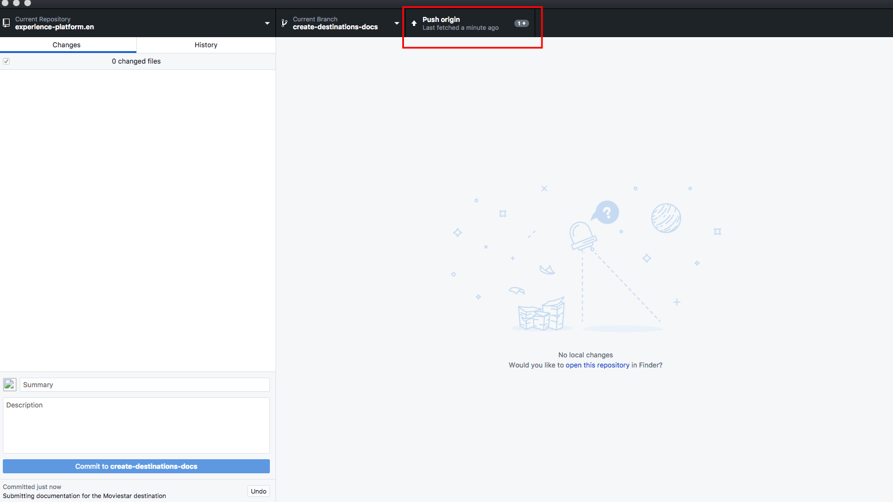

# 在本地环境中使用文本编辑器创建目标文档页面 {#local-authoring}

本页面上的说明向您展示了如何使用文本编辑器在本地环境中工作，以创作文档并提交拉取请求(PR)。 在完成此处指示的步骤之前，请确保已阅读[在Adobe Experience Platform目标中记录目标](./documentation-instructions.md)。

>[!TIP]
>
>另请参阅Adobe参与者指南中的支持文档：
>* [安装Git和Markdown创作工具](https://experienceleague.adobe.com/docs/contributor/contributor-guide/setup/install-tools.html?lang=en)
>* [在本地设置适用于文档的 Git 存储库](https://experienceleague.adobe.com/docs/contributor/contributor-guide/setup/local-repo.html?lang=en)
>* [针对主要更改的 GitHub 参与工作流](https://experienceleague.adobe.com/docs/contributor/contributor-guide/setup/full-workflow.html?lang=en).

## 连接到GitHub并设置本地创作环境 {#set-up-environment}

1. 在浏览器中，导航到`https://github.com/AdobeDocs/experience-platform.en`
2. 要分支[存储库](https://experienceleague.adobe.com/docs/contributor/contributor-guide/setup/local-repo.html?lang=en#fork-the-repository)，请单击&#x200B;**分支**，如屏幕截图所示。

   

3. 将存储库克隆到您的本地计算机. 选择&#x200B;**代码> HTTPS >使用GitHub Desktop**&#x200B;打开，如下所示。 确保已安装[GitHub Desktop](https://desktop.github.com/)。 有关进一步的参考，请阅读Adobe参与者指南中的[创建存储库的本地克隆](https://experienceleague.adobe.com/docs/contributor/contributor-guide/setup/local-repo.html?lang=en#create-a-local-clone-of-the-repository) 。

   

4. 在本地文件结构中，导航到`experience-platform.en/help/destinations/catalog/[...]`，其中`[...]`是目标的所需类别。 例如，如果要将个性化目标添加到Experience Platform，请选择`personalization`文件夹。

## 为您的目标创作文档页面 {#author-documentation}

1. 您的文档页面基于[自助服务目标模板](./self-service-template.md)。 下载[目标模板](assets/yourdestination-template.zip)。 解压缩文件，并将文件`yourdestination-template.md`解压缩到上面步骤4中提到的目录。  重命名文件`YOURDESTINATION.md`，其中YOURDESTINATION是您在Adobe Experience Platform中的目标名称。 例如，如果您的公司名为Moviestar，则需要将文件命名为`moviestar.md`。
2. 在选择的[文本编辑器](https://experienceleague.adobe.com/docs/contributor/contributor-guide/setup/install-tools.html?lang=en#understand-markdown-editors)中打开新文件。 Adobe建议您使用[Visual Studio代码](https://code.visualstudio.com/)并安装AdobeMarkdown创作扩展。 要安装该扩展，请打开Visual Studio代码，选择屏幕左侧的&#x200B;**[!DNL Extensions]**&#x200B;选项卡，然后搜索`adobe markdown authoring`。 选择扩展，然后单击&#x200B;**[!DNL Install]**。
   
3. 使用目标的相关信息编辑模板。 按照模板中的说明操作。
4. 有关您计划添加到文档中的任何屏幕截图或图像，请转到`GitHub/experience-platform.en/help/destinations/assets/catalog/[...]`，其中`[...]`是目标的所需类别。 例如，如果要将个性化目标添加到Experience Platform，请选择`personalization`文件夹。 为目标创建新文件夹，然后将图像保存在此处。 您必须从正在创作的页面中链接到这些页面。 请参阅[说明如何链接到图像](https://experienceleague.adobe.com/docs/contributor/contributor-guide/writing-essentials/linking.html?lang=en#link-to-images)。
5. 准备就绪后，保存正在处理的文件。

## 提交文档以供审核 {#submit-review}

1. 在GitHub Desktop中，为您的更新创建一个工作分支，然后选择&#x200B;**发布分支**&#x200B;以将该分支发布到GitHub。

1. 在GitHub Desktop中，[commit](https://docs.github.com/en/free-pro-team@latest/github/getting-started-with-github/github-glossary#commit)您的工作，如下所示。

   

1. 在GitHub Desktop中， [将](https://docs.github.com/en/free-pro-team@latest/github/getting-started-with-github/github-glossary#push)将您的工作推送到[remote](https://docs.github.com/en/free-pro-team@latest/github/getting-started-with-github/github-glossary#remote)分支，如下所示。

   

1. 在GitHub Web界面中，打开拉取请求(PR)，将您的工作分支合并到Adobe文档存储库的主控分支中。 确保已选择您处理的分支，并选择&#x200B;**拉取请求**。

   

1. 确保基分支和比较分支正确无误。 在PR中添加注释以描述您的更新，然后选择&#x200B;**创建拉取请求**。 此操作将打开一个PR，将分支的工作分支合并到Adobe存储库的主控分支中。
   >[!TIP]
   >
   >保持选中&#x200B;**允许维护者编辑**&#x200B;复选框，以便Adobe文档团队可以对PR进行编辑。

   

1. 此时会显示一则通知，提示您签署Adobe参与者许可协议(CLA)。 这是强制步骤。 签署CLA后，刷新PR页面并提交拉取请求。

1. 您可以通过检查`https://github.com/AdobeDocs/experience-platform.en`中的&#x200B;**拉取请求**&#x200B;选项卡，确认已提交拉取请求。

1. 谢谢！Adobe文档团队将在PR中联系，以防需要进行任何编辑，并告知您文档何时发布。

>[!TIP]
>
>要添加图像和文档链接，以及有关Markdown的任何其他问题，请阅读Adobe协作编写指南中的[Using Markdown](https://experienceleague.adobe.com/docs/contributor/contributor-guide/writing-essentials/markdown.html?lang=en)。
