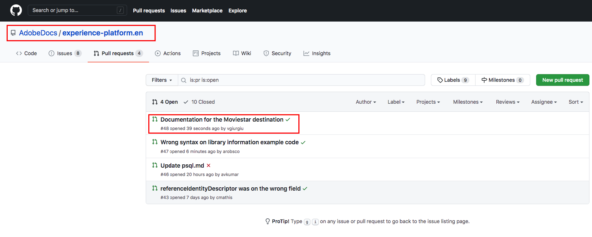

# 在本地环境中使用文本编辑器创建目标文档页面 {#local-authoring}

此页面上的说明向您展示了如何使用文本编辑器在本地环境中创作文档并提交拉取请求(PR)。 在执行以下指示的步骤之前，请确保阅读[在Adobe Experience Platform目标中记录您的目标](./documentation-instructions.md)。

>[!TIP]
>
>另请参阅Adobe参与者指南中的支持文档：
>
>* [安装Git和Markdown创作工具](https://experienceleague.adobe.com/docs/contributor/contributor-guide/setup/install-tools.html)
>* [在本地为文档设置Git存储库](https://experienceleague.adobe.com/docs/contributor/contributor-guide/setup/local-repo.html)
>* 针对主要更改的[GitHub贡献工作流](https://experienceleague.adobe.com/docs/contributor/contributor-guide/setup/full-workflow.html)。

## 连接到GitHub并设置本地创作环境 {#set-up-environment}

1. 在浏览器中，导航到`https://github.com/AdobeDocs/experience-platform.en`
2. 要[创建分支存储库](https://experienceleague.adobe.com/docs/contributor/contributor-guide/setup/local-repo.html#fork-the-repository)，请单击&#x200B;**创建分支存储库**，如下所示。 这会在您自己的GitHub帐户中创建Experience Platform存储库的副本。

   

3. 将存储库克隆到本地计算机。 选择&#x200B;**Code > HTTPS > Open with GitHub Desktop**，如下所示。 确保您已安装[GitHub Desktop](https://desktop.github.com/)。 有关详细信息，请参阅Adobe参与者指南中的[创建存储库的本地克隆](https://experienceleague.adobe.com/docs/contributor/contributor-guide/setup/local-repo.html#create-a-local-clone-of-the-repository)。

   

4. 在本地文件结构中，导航到`experience-platform.en/help/destinations/catalog/[...]`，其中`[...]`是您目标的所需类别。 例如，如果您要将个性化目标添加到Experience Platform，请选择`personalization`文件夹。

## 为您的目标创作文档页面 {#author-documentation}

1. 您的文档页面基于[自助服务目标模板](../docs-framework/self-service-template.md)。 下载[目标模板](../assets/docs-framework/yourdestination-template.zip)。 解压文件`yourdestination-template.md`并将其解压到上面步骤4中提到的目录。  重命名文件`YOURDESTINATION.md`，其中YOURDESTINATION是Adobe Experience Platform中目标的名称。 例如，如果贵公司名为Moviestar，则应将您的文件命名为`moviestar.md`。
2. 在所选的[文本编辑器](https://experienceleague.adobe.com/docs/contributor/contributor-guide/setup/install-tools.html#understand-markdown-editors)中打开新文件。 Adobe建议您使用[Visual Studio代码](https://code.visualstudio.com/)并安装Adobe Markdown创作扩展。 若要安装该扩展，请打开Visual Studio Code，选择屏幕左侧的&#x200B;**[!DNL Extensions]**&#x200B;选项卡，然后搜索`adobe markdown authoring`。 选择扩展并单击&#x200B;**[!DNL Install]**。
   
3. 编辑模板，其中包含与您的目标相关的信息。 按照模板中的说明操作。
4. 对于您计划添加到文档的任何屏幕截图或图像，请转到`GitHub/experience-platform.en/help/destinations/assets/catalog/[...]`，其中`[...]`是您目标的所需类别。 例如，如果您要将个性化目标添加到Experience Platform，请选择`personalization`文件夹。 为目标创建新文件夹，并将图像保存在此处。 您必须从正在创作的页面中链接到它们。 请参阅[有关如何链接到图像的说明](https://experienceleague.adobe.com/docs/contributor/contributor-guide/writing-essentials/linking.html#link-to-images)。
5. 准备就绪后，保存您正在处理的文件。

## 提交文档以供审阅 {#submit-review}

>[!TIP]
>
>请注意，此处没有任何可破坏的内容。 按照本节中的说明，您只是建议更新文档。 您建议的更新将由Adobe Experience Platform文档团队批准或编辑。

1. 在GitHub Desktop中，为您的更新创建一个工作分支，然后选择&#x200B;**发布分支**&#x200B;以将该分支发布到GitHub。

1. 在GitHub Desktop中，[提交](https://docs.github.com/en/free-pro-team@latest/github/getting-started-with-github/github-glossary#commit)您的工作，如下所示。

   

1. 在GitHub Desktop中，[将您的工作](https://docs.github.com/en/free-pro-team@latest/github/getting-started-with-github/github-glossary#push)推送到[远程](https://docs.github.com/en/free-pro-team@latest/github/getting-started-with-github/github-glossary#remote)分支，如下所示。

   

1. 在GitHub Web界面中，打开拉取请求(PR)，将您的工作分支合并到Adobe文档存储库的主分支。 确保已选择您处理的分支，然后选择&#x200B;**Contribute >打开拉取请求**。

   

1. 确保基础分支和比较分支正确。 向PR添加说明您更新的注释，然后选择&#x200B;**创建拉取请求**。 这将打开一个PR，以将分支的工作分支合并到Adobe存储库的主分支。

   >[!TIP]
   >
   >保持选中&#x200B;**允许维护者编辑**&#x200B;复选框，以便Adobe文档团队可以对PR进行编辑。

   

1. 此时，将显示一条通知，提示您签署Adobe参与者许可协议(CLA)。 这是强制步骤。 签署CLA后，刷新PR页面并提交拉取请求。

1. 您可以通过检查&#x200B;**中的**&#x200B;拉取请求`https://github.com/AdobeDocs/experience-platform.en`选项卡来确认拉取请求已提交。

1. 谢谢！如果需要编辑，Adobe文档团队将在PR中联系，并告知您文档何时发布。

>[!TIP]
>
>若要在文档中添加图像和链接，以及有关Markdown的任何其他问题，请阅读Adobe协作编写指南中的[使用Markdown](https://experienceleague.adobe.com/docs/contributor/contributor-guide/writing-essentials/markdown.html)。
