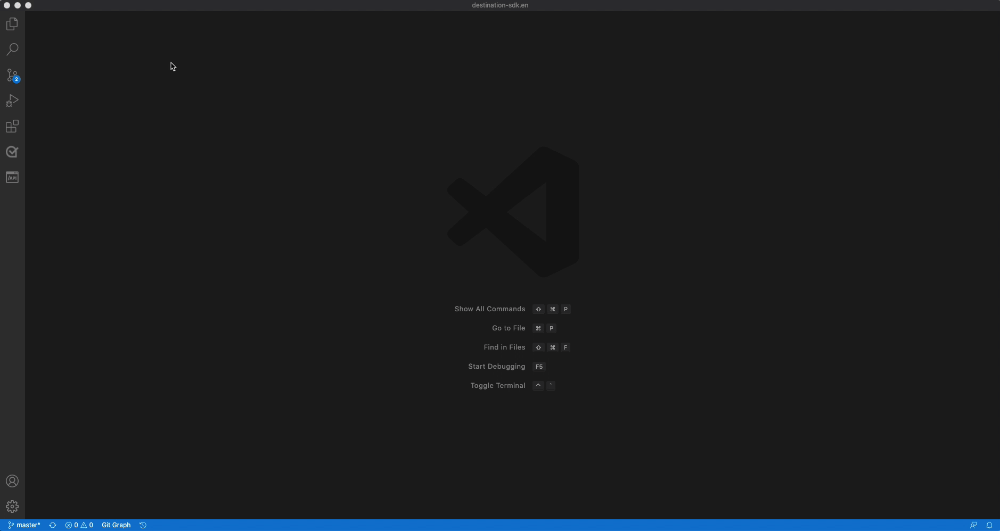

# 在本地环境中使用文本编辑器创建目标文档页面 {#local-authoring}

此页面上的说明向您展示了如何使用文本编辑器在本地环境中工作以创作文档并提交拉取请求(PR)。 在执行以下指示的步骤之前，请确保已阅读 [在Adobe Experience Platform目标中记录您的目标](./documentation-instructions.md).

>[!TIP]
>
>另请参阅Adobe参与者指南中的支持文档：
>* [安装Git和Markdown创作工具](https://experienceleague.adobe.com/docs/contributor/contributor-guide/setup/install-tools.html?lang=en)
>* [在本地设置适用于文档的 Git 存储库](https://experienceleague.adobe.com/docs/contributor/contributor-guide/setup/local-repo.html?lang=en)
>* [针对主要更改的 GitHub 参与工作流](https://experienceleague.adobe.com/docs/contributor/contributor-guide/setup/full-workflow.html?lang=en).

## 连接到GitHub并设置您的本地创作环境 {#set-up-environment}

1. 在浏览器中，导航到 `https://github.com/AdobeDocs/experience-platform.en`
2. 至 [分支](https://experienceleague.adobe.com/docs/contributor/contributor-guide/setup/local-repo.html?lang=en#fork-the-repository) 存储库，单击 **分支** 如下所示。 这会在您自己的GitHub帐户中创建Experience Platform存储库的副本。

   

3. 将存储库克隆到您的本地计算机. 选择 **“代码”>“HTTPS”>“使用GitHub Desktop打开”**，如下所示。 确保您拥有 [GitHub Desktop](https://desktop.github.com/) 已安装。 如需进一步参考，请阅读 [创建存储库的本地克隆](https://experienceleague.adobe.com/docs/contributor/contributor-guide/setup/local-repo.html?lang=en#create-a-local-clone-of-the-repository) 在Adobe参与者指南中。

   

4. 在本地文件结构中，导航到 `experience-platform.en/help/destinations/catalog/[...]`，其中 `[...]` 是您目标的所需类别。 例如，如果要向Experience Platform添加个性化目标，请选择 `personalization` 文件夹。

## 为您的目标创作文档页面 {#author-documentation}

1. 您的文档页面基于 [自助服务目标模板](../docs-framework/self-service-template.md). 下载 [目标模板](../assets/docs-framework/yourdestination-template.zip). 解压缩并解压缩文件 `yourdestination-template.md` 到上述步骤4中所述的目录。  重命名文件 `YOURDESTINATION.md`，其中YOURDESTINATION是您在Adobe Experience Platform中的目标的名称。 例如，如果贵公司名为Moviestar，则应将您的文件命名为 `moviestar.md`.
2. 在下列位置打开新文件： [选择的文本编辑器](https://experienceleague.adobe.com/docs/contributor/contributor-guide/setup/install-tools.html?lang=en#understand-markdown-editors). Adobe建议您使用 [Visual Studio Code](https://code.visualstudio.com/) 并安装AdobeMarkdown创作扩展。 要安装该扩展，请打开Visual Studio Code，选择 **[!DNL Extensions]** 选项卡，并搜索 `adobe markdown authoring`. 选择扩展并单击 **[!DNL Install]**.
   
3. 使用与目标相关的信息编辑模板。 按照模板中的说明操作。
4. 有关您计划添加到文档的任何屏幕截图或图像，请转到 `GitHub/experience-platform.en/help/destinations/assets/catalog/[...]`，其中 `[...]` 是您目标的所需类别。 例如，如果要向Experience Platform添加个性化目标，请选择 `personalization` 文件夹。 为目标创建新文件夹并在此处保存图像。 您必须从正在创作的页面链接到它们。 参见 [说明如何链接到图像](https://experienceleague.adobe.com/docs/contributor/contributor-guide/writing-essentials/linking.html?lang=en#link-to-images).
5. 准备就绪后，保存正在处理的文件。

## 提交您的文档以供审阅 {#submit-review}

>[!TIP]
>
>请注意，此处没有任何可破坏的内容。 按照本节中的说明，您只是建议更新文档。 您建议的更新将由Adobe Experience Platform文档团队批准或编辑。

1. 在GitHub Desktop中，为您的更新创建一个工作分支，然后选择 **发布分支** 以将分支发布到GitHub。

1. 在GitHub桌面版中， [提交](https://docs.github.com/en/free-pro-team@latest/github/getting-started-with-github/github-glossary#commit) 您的工作，如下所示。

   

1. 在GitHub桌面版中， [推送](https://docs.github.com/en/free-pro-team@latest/github/getting-started-with-github/github-glossary#push) 您的工作到 [远程](https://docs.github.com/en/free-pro-team@latest/github/getting-started-with-github/github-glossary#remote) 分支，如下所示。

   

1. 在GitHub Web界面中，打开拉取请求(PR)，将您的工作分支合并到Adobe文档存储库的主控分支中。 确保已选中您处理的分支并选择 **Contribute >打开拉取请求**.

   

1. 确保基础分支和比较分支正确。 向PR添加注释，描述您的更新，然后选择 **创建拉取请求**. 这将打开一个PR，以将分支的工作分支合并到Adobe存储库的主控分支中。
   >[!TIP]
   >
   >保留 **允许维护者编辑** 复选框，以便Adobe文档团队可以对PR进行编辑。

   

1. 此时，将显示一条通知，提示您签署Adobe参与者许可协议(CLA)。 这是强制步骤。 签署CLA后，刷新PR页面并提交拉取请求。

1. 您可以通过检查 **拉取请求** 按Tab键进入 `https://github.com/AdobeDocs/experience-platform.en`.

1. 谢谢！如果需要编辑，Adobe文档团队将联系PR，并告知您何时发布文档。

>[!TIP]
>
>若要向文档添加图像和链接，以及询问有关Markdown的任何其他问题，请阅读 [使用Markdown](https://experienceleague.adobe.com/docs/contributor/contributor-guide/writing-essentials/markdown.html?lang=en) 在Adobe的协作编写指南中。
