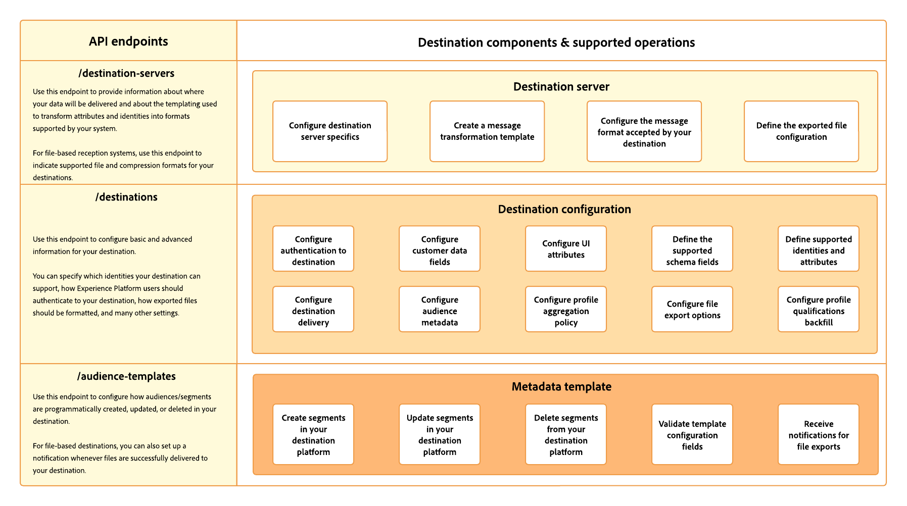

# Destination SDK中的配置选项

Adobe Experience Platform中的目标服务使用多个组件的配置端点来构建目标功能。

通过这些组件，Experience Platform可以连接到目标平台、发送自定义消息、导出自定义文件，以及在整个数字生态系统中激活用户档案数据。

下图显示了可通过Destination SDK配置以构建您自己目标的组件的高级概述。 这些组件在下文中作了进一步描述。

## 服务器配置 {#server-configuration}

目标服务器配置将有关服务器规范的信息与Adobe用于将负载交付到目标的模板联系起来。

例如，您可以在此处指定Experience Platform需要连接到的API端点，以及平台将发起的API调用的标头和格式。

对于基于文件的目标，此配置还包含目标支持的文件格式和压缩格式。 您可以通过 [目标服务器端点](../authoring-api/destination-server/create-destination-server.md).

* [服务器规范](destination-server/server-specs.md):配置模板，其中包含有关数据被发送到的存储位置或HTTP端点的信息。
* [模板规范](destination-server/templating-specs.md):在此模板中，您可以定义如何向端点构建HTTP API请求，包括如何在XDM架构和平台支持的格式之间转换配置文件属性字段。 将此信息与 [消息格式](destination-server/message-format.md) 文档。
* [消息格式](destination-server/message-format.md):本节详细介绍了支持的模板语言、消息格式，以及Adobe设置与平台集成所需的信息。 将此信息与 [模板规范](destination-server/templating-specs.md) 文档。
* [文件规范](destination-server/file-formatting.md):配置模板，其中包含批处理目标的文件格式和压缩选项。

## 目标配置 {#destination-configuration}

此配置端点包含有关目标的基本和高级信息。 例如，您可以在此处为Adobe Experience Platform用户界面中的目标卡指定目标可支持的身份类型、所需的导出文件格式（用于基于文件的目标）以及各种UI属性。

有关每个目标配置组件的详细信息，请参阅以下文档。 您可以通过 [目标端点](../authoring-api/destination-configuration/create-destination-configuration.md).

* [客户身份验证配置](destination-configuration/customer-authentication.md):选择Experience Platform连接到目标时应使用的身份验证机制。 此配置将生成 [配置新目标](../../ui/connect-destination.md) Experience Platform用户界面中的页面，用户可将Experience Platform连接到他们与您的目标拥有的帐户。
* [OAuth2身份验证](destination-configuration/oauth2-authentication.md):了解 [!DNL OAuth2] Destination SDK支持的身份验证流，并获取有关设置的说明 [!DNL OAuth2] 目标的身份验证……
* [客户数据字段](destination-configuration/customer-data-fields.md):了解如何在Experience PlatformUI中创建输入字段，以便用户指定与如何连接数据并将其导出到目标相关的各种信息。
* [UI属性](destination-configuration/ui-attributes.md):了解如何为通过Destination SDK构建的目标配置UI属性，例如文档链接、目标卡类别、目标连接类型和频率。
* [架构配置](destination-configuration/schema-configuration.md):了解如何定义目标的目标架构，用户可将配置文件属性和身份映射到该架构。
* [身份命名空间配置](destination-configuration/identity-namespace-configuration.md):了解如何配置目标支持的身份。 此配置在 [映射步骤](../../ui/activate-segment-streaming-destinations.md#mapping) Experience Platform用户界面的中，用户可将身份和属性从其XDM架构映射到目标中的架构。
* [目标投放](destination-configuration/destination-delivery.md):了解如何配置导出数据的确切去向，以及在数据要登陆的位置中使用的身份验证规则。
* [受众元数据配置](destination-configuration/audience-metadata-configuration.md):了解区段元数据（如区段名称或ID）应如何在Experience Platform与目标之间共享。
* [聚合策略](destination-configuration/aggregation-policy.md):了解如何设置聚合策略以确定对目标的HTTP请求应如何分组和批量处理。
* [批量配置](destination-configuration/batch-configuration.md):在Experience Platform用户界面中设置各种可供用户在连接到目标时使用的文件命名和导出计划设置。
* [历史用户档案资格](destination-configuration/historical-profile-qualifications.md):了解通过Destination SDK构建的目标所支持的历史配置文件资格条件。

## 受众元数据配置 {#audience-metadata-configuration}

此组件允许您配置受众/区段在目标中以编程方式创建、更新或删除的方式。 对于基于文件的目标，它允许您在文件成功发送到目标时设置通知。 您可以通过 [audience-templates端点](../metadata-api/create-audience-template.md).

## 后续步骤 {#next-steps}

通过阅读本文，您现在可以大致了解Destination SDK提供的功能以及要阅读哪些页面以了解有关特定配置的更多信息。 接下来，您可以阅读指南，其中包含 [配置流](../guides/configure-destination-instructions.md) 或 [基于文件的目标](../guides/configure-file-based-destination-instructions.md) 使用Destination SDK。
