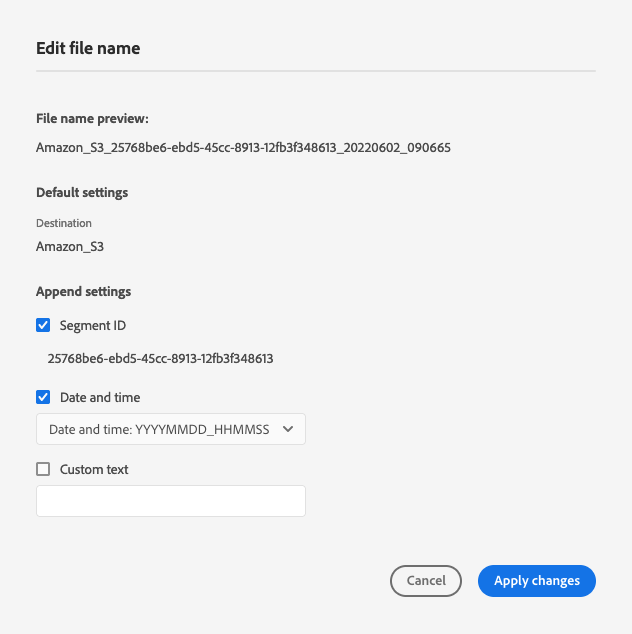

# 批量配置 {#batch-configuration}

使用Destination SDK中的批量配置选项，允许用户自定义导出的文件名，并根据其首选项配置导出计划。

通过Destination SDK创建基于文件的目标时，您可以配置默认的文件命名和导出计划，也可以为用户提供从平台UI配置这些设置的选项。 例如，您可以配置以下行为：

* 在文件名中包含特定信息，如区段ID、目标ID或自定义信息。
* 允许用户从平台UI自定义文件命名。
* 将文件导出配置为以设置的时间间隔进行。
* 定义用户在Platform UI中可以看到的文件命名和导出计划自定义选项。

批量配置设置是基于文件的目标目标配置的一部分。

要了解此组件在与Destination SDK创建的集成中的位置，请参阅 [配置选项](../configuration-options.md) 文档，或参阅有关如何 [使用Destination SDK配置基于文件的目标](../../guides/configure-file-based-destination-instructions.md#create-server-file-configuration).

您可以通过配置文件命名并导出计划设置 `/authoring/destinations` 端点。 有关详细的API调用示例，请参阅以下API参考页面，您可以在其中配置此页面中显示的组件。

* [创建目标配置](../../authoring-api/destination-configuration/create-destination-configuration.md)
* [更新目标配置](../../authoring-api/destination-configuration/update-destination-configuration.md)

本文介绍了可用于目标的所有受支持的批量配置选项，并显示客户将在Platform UI中看到的内容。

>[!IMPORTANT]
>
>Destination SDK支持的所有参数名称和值均为 **区分大小写**. 为避免出现区分大小写错误，请完全按照文档中的说明使用参数名称和值。

## 支持的集成类型 {#supported-integration-types}

有关哪些类型的集成支持本页所述功能的详细信息，请参阅下表。

| 集成类型 | 支持功能 |
|---|---|
| 实时（流）集成 | 否 |
| 基于文件的（批处理）集成 | 是 |

## 支持的参数 {#supported-parameters}

您在此处设置的值会在 [计划区段导出](../../../ui/activate-batch-profile-destinations.md#scheduling) 基于文件的目标激活工作流的步骤。

```json
"batchConfig":{
   "allowMandatoryFieldSelection":true,
   "allowDedupeKeyFieldSelection":true,
   "defaultExportMode":"DAILY_FULL_EXPORT",
   "allowedExportMode":[
      "DAILY_FULL_EXPORT",
      "FIRST_FULL_THEN_INCREMENTAL"
   ],
   "allowedScheduleFrequency":[
      "DAILY",
      "EVERY_3_HOURS",
      "EVERY_6_HOURS",
      "EVERY_8_HOURS",
      "EVERY_12_HOURS",
      "ONCE"
   ],
   "defaultFrequency":"DAILY",
   "defaultStartTime":"00:00",
   "filenameConfig":{
         "allowedFilenameAppendOptions":[
            "SEGMENT_NAME",
            "DESTINATION_INSTANCE_ID",
            "DESTINATION_INSTANCE_NAME",
            "ORGANIZATION_NAME",
            "SANDBOX_NAME",
            "DATETIME",
            "CUSTOM_TEXT"
         ],
         "defaultFilenameAppendOptions":[
            "DATETIME"
         ],
         "defaultFilename":"%DESTINATION%_%SEGMENT_ID%"
      },
   }
```

| 参数 | 类型 | 描述 |
|---------|----------|------|
| `allowMandatoryFieldSelection` | 布尔值 | 设置为 `true` 以允许客户指定哪些配置文件属性是必需的。 默认值为 `false`。请参阅 [必需属性](../../../ui/activate-batch-profile-destinations.md#mandatory-attributes) 以了解更多信息。 |
| `allowDedupeKeyFieldSelection` | 布尔值 | 设置为 `true` 允许客户指定重复数据删除键。 默认值为 `false`。请参阅 [重复数据删除键](../../../ui/activate-batch-profile-destinations.md#deduplication-keys) 以了解更多信息。 |
| `defaultExportMode` | 枚举 | 定义默认的文件导出模式。 支持的值：<ul><li>`DAILY_FULL_EXPORT`</li><li>`FIRST_FULL_THEN_INCREMENTAL`</li></ul> 默认值为 `DAILY_FULL_EXPORT`。请参阅 [批量激活文档](../../../ui/activate-batch-profile-destinations.md#scheduling) 有关文件导出计划的详细信息。 |
| `allowedExportModes` | 列表 | 定义客户可用的文件导出模式。 支持的值：<ul><li>`DAILY_FULL_EXPORT`</li><li>`FIRST_FULL_THEN_INCREMENTAL`</li></ul> |
| `allowedScheduleFrequency` | 列表 | 定义客户可用的文件导出频率。 支持的值：<ul><li>`ONCE`</li><li>`EVERY_3_HOURS`</li><li>`EVERY_6_HOURS`</li><li>`EVERY_8_HOURS`</li><li>`EVERY_12_HOURS`</li><li>`DAILY`</li></ul> |
| `defaultFrequency` | 枚举 | 定义默认文件导出频率。支持的值：<ul><li>`ONCE`</li><li>`EVERY_3_HOURS`</li><li>`EVERY_6_HOURS`</li><li>`EVERY_8_HOURS`</li><li>`EVERY_12_HOURS`</li><li>`DAILY`</li></ul> 默认值为 `DAILY`。 |
| `defaultStartTime` | 字符串 | 定义文件导出的默认开始时间。 使用24小时文件格式。 默认值为“00:00”。 |
| `filenameConfig.allowedFilenameAppendOptions` | 字符串 | *必需*. 可供用户选择的可用文件名宏列表。 这可确定要将哪些项目附加到导出的文件名（区段ID、组织名称、导出日期和时间等）中。 设置 `defaultFilename`，请确保避免复制宏。 <br><br>支持的值： <ul><li>`DESTINATION`</li><li>`SEGMENT_ID`</li><li>`SEGMENT_NAME`</li><li>`DESTINATION_INSTANCE_ID`</li><li>`DESTINATION_INSTANCE_NAME`</li><li>`ORGANIZATION_NAME`</li><li>`SANDBOX_NAME`</li><li>`DATETIME`</li><li>`CUSTOM_TEXT`</li></ul>无论您定义宏的顺序如何，Experience PlatformUI都将始终按此处显示的顺序显示宏。 <br><br> 如果 `defaultFilename` 为空， `allowedFilenameAppendOptions` 列表必须至少包含一个宏。 |
| `filenameConfig.defaultFilenameAppendOptions` | 字符串 | *必需*. 用户可取消选中的预选默认文件名宏。<br><br> 此列表中的宏是 `allowedFilenameAppendOptions`. |
| `filenameConfig.defaultFilename` | 字符串 | *可选*. 为导出的文件定义默认的文件名宏。 用户无法覆盖这些内容。 <br><br>定义的任何宏 `allowedFilenameAppendOptions` 将在 `defaultFilename` 宏。 <br><br>如果 `defaultFilename` 为空，则必须在 `allowedFilenameAppendOptions`. |

{style="table-layout:auto"}

## 文件名配置 {#file-name-configuration}

使用文件名配置宏来定义导出的文件名应包含的内容。 下表中的宏描述了在 [文件名配置](../../../ui/activate-batch-profile-destinations.md#file-names) 屏幕。

>[!TIP]
> 
>作为最佳实践，您应始终包含 `SEGMENT_ID` 宏。 区段ID是唯一的，因此将它们包含在文件名中是确保文件名也唯一的最佳方法。

| 宏 | UI标签 | 描述 | 示例 |
|---|---|---|---|
| `DESTINATION` | [!UICONTROL 目标] | UI中的目标名称。 | Amazon S3 |
| `SEGMENT_ID` | [!UICONTROL 区段ID] | 平台生成的唯一区段ID | ce5c5482-2813-4a80-99bc-57113f6acde2 |
| `SEGMENT_NAME` | [!UICONTROL 区段名称] | 用户定义的区段名称 | VIP订阅者 |
| `DESTINATION_INSTANCE_ID` | [!UICONTROL 目标ID] | 目标实例的唯一、平台生成的ID | 7b891e5f-025a-4f0d-9e73-1919e71da3b0 |
| `DESTINATION_INSTANCE_NAME` | [!UICONTROL 目标名称] | 目标实例的用户定义的名称。 | 我2022年的广告去向 |
| `ORGANIZATION_NAME` | [!UICONTROL 组织名称] | Adobe Experience Platform中的客户组织名称。 | 我的组织名称 |
| `SANDBOX_NAME` | [!UICONTROL 沙盒名称] | 客户使用的沙盒的名称。 | prod |
| `DATETIME` / `TIMESTAMP` | [!UICONTROL 日期和时间] | `DATETIME` 和 `TIMESTAMP` 这两种格式都定义了文件的生成时间，但格式不同。 <br><br><ul><li>`DATETIME` 使用以下格式：YYYYMMDD_HHMMSS。</li><li>`TIMESTAMP` 使用10位Unix格式。 </li></ul> `DATETIME` 和 `TIMESTAMP` 互斥，且不能同时使用。 | <ul><li>`DATETIME`: 20220509_210543</li><li>`TIMESTAMP`: 1652131584</li></ul> |
| `CUSTOM_TEXT` | [!UICONTROL 自定义文本] | 要包含在文件名中的用户定义的自定义文本。 不能在中使用 `defaultFilename`. | My_Custom_Text |
| `TIMESTAMP` | [!UICONTROL 日期和时间] | 生成文件时的10位时间戳（Unix格式）。 | 1652131584 |

{style="table-layout:auto"}

### 文件名配置示例

以下配置示例显示了API调用中使用的配置与UI中显示的选项之间的对应关系。

```json
"filenameConfig":{
   "allowedFilenameAppendOptions":[
      "CUSTOM_TEXT",
      "SEGMENT_ID",
      "DATETIME"
   ],
   "defaultFilenameAppendOptions":[
      "SEGMENT_ID",
      "DATETIME"
   ],
   "defaultFilename": "%DESTINATION%"
}
```



## 后续步骤 {#next-steps}

阅读本文后，您应该对如何为基于文件的目标配置文件命名和导出计划有了更好的了解。

要了解有关其他目标组件的更多信息，请参阅以下文章：

* [客户身份验证配置](customer-authentication.md)
* [OAuth2身份验证](oauth2-authentication.md)
* [客户数据字段](customer-data-fields.md)
* [UI属性](ui-attributes.md)
* [架构配置](schema-configuration.md)
* [身份命名空间配置](identity-namespace-configuration.md)
* [支持的映射配置](supported-mapping-configurations.md)
* [目标投放](destination-delivery.md)
* [受众元数据配置](audience-metadata-configuration.md)
* [聚合策略](aggregation-policy.md)
* [历史用户档案资格](historical-profile-qualifications.md)