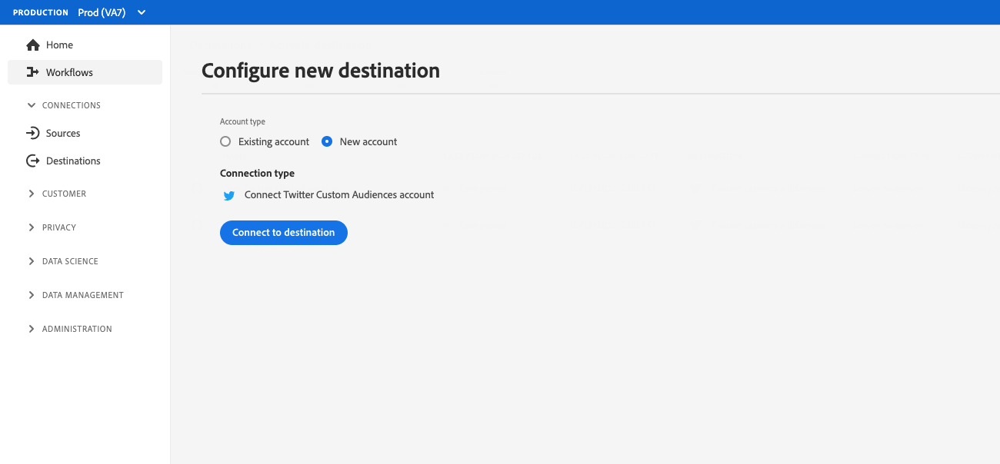
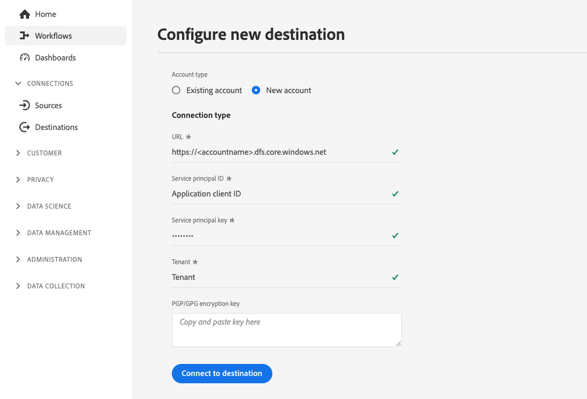

# 客户身份验证配置

Experience Platform为合作伙伴和客户提供的身份验证协议提供了极大的灵活性。 您可以将目标配置为支持任何行业标准身份验证方法，如[!DNL OAuth2]、持有者令牌身份验证、密码身份验证等。

本页说明如何使用首选身份验证方法设置目标。 根据您在创建目标时使用的身份验证配置，客户在Experience Platform UI中连接到目标时将看到不同类型的身份验证页面。

要了解此组件在何处适合使用Destination SDK创建的集成，请参阅[配置选项](../configuration-options.md)文档中的关系图或查看以下目标配置概述页面：

* [使用Destination SDK配置流目标](../../guides/configure-destination-instructions.md#create-destination-configuration)
* [使用Destination SDK配置基于文件的目标](../../guides/configure-file-based-destination-instructions.md#create-destination-configuration)

客户必须先按照[目标连接](../../../ui/connect-destination.md)教程中描述的步骤，在Experience Platform与您的目标之间创建新连接，然后才能将数据从Experience Platform导出到您的目标。

当[通过Destination SDK创建目标](../../authoring-api/destination-configuration/create-destination-configuration.md)时，`customerAuthenticationConfigurations`部分定义客户在[身份验证屏幕](../../../ui/connect-destination.md#authenticate)中看到的内容。 根据目标身份验证类型，客户必须提供各种身份验证详细信息，例如：

* 对于使用[基本身份验证](#basic)的目标，用户必须直接在Experience Platform UI身份验证页面中提供用户名和密码。
* 对于使用[持有者身份验证](#bearer)的目标，用户必须提供持有者令牌。
* 对于使用[OAuth2授权](#oauth2)的目标，用户将被重定向到您目标的登录页面，他们可以使用凭据登录。
* 对于[Amazon S3](#s3)目标，用户必须提供其[!DNL Amazon S3]访问密钥和密钥。
* 对于[Azure Blob](#blob)目标，用户必须提供其[!DNL Azure Blob]连接字符串。

您可以通过`/authoring/destinations`端点配置客户身份验证详细信息。 有关详细的API调用示例，请参阅以下API参考页面，您可以在其中配置此页面中显示的组件。

* [创建目标配置](../../authoring-api/destination-configuration/create-destination-configuration.md)
* [更新目标配置](../../authoring-api/destination-configuration/update-destination-configuration.md)

本文介绍了可用于您的目标的所有受支持的客户身份验证配置，并显示了客户将根据您为目标设置的身份验证方法在Experience Platform UI中看到的内容。

>[!IMPORTANT]
>
>客户身份验证配置不需要配置任何参数。 当[创建](../../authoring-api/destination-configuration/create-destination-configuration.md)或[更新](../../authoring-api/destination-configuration/update-destination-configuration.md)目标配置时，您可以复制并粘贴在API调用中此页面中显示的代码片段，并且您的用户将在Experience Platform UI中看到相应的身份验证屏幕。

>[!IMPORTANT]
>
>Destination SDK支持的所有参数名称和值均区分大小写&#x200B;****。 为避免出现区分大小写错误，请完全按照文档中的说明使用参数名称和值。

## 支持的集成类型 {#supported-integration-types}

有关哪些类型的集成支持此页面上描述的功能，请参阅下表。

| 集成类型 | 支持功能 |
|---|---|
| 实时（流）集成 | 是 |
| 基于文件（批处理）的集成 | 是 |

## 身份验证规则配置 {#authentication-rule}

使用本页中介绍的任何客户身份验证配置时，请始终将[目标投放](destination-delivery.md)中的`authenticationRule`参数设置为`"CUSTOMER_AUTHENTICATION"`，如下所示。

```json {line-numbers="true" highlight="4"
{
   "destinationDelivery":[
      {
         "authenticationRule":"CUSTOMER_AUTHENTICATION",
         "destinationServerId":"{{destinationServerId}}"
      }
   ]
}
```

## 基本身份验证 {#basic}

Experience Platform中的实时（流）集成支持基本身份验证。

配置基本身份验证类型时，用户需要输入用户名和密码以连接到您的目标。

使用基本身份验证的

要为您的目标设置基本身份验证，请通过`/destinations`端点配置`customerAuthenticationConfigurations`部分，如下所示：

```json
"customerAuthenticationConfigurations":[
   {
      "authType":"BASIC"
   }
]
```

## 持有者身份验证 {#bearer}

配置持有者身份验证类型时，用户需要输入他们从您的目标获得的持有者令牌。

使用持有者身份验证的

要为您的目标设置持有者类型身份验证，请通过`/destinations`端点配置`customerAuthenticationConfigurations`部分，如下所示：

```json
"customerAuthenticationConfigurations":[
   {
      "authType":"BEARER"
   }
]
```

## OAuth 2身份验证 {#oauth2}

用户选择&#x200B;**[!UICONTROL 连接到目标]**&#x200B;以触发到您的目标的OAuth 2身份验证流程，如下面的Twitter自定义受众目标示例所示。 有关为目标端点配置OAuth 2身份验证的详细信息，请阅读专用的[Destination SDK OAuth 2身份验证页面](oauth2-authorization.md)。

使用OAuth 2身份验证的

要为您的目标设置[!DNL OAuth2]身份验证，请通过`/destinations`端点配置`customerAuthenticationConfigurations`部分，如下所示：

```json
"customerAuthenticationConfigurations":[
   {
      "authType":"OAUTH2"
   }
]
```

## Amazon S3身份验证 {#s3}

Experience Platform中基于文件的目标支持[!DNL Amazon S3]身份验证。

配置Amazon S3身份验证类型时，要求用户输入其S3凭据。

使用S3身份验证的

要为您的目标设置[!DNL Amazon S3]身份验证，请通过`/destinations`端点配置`customerAuthenticationConfigurations`部分，如下所示：

```json
"customerAuthenticationConfigurations":[
   {
      "authType":"S3"
   }
]
```

## Azure Blob身份验证  {#blob}

Experience Platform中基于文件的目标支持[!DNL Azure Blob Storage]身份验证。

配置Azure Blob身份验证类型时，需要用户输入连接字符串。

使用Blob身份验证的

要为您的目标设置[!DNL Azure Blob]身份验证，请在`/destinations`端点中配置`customerAuthenticationConfigurations`参数，如下所示：

```json
"customerAuthenticationConfigurations":[
   {
      "authType":"AZURE_CONNECTION_STRING"
   }
]
```

## [!DNL Azure Data Lake Storage]身份验证 {#adls}

Experience Platform中基于文件的目标支持[!DNL Azure Data Lake Storage]身份验证。

配置[!DNL Azure Data Lake Storage]身份验证类型时，需要用户输入Azure服务主体凭据及其租户信息。

使用[!DNL Azure Data Lake Storage]身份验证的

要为您的目标设置[!DNL Azure Data Lake Storage] (ADLS)身份验证，请在`/destinations`端点中配置`customerAuthenticationConfigurations`参数，如下所示：

```json
"customerAuthenticationConfigurations":[
   {
      "authType":"AZURE_SERVICE_PRINCIPAL"
   }
]
```

## 具有密码身份验证的SFTP

Experience Platform中基于文件的目标支持使用密码的[!DNL SFTP]身份验证。

在配置具有密码身份验证类型的SFTP时，用户需要输入SFTP用户名和密码，以及SFTP域和端口（默认端口为22）。


要为您的目标设置带有密码的SFTP身份验证，请在`/destinations`端点中配置`customerAuthenticationConfigurations`参数，如下所示：

```json
"customerAuthenticationConfigurations":[
   {
      "authType":"SFTP_WITH_PASSWORD"
   }
]
```

## 具有SSH密钥身份验证的SFTP

Experience Platform中基于文件的目标支持使用[!DNL SSH]密钥的[!DNL SFTP]身份验证。

在配置具有SSH密钥身份验证类型的SFTP时，用户需要输入SFTP用户名和SSH密钥，以及SFTP域和端口（默认端口为22）。

使用SSH密钥身份验证的SFTP呈现

要为您的目标设置使用SSH密钥的SFTP身份验证，请在`/destinations`端点中配置`customerAuthenticationConfigurations`参数，如下所示：

```json
"customerAuthenticationConfigurations":[
   {
      "authType":"SFTP_WITH_SSH_KEY"
   }
]
```

## [!DNL Google Cloud Storage]身份验证 {#gcs}

Experience Platform中基于文件的目标支持[!DNL Google Cloud Storage]身份验证。

配置[!DNL Google Cloud Storage]身份验证类型时，需要用户输入其[!DNL Google Cloud Storage] [!UICONTROL 访问密钥ID]和[!UICONTROL 访问密钥]。

使用Google Cloud Storage身份验证的

要为您的目标设置[!DNL Google Cloud Storage]身份验证，请在`/destinations`端点中配置`customerAuthenticationConfigurations`参数，如下所示：

```json
"customerAuthenticationConfigurations":[
   {
      "authType":"GOOGLE_CLOUD_STORAGE"
   }
]
```

## 后续步骤 {#next-steps}

阅读本文后，您应该更好地了解如何为目标平台配置用户身份验证。

要了解有关其他目标组件的更多信息，请参阅以下文章：

* [OAuth2授权](oauth2-authorization.md)
* [客户数据字段](customer-data-fields.md)
* [UI属性](ui-attributes.md)
* [架构配置](schema-configuration.md)
* [身份命名空间配置](identity-namespace-configuration.md)
* [支持的映射配置](supported-mapping-configurations.md)
* [目标投放](destination-delivery.md)
* [受众元数据配置](audience-metadata-configuration.md)
* [聚合策略](aggregation-policy.md)
* [批次配置](batch-configuration.md)
* [历史配置文件资格](historical-profile-qualifications.md)
