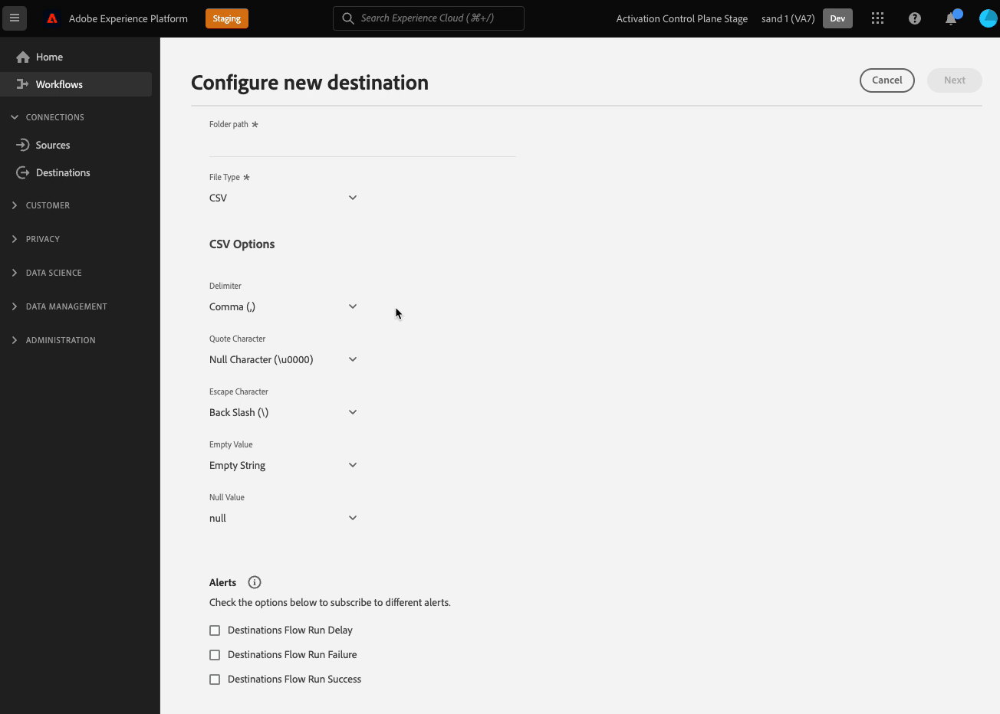

# 通过客户数据字段配置用户输入

在Experience PlatformUI中连接到目标时，您可能需要用户提供特定配置详细信息或选择可供他们使用的特定选项。 在Destination SDK中，这些选项称为客户数据字段。

要了解此组件在与Destination SDK创建的集成中的位置，请参阅 [配置选项](../configuration-options.md) 文档或请参阅以下目标配置概述页面：

* [使用Destination SDK配置流目标](../../guides/configure-destination-instructions.md#create-destination-configuration)
* [使用Destination SDK配置基于文件的目标](../../guides/configure-file-based-destination-instructions.md#create-destination-configuration)

## 客户数据字段的用例 {#use-cases}

在需要用户将数据输入Experience PlatformUI的各种用例中，使用客户数据字段。 例如，当用户需要提供以下内容时，请使用客户数据字段：

* 云存储段名称和路径，适用于基于文件的目标。
* 客户数据字段接受的格式。
* 用户可从中选择的可用文件压缩类型。
* 实时（流）集成的可用端点列表。

您可以通过 `/authoring/destinations` 端点。 有关详细的API调用示例，请参阅以下API参考页面，您可以在其中配置此页面中显示的组件。

* [创建目标配置](../../authoring-api/destination-configuration/create-destination-configuration.md)
* [更新目标配置](../../authoring-api/destination-configuration/update-destination-configuration.md)

本文介绍了可用于目标的所有受支持的客户数据字段配置类型，并显示了客户将在Experience PlatformUI中看到的内容。

>[!IMPORTANT]
>
>Destination SDK支持的所有参数名称和值均为 **区分大小写**. 为避免出现区分大小写错误，请完全按照文档中的说明使用参数名称和值。

## 支持的集成类型 {#supported-integration-types}

有关哪些类型的集成支持本页所述功能的详细信息，请参阅下表。

| 集成类型 | 支持功能 |
|---|---|
| 实时（流）集成 | 是 |
| 基于文件的（批处理）集成 | 是 |

## 支持的参数 {#supported-parameters}

创建自己的客户数据字段时，您可以使用下表中描述的参数配置其行为。

| 参数 | 类型 | 必填/可选 | 描述 |
|---------|----------|------|---|
| `name` | 字符串 | 必需 | 为要引入的自定义字段提供名称。 此名称在Platform UI中不可见，除非 `title` 字段为空或缺少字段。 |
| `type` | 字符串 | 必需 | 指示您引入的自定义字段的类型。 接受的值： <ul><li>`string`</li><li>`object`</li><li>`integer`</li></ul> |
| `title` | 字符串 | 可选 | 指示字段的名称，客户在Platform UI中可看到该字段。 如果此字段为空或缺失，则UI会从 `name` 值。 |
| `description` | 字符串 | 可选 | 为自定义字段提供描述。 此描述在Platform UI中不可见。 |
| `isRequired` | 布尔值 | 可选 | 指示是否要求用户在目标配置工作流中为此字段提供值。 |
| `pattern` | 字符串 | 可选 | 如果需要，可为自定义字段实施模式。 使用正则表达式来强制实施模式。 例如，如果您的客户ID不包含数字或下划线，请输入 `^[A-Za-z]+$` 中。 |
| `enum` | 字符串 | 可选 | 将自定义字段呈现为下拉菜单，并列出可供用户使用的选项。 |
| `default` | 字符串 | 可选 | 定义 `enum` 列表。 |
| `hidden` | 布尔值 | 可选 | 指示客户数据字段是否显示在UI中。 |
| `unique` | 布尔值 | 可选 | 当您需要创建一个客户数据字段，该字段的值在用户组织设置的所有目标数据流中必须唯一时，请使用此参数。 例如， **[!UICONTROL 集成别名]** 字段 [自定义个性化](../../../catalog/personalization/custom-personalization.md) 目标必须唯一，这意味着此目标的两个单独的数据流不能具有此字段的相同值。 |
| `readOnly` | 布尔值 | 可选 | 指示客户是否可以更改字段的值。 |

{style="table-layout:auto"}

在以下示例中， `customerDataFields` 部分定义了用户在连接到目标时必须在Platform UI中输入的两个字段：

* `Account ID`:目标平台的用户帐户ID。
* `Endpoint region`:他们将连接到的API的区域端点。 的 `enum` 部分会创建一个下拉菜单，其中的值在中定义，供用户选择。

```json
"customerDataFields":[
   {
      "name":"accountID",
      "title":"User account ID",
      "description":"User account ID for the destination platform.",
      "type":"string",
      "isRequired":true
   },
   {
      "name":"region",
      "title":"API endpoint region",
      "description":"The API endpoint region that the user should connect to.",
      "type":"string",
      "isRequired":true,
      "enum":[
         "EU"
         "US",
      ],
      "readOnly":false,
      "hidden":false
   }
]
```

生成的UI体验如下图所示。


## 目标连接名称和描述 {#names-description}

创建新目标时，Destination SDK会自动添加 **[!UICONTROL 名称]** 和 **[!UICONTROL 描述]** 字段。 如上例所示， **[!UICONTROL 名称]** 和 **[!UICONTROL 描述]** 字段会在UI中呈现，但不会包含在客户数据字段配置中。

>[!IMPORTANT]
>
>如果添加 **[!UICONTROL 名称]** 和 **[!UICONTROL 描述]** 客户数据字段配置中的字段，用户将在UI中看到这些字段重复。

## 订购客户数据字段 {#ordering}

在目标配置中添加客户数据字段的顺序反映在平台UI中。

例如，下面的配置会相应地反映在UI中，选项会按顺序显示 **[!UICONTROL 名称]**, **[!UICONTROL 描述]**, **[!UICONTROL 存储段名称]**, **[!UICONTROL 文件夹路径]**, **[!UICONTROL 文件类型]**, **[!UICONTROL 压缩格式]**.

```json
"customerDataFields":[
{
   "name":"bucketName",
   "title":"Bucket name",
   "description":"Amazon S3 bucket name",
   "type":"string",
   "isRequired":true,
   "pattern":"(?=^.{3,63}$)(?!^(\\d+\\.)+\\d+$)(^(([a-z0-9]|[a-z0-9][a-z0-9\\-]*[a-z0-9])\\.)*([a-z0-9]|[a-z0-9][a-z0-9\\-]*[a-z0-9])$)",
   "readOnly":false,
   "hidden":false
},
{
   "name":"path",
   "title":"Folder path",
   "description":"Enter the path to your S3 bucket folder",
   "type":"string",
   "isRequired":true,
   "pattern":"^[0-9a-zA-Z\\/\\!\\-_\\.\\*\\''\\(\\)]*((\\%SEGMENT_(NAME|ID)\\%)?\\/?)+$",
   "readOnly":false,
   "hidden":false
},
{
   "name":"fileType",
   "title":"File Type",
   "description":"Select the exported file type.",
   "type":"string",
   "isRequired":true,
   "readOnly":false,
   "hidden":false,
   "enum":[
      "csv",
      "json",
      "parquet"
   ],
   "default":"csv"
},
{
   "name":"compression",
   "title":"Compression format",
   "description":"Select the desired file compression format.",
   "type":"string",
   "isRequired":true,
   "readOnly":false,
   "enum":[
      "SNAPPY",
      "GZIP",
      "DEFLATE",
      "NONE"
   ]
}
]
```


## 对客户数据字段进行分组 {#grouping}

您可以在一个部分中对多个客户数据字段进行分组。 在UI中设置与目标的连接时，用户可以查看类似字段的可视化分组并从中受益。

为此，请使用 `"type": "object"` 创建群组，并在 `properties` 对象，如下图所示，其中分组 **[!UICONTROL CSV选项]** 中。

```json {line-numbers="true" highlight="6-28"}
"customerDataFields":[
   {
      "name":"csvOptions",
      "title":"CSV Options",
      "description":"Select your CSV options",
      "type":"object",
      "properties":[
         {
            "name":"delimiter",
            "title":"Delimiter",
            "description":"Select your Delimiter",
            "type":"string",
            "isRequired":false,
            "default":",",
            "namedEnum":[
               {
                  "name":"Comma (,)",
                  "value":","
               },
               {
                  "name":"Tab (\\t)",
                  "value":"\t"
               }
            ],
            "readOnly":false,
            "hidden":false
         }
      ]
   }
]
```


## 为客户数据字段创建下拉选择器 {#dropdown-selectors}

如果您希望允许用户在多个选项之间进行选择（例如，应使用哪个字符来分隔CSV文件中的字段），则可以向UI添加下拉字段。

为此，请使用 `namedEnum` 如下所示的对象，并配置 `default` 值。

```json {line-numbers="true" highlight="15-24"}
"customerDataFields":[
   {
      "name":"csvOptions",
      "title":"CSV Options",
      "description":"Select your CSV options",
      "type":"object",
      "properties":[
         {
            "name":"delimiter",
            "title":"Delimiter",
            "description":"Select your Delimiter",
            "type":"string",
            "isRequired":false,
            "default":",",
            "namedEnum":[
               {
                  "name":"Comma (,)",
                  "value":","
               },
               {
                  "name":"Tab (\\t)",
                  "value":"\t"
               }
            ],
            "readOnly":false,
            "hidden":false
         }
      ]
   }
]
```



## 创建条件客户数据字段 {#conditional-options}

您可以创建条件客户数据字段，这些字段仅在用户选择特定选项时显示在激活工作流中。

例如，您可以创建条件文件格式选项，该选项仅在用户选择特定文件导出类型时才显示。

以下配置为CSV文件格式选项创建条件分组。 仅当用户选择CSV作为所需的文件类型进行导出时，才会显示CSV文件选项。

要将字段设置为条件字段，请使用 `conditional` 参数，如下所示：

```json
"conditional": {
   "field": "fileType",
   "operator": "EQUALS",
   "value": "CSV"
}
```

在更大的范围内，您可以看到 `conditional` 字段，以及 `fileType` 字符串和 `csvOptions` 对象。

```json {line-numbers="true" highlight="3-15, 21-25"}
"customerDataFields":[
   {
      "name":"fileType",
      "title":"File Type",
      "description":"Select your file type",
      "type":"string",
      "isRequired":true,
      "enum":[
         "PARQUET",
         "CSV",
         "JSON"
      ],
      "readOnly":false,
      "hidden":false
   },
   {
      "name":"csvOptions",
      "title":"CSV Options",
      "description":"Select your CSV options",
      "type":"object",
      "conditional":{
         "field":"fileType",
         "operator":"EQUALS",
         "value":"CSV"
      },
      "properties":[
         {
            "name":"delimiter",
            "title":"Delimiter",
            "description":"Select your Delimiter",
            "type":"string",
            "isRequired":false,
            "default":",",
            "namedEnum":[
               {
                  "name":"Comma (,)",
                  "value":","
               },
               {
                  "name":"Tab (\\t)",
                  "value":"\t"
               }
            ],
            "readOnly":false,
            "hidden":false
         },
         {
            "name":"quote",
            "title":"Quote Character",
            "description":"Select your Quote character",
            "type":"string",
            "isRequired":false,
            "default":"",
            "namedEnum":[
               {
                  "name":"Double Quotes (\")",
                  "value":"\""
               },
               {
                  "name":"Null Character (\u0000)",
                  "value":"\u0000"
               }
            ],
            "readOnly":false,
            "hidden":false
         },
         {
            "name":"escape",
            "title":"Escape Character",
            "description":"Select your Escape character",
            "type":"string",
            "isRequired":false,
            "default":"\\",
            "namedEnum":[
               {
                  "name":"Back Slash (\\)",
                  "value":"\\"
               },
               {
                  "name":"Single Quote (')",
                  "value":"'"
               }
            ],
            "readOnly":false,
            "hidden":false
         },
         {
            "name":"emptyValue",
            "title":"Empty Value",
            "description":"Select the output value of blank fields",
            "type":"string",
            "isRequired":false,
            "default":"",
            "namedEnum":[
               {
                  "name":"Empty String",
                  "value":""
               },
               {
                  "name":"\"\"",
                  "value":"\"\""
               },
               {
                  "name":"null",
                  "value":"null"
               }
            ],
            "readOnly":false,
            "hidden":false
         },
         {
            "name":"nullValue",
            "title":"Null Value",
            "description":"Select the output value of 'null' fields",
            "type":"string",
            "isRequired":false,
            "default":"null",
            "namedEnum":[
               {
                  "name":"Empty String",
                  "value":""
               },
               {
                  "name":"\"\"",
                  "value":"\"\""
               },
               {
                  "name":"null",
                  "value":"null"
               }
            ],
            "readOnly":false,
            "hidden":false
         }
      ],
      "isRequired":false,
      "readOnly":false,
      "hidden":false
   }
]
```

在下面，您可以根据上述配置看到生成的UI屏幕。 当用户选择CSV文件类型时，UI中会显示引用CSV文件类型的其他文件格式选项。


## 访问模板化客户数据字段 {#accessing-templatized-fields}

当您的目标需要用户输入时，您必须向用户提供一系列客户数据字段选项，用户可以通过Platform UI填写这些字段。 然后，您必须配置目标服务器，以正确读取客户数据字段中的用户输入。 此操作通过模板化字段完成。

模板化字段使用格式 `{{customerData.fieldName}}`，其中 `fieldName` 是您从中读取信息的客户数据字段的名称。 所有模板化的客户数据字段前面都有 `customerData.` 被双大括号围住 `{{ }}`.

例如，让我们考虑以下Amazon S3目标配置：

```json
"customerDataFields":[
   {
      "name":"bucketName",
      "title":"Enter the name of your Amazon S3 bucket",
      "description":"Amazon S3 bucket name",
      "type":"string",
      "isRequired":true,
      "pattern":"(?=^.{3,63}$)(?!^(\\d+\\.)+\\d+$)(^(([a-z0-9]|[a-z0-9][a-z0-9\\-]*[a-z0-9])\\.)*([a-z0-9]|[a-z0-9][a-z0-9\\-]*[a-z0-9])$)",
      "readOnly":false,
      "hidden":false
   },
   {
      "name":"path",
      "title":"Enter the path to your S3 bucket folder",
      "description":"Enter the path to your S3 bucket folder",
      "type":"string",
      "isRequired":true,
      "pattern":"^[0-9a-zA-Z\\/\\!\\-_\\.\\*\\''\\(\\)]*((\\%SEGMENT_(NAME|ID)\\%)?\\/?)+$",
      "readOnly":false,
      "hidden":false
   }
]
```

此配置会提示用户输入 [!DNL Amazon S3] 存储段名称和文件夹路径分别放入各自的客户数据字段中。

要使Experience Platform正确连接到 [!DNL Amazon S3]，则必须将目标服务器配置为从这两个客户数据字段中读取值，如下所示：

```json
 "fileBasedS3Destination":{
      "bucketName":{
         "templatingStrategy":"PEBBLE_V1",
         "value":"{{customerData.bucketName}}"
      },
      "path":{
         "templatingStrategy":"PEBBLE_V1",
         "value":"{{customerData.path}}"
      }
   }
```

模板化值 `{{customerData.bucketName}}` 和 `{{customerData.path}}` 读取用户提供的值，以便Experience Platform能够成功连接到目标平台。

有关如何配置目标服务器以读取模板化字段的更多信息，请参阅 [硬编码字段与模板字段](../destination-server/server-specs.md#templatized-fields).

## 后续步骤 {#next-steps}

阅读本文后，您应该对如何允许用户通过客户数据字段在Experience PlatformUI中输入信息有了更好的了解。 您现在还知道如何为用例选择正确的客户数据字段，以及如何在Platform UI中配置、排序和分组客户数据字段。

要了解有关其他目标组件的更多信息，请参阅以下文章：

* [客户身份验证](customer-authentication.md)
* [OAuth2身份验证](oauth2-authentication.md)
* [UI属性](ui-attributes.md)
* [架构配置](schema-configuration.md)
* [身份命名空间配置](identity-namespace-configuration.md)
* [支持的映射配置](supported-mapping-configurations.md)
* [目标投放](destination-delivery.md)
* [受众元数据配置](audience-metadata-configuration.md)
* [聚合策略](aggregation-policy.md)
* [批量配置](batch-configuration.md)
* [历史用户档案资格](historical-profile-qualifications.md)