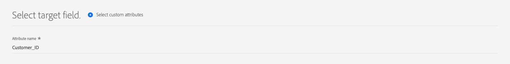
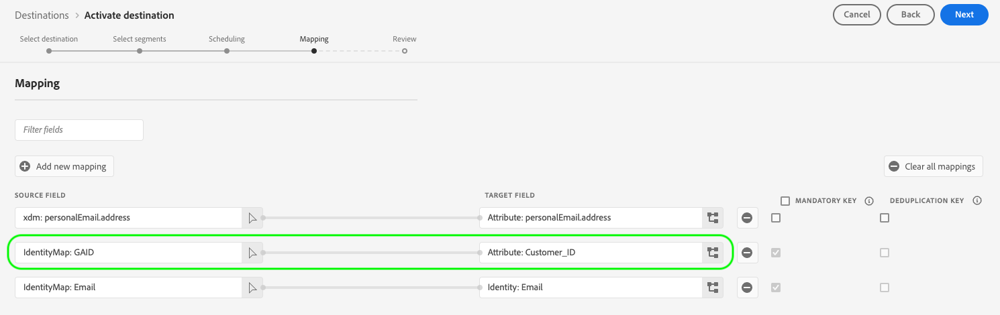

# 支持的映射配置

使用Destination SDK构建的目标根据目标类型支持特定的身份命名空间和属性映射配置。

本文介绍了在配置目标时可以使用的所有受支持的映射配置。

>[!WARNING]
>
>Destination SDK不支持本文未介绍的任何映射配置。

在构建目标时，请根据此页面中描述的映射配置之一配置架构和身份命名空间。

>[!IMPORTANT]
>
>Destination SDK支持的所有参数名称和值均区分大小写&#x200B;****。 为避免出现区分大小写错误，请完全按照文档中的说明使用参数名称和值。

## 流媒体目标支持的映射 {#streaming-mappings}

使用Destination SDK构建的实时（流）目标支持下表所述的映射配置。

| 源字段 | 目标字段 |
| --- | --- |
| XDM属性 | 自定义属性 |
| 身份标识命名空间 | 身份标识命名空间 |

下面的配置示例允许客户使用上表中的两个映射。

```json
"schemaConfig":{
   "profileRequired":true,
   "segmentRequired":true,
   "identityRequired":true
},
"identityNamespaces":{
   "Customer_contact":{
      "acceptsAttributes":false,
      "acceptsCustomNamespaces":true,
      "acceptedGlobalNamespaces":{
         "Email":{
            
         },
         "Phone":{
            
         }
      }
   }
},
```

### 将XDM属性映射到自定义属性 {#streaming-xdm-to-custom}

用户可以将其源XDM配置文件中的属性映射到目标端的自定义属性。

选择目标字段映射时，用户必须手动输入目标自定义属性的名称。


生成的UI体验如下图所示。


### 将身份命名空间映射到合作伙伴身份命名空间 {#streaming-identity-to-identity}

用户可以将自定义或全局身份命名空间从Experience Platform映射到您定义的身份命名空间。

生成的UI体验如下图所示。


## 基于文件的目标支持的映射 {#batch-mappings}

使用Destination SDK构建的基于文件的目标支持下表所述的映射配置。 有关详细的映射示例，请参阅以下部分。

| 源字段 | 目标字段 |
| --- | --- |
| XDM属性 | 属性/自定义属性 |
| 身份标识命名空间 | 属性/自定义属性 |
| 身份标识命名空间 | 身份标识命名空间 |

下面的配置示例允许客户使用上表中的所有映射。

```json
"schemaConfig":{
   "profileRequired":true,
   "segmentRequired":true,
   "identityRequired":true
},
"identityNamespaces":{
   "Customer_contact":{
      "acceptsAttributes":false,
      "acceptsCustomNamespaces":true,
      "acceptedGlobalNamespaces":{
         "Email":{
         },
         "Phone":{
         }
      }
   }
},
```

### 将XDM属性映射到自定义属性 {#batch-xdm-to-custom}

用户可以将其源XDM配置文件中的属性映射到目标端的自定义属性。

对于基于文件的目标，使用与源字段同名的默认属性自动填充目标字段。

生成的UI体验如下图所示。


用户可以保留默认名称，也可以在目标字段选择屏幕中输入自定义属性名称。



### 将身份命名空间映射到自定义属性 {#batch-identity-to-custom}

用户可以将自定义或全局身份命名空间从Experience Platform映射到目标端的自定义属性。

选择身份命名空间作为源字段时，目标字段会自动填充等效的身份命名空间。 要将目标字段替换为自定义属性，用户必须在目标字段选择屏幕中输入自定义属性名称。


生成的UI体验如下图所示。



### 将身份命名空间映射到合作伙伴身份命名空间 {#batch-identity-to-identity}

用户可以将自定义或全局身份命名空间从Experience Platform映射到等效的身份命名空间。

选择身份命名空间作为源字段时，目标字段会自动填充等效的身份命名空间。

生成的UI体验如下图所示。


## 后续步骤 {#next-steps}

阅读本文后，您应该更好地了解使用Destination SDK构建的目标支持哪些映射。

要了解有关其他目标组件的更多信息，请参阅以下文章：

* [客户身份验证](customer-authentication.md)
* [OAuth2授权](oauth2-authorization.md)
* [客户数据字段](customer-data-fields.md)
* [UI属性](ui-attributes.md)
* [架构配置](schema-configuration.md)
* [身份命名空间配置](identity-namespace-configuration.md)
* [目标投放](destination-delivery.md)
* [受众元数据配置](audience-metadata-configuration.md)
* [聚合策略](aggregation-policy.md)
* [批次配置](batch-configuration.md)
* [历史配置文件资格](historical-profile-qualifications.md)
