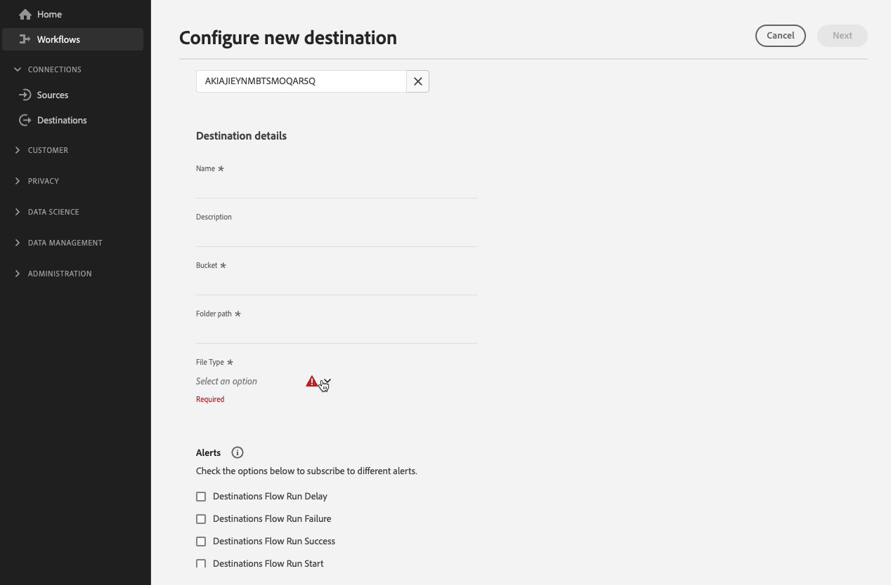

# 为基于文件的目标配置文件格式选项

## 概述 {#overview}

Destination SDK允许您广泛调整导出文件的格式和压缩选项，以匹配存储位置的任何下游要求。

本页介绍如何使用Destination SDK为基于文件的目标配置文件格式选项。

## 先决条件 {#prerequisites}

在继续执行以下步骤之前，请阅读 [Destination SDK快速入门](../../getting-started.md) 页面，以了解有关获取使用Destination SDKAPI所需的Adobe I/O身份验证凭据和其他先决条件的信息。

Adobe还建议您先阅读并熟悉以下文档，然后再继续：

* 每个可用的文件格式选项都详细记录在 [文件格式配置](../../functionality/destination-server/file-formatting.md) 部分。
* 完成步骤以 [配置基于文件的目标](../../guides/configure-file-based-destination-instructions.md) 使用Destination SDK。

## 创建服务器和文件配置 {#create-server-file-configuration}

首先使用 `/destination-server` 端点确定要为导出的文件设置哪些文件格式配置选项。

以下是 [!DNL Amazon S3] 目标，选择了多个文件格式选项。

**API格式**

```http
POST platform.adobe.io/data/core/activation/authoring/destination-servers
```

**请求**

```shell
curl -X POST https://platform.adobe.io/data/core/activation/authoring/destination-server \
 -H 'Authorization: Bearer {ACCESS_TOKEN}' \
 -H 'Content-Type: application/json' \
 -H 'x-gw-ims-org-id: {ORG_ID}' \
 -H 'x-api-key: {API_KEY}' \
 -H 'x-sandbox-name: {SANDBOX_NAME}' \
 -d '
{
{
  "name": "Amazon S3 Server with several CSV Options",
  "destinationServerType": "FILE_BASED_S3",
  "fileBasedS3Destination": {
    "bucket": {
      "templatingStrategy": "PEBBLE_V1",
      "value": "{{customerData.bucket}}"
    },
    "path": {
      "templatingStrategy": "PEBBLE_V1",
      "value": "{{customerData.path}}"
    }
  },
  "fileConfigurations": {
    "compression": {
      "templatingStrategy": "PEBBLE_V1",
      "value": "{{customerData.compression}}NONE"
    },
    "fileType": {
      "templatingStrategy": "PEBBLE_V1",
      "value": "{{customerData.fileType}}"
    },
    "csvOptions": {
      "sep": {
        "templatingStrategy": "PEBBLE_V1",
        "value": "{{customerData.csvOptions.delimiter}},"
      },
      "quote": {
        "templatingStrategy": "PEBBLE_V1",
        "value": "{{customerData.csvOptions.quote}}\""
      },
      "escape": {
        "templatingStrategy": "PEBBLE_V1",
        "value": "{{customerData.csvOptions.escape}}\\"
      },
      "nullValue": {
        "templatingStrategy": "PEBBLE_V1",
        "value": "{{customerData.csvOptions.nullValue}}null"
      },
      "emptyValue": {
        "templatingStrategy": "PEBBLE_V1",
        "value": "{{customerData.csvOptions.emptyValue}}"
      }
    }
  }
}
}'
```

## 将文件格式设置选项添加到目标配置 {#create-destination-configuration}

>[!TIP]
>
>**验证Experience PlatformUI**. 使用下面部分中演示的配置来配置文件格式选项时，您应该检查Experience PlatformUI以了解这些选项的呈现方式。

在上一步中将所需的文件格式选项添加到目标服务器和文件格式配置后，您现在可以使用 `/destinations` API端点将所需的字段作为客户数据字段添加到目标配置。

>[!IMPORTANT]
>
>此步骤是可选的，它仅决定在Experience PlatformUI中应向用户显示哪些文件格式选项。 如果您没有将文件格式选项设置为客户数据字段，则文件导出将继续使用中配置的默认值。 [服务器和文件配置](#create-server-file-configuration).

在此步骤中，您可以按所需的任何顺序对显示的选项进行分组，您可以根据所选文件类型创建自定义分组、下拉字段和条件分组。 所有这些设置都显示在录制和更下面的部分中。



### 对文件格式选项排序 {#ordering}

作为目标配置中的客户数据字段，您添加文件格式选项的顺序反映在UI中。 例如，以下配置将相应地反映在UI中，并按顺序显示各个选项 **[!UICONTROL 分隔符]**， **[!UICONTROL 引号字符]**， **[!UICONTROL 转义字符]**， **[!UICONTROL 空值]**， **[!UICONTROL 空值]**.


```json
        {
            "name": "csvOptions",
            "title": "CSV Options",
            "description": "Select your CSV options",
            "type": "object",
            "properties": [
                {
                    "name": "delimiter",
                    "title": "Delimiter",
                    "description": "Select your Delimiter",
                    "type": "string",
                    "isRequired": false,
                    "default": ",",
                    "namedEnum": [
                        {
                            "name": "Comma (,)",
                            "value": ","
                        },
                        {
                            "name": "Tab (\\t)",
                            "value": "\t"
                        }
                    ],
                    "readOnly": false,
                    "hidden": false
                },
                {
                    "name": "quote",
                    "title": "Quote Character",
                    "description": "Select your Quote character",
                    "type": "string",
                    "isRequired": false,
                    "default": "\u0000",
                    "namedEnum": [
                        {
                            "name": "Double Quotes (\")",
                            "value": "\""
                        },
                        {
                            "name":"Null Character (\u0000)",
                            "value": ""
                        }
                    ],
                    "readOnly": false,
                    "hidden": false
                },
                {
                    "name": "escape",
                    "title": "Escape Character",
                    "description": "Select your Escape character",
                    "type": "string",
                    "isRequired": false,
                    "default": "\\",
                    "namedEnum": [
                        {
                            "name": "Back Slash (\\)",
                            "value": "\\"
                        },
                        {
                            "name": "Single Quote (')",
                            "value": "'"
                        }
                    ],
                    "readOnly": false,
                    "hidden": false
                },
                {
                    "name": "emptyValue",
                    "title": "Empty Value",
                    "description": "Select the output value of blank fields",
                    "type": "string",
                    "isRequired": false,
                    "default": "",
                    "namedEnum": [
                        {
                            "name": "Empty String",
                            "value": ""
                        },
                        {
                            "name": "\"\"",
                            "value": "\"\""
                        },
                        {
                            "name": "null",
                            "value": "null"
                        }
                    ],
                    "readOnly": false,
                    "hidden": false
                },
                {
                    "name": "nullValue",
                    "title": "Null Value",
                    "description": "Select the output value of 'null' fields",
                    "type": "string",
                    "isRequired": false,
                    "default": "null",
                    "namedEnum": [
                        {
                            "name": "Empty String",
                            "value": ""
                        },
                        {
                            "name": "\"\"",
                            "value": "\"\""
                        },
                        {
                            "name": "null",
                            "value": "null"
                        }
                    ],
                    "readOnly": false,
                    "hidden": false
                }
```

### 将文件格式选项分组 {#grouping}

您可以将多个文件格式选项组合在一个节中。 在UI中设置与目标之间的连接时，用户可以查看类似字段的可视化分组并从中受益。

为此，请使用 `"type": "object"` 创建组，并在中收集所需的文件格式选项 `properties` 参数，如下面的示例所示，其中 **[!UICONTROL CSV选项]** 高亮显示。

```json {line-numbers="true" start-number="100" highlight="106-128"}
"customerDataFields":[
[...]
{
   "name":"csvOptions",
   "title":"CSV Options",
   "description":"Select your CSV options",
   "type":"object",
   "properties":[
      {
         "name":"delimiter",
         "title":"Delimiter",
         "description":"Select your Delimiter",
         "type":"string",
         "isRequired":false,
         "default":",",
         "namedEnum":[
            {
               "name":"Comma (,)",
               "value":","
            },
            {
               "name":"Tab (\\t)",
               "value":"\t"
            }
         ],
         "readOnly":false,
         "hidden":false
      },
      [...]
   ]
}
[...]
]
```


### 为文件格式选项创建下拉选择器 {#dropdown-selectors}

对于希望允许用户在多个选项之间进行选择的情况（例如，应使用哪个字符来分隔CSV文件中的字段），您可以向UI添加下拉字段。

要执行此操作，请使用 `namedEnum` 对象并配置 `default` 用户可以选择的选项的值。

```json {line-numbers="true" start-number="100" highlight="114-124"}
[...]
"customerDataFields":[
[...]
{
   "name":"csvOptions",
   "title":"CSV Options",
   "description":"Select your CSV options",
   "type":"object",
   "properties":[
      {
         "name":"delimiter",
         "title":"Delimiter",
         "description":"Select your Delimiter",
         "type":"string",
         "isRequired":false,
         "default":",",
         "namedEnum":[
            {
               "name":"Comma (,)",
               "value":","
            },
            {
               "name":"Tab (\\t)",
               "value":"\t"
            }
         ],
         "readOnly":false,
         "hidden":false
      },
      [...]
   ]
}
[...]
]
```


### 创建条件文件格式选项 {#conditional-options}

您可以创建条件文件格式选项，这些选项仅在用户选择特定文件类型进行导出时才会显示在激活工作流中。 例如，下面的配置为CSV文件选项创建条件分组。 只有在用户选择CSV作为导出所需的文件类型时，才会显示CSV文件选项。

要将字段设置为条件字段，请使用 `conditional` 参数如下所示：

```json
            "conditional": {
                "field": "fileType",
                "operator": "EQUALS",
                "value": "CSV"
            }
```

在更广泛的背景下，您可以看到 `conditional` 以下目标配置中使用的字段，以及 `fileType` 字符串和 `csvOptions` 在其中定义它的对象。

```json
        {
            "name": "fileType",
            "title": "File Type",
            "description": "Select your file type",
            "type": "string",
            "isRequired": true,
            "enum": [
                "PARQUET",
                "CSV",
                "JSON"
            ],
            "readOnly": false,
            "hidden": false
        },
        {
            "name": "csvOptions",
            "title": "CSV Options",
            "description": "Select your CSV options",
            "type": "object",
            "conditional": {
                "field": "fileType",
                "operator": "EQUALS",
                "value": "CSV"
            },            
            "properties": [
                {
                    "name": "delimiter",
                    "title": "Delimiter",
                    "description": "Select your Delimiter",
                    "type": "string",
                    "isRequired": false,
                    "default": ",",
                    "namedEnum": [
                        {
                            "name": "Comma (,)",
                            "value": ","
                        },
                        {
                            "name": "Tab (\\t)",
                            "value": "\t"
                        }
                    ],
                    "readOnly": false,
                    "hidden": false
                },
                {
                    "name": "quote",
                    "title": "Quote Character",
                    "description": "Select your Quote character",
                    "type": "string",
                    "isRequired": false,
                    "default": "",
                    "namedEnum": [
                        {
                            "name": "Double Quotes (\")",
                            "value": "\""
                        },
                        {
                            "name":"Null Character (\u0000)",
                            "value": "\u0000"
                        }
                    ],
                    "readOnly": false,
                    "hidden": false
                },
                {
                    "name": "escape",
                    "title": "Escape Character",
                    "description": "Select your Escape character",
                    "type": "string",
                    "isRequired": false,
                    "default": "\\",
                    "namedEnum": [
                        {
                            "name": "Back Slash (\\)",
                            "value": "\\"
                        },
                        {
                            "name": "Single Quote (')",
                            "value": "'"
                        }
                    ],
                    "readOnly": false,
                    "hidden": false
                },
                {
                    "name": "emptyValue",
                    "title": "Empty Value",
                    "description": "Select the output value of blank fields",
                    "type": "string",
                    "isRequired": false,
                    "default": "",
                    "namedEnum": [
                        {
                            "name": "Empty String",
                            "value": ""
                        },
                        {
                            "name": "\"\"",
                            "value": "\"\""
                        },
                        {
                            "name": "null",
                            "value": "null"
                        }
                    ],
                    "readOnly": false,
                    "hidden": false
                },
                {
                    "name": "nullValue",
                    "title": "Null Value",
                    "description": "Select the output value of 'null' fields",
                    "type": "string",
                    "isRequired": false,
                    "default": "null",
                    "namedEnum": [
                        {
                            "name": "Empty String",
                            "value": ""
                        },
                        {
                            "name": "\"\"",
                            "value": "\"\""
                        },
                        {
                            "name": "null",
                            "value": "null"
                        }
                    ],
                    "readOnly": false,
                    "hidden": false
                }
            ],
            "isRequired": false,
            "readOnly": false,
            "hidden": false
        }
```

在下方，您可以根据上述配置查看生成的UI屏幕。 当用户选择文件类型CSV时，UI中会显示引用CSV文件类型的其他文件格式选项。


### 完成API请求，其中包括上面显示的所有选项

以下API请求将以上部分中描述的所有选项组合到一个配置中。

**请求**

```shell
curl -X POST https://platform.adobe.io/data/core/activation/authoring/destinations \
 -H 'Authorization: Bearer {ACCESS_TOKEN}' \
 -H 'Content-Type: application/json' \
 -H 'x-gw-ims-org-id: {ORG_ID}' \
 -H 'x-api-key: {API_KEY}' \
 -H 'x-sandbox-name: {SANDBOX_NAME}' \
 -d '
{
  "name": "My S3 Destination",
  "description": "Test destination",
  "status": "TEST",
  "sources": [
    "UNIFIED_PROFILE"
  ],
  "customerAuthenticationConfigurations": [
    {
      "authType": "S3"
    }
  ],
  "customerDataFields": [
    {
      "name": "bucket",
      "type": "string",
      "title": "Bucket",
      "description": "Enter your S3 Bucket",
      "isRequired": true
    },
    {
      "name": "path",
      "type": "string",
      "title": "Path",
      "description": "Enter your S3 Path",
      "isRequired": true
    },
    {
      "name": "fileType",
      "type": "string",
      "enum": [
        "CSV",
        "JSON",
        "PARQUET"
      ],
      "title": "File Type",
      "description": "Select your file type",
      "isRequired": true
    },
    {
      "name": "csvOptions",
      "type": "object",
      "title": "CSV Options",
      "description": "Select your CSV options",
      "conditional": {
        "field": "fileType",
        "operator": "EQUALS",
        "value": "CSV"
      },
      "properties": [
        {
          "name": "delimiter",
          "type": "string",
          "title": "Delimiter",
          "description": "Select your Delimiter",
          "namedEnum": [
            {
              "name": "Comma (,)",
              "value": ","
            },
            {
              "name": "Tab (\\t)",
              "value": "\t"
            }
          ],
          "default": ","
        },
        {
          "name": "quote",
          "type": "string",
          "title": "Quote Character",
          "description": "Select your Quote character",
          "namedEnum": [
            {
              "name": "Double Quotes (\")",
              "value": "\""
            },
            {
              "name": "Null Character (\\u0000)",
              "value": "\u0000"
            }
          ],
          "default": "\u0000"
        },
        {
          "name": "escape",
          "type": "string",
          "title": "Escape Character",
          "description": "Select your Escape character",
          "namedEnum": [
            {
              "name": "Back Slash (\\)",
              "value": "\\"
            },
            {
              "name": "Single Quote (')",
              "value": "'"
            }
          ],
          "default": "\\"
        },
        {
          "name": "emptyValue",
          "type": "string",
          "title": "Empty Value",
          "description": "Select the output value of blank fields",
          "namedEnum": [
            {
              "name": "null",
              "value": "null"
            },
            {
              "name": "Empty String",
              "value": ""
            },
            {
              "name": "\"\"",
              "value": "\"\""
            }
          ],
          "default": ""
        },
        {
          "name": "nullValue",
          "type": "string",
          "title": "Null Value",
          "description": "Select the output value of 'null' fields",
          "namedEnum": [
            {
              "name": "null",
              "value": "null"
            },
            {
              "name": "Empty String",
              "value": ""
            },
            {
              "name": "\"\"",
              "value": "\"\""
            }
          ],
          "default": "null"
        }
      ]
    }
  ],
  "uiAttributes": {
    "documentationLink": "https://www.adobe.com/go/aep",
    "category": "cloudStorage",
    "connectionType": "Server-to-server",
    "frequency": "Batch",
    "monitoringSupported": true,
    "flowRunsSupported": true
  },
  "schemaConfig": {
    "profileRequired": true,
    "segmentRequired": true,
    "identityRequired": true
  },
  "batchConfig": {
    "allowMandatoryFieldSelection": true,
    "allowDedupeKeyFieldSelection": true,
    "defaultExportMode": "DAILY_FULL_EXPORT",
    "allowedExportMode": [
      "DAILY_FULL_EXPORT",
      "FIRST_FULL_THEN_INCREMENTAL"
    ],
    "allowedScheduleFrequency": [
      "DAILY",
      "EVERY_3_HOURS",
      "EVERY_6_HOURS",
      "EVERY_8_HOURS",
      "EVERY_12_HOURS",
      "ONCE"
    ],
    "defaultFrequency": "DAILY",
    "defaultStartTime": "00:00",
    "filenameConfig": {
      "allowedFilenameAppendOptions": [
        "SEGMENT_NAME",
        "DESTINATION_INSTANCE_ID",
        "DESTINATION_INSTANCE_NAME",
        "ORGANIZATION_NAME",
        "SANDBOX_NAME",
        "DATETIME",
        "CUSTOM_TEXT"
      ],
      "defaultFilenameAppendOptions": [
        "DATETIME"
      ],
      "defaultFilename": "%DESTINATION%_%SEGMENT_ID%"
    }
  },
  "destinationDelivery": [
    {
      "deliveryMatchers": [
        {
          "type": "SOURCE",
          "value": [
            "batch"
          ]
        }
      ],
      "authenticationRule": "CUSTOMER_AUTHENTICATION",
      "destinationServerId": "<server-id>"
    }
  ]
}'
```

成功的响应将返回目标配置，包括唯一标识符(`instanceId`)。

## 已知限制 {#known-limitations}

文件格式选项的特定组合可能会导致不想要的文件导出结果。
Adobe建议不要选择以下CSV选项组合：

```
nullValue -> ""
quote -> "
emptyValue -> ""
```

要说明此限制，请考虑导出具有以下值的文件：

| 名字 | 姓氏 | 国家/地区 | state |
|---------|----------|---------|--------|
| 迈克尔 | 玫瑰 | 美国 | 纽约 |
| 詹姆斯 | Smith |  | null |

{style="table-layout:auto"}

这将产生如下所示的输出。 请注意表中的空值如何错误地导出为转义引号。

```csv
Michael,Rose,USA,NY 
James,Smith,"","\"\""
```

## 后续步骤 {#next-steps}

阅读本文后，您现在知道如何使用Destination SDK为导出的文件设置自定义文件格式选项。 接下来，您的团队可以使用 [基于文件的目标的激活工作流](../../../ui/activate-batch-profile-destinations.md) 将数据导出到目标。
