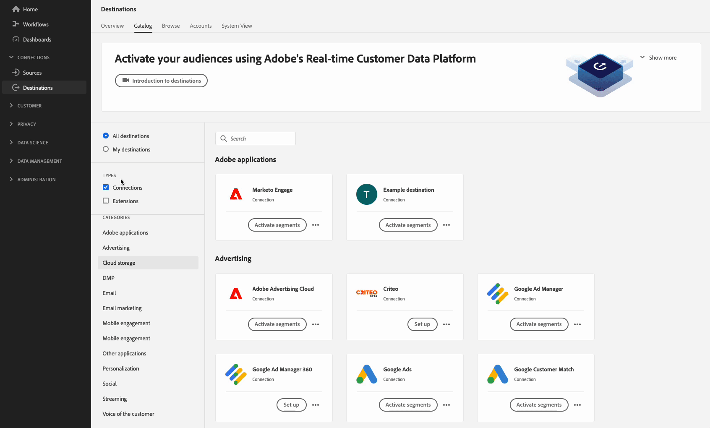

# 配置基于文件的目标以将目标受众导出到存储位置

## 概述 {#overview}

本页介绍如何使用Destination SDK通过自定义[文件格式选项](configure-file-formatting-options.md)和自定义[文件名配置](../../functionality/destination-configuration/batch-configuration.md#file-name-configuration)配置基于文件的目标以导出[目标受众](/help/destinations/ui/activate-prospect-audiences.md)。 本指南中的示例介绍了如何将潜在客户配置文件的受众导出到Amazon S3位置。

您还可以设置STFP或其他存储位置以导出目标客户受众。 请牢记的重要部分是，在[步骤2](#create-destination-configuration)中将以下代码片段添加到目标配置中，以启用[工作流以将目标受众](/help/destinations/ui/activate-prospect-audiences.md)导出到目标。

```json
  "sources": [
    "UNIFIED_PROFILE_PROSPECTS"
  ],
```

有关下面使用的参数的详细说明，请参阅目标SDK [&#128279;](../../functionality/configuration-options.md)中的配置选项。

## 先决条件 {#prerequisites}

在进入下面列出的步骤之前，请阅读[Destination SDK快速入门](../../getting-started.md)页面，了解有关获取使用Destination SDKAPI所需的身份验证凭据和其他先决条件的信息。

## 步骤1：创建服务器和文件配置 {#create-server-file-configuration}

首先使用`/destination-server`终结点[创建服务器和文件配置](../../authoring-api/destination-server/create-destination-server.md)。

**API格式**

```http
POST platform.adobe.io/data/core/activation/authoring/destination-servers
```

**请求**

以下请求创建新的目标服务器配置，该配置由有效负载中提供的参数配置。
以下有效负载包含通用Amazon S3配置，该配置包含用户可在Experience PlatformUI中定义的自定义[CSV文件格式](../../functionality/destination-server/file-formatting.md)配置参数。

```shell
curl -X POST https://platform.adobe.io/data/core/activation/authoring/destination-server \
 -H 'Authorization: Bearer {ACCESS_TOKEN}' \
 -H 'Content-Type: application/json' \
 -H 'x-gw-ims-org-id: {ORG_ID}' \
 -H 'x-api-key: {API_KEY}' \
 -H 'x-sandbox-name: {SANDBOX_NAME}' \
 -d ' {
   "name":"Amazon S3 destination server with custom file formatting options",
   "destinationServerType":"FILE_BASED_S3",
   "fileBasedS3Destination":{
      "bucket":{
         "templatingStrategy":"PEBBLE_V1",
         "value":"{{customerData.bucketName}}"
      },
      "path":{
         "templatingStrategy":"PEBBLE_V1",
         "value":"{{customerData.path}}"
      }
   },
   "fileConfigurations":{
      "compression":{
         "templatingStrategy":"PEBBLE_V1",
         "value":"{{customerData.compression}}"
      },
      "fileType":{
         "templatingStrategy":"PEBBLE_V1",
         "value":"{{customerData.fileType}}"
      },
      "csvOptions":{
         "sep":{
            "templatingStrategy":"PEBBLE_V1",
            "value":"{{customerData.sep}}"
         },
         "encoding":{
            "templatingStrategy":"PEBBLE_V1",
            "value":"{{customerData.encoding}}"
         },
         "quote":{
            "templatingStrategy":"PEBBLE_V1",
            "value":"{{customerData.quote}}"
         },
         "quoteAll":{
            "templatingStrategy":"PEBBLE_V1",
            "value":"{{customerData.quoteAll}}"
         },
         "escape":{
            "templatingStrategy":"PEBBLE_V1",
            "value":"{{customerData.escape}}"
         },
         "escapeQuotes":{
            "templatingStrategy":"PEBBLE_V1",
            "value":"{{customerData.escapeQuotes}}"
         },
         "header":{
            "templatingStrategy":"PEBBLE_V1",
            "value":"{{customerData.header}}"
         },
         "ignoreLeadingWhiteSpace":{
            "templatingStrategy":"PEBBLE_V1",
            "value":"{{customerData.ignoreLeadingWhiteSpace}}"
         },
         "nullValue":{
            "templatingStrategy":"PEBBLE_V1",
            "value":"{{customerData.nullValue}}"
         },
         "dateFormat":{
            "templatingStrategy":"PEBBLE_V1",
            "value":"{{customerData.dateFormat}}"
         },
         "charToEscapeQuoteEscaping":{
            "templatingStrategy":"PEBBLE_V1",
            "value":"{{customerData.charToEscapeQuoteEscaping}}"
         },
         "emptyValue":{
            "templatingStrategy":"PEBBLE_V1",
            "value":"{{customerData.dateFormat}}"
         }
      }
   }
}'
```

成功的响应返回新的目标服务器配置，包括配置的唯一标识符(`instanceId`)。 将此值存储为下一步中所需的值。

## 步骤2：创建目标配置 {#create-destination-configuration}

在上一步中创建目标服务器和文件格式配置后，您现在可以使用`/destinations` API端点创建目标配置。

要将[步骤1](#create-server-file-configuration)中的服务器配置连接到此目标配置，请将以下API请求中的`destinationServerId`值替换为在[步骤1](#create-server-file-configuration)中创建目标服务器时获得的值。

**API格式**

```http
POST platform.adobe.io/data/core/activation/authoring/destinations
```

**请求**

```shell
curl -X POST https://platform.adobe.io/data/core/activation/authoring/destinations \
 -H 'Authorization: Bearer {ACCESS_TOKEN}' \
 -H 'Content-Type: application/json' \
 -H 'x-gw-ims-org-id: {ORG_ID}' \
 -H 'x-api-key: {API_KEY}' \
 -H 'x-sandbox-name: {SANDBOX_NAME}' \
 -d '
{
   "name":"Amazon S3 destination to export prospect audiences",
   "description":"Amazon S3 destination to export prospect audiences",
   "status":"TEST",
   "sources": [
    "UNIFIED_PROFILE_PROSPECTS"
   ],
   "customerAuthenticationConfigurations":[
      {
         "authType":"S3"
      }
   ],
   "customerEncryptionConfigurations":[
      
   ],
   "customerDataFields":[
      {
         "name":"bucketName",
         "title":"Enter the name of your Amazon S3 bucket",
         "description":"Amazon S3 bucket name",
         "type":"string",
         "isRequired":true,
         "pattern": "(?=^.{3,63}$)(?!^(\\d+\\.)+\\d+$)(^(([a-z0-9]|[a-z0-9][a-z0-9\\-]*[a-z0-9])\\.)*([a-z0-9]|[a-z0-9][a-z0-9\\-]*[a-z0-9])$)",
         "readOnly":false,
         "hidden":false
      },
      {
         "name":"path",
         "title":"Enter the path to your S3 bucket folder",
         "description":"Enter the path to your S3 bucket folder",
         "type":"string",
         "isRequired":true,
         "pattern": "^[0-9a-zA-Z\\/\\!\\-_\\.\\*\\''\\(\\)]*((\\%SEGMENT_(NAME|ID)\\%)?\\/?)+$",
         "readOnly":false,
         "hidden":false
      },
      {
         "name":"sep",
         "title":"Enter your desired separator for each field and value",
         "description":"Enter your desired separator for each field and value",
         "type":"string",
         "isRequired":false,
         "readOnly":false,
         "hidden":false
      },
      {
         "name":"encoding",
         "title":"Select the desired CSV file encoding",
         "description":"Select the desired CSV file encoding",
         "type":"string",
         "enum":[
            "UTF-8",
            "UTF-16"
         ],
         "isRequired":false,
         "readOnly":false,
         "hidden":false
      },
      {
         "name":"quote",
         "title":"Quoted values escape character",
         "description":"Enter the desired character to be used for escaping quoted values.",
         "type":"string",
         "isRequired":false,
         "readOnly":false,
         "hidden":false
      },
      {
         "name":"quoteAll",
         "title":"Escape all quoted values",
         "description":"Select whether to escape all quoted values.",
         "type":"string",
         "enum":[
            "true",
            "false"
         ],
         "default":"true",
         "isRequired":true,
         "readOnly":false,
         "hidden":false
      },
      {
         "name":"escape",
         "title":"Quote escaping character",
         "description":"Enter the desired character to be used for escaping quotes inside an already quoted value.",
         "type":"string",
         "isRequired":false,
         "readOnly":false,
         "hidden":false
      },
      {
         "name":"escapeQuotes",
         "title":"Enclose quoted values within quotes",
         "description":"Select whether values containing quotes should always be enclosed in quotes.",
         "type":"string",
         "enum":[
            "true",
            "false"
         ],
         "isRequired":false,
         "default":"true",
         "readOnly":false,
         "hidden":false
      },
      {
         "name":"header",
         "title":"Generate file header.",
         "description":"Select whether to write the names of columns as the first line of the exported files.",
         "type":"string",
         "isRequired":false,
         "enum":[
            "true",
            "false"
         ],
         "readOnly":false,
         "default":"true",
         "hidden":false
      },
      {
         "name":"ignoreLeadingWhiteSpace",
         "title":"Ignore leading white space",
         "description":"Select whether leading whitespaces should be trimmed from exported values.",
         "type":"string",
         "isRequired":false,
         "enum":[
            "true",
            "false"
         ],
         "readOnly":false,
         "default":"true",
         "hidden":false
      },
      {
         "name":"nullValue",
         "title":"NULL value string format",
         "description":"Enter the string representation of a NULL value. ",
         "type":"string",
         "isRequired":false,
         "readOnly":false,
         "hidden":false
      },
      {
         "name":"dateFormat",
         "title":"Date format",
         "description":"Enter the desired date format. ",
         "type":"string",
         "default":"yyyy-MM-dd",
         "isRequired":false,
         "readOnly":false,
         "hidden":false
      },
      {
         "name":"charToEscapeQuoteEscaping",
         "title":"Quote escaping escape character",
         "description":"Enter the desired character to be used for escaping the escaping of a quote character.",
         "type":"string",
         "isRequired":false,
         "readOnly":false,
         "hidden":false
      },
      {
         "name":"emptyValue",
         "title":"Empty value string format",
         "description":"Enter the string representation of an empty value.",
         "type":"string",
         "isRequired":false,
         "readOnly":false,
         "default":"",
         "hidden":false
      },
      {
         "name":"compression",
         "title":"Compression format",
         "description":"Select the desired file compression format.",
         "type":"string",
         "isRequired":true,
         "readOnly":false,
         "enum":[
            "SNAPPY",
            "GZIP",
            "DEFLATE",
            "NONE"
         ]
      },
      {
         "name":"fileType",
         "title":"File type",
         "description":"Select the exported file type.",
         "type":"string",
         "isRequired":true,
         "readOnly":false,
         "hidden":false,
         "enum":[
            "csv",
            "json",
            "parquet"
         ],
         "default":"csv"
      }
   ],
   "uiAttributes":{
      "documentationLink":"https://www.adobe.com/go/destinations-amazon-s3-en",
      "category":"cloudStorage",
      "connectionType":"S3",
      "flowRunsSupported":true,
      "monitoringSupported":true,
      "frequency":"Batch"
   },
   "destinationDelivery":[
      {
         "deliveryMatchers":[
            {
               "type":"SOURCE",
               "value":[
                  "batch"
               ]
            }
         ],
         "authenticationRule":"CUSTOMER_AUTHENTICATION",
         "destinationServerId":"{{destinationServerId}}"
      }
   ],
   "schemaConfig":{
      "profileRequired":true,
      "segmentRequired":true,
      "identityRequired":true
   },
   "batchConfig":{
      "allowMandatoryFieldSelection":true,
      "allowDedupeKeyFieldSelection":true,
      "defaultExportMode":"DAILY_FULL_EXPORT",
      "allowedExportMode":[
         "DAILY_FULL_EXPORT"
      ],
      "allowedScheduleFrequency":[
         "DAILY",
         "ONCE"
      ],
      "defaultFrequency":"DAILY",
      "defaultStartTime":"00:00",
      "filenameConfig":{
         "allowedFilenameAppendOptions":[
            "SEGMENT_NAME",
            "DESTINATION_INSTANCE_ID",
            "DESTINATION_INSTANCE_NAME",
            "ORGANIZATION_NAME",
            "SANDBOX_NAME",
            "DATETIME",
            "CUSTOM_TEXT"
         ],
         "defaultFilenameAppendOptions":[
            "DATETIME"
         ],
         "defaultFilename":"%DESTINATION%_%SEGMENT_ID%"
      },
      "backfillHistoricalProfileData":true
   }
}'
```

成功的响应返回新的目标配置，包括配置的唯一标识符(`instanceId`)。 如果需要进一步提出HTTP请求以更新目标配置，请根据需要存储此值。

## 步骤3：验证Experience PlatformUI {#verify-ui}

基于以上配置，Experience Platform目录现在将显示新的专用目标卡以供您使用。



在下面的图像和录制中，请注意基于文件的目标的[激活工作流](../../../ui/activate-batch-profile-destinations.md)中的选项如何与您在目标配置中选择的选项相匹配。

在填写有关目标的详细信息时，请注意显示的字段是您在配置中设置的自定义数据字段。

>[!TIP]
>
>将自定义数据字段添加到目标配置的顺序未反映在UI中。 自定义数据字段始终按照以下屏幕录制中显示的顺序显示。


在计划导出间隔时，请注意显示的字段是您在`batchConfig`配置中设置的字段。


查看文件名配置选项时，请注意显示的字段如何表示您在配置中设置的`filenameConfig`选项。


如果要调整上述任何字段，请重复[步骤1](#create-server-file-configuration)和[步骤2](#create-destination-configuration)以根据需要修改配置。

## 步骤4：（可选）Publish您的目标 {#publish-destination}

>[!NOTE]
>
>如果您正在创建供自己使用的专用目标，并且不想将其发布到目标目录以供其他客户使用，则不需要执行此步骤。

配置目标后，使用[目标发布API](../../publishing-api/create-publishing-request.md)将配置提交给Adobe进行审核。

## 步骤5：（可选）记录您的目标 {#document-destination}

>[!NOTE]
>
>如果您正在创建供自己使用的专用目标，并且不想将其发布到目标目录以供其他客户使用，则不需要执行此步骤。

如果您是创建[产品化集成](../../overview.md#productized-custom-integrations)的独立软件供应商(ISV)或系统集成商(SI)，请使用[自助文档流程](../../docs-framework/documentation-instructions.md)在[Experience Platform目标目录](../../../catalog/overview.md)中为您的目标创建产品文档页面。

## 后续步骤 {#next-steps}

通过阅读本文，您现在知道如何使用Destination SDK创作自定义[!DNL Amazon S3]目标以导出目标受众。
