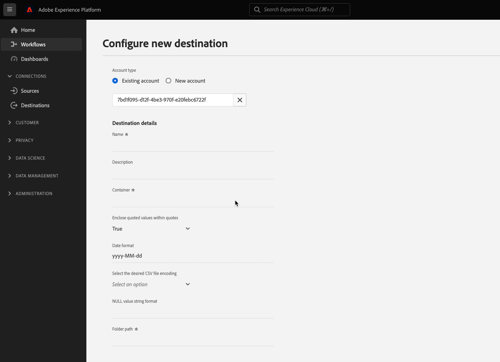

# 使用预定义的文件格式选项和自定义文件名配置配置SFTP目标

## 概述 {#overview}

>[!IMPORTANT]
>
>使用Adobe Experience Platform Destination SDK配置基于文件的目标的功能目前尚处于测试阶段。 文档和功能可能会发生更改。

本页介绍如何使用Destination SDK，通过预定义的默认SFTP目标配置 [文件格式选项](../../server-and-file-configuration.md#file-configuration) 和定制 [文件名配置](../../file-based-destination-configuration.md#file-name-configuration).

本页显示了可用于SFTP目标的所有配置选项。 您可以编辑以下步骤中显示的配置，也可以根据需要删除配置的某些部分。

## 先决条件 {#prerequisites}

在前进到下面概述的步骤之前，请阅读 [Destination SDK入门](../../getting-started.md) 页面，以了解有关获取使用Adobe I/OAPI所需的Destination SDK身份验证凭据以及其他先决条件的信息。

## 步骤1:创建服务器和文件配置 {#create-server-file-configuration}

首先使用 `/destination-server` 用于创建服务器和文件配置的端点。 有关HTTP请求中参数的详细描述，请阅读 [基于文件的目标的服务器和文件配置规范](../../server-and-file-configuration.md#sftp-example) 和关联的 [文件格式配置](../../server-and-file-configuration.md#file-configuration).

**API格式**

```http
POST platform.adobe.io/data/core/activation/authoring/destination-servers
```

**请求**

以下请求会创建一个新的目标服务器配置，该配置由有效负载中提供的参数进行配置。
以下负载包括通用的SFTP配置，其中包含预定义的默认值 [CSV文件格式](../../server-and-file-configuration.md#file-configuration) 配置参数，用户可以在Experience PlatformUI中定义这些参数。

```shell
curl -X POST https://platform.adobe.io/data/core/activation/authoring/destination-server \
 -H 'Authorization: Bearer {ACCESS_TOKEN}' \
 -H 'Content-Type: application/json' \
 -H 'x-gw-ims-org-id: {ORG_ID}' \
 -H 'x-api-key: {API_KEY}' \
 -H 'x-sandbox-name: {SANDBOX_NAME}' \
 -d '
{
    "name": "SFTP destination with predefined CSV formatting options",
    "destinationServerType": "FILE_BASED_SFTP",
    "fileBasedSFTPDestination": {
        "hostname": {
            "templatingStrategy": "NONE",
            "value": "{{customerData.hostname}}"
        },
        "rootDirectory": {
            "templatingStrategy": "PEBBLE_V1",
            "value": "{{customerData.remotePath}}"
        },
        "port": 22
    },
    "fileConfigurations": {
        "compression": {
            "templatingStrategy": "PEBBLE_V1",
            "value": "{{customerData.compression}}"
        },
        "fileType": {
            "templatingStrategy": "PEBBLE_V1",
            "value": "{{customerData.fileType}}"
        },
        "csvOptions": {
            "quote": {
                "templatingStrategy": "NONE",
                "value": "\""
            },
            "quoteAll": {
                "templatingStrategy": "NONE",
                "value": "false"
            },
            "escape": {
                "templatingStrategy": "NONE",
                "value": "\\"
            },
            "escapeQuotes": {
                "templatingStrategy": "NONE",
                "value": "true"
            },
            "header": {
                "templatingStrategy": "NONE",
                "value": "true"
            },
            "ignoreLeadingWhiteSpace": {
                "templatingStrategy": "NONE",
                "value": "true"
            },
            "ignoreTrailingWhiteSpace": {
                "templatingStrategy": "NONE",
                "value": "true"
            },
            "nullValue": {
                "templatingStrategy": "NONE",
                "value": ""
            },
            "dateFormat": {
                "templatingStrategy": "NONE",
                "value": "yyyy-MM-dd"
            },
            "timestampFormat": {
                "templatingStrategy": "NONE",
                "value": "yyyy-MM-dd'T':mm:ss[.SSS][XXX]"
            },
            "charToEscapeQuoteEscaping": {
                "templatingStrategy": "NONE",
                "value": "\\"
            },
            "emptyValue": {
                "templatingStrategy": "NONE",
                "value": ""
            }
        }
    }
}'
```

成功的响应会返回新的目标服务器配置，包括唯一标识符(`instanceId`)。 在下一步中根据需要存储此值。

## 步骤2:创建目标配置 {#create-destination-configuration}

在上一步中创建目标服务器和文件格式配置后，您现在可以使用 `/destinations` 用于创建目标配置的API端点。

要在 [步骤1](#create-server-file-configuration) 对于此目标配置，请将 `destinationServerId` 值，其中包含在 [步骤1](#create-server-file-configuration).

有关下面所用参数的详细说明，请参阅以下页面：

* [身份验证配置](../../authentication-configuration.md#sftp)
* [批量目标配置](../../file-based-destination-configuration.md#batch-configuration)
* [基于文件的目标配置API操作](../../destination-configuration-api.md#create-file-based)

**API格式**

```http
POST platform.adobe.io/data/core/activation/authoring/destinations
```

**请求**

```shell
curl -X POST https://platform.adobe.io/data/core/activation/authoring/destinations \
 -H 'Authorization: Bearer {ACCESS_TOKEN}' \
 -H 'Content-Type: application/json' \
 -H 'x-gw-ims-org-id: {ORG_ID}' \
 -H 'x-api-key: {API_KEY}' \
 -H 'x-sandbox-name: {SANDBOX_NAME}' \
 -d '
{
   "name":"SFTP destination with predefined CSV formatting options",
   "description":"SFTP destination with predefined CSV formatting options",
   "releaseNotes":"",
   "status":"TEST",
   "customerAuthenticationConfigurations":[
      {
         "authType":"SFTP_WITH_PASSWORD"
      },
      {
         "authType":"SFTP_WITH_SSH_KEY"
      }
   ],
   "customerEncryptionConfigurations":[
       
   ],
   "customerDataFields":[
      {
         "name":"remotePath",
         "title":"Root directory",
         "description":"Enter root directory",
         "type":"string",
         "isRequired":true,
         "readOnly":false,
         "hidden":false
      },
      {
         "name":"hostname",
         "title":"Hostname",
         "description":"Enter hostname",
         "type":"string",
         "isRequired":true,
         "readOnly":false,
         "hidden":false
      }
   ],
   "uiAttributes":{
      "documentationLink":"https://www.adobe.com/go/destinations-sftp-en",
      "category":"SFTP",
      "connectionType":"SFTP",
      "monitoringSupported":true,
      "flowRunsSupported":true,
      "frequency":"Batch"
   },
   "destinationDelivery":[
      {
         "deliveryMatchers":[
            {
               "type":"SOURCE",
               "value":[
                  "batch"
               ]
            }
         ],
         "authenticationRule":"CUSTOMER_AUTHENTICATION",
         "destinationServerId":"{{instanceID of your destination server}}"
      }
   ],
   "schemaConfig":{
      "profileRequired":true,
      "segmentRequired":true,
      "identityRequired":true
   },
   "batchConfig":{
      "allowMandatoryFieldSelection":true,
      "allowDedupeKeyFieldSelection":true,
      "defaultExportMode":"DAILY_FULL_EXPORT",
      "allowedExportMode":[
         "DAILY_FULL_EXPORT",
         "FIRST_FULL_THEN_INCREMENTAL"
      ],
      "allowedScheduleFrequency":[
         "DAILY",
         "EVERY_3_HOURS",
         "EVERY_6_HOURS",
         "EVERY_8_HOURS",
         "EVERY_12_HOURS",
         "ONCE"
      ],
      "defaultFrequency":"DAILY",
      "defaultStartTime":"00:00",
      "filenameConfig":{
         "allowedFilenameAppendOptions":[
            "SEGMENT_NAME",
            "DESTINATION_INSTANCE_ID",
            "DESTINATION_INSTANCE_NAME",
            "ORGANIZATION_NAME",
            "SANDBOX_NAME",
            "DATETIME",
            "CUSTOM_TEXT"
         ],
         "defaultFilenameAppendOptions":[
            "DATETIME"
         ],
         "defaultFilename":"%DESTINATION%_%SEGMENT_ID%"
      },
      "backfillHistoricalProfileData":true
   }
}'
```

成功的响应会返回新的目标配置，包括唯一标识符(`instanceId`)。 如果需要进一步发出HTTP请求以更新目标配置，请根据需要存储此值。

## 步骤3:验证Experience PlatformUI {#verify-ui}

根据上述配置，Experience Platform目录现在将显示一张供您使用的新专用目标卡。


在以下图像和录制中，请注意 [基于文件的目标的激活工作流](/help/destinations/ui/activate-batch-profile-destinations.md) 匹配您在目标配置中选择的选项。

在填写有关目标的详细信息时，请注意显示的字段是如何在配置中设置的自定义数据字段。

>[!TIP]
>
>向目标配置添加自定义数据字段的顺序未反映在UI中。 自定义数据字段始终按屏幕记录中显示的顺序显示。



在计划导出间隔时，请注意字段的显示方式是您在 `batchConfig` 配置。


查看文件名配置选项时，请注意显示的字段如何表示 `filenameConfig` 您在配置中设置的选项。


如果要调整上述任何字段，请重复 [步骤1](#create-server-file-configuration) 和 [二](#create-destination-configuration) 以根据您的需要修改配置。

## 步骤4:（可选）发布目标 {#publish-destination}

>[!NOTE]
>
>如果您要创建供自己使用的专用目标，并且不想将其发布到目标目录中以供其他客户使用，则无需执行此步骤。

配置目标后，使用 [目标发布API](../../destination-publish-api.md) 将配置提交到Adobe以供审核。

## 步骤5:（可选）记录目标 {#document-destination}

>[!NOTE]
>
>如果您要创建供自己使用的专用目标，并且不想将其发布到目标目录中以供其他客户使用，则无需执行此步骤。

如果您是独立软件供应商(ISV)或系统集成商(SI)，创建 [产品化集成](../../overview.md#productized-custom-integrations)，则使用 [自助文档流程](../../docs-framework/documentation-instructions.md) 要在 [Experience Platform目标目录](../../../catalog/overview.md).

## 后续步骤 {#next-steps}

通过阅读本文，您现在知道如何使用Destination SDK创作自定义SFTP目标。 接下来，您的团队可以使用 [基于文件的目标的激活工作流](../../../ui/activate-batch-profile-destinations.md) 将数据导出到目标。
