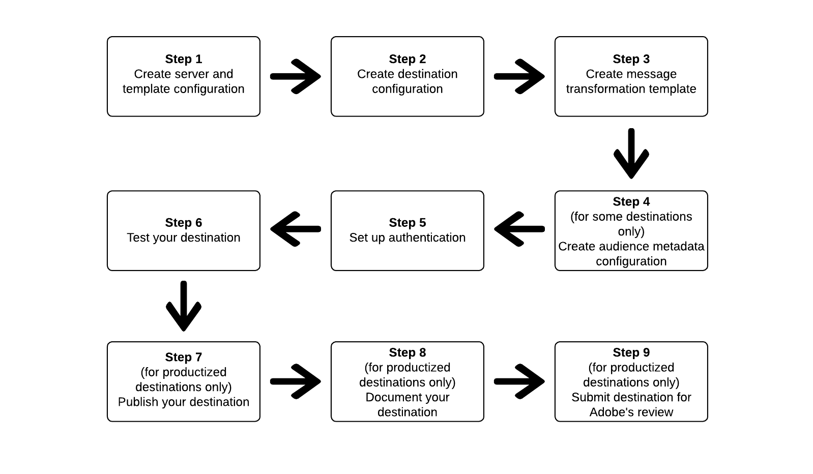

# 使用Destination SDK配置流目标

## 概述 {#overview}

本页介绍如何使用目标SDK[中的](../functionality/configuration-options.md)配置选项以及其他Destination SDK功能和API参考文档中的信息配置[流目标](../../destination-types.md#streaming-destinations)。 步骤按以下顺序排列。

## 先决条件 {#prerequisites}

在继续执行以下说明的步骤之前，请阅读[Destination SDK快速入门](../getting-started.md)页面，了解有关获取使用Destination SDK API所需的必要Adobe I/O身份验证凭据和其他先决条件的信息。 这假定您已完成伙伴关系和权限先决条件，并已准备好开始开发目标。

## 在Destination SDK中使用配置选项设置目标的步骤 {#steps}



## 步骤1：创建服务器和模板配置 {#create-server-template-configuration}

首先[使用](../authoring-api/destination-server/create-destination-server.md)端点创建服务器和模板配置`/destinations-server`。

下面显示了一个配置示例。 请注意，在步骤3 `requestBody.value`创建转换模板[中处理了](#create-transformation-template)参数中的消息转换模板。

```shell
POST platform.adobe.io/data/core/activation/authoring/destination-servers
```

```json {line-numbers="true" highlight="14"}
{
   "name":"Moviestar destination server",
   "destinationServerType":"URL_BASED",
   "urlBasedDestination":{
      "url":{
         "templatingStrategy":"PEBBLE_V1",
         "value":"https://api.moviestar.com/data/{{customerData.region}}/items"
      }
   },
   "httpTemplate":{
      "httpMethod":"POST",
      "requestBody":{
         "templatingStrategy":"PEBBLE_V1",
         "value":"insert after you create a template in step 3"
      },
      "contentType":"application/json"
   }
}
```

## 步骤2：创建目标配置 {#create-destination-configuration}

下面显示的是目标模板的示例配置，使用`/destinations` API端点创建。 有关详细信息，请参阅[创建目标配置](../authoring-api/destination-configuration/create-destination-configuration.md)。

若要将步骤1中的服务器和模板配置连接到此目标配置，请在此处添加服务器和模板配置的实例ID作为`destinationServerId`。

>[!IMPORTANT]
>
>要创建正确配置的实时（流）目标，您&#x200B;*必须*&#x200B;在`identityNamespaces`中添加至少一个目标身份，如下所示。 如果未配置目标标识，则用户将无法继续完成激活工作流的[映射步骤](../../ui/activate-segment-streaming-destinations.md#mapping)。

```shell
POST platform.adobe.io/data/core/activation/authoring/destinations
```

```json {line-numbers="true" highlight="74"}
{
   "name":"Moviestar",
   "description":"Moviestar is a fictional destination, used for this example.",
   "status":"TEST",
   "customerAuthenticationConfigurations":[
      {
         "authType":"BEARER"
      }
   ],
   "customerDataFields":[
      {
         "name":"endpointsInstance",
         "type":"string",
         "title":"Select Endpoint",
         "description":"Moviestar manages several instances across the globe for REST endpoints that our customers are provisioned for. Select your endpoint in the dropdown list.",
         "isRequired":true,
         "enum":[
            "US",
            "EU",
            "APAC",
            "NZ"
         ]
      },
      {
         "name":"customerID",
         "type":"string",
         "title":"Moviestar Customer ID",
         "description":"Your customer ID in the Moviestar destination (e.g. abcdef).",
         "isRequired":true,
         "pattern":""
      }
   ],
   "uiAttributes":{
      "documentationLink":"http://www.adobe.com/go/destinations-moviestar-en",
      "category":"mobile",
      "connectionType":"Server-to-server",
      "frequency":"Streaming"
   },
   "identityNamespaces":{
      "external_id":{
         "acceptsAttributes":true,
         "acceptsCustomNamespaces":true
      },
      "another_id":{
         "acceptsAttributes":true,
         "acceptsCustomNamespaces":true
      }
   },
   "segmentMappingConfig":{
      "mapExperiencePlatformSegmentName":false,
      "mapExperiencePlatformSegmentId":false,
      "mapUserInput":false
   },
   "audienceMetadataConfig":{
      "audienceTemplateId":"cbf90a70-96b4-437b-86be-522fbdaabe9c"
   },  
   "aggregation":{
      "aggregationType":"CONFIGURABLE_AGGREGATION",
      "configurableAggregation":{
         "aggregationPolicyId":null,
         "aggregationKey":{
            "includeSegmentId":true,
            "includeSegmentStatus":true,
            "includeIdentity":true,
            "oneIdentityPerGroup":true,
            "groups":null
         },
         "splitUserById":true,
         "maxBatchAgeInSecs":2400,
         "maxNumEventsInBatch":5000
      }
   },
   "destinationDelivery":[
      {
         "authenticationRule":"CUSTOMER_AUTHENTICATION",
         "destinationServerId":"9c77000a-4559-40ae-9119-a04324a3ecd4"
      }
   ]
}
```

## 步骤3：创建消息转换模板 — 使用模板化语言指定消息输出格式 {#create-transformation-template}

根据目标支持的负载，必须创建一个模板，将导出数据的格式从Adobe XDM格式转换为目标支持的格式。 请参阅[使用模板语言进行标识、属性和受众成员资格转换](../functionality/destination-server/message-format.md#using-templating)部分中的模板示例，并使用Adobe提供的[模板创作工具](../testing-api/streaming-destinations/create-template.md)。

创建适合您的消息转换模板后，将其添加到您在步骤1中创建的服务器和模板配置中。

```json {line-numbers="true" highlight="13-14"}
{
   "name":"Moviestar destination server",
   "destinationServerType":"URL_BASED",
   "urlBasedDestination":{
      "url":{
         "templatingStrategy":"PEBBLE_V1",
         "value":"https://api.moviestar.com/data/{{customerData.region}}/items"
      }
   },
   "httpTemplate":{
      "requestBody":{
         "templatingStrategy":"PEBBLE_V1",
         "value":"{\n    \"users\": [\n        \n            {{profile|raw}},\n        \n    ]\n}"
      },
      "contentType":"application/json"
   }
}
```

## 步骤4：创建受众元数据配置 {#create-audience-metadata-configuration}

对于某些目标，Destination SDK要求您将受众元数据配置配置为以编程方式创建、更新或删除目标中的受众。 有关何时需要设置此配置以及如何设置的信息，请参阅[受众元数据管理](../functionality/audience-metadata-management.md)。

如果使用受众元数据配置，则必须将其连接到在步骤2中创建的目标配置。 将受众元数据配置的实例ID作为`audienceTemplateId`添加到目标配置中。

```json {line-numbers="true" highlight="53"}
{
   "name":"Moviestar",
   "description":"Moviestar is a fictional destination, used for this example.",
   "status":"TEST",
   "customerAuthenticationConfigurations":[
      {
         "authType":"BEARER"
      }
   ],
   "customerDataFields":[
      {
         "name":"endpointsInstance",
         "type":"string",
         "title":"Select Endpoint",
         "description":"Moviestar manages several instances across the globe for REST endpoints that our customers are provisioned for. Select your endpoint in the dropdown list.",
         "isRequired":true,
         "enum":[
            "US",
            "EU",
            "APAC",
            "NZ"
         ]
      },
      {
         "name":"customerID",
         "type":"string",
         "title":"Moviestar Customer ID",
         "description":"Your customer ID in the Moviestar destination (e.g. abcdef).",
         "isRequired":true,
         "pattern":""
      }
   ],
   "uiAttributes":{
      "documentationLink":"http://www.adobe.com/go/destinations-moviestar-en",
      "category":"mobile",
      "connectionType":"Server-to-server",
      "frequency":"Streaming"
   },
   "identityNamespaces":{
      "external_id":{
         "acceptsAttributes":true,
         "acceptsCustomNamespaces":true
      },
      "another_id":{
         "acceptsAttributes":true,
         "acceptsCustomNamespaces":true
      }
   },
   "segmentMappingConfig":{
      "mapExperiencePlatformSegmentName":false,
      "mapExperiencePlatformSegmentId":false,
      "mapUserInput":false
   },
   "audienceMetadataConfig":{
      "audienceTemplateId":"cbf90a70-96b4-437b-86be-522fbdaabe9c"
   },   
   "aggregation":{
      "aggregationType":"CONFIGURABLE_AGGREGATION",
      "configurableAggregation":{
         "aggregationPolicyId":null,
         "aggregationKey":{
            "includeSegmentId":true,
            "includeSegmentStatus":true,
            "includeIdentity":true,
            "oneIdentityPerGroup":true,
            "groups":null
         },
         "splitUserById":true,
         "maxBatchAgeInSecs":2400,
         "maxNumEventsInBatch":5000
      }
   },
   "destinationDelivery":[
      {
         "authenticationRule":"CUSTOMER_AUTHENTICATION",
         "destinationServerId":"9c77000a-4559-40ae-9119-a04324a3ecd4"
      }
   ]
}
```


## 步骤5：设置身份验证 {#set-up-authentication}

根据您在上面的目标配置中指定`"authenticationRule": "CUSTOMER_AUTHENTICATION"`还是`"authenticationRule": "PLATFORM_AUTHENTICATION"`，可以使用`/destination`或`/credentials`端点为目标设置身份验证。

>[!NOTE]
>
>`CUSTOMER_AUTHENTICATION`是两个身份验证规则中比较常见的一个，如果您要求用户在设置连接和导出数据之前向您的目标提供某种形式的身份验证，则应该使用。

如果您在目标配置中选择了`"authenticationRule": "CUSTOMER_AUTHENTICATION"`，并且目标支持OAuth 2身份验证方法，请阅读[OAuth 2身份验证](../functionality/destination-configuration/oauth2-authorization.md)。

如果选择`"authenticationRule": "PLATFORM_AUTHENTICATION"`，则必须创建[凭据配置](../credentials-api/create-credential-configuration.md)，并在`authenticationId`目标投放[配置的](/help/destinations/destination-sdk/functionality/destination-configuration/destination-delivery.md#platform-authentication)参数中传递凭据对象的ID。

## 步骤6：测试您的目标 {#test-destination}

使用前面步骤中的配置端点设置目标后，您可以使用[目标测试工具](../testing-api/streaming-destinations/streaming-destination-testing-overview.md)来测试Adobe Experience Platform与您的目标之间的集成。

在测试目标的过程中，您必须使用Experience Platform UI创建区段，并将区段激活到目标。 有关如何在Experience Platform中创建受众的说明，请参阅以下两个资源：

* [创建受众文档页面](/help/segmentation/ui/audience-portal.md#create-audience)
* [创建受众视频演练](https://experienceleague.adobe.com/docs/platform-learn/tutorials/segments/create-segments.html?lang=zh-Hans)

## 步骤7：发布目标 {#publish-destination}

>[!NOTE]
>
>如果您正在创建供自己使用的专用目标，并且不想将其发布到目标目录以供其他客户使用，则不需要执行此步骤。

配置和测试目标后，使用[目标发布API](../publishing-api/create-publishing-request.md)将配置提交到Adobe以供审查。

## 步骤8：记录您的目标 {#document-destination}

>[!NOTE]
>
>如果您正在创建供自己使用的专用目标，并且不想将其发布到目标目录以供其他客户使用，则不需要执行此步骤。

如果您是创建[产品化集成](../overview.md#productized-custom-integrations)的独立软件供应商(ISV)或系统集成商(SI)，请使用[自助文档流程](../docs-framework/documentation-instructions.md)在[Experience Platform目标目录](/help/destinations/catalog/overview.md)中为您的目标创建产品文档页面。

## 步骤9：提交目标以供Adobe审查 {#submit-for-review}

>[!NOTE]
>
>如果您正在创建供自己使用的专用目标，并且不想将其发布到目标目录以供其他客户使用，则不需要执行此步骤。

最后，在Experience Platform目录中发布目标并对所有Experience Platform客户可见之前，您需要正式提交目标以供Adobe审核。 查找有关如何[提交以供审阅在Destination SDK](../guides/submit-destination.md)中创作的产品化目标的完整信息。
