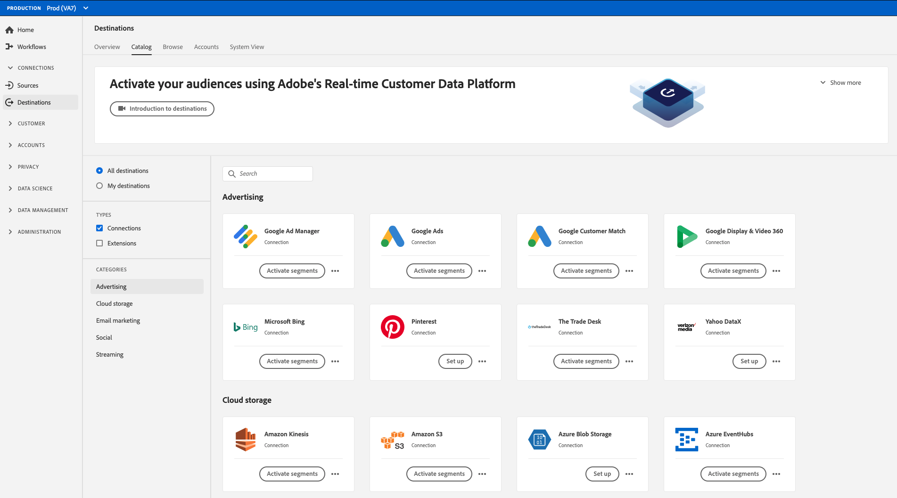

# Adobe Experience Platform Destination SDK

Adobe Experience Platform Destination SDK是一套配置API，可让您为Experience Platform配置目标集成模式，以根据所选的数据和身份验证格式将受众和配置文件数据交付到您的端点或存储位置。 配置存储在Experience Platform中，可以通过API检索以获取其他更新。

Destination SDK文档为您提供了相关说明，指导您使用Adobe Experience Platform Destination SDK配置、测试和发布与Adobe Experience Platform的生产化目标集成，并让您的目标成为不断增长的目标目录的一部分。 通过使用Destination SDK，您还可以创建自己的自定义专用目标，以导出根据您的需求定制的数据。

## 快速入门 — 探索基本信息 {#quick-start}

请查阅以下链接中的文档，以快速开始通过Destination SDK配置和提交目标。

>[!BEGINSHADEBOX]

<table style="border: 0;">
  <tbody>
    <tr>
        <td>
            
<b>配置页面</b>

            <ul>
                <li><a href="/help/destinations/destination-sdk/functionality/configuration-options.md">解释所有配置选项</a></li>
                <li> 目标服务器配置 — <a href="/help/destinations/destination-sdk/functionality/destination-server/server-specs.md">服务器规范</a>和<a href="/help/destinations/destination-sdk/functionality/destination-server/templating-specs.md">模板规范</a></li>
                <li><a href="/help/destinations/destination-sdk/functionality/destination-configuration/customer-data-fields.md">客户数据字段和其他目标配置组件</a></li>
                <li><a href="https://experienceleague.adobe.com/en/docs/experience-platform/destinations/destination-sdk/functionality/destination-server/message-format">模板化和宏</a></li>
            </ul>
        </td>
        <td>
            
<b>指南</b>

            <ul>
                <li><a href="/help/destinations/destination-sdk/overview.md#process">高级集成流程</a></li>
                <li><a href="/help/destinations/destination-sdk/guides/configure-destination-instructions.md">配置流目标</a></li>
                <li><a href="/help/destinations/destination-sdk/guides/configure-file-based-destination-instructions.md">配置基于文件的目标</a></li>
                <li><a href="/help/destinations/destination-sdk/guides/batch/configure-prospect-audience-destination.md">配置目标以导出目标客户配置文件</a></li>
                <li><a href="/help/destinations/destination-sdk/guides/submit-destination.md">提交目标以进行发布</a></li>
            </ul>
        </td>
                <td>
            
<b>API引用</b>

            <ul>
                <li><a href="https://developer.adobe.com/experience-platform-apis/references/destination-authoring/#tag/Destination-servers-and-templates">目标服务器端点API引用</a></li>
                <li><a href="https://developer.adobe.com/experience-platform-apis/references/destination-authoring/#tag/Destination-configurations">目标端点API引用</a></li>
                <li><a href="https://developer.adobe.com/experience-platform-apis/references/destination-authoring/#tag/Audience-metadata-templates">受众元数据API参考</a></li>
                <li><a href="https://developer.adobe.com/experience-platform-apis/references/destination-authoring/#tag/Destination-testing">测试API参考</a></li>
                <li><a href="https://developer.adobe.com/experience-platform-apis/references/destination-authoring/#tag/Destination-publishing">目标发布API参考</a></li>
            </ul>
        </td>
    </tr>
  </tbody>
</table>

<table style="border: 0;">
  <tbody>
    <tr>
        <td>
            
<b>配置流目标 — 速查表</b>

            <ul>
                <li><a href="/help/destinations/destination-sdk/guides/configure-destination-instructions.md">配置流目标端到端指南</a></li>
                <li><a href="/help/destinations/destination-sdk/functionality/destination-server/message-format.md">通过Pebble模板了解数据转换</a>和<a href="/help/destinations/destination-sdk/functionality/destination-server/supported-functions.md">查看支持的模板功能</a></li>
                <li><a href="/help/destinations/destination-sdk/functionality/destination-configuration/aggregation-policy.md">了解数据聚合策略</a></li>
                <li><a href="https://experienceleague.adobe.com/en/docs/experience-platform/destinations/destination-sdk/functionality/destination-server/message-format">实时配置示例</a></li>
                <li><a href="/help/destinations/destination-sdk/testing-api/streaming-destinations/streaming-destination-testing-overview.md">测试您的流目标</a></li>
            </ul>
        </td>
        <td>
            
<b>配置基于文件的目标 — 备忘单</b>

            <ul>
                <li><a href="/help/destinations/destination-sdk/guides/configure-file-based-destination-instructions.md">配置基于文件的目标端到端指南</a></li>
                <li><a href="/help/destinations/destination-sdk/guides/batch/configure-file-formatting-options.md">为导出的文件配置文件格式</a></li>
                <li><a href="/help/destinations/destination-sdk/guides/batch/configure-amazon-s3-destination-with-predefined-file-formatting.md">Amazon S3目标的实时配置示例</a></li>
                <li>用于文件导出计划和文件命名的<a href="/help/destinations/destination-sdk/functionality/destination-configuration/batch-configuration.md">批处理配置</a></li>
                <li><a href="/help/destinations/destination-sdk/testing-api/batch-destinations/file-based-destination-testing-overview.md">测试基于文件的目标</a></li>
            </ul>
        </td>
        <td>
            
<b>其他基本信息</b>

            <ul>
                <li><a href="/help/destinations/destination-sdk/getting-started.md#obtain-authentication-credentials">获取使用API所需的身份验证凭据</a></li>
                <li><a href="/help/destinations/destination-sdk/integration-prerequisites.md">集成先决条件</a></li>
                <li><a href="/help/destinations/destination-sdk/glossary.md">Destination SDK术语表</a></li>                
                <li><a href="/help/destinations/destination-sdk/functionality/rate-limiting-retry-policy.md">速率限制和重试策略</a></li>
                <li><a href="/help/destinations/destination-sdk/docs-framework/self-service-template.md">用于记录目标的自助模板</a></li>
            </ul>
        </td>
    </tr>
  </tbody>
</table>

>[!ENDSHADEBOX]

## 生产和自定义集成 {#productized-custom-integrations}

>[!IMPORTANT]
>
> 此功能仅适用于[Adobe Real-Time Customer Data Platform Ultimate](https://helpx.adobe.com/legal/product-descriptions/real-time-customer-data-platform.html)客户，可用于创建专用自定义目标。

作为Destination SDK合作伙伴，您可以将产品化的目标添加到[Experience Platform目录](../catalog/overview.md)，从而从中受益：

1. 使用预配置的参数标准化跨客户的集成配置并简化客户的设置体验。
2. 在Experience Platform目标目录中推出品牌目标卡，以简化客户设置和识别。
3. 作为与Adobe Experience Platform和Adobe Real-Time Customer Data Platform的产品化目标集成而受到追捧。

作为Experience Platform客户，您还可以创作自己的专用自定义目标，这最适合您的激活需求。

## 支持的集成类型 {#supported-integration-types}

### 实时（流）集成 {#real-time-integrations}

通过Destination SDK，Adobe Experience Platform支持与具有REST API端点的目标的实时（也称为流）集成。 与Experience Platform的实时集成支持以下功能：

* 报文转换和聚合
* 配置文件回填
* 可配置的元数据集成可初始化受众设置和数据传输
* 可配置的身份验证
* 一套测试和验证API，可供您测试和迭代目标配置

### 基于文件的集成 {#file-based-integrations}

通过Destination SDK，您还可以设置集成，以定期将文件导出到您选择的存储位置。 与Experience Platform的基于文件的集成支持以下功能：

* 以多种支持的格式(CSV、Parquet、JSON)导出文件
* 可配置的文件格式选项，利用这些选项可构建导出文件的格式以满足下游需求。

阅读[集成先决条件](integration-prerequisites.md)文章中目标端的技术要求，并阅读[配置选项](functionality/configuration-options.md)文章中支持的所有配置

## 访问Destination SDK {#get-access}

Destination SDK访问权限因您作为合作伙伴或Experience Platform、Real-Time CDP客户的身份而异。 有关更多信息，请参阅下表。

| 合作伙伴或客户的类型 | 如何访问Destination SDK |
|---------|----------|
| 独立软件供应商(ISV) | 加入[Adobe技术合作伙伴计划](https://partners.adobe.com/technologyprogram/experiencecloud.html)并请求获取Experience Platform沙盒以进行访问Destination SDK。 |
| 系统集成商(SI) | 您需要在[Adobe解决方案合作伙伴计划](https://solutionpartners.adobe.com/home.html)中处于金级或白金级才能配置Experience Platform沙盒并访问Destination SDK。 |
| [Real-Time CDP Ultimate包](https://helpx.adobe.com/legal/product-descriptions/real-time-customer-data-platform.html)上的Experience Platform客户 | 默认情况下，您有权访问Experience Platform沙盒和Destination SDK，从而允许您为组织构建专用目标。 |

{style="table-layout:auto"}

## 高级流程 {#process}

下面概述了在Experience Platform中配置目标的过程：

1. 如果您是ISV或SI，请参阅上文部分中的[获取访问权限](#get-access)信息。 [Real-Time CDP Ultimate包](https://helpx.adobe.com/legal/product-descriptions/real-time-customer-data-platform.html)客户可以跳过此步骤。
2. [请求预配Experience Platform沙盒](https://adobeexchangeec.zendesk.com/hc/en-us/articles/360037457812-Adobe-Experience-Platform-Sandbox-Accounts-Access-Adding-Users-and-Support)并启用目标创作权限。
3. 构建集成。 按照产品文档中的说明配置[流式目标](guides/configure-destination-instructions.md)或[基于文件的目标](guides/configure-file-based-destination-instructions.md)。
4. 测试您的集成。 按照产品文档中的说明测试[流式目标](testing-api/streaming-destinations/streaming-destination-testing-overview.md)或[基于文件的目标](testing-api/batch-destinations/file-based-destination-testing-overview.md)。
5. 如果您是创建[产品化集成](./overview.md#productized-custom-integrations)的ISV或SI，请[提交您的集成](guides/submit-destination.md)以供Adobe审查（标准响应时间为五个工作日）。
6. 如果您是创建产品化集成的ISV或SI，请使用[自助式文档流程](docs-framework/documentation-instructions.md)在Experience League上为您的目标创建产品文档页面。
7. 对于产品化集成，一旦获得Adobe批准，您的集成将显示在[Experience Platform目录](../catalog/overview.md)中。
8. 如果要更新集成，请按照相同的流程操作。

## 参考 {#reference}

Adobe建议您阅读并了解以下Experience Platform文档：

* [Adobe Experience Platform目标概述](https://experienceleague.adobe.com/docs/experience-platform/destinations/home.html?lang=zh-Hans)
* [XDM架构组合的基础](https://experienceleague.adobe.com/docs/experience-platform/xdm/schema/composition.html)
* [身份命名空间概述](https://experienceleague.adobe.com/docs/experience-platform/identity/namespaces.html?lang=zh-Hans)
