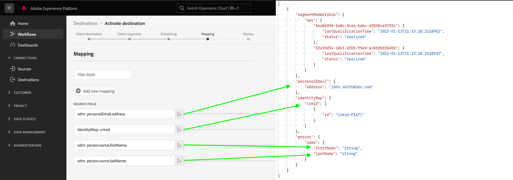

# 根据源架构生成示例用户档案

测试基于文件的目标的第一步是使用 `/sample-profiles` 端点，以根据您现有的源架构生成示例配置文件。

示例用户档案可帮助您了解用户档案的JSON结构。 此外，它们还为您提供了一个默认设置，您可以使用自己的配置文件数据进行自定义，以进一步进行目标测试。

## 快速入门 {#getting-started}

在继续之前，请查看 [入门指南](../../getting-started.md) 有关成功调用API所需的重要信息，包括如何获取所需的目标创作权限和所需标头。

## 先决条件 {#prerequisites}

在使用 `/sample-profiles` 端点，确保满足以下条件：

* 您已通过Destination SDK创建了一个基于文件的现有目标，您可以在 [目标目录](../../../ui/destinations-workspace.md).
* 您已在Experience PlatformUI中为目标至少创建了一个激活流程。 的 `/sample-profiles` 端点会根据您在激活流程中定义的源架构创建配置文件。 请参阅 [激活教程](../../../ui/activate-batch-profile-destinations.md) 了解如何创建激活流程。
* 要成功发出API请求，您需要与要测试的目标实例对应的目标实例ID。 在Platform UI中浏览与目标的连接时，从URL获取应在API调用中使用的目标实例ID。

   

## 生成目标测试的示例配置文件 {#generate-sample-profiles}

您可以通过向 `/sample-profiles` 包含要测试的目标的目标实例ID的端点。

**API格式**

```http
GET /authoring/sample-profiles?destinationInstanceId={DESTINATION_INSTANCE_ID}&count={NUMBER_OF_GENERATED_PROFILES}
```

| 查询参数 | 描述 |
| -------- | ----------- |
| `destinationInstanceId` | 要为其生成示例用户档案的目标实例的ID。 请参阅 [先决条件](#prerequisites) 部分以了解有关如何获取此ID的详细信息。 |
| `count` | *可选*. 要生成的示例用户档案数。 参数可以采用 `1 - 1000`. 如果未定义此属性，则API会生成一个示例配置文件。 |

**请求**

以下请求根据目标实例中定义的源架构以及相应的 `destinationInstanceId`.

```shell
curl -X GET 'https://platform.adobe.io/data/core/activation/authoring/sample-profiles?destinationInstanceId={DESTINATION_INSTANCE_ID}' \
 -H 'Authorization: Bearer {ACCESS_TOKEN}' \
 -H 'Content-Type: application/json' \
 -H 'x-gw-ims-org-id: {IMS_ORG}' \
 -H 'x-api-key: {API_KEY}' \
 -H 'x-sandbox-name: {SANDBOX_NAME}' \
```

**响应**

成功响应会返回具有指定数量的示例配置文件的HTTP状态200，其中区段成员资格、标识和配置文件属性与源XDM架构相对应。

>[!NOTE]
>
> 响应仅返回在目标实例中使用的区段成员资格、标识和配置文件属性。 即使源架构具有其他字段，也会忽略这些字段。

```json
[
   {
      "segmentMembership":{
         "ups":{
            "fea8d394-5a8c-4cea-bebc-df020ce37f5c":{
               "lastQualificationTime":"2022-01-13T11:33:28.211895Z",
               "status":"realized"
            },
            "5fa55d3a-18e1-4f65-95ed-ac8fdb03b45b":{
               "lastQualificationTime":"2022-01-13T11:33:28.211893Z",
               "status":"realized"
            }
         }
      },
      "personalEmail":{
         "address":"john.smith@abc.com"
      },
      "identityMap":{
         "crmid":[
            {
               "id":"crmid-P1A7l"
            }
         ]
      },
      "person":{
         "name":{
            "firstName":"string",
            "lastName":"string"
         }
      }
   }
]
```



| 属性 | 描述 |
| -------- | ----------- |
| `segmentMembership` | 描述个人区段成员资格的映射对象。 有关 `segmentMembership`，读取 [区段成员资格详细信息](../../../../xdm/field-groups/profile/segmentation.md). |
| `lastQualificationTime` | 此用户档案上次符合区段资格条件的时间戳。 |
| `status` | 一个字符串字段，用于指示区段成员资格是否已作为当前请求的一部分实现。 接受以下值： <ul><li>`realized`:用户档案是区段的一部分。</li><li>`exited`:该用户档案将作为当前请求的一部分退出该区段。</li></ul> |
| `identityMap` | 映射类型字段，用于描述个人的各种身份值及其关联的命名空间。 有关 `identityMap`，请参阅 [模式组合的基础](../../../../xdm/schema/composition.md#identityMap). |

{style="table-layout:auto"}

## API错误处理 {#api-error-handling}

Destination SDKAPI端点遵循常规Experience PlatformAPI错误消息原则。 请参阅 [API状态代码](../../../../landing/troubleshooting.md#api-status-codes) 和 [请求标头错误](../../../../landing/troubleshooting.md#request-header-errors) 平台疑难解答指南中。

## 后续步骤

阅读本文档后，您现在知道如何根据您在目标中配置的源架构生成示例用户档案 [激活流程](../../../ui/activate-batch-profile-destinations.md).

您现在可以自定义这些配置文件，或在API返回时使用它们， [测试基于文件的目标配置](file-based-destination-testing-api.md).
