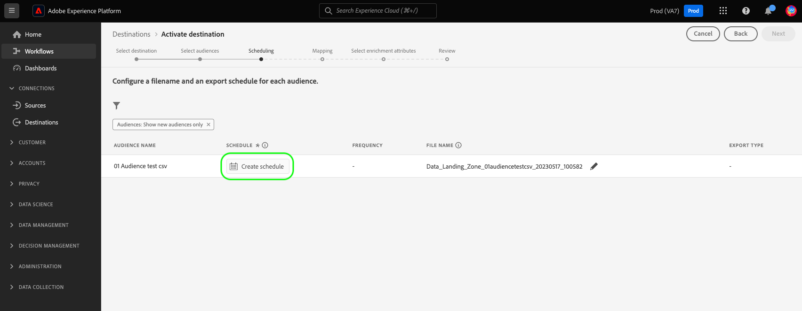

# 将受众数据激活到批量配置文件导出目标

>[!IMPORTANT]
> 
> * 要激活数据并启用 [映射步骤](#mapping) 的工作流，您需要 **[!UICONTROL 管理目标]**， **[!UICONTROL 激活目标]**， **[!UICONTROL 查看配置文件]**、和 **[!UICONTROL 查看区段]** [访问控制权限](/help/access-control/home.md#permissions).
> * 要激活数据，而不通过 [映射步骤](#mapping) 的工作流，您需要 **[!UICONTROL 管理目标]**， **[!UICONTROL 激活没有映射的区段]**， **[!UICONTROL 查看配置文件]**、和 **[!UICONTROL 查看区段]** [访问控制权限](/help/access-control/home.md#permissions).
> 
> 阅读 [访问控制概述](/help/access-control/ui/overview.md) 或与产品管理员联系以获取所需的权限。
>
> 一些参与改进文件导出功能测试计划的客户看到了新的 **[!UICONTROL 映射]** 步骤作为其激活工作流的一部分，转到 [新的测试版云存储目标](/help/release-notes/2022/october-2022.md#destinations). 另请注意 [已知限制](#known-limitations) 作为发行版的一部分。

## 概述 {#overview}

本文介绍了在基于用户档案的Adobe Experience Platform批量目标（如云存储和电子邮件营销目标）中激活受众数据所需的工作流程。

## 先决条件 {#prerequisites}

要将数据激活到目标，您必须已成功 [已连接到目标](./connect-destination.md). 如果您尚未这样做，请转到 [目标目录](../catalog/overview.md)，浏览支持的目标，并配置要使用的目标。

## 选择您的目标 {#select-destination}

1. 转到 **[!UICONTROL 连接>目标]**，并选择 **[!UICONTROL 目录]** 选项卡。

   

1. 选择 **[!UICONTROL 激活区段]** ，该页面位于要激活区段的目标的对应卡上，如下图所示。

   

1. 选择要用于激活区段的目标连接，然后选择 **[!UICONTROL 下一个]**.

   

1. 移到下一部分以 [选择您的区段](#select-segments).

## 选择您的区段 {#select-segments}

使用区段名称左侧的复选框可选择要激活到目标的区段，然后选择 **[!UICONTROL 下一个]**.


## 计划区段导出 {#scheduling}

>[!CONTEXTUALHELP]
>id="platform_destinations_activate_schedule"
>title="计划"
>abstract="使用铅笔图标设置文件导出类型（完整文件或增量文件）和导出频率。"

[!DNL Adobe Experience Platform] 以以下形式导出电子邮件营销和云存储目标的数据 [!DNL CSV] 文件。 在 **[!UICONTROL 计划]** 页面上，您可以为要导出的每个区段配置计划和文件名。 必须配置计划，但可以选择是否配置文件名。

>[!IMPORTANT]
> 
>[!DNL Adobe Experience Platform] 自动以每个文件500万条记录（行）拆分导出文件。 每一行表示一个配置文件。
>
>拆分文件名后附加一个数字，指示文件是较大导出的一部分，例如： `filename.csv`， `filename_2.csv`， `filename_3.csv`.

选择 **[!UICONTROL 创建计划]** 与要发送到目标的区段对应的按钮。



### 导出完整文件 {#export-full-files}

>[!CONTEXTUALHELP]
>id="platform_destinations_activate_exportoptions"
>title="文件导出选项"
>abstract="选择&#x200B;**导出全部文件**&#x200B;以导出符合区段资格的所有配置文件的完整快照。选择&#x200B;**导出增量文件**&#x200B;以仅导出自上次导出后符合区段资格的配置文件。<br>第一个增量文件导出包括符合区段资格的所有配置文件，充当回填。后续增量文件仅包含自第一个增量文件导出后符合区段资格的配置文件。"
>additional-url="https://experienceleague.adobe.com/docs/experience-platform/destinations/ui/activate/activate-batch-profile-destinations.html?lang=zh-Hans#export-incremental-files" text="导出增量文件"

>[!CONTEXTUALHELP]
>id="platform_destinations_activationchaining_aftersegmentevaluation"
>title="在区段评估后激活"
>abstract="在每日分段作业完成后立即运行激活。这将确保导出最新的配置文件。"

>[!CONTEXTUALHELP]
>id="platform_destinations_activationchaining_scheduled"
>title="计划的激活"
>abstract="激活在一天中的固定时间运行。"

选择 **[!UICONTROL 导出完整文件]** 触发导出包含选定区段的所有配置文件资格的完整快照的文件。


1. 使用 **[!UICONTROL 频率]** 选择器以选择导出频率：

   * **[!UICONTROL 一次]**：计划一次性的按需完整文件导出。
   * **[!UICONTROL 每日]**：计划每天在指定的时间导出一次完整文件。

1. 使用 **[!UICONTROL 时间]** 切换以选择导出是在区段评估后立即执行，还是在指定时间按计划执行。 选择 **[!UICONTROL 已计划]** 选项，则可以使用选择器选择一天中的时间，在 [!DNL UTC] 格式，应何时进行导出。

   >[!NOTE]
   >
   >此 **[!UICONTROL 区段评估后]** 下面描述的选项目前仅适用于部分Beta版客户。

   使用 **[!UICONTROL 区段评估后]** 用于使激活作业在每日平台批量分段作业完成后立即运行的选项。 这可确保在激活作业运行时，将最新的用户档案导出到您的目标。

   <!-- Batch segmentation currently runs at {{insert time of day}} and lasts for an average {{x hours}}. Adobe reserves the right to modify this schedule. -->

   
使用 **[!UICONTROL 已计划]** 选项使激活作业在固定时间运行。 这可以确保每天在同一时间导出Experience Platform用户档案数据，但您导出的用户档案可能不是最新的，具体取决于批量分段作业是否在激活作业启动之前完成。

   

   >[!IMPORTANT]
   >
   >由于内部Experience Platform进程的配置方式，第一次增量或完整文件导出可能不包含所有回填数据。 <br> <br> 为确保完整文件和增量文件的回填数据导出完整且最新，Adobe建议将首次文件导出时间设置为当天12 PM GMT之后。 此限制将在未来版本中解决。

1. 使用 **[!UICONTROL 日期]** 选择器来选择应进行导出的日期或时间间隔。 对于每日导出，最佳实践是将开始和结束日期设置为与下游平台中的促销活动持续时间一致。

   >[!IMPORTANT]
   >
   > 选择导出间隔时，该间隔的最后一天不包含在导出中。 例如，如果选择1月4日至11日之间的时间间隔，则最后一次文件导出将在1月10日进行。

1. 选择 **[!UICONTROL 创建]** 以保存计划。

### 导出增量文件 {#export-incremental-files}

选择 **[!UICONTROL 导出增量文件]** 触发导出，其中第一个文件是选定区段的所有配置文件资格的完整快照，后续文件是自上次导出以来的增量配置文件资格。

>[!IMPORTANT]
>
>第一个导出的增量文件包括符合区段条件的所有配置文件，它们用作回填。


1. 使用 **[!UICONTROL 频率]** 选择器以选择导出频率：

   * **[!UICONTROL 每日]**：计划每天在指定的时间导出一次增量文件。
   * **[!UICONTROL 每小时]**：计划每3、6、8或12小时导出一次增量文件。

1. 使用 **[!UICONTROL 时间]** 选择器以选择一天中的时间，在 [!DNL UTC] 格式，应何时进行导出。

   >[!IMPORTANT]
   >
   >由于内部Experience Platform进程的配置方式，第一次增量或完整文件导出可能不包含所有回填数据。 <br> <br> 为确保完整文件和增量文件的回填数据导出完整且最新，Adobe建议将首次文件导出时间设置为当天12 PM GMT之后。 此限制将在未来版本中解决。

1. 使用 **[!UICONTROL 日期]** 选择器来选择应进行导出的时间间隔。 最佳实践是将您的开始和结束日期设置为与下游平台中的促销活动持续时间一致。

   >[!IMPORTANT]
   >
   >间隔的最后一天不包含在导出中。 例如，如果选择1月4日至11日之间的时间间隔，则最后一次文件导出将在1月10日进行。

1. 选择 **[!UICONTROL 创建]** 以保存计划。

### 配置文件名 {#file-names}

>[!CONTEXTUALHELP]
>id="platform_destinations_activate_filename"
>title="配置文件名"
>abstract="对于基于文件的目标，为每个区段生成一个唯一的文件名。使用文件名编辑器可创建和编辑唯一文件名或保留默认名称。"

对于大多数目标，默认文件名由目标名称、区段ID以及日期和时间指示器组成。 例如，您可以编辑导出的文件名，以区分不同的促销活动，或者将数据导出时间附加到文件。 请注意，某些目标开发人员可能选择为其目标显示不同的默认文件名附加选项。

选择铅笔图标以打开模式窗口并编辑文件名。 文件名限制为255个字符。

>[!NOTE]
>
>下图显示了如何编辑的文件名 [!DNL Amazon S3] 目标，但所有批处理目标的过程都相同(例如SFTP、 [!DNL Azure Blob Storage]，或 [!DNL Google Cloud Storage])。


在文件名编辑器中，可以选择要添加到文件名的不同组件。


无法从文件名中删除目标名称和区段ID。 除了这些以外，您还可以添加以下内容：

| 文件名选项 | 描述 |
|---------|----------|
| **[!UICONTROL 区段名称]** | 导出区段的名称。 |
| **[!UICONTROL 日期和时间]** | 在添加之间选择 `MMDDYYYY_HHMMSS` 格式或生成文件时的Unix 10位数时间戳。 如果希望文件在每个增量导出时生成动态文件名，请选择以下选项之一。 |
| **[!UICONTROL 自定文本]** | 要添加到文件名的任何自定义文本。 |
| **[!UICONTROL 目标ID]** | 用于导出区段的目标数据流的ID。 <br> **注释**：此文件名附加选项仅适用于参与改进文件导出功能测试计划的测试版客户。 如果您希望访问测试版计划，请联系您的Adobe代表或客户关怀。 |
| **[!UICONTROL 目标名称]** | 用于导出区段的目标数据流的名称。 <br> **注释**：此文件名附加选项仅适用于参与改进文件导出功能测试计划的测试版客户。 如果您希望访问测试版计划，请联系您的Adobe代表或客户关怀。 |
| **[!UICONTROL 组织名称]** | Experience Platform中的组织名称。 <br> **注释**：此文件名附加选项仅适用于参与改进文件导出功能测试计划的测试版客户。 如果您希望访问测试版计划，请联系您的Adobe代表或客户关怀。 |
| **[!UICONTROL 沙盒名称]** | 用于导出区段的沙盒的ID。 <br> **注释**：此文件名附加选项仅适用于参与改进文件导出功能测试计划的测试版客户。 如果您希望访问测试版计划，请联系您的Adobe代表或客户关怀。 |

{style="table-layout:auto"}

选择 **[!UICONTROL 应用更改]** 以确认您的选择。

>[!IMPORTANT]
> 
>如果您不选择 **[!UICONTROL 日期和时间]** 组件，文件名将是静态的，并且新导出的文件将使用每次导出覆盖存储位置中的上一个文件。 将周期性导入作业从存储位置运行到电子邮件营销平台时，这是推荐的选项。

配置完所有区段后，选择 **[!UICONTROL 下一个]** 以继续。

## 选择配置文件属性 {#select-attributes}

对于基于配置文件的目标，您必须选择要发送到目标目标的配置文件属性。

1. 在 **[!UICONTROL 选择属性]** 页面，选择 **[!UICONTROL 添加新字段]**.

   

1. 选择右侧的箭头 **[!UICONTROL 架构字段]** 登入。

   

1. 在 **[!UICONTROL 选择字段]** 页面上，选择要发送到目标的XDM属性或身份命名空间，然后选择 **[!UICONTROL 选择]**.

   

1. 要添加更多映射，请重复步骤1至3。

>[!NOTE]
>
> Adobe Experience Platform会使用架构中的四个推荐的常用属性来预填充您的选择： `person.name.firstName`， `person.name.lastName`， `personalEmail.address`， `segmentMembership.status`.

>[!IMPORTANT]
>
>由于已知限制，您当前无法使用 **[!UICONTROL 选择字段]** 要添加的窗口 `segmentMembership.status` 到您的文件导出。 相反，您需要手动粘贴值 `xdm: segmentMembership.status` “架构”字段中，如下所示。
>
>

文件导出将以下列方式有所不同，具体取决于是否 `segmentMembership.status` 已选中：
* 如果 `segmentMembership.status` 字段已选定，导出的文件包括 **[!UICONTROL 活动]** 初始完整快照中的成员和 **[!UICONTROL 活动]** 和 **[!UICONTROL 已过期]** 后续增量导出中的成员。
* 如果 `segmentMembership.status` 未选择字段，导出的文件仅包括 **[!UICONTROL 活动]** 初始完整快照和后续增量导出中的成员。


### 必需属性 {#mandatory-attributes}

>[!CONTEXTUALHELP]
>id="platform_destinations_activate_mandatorykey"
>title="关于强制属性"
>abstract="选择所有导出的配置文件应包含的 XDM 架构属性。不会将没有强制密钥的配置文件导出到目标。不选择强制密钥会导出所有合格的配置文件，而不管其属性如何。"

强制属性是用户启用的复选框，可确保所有配置文件记录都包含所选属性。 例如：所有导出的用户档案都包含电子邮件地址&#x200B;。

您可以将属性标记为必需，以确保 [!DNL Platform] 仅导出包含特定属性的配置文件。 因此，可以将其用作其他形式的筛选。 将属性标记为必填字段是 **非** 必需。

不选择强制属性会导出所有符合条件的配置文件，而不管其属性如何。

建议其中一个属性为 [唯一标识符](../../destinations/catalog/email-marketing/overview.md#identity) 从您的架构中。 有关强制属性的更多信息，请参阅 [电子邮件营销目标](../../destinations/catalog/email-marketing/overview.md#identity) 文档。

### 重复数据删除键 {#deduplication-keys}

>[!CONTEXTUALHELP]
>id="platform_destinations_activate_deduplicationkey"
>title="关于删除重复项键"
>abstract="通过选择删除重复项键，消除导出文件中同一配置文件的多条记录。选择一个命名空间或最多两个 XDM 架构属性作为删除重复项键。不选择删除重复项键可能会导致导出文件中出现重复的配置文件条目。"

重复数据删除键是用户定义的主键，可确定用户希望为其配置文件进行重复数据删除的身份&#x200B;。

重复数据删除键消除了在一个导出文件中拥有同一配置文件的多个记录的可能性。

有三种方法可以在中使用重复数据删除键 [!DNL Platform]：

* 使用单个身份命名空间作为 [!UICONTROL 重复数据删除键]
* 使用 [!DNL XDM] 个人资料作为a [!UICONTROL 重复数据删除键]
* 使用来自的两种配置文件属性的组合 [!DNL XDM] 配置文件作为复合键

>[!IMPORTANT]
>
> 您可以将单个身份命名空间导出到目标，并且该命名空间会自动设置为重复数据删除键。 不支持向目标发送多个命名空间。
> 
> 不能将身份命名空间和配置文件属性的组合用作重复数据删除键。

### 去重示例 {#deduplication-example}

此示例说明了重复数据删除的工作方式，具体取决于所选的重复数据删除键。

让我们考虑以下两个配置文件。

**用户档案A**

```json
{
  "identityMap": {
    "Email": [
      {
        "id": "johndoe_1@example.com"
      },
      {
        "id": "johndoe_2@example.com"
      }
    ]
  },
  "segmentMembership": {
    "ups": {
      "fa5c4622-6847-4199-8dd4-8b7c7c7ed1d6": {
        "status": "realized",
        "lastQualificationTime": "2021-03-10 10:03:08"
      }
    }
  },
  "person": {
    "name": {
      "lastName": "Doe",
      "firstName": "John"
    }
  },
  "personalEmail": {
    "address": "johndoe@example.com"
  }
}
```

**配置文件B**

```json
{
  "identityMap": {
    "Email": [
      {
        "id": "johndoe_1@example.com"
      },
      {
        "id": "johndoe_2@example.com"
      }
    ]
  },
  "segmentMembership": {
    "ups": {
      "fa5c4622-6847-4199-8dd4-8b7c7c7ed1d6": {
        "status": "realized",
        "lastQualificationTime": "2021-04-10 11:33:28"
      }
    }
  },
  "person": {
    "name": {
      "lastName": "D",
      "firstName": "John"
    }
  },
  "personalEmail": {
    "address": "johndoe@example.com"
  }
}
```

### 重复数据删除用例1：无重复数据删除 {#deduplication-use-case-1}

如果不使用重复数据删除，导出文件将包含以下条目。

| 个人电子邮件 | 名字 | 姓氏 |
|---|---|---|
| johndoe@example.com | John | Doe |
| johndoe@example.com | John | D |


### 重复数据删除用例2：基于身份命名空间进行重复数据删除 {#deduplication-use-case-2}

假设重复数据删除由 [!DNL Email] 命名空间中，导出文件将包含以下条目。 配置文件B是符合区段资格条件的最新配置文件，因此它是唯一导出的。

| 电子邮件* | 个人电子邮件 | 名字 | 姓氏 |
|---|---|---|---|
| johndoe_1@example.com | johndoe@example.com | John | D |
| johndoe_2@example.com | johndoe@example.com | John | D |

### 重复数据删除用例3：基于单个配置文件属性进行重复数据删除 {#deduplication-use-case-3}

假设重复数据删除由 `personal Email` 属性，导出文件将包含以下条目。 配置文件B是符合区段资格条件的最新配置文件，因此它是唯一导出的。

| 个人电子邮件* | 名字 | 姓氏 |
|---|---|---|
| johndoe@example.com | John | D |


### 重复数据删除用例4：基于两个用户档案属性进行重复数据删除 {#deduplication-use-case-4}

假定通过复合键进行重复数据删除 `personalEmail + lastName`，则导出文件将包含以下条目。

| 个人电子邮件* | 姓氏* | 名字 |
|---|---|---|
| johndoe@example.com | D | John |
| johndoe@example.com | Doe | John |


Adobe建议选择身份命名空间，例如 [!DNL CRM ID] 或电子邮件地址作为重复数据删除键，以确保唯一标识所有配置文件记录。

>[!NOTE]
> 
>如果有任何数据使用标签应用于数据集内的某些字段（而不是整个数据集），则在激活时强制实施这些字段级别标签将在以下条件下发生：
>
>* 这些字段在区段定义中使用。
>* 这些字段配置为目标目标的投影属性。
>
> 例如，如果字段 `person.name.firstName` 具有与目标的营销操作冲突的特定数据使用标签，则会在查看步骤中向您显示数据使用策略违规。 有关更多信息，请参阅 [Adobe Experience Platform中的数据治理](../../rtcdp/privacy/data-governance-overview.md#destinations).

## (Beta)映射 {#mapping}

>[!IMPORTANT]
> 
>部分Beta版客户可以查看已改进的 **[!UICONTROL 映射]** 步骤，用于替换 [选择配置文件属性](#select-attributes) 步骤。 此新 **[!UICONTROL 映射]** 步骤允许您将导出文件的标头编辑为所需的任何自定义名称。
> 
> 功能和文档可能会发生更改。 如果您希望访问此Beta计划，请联系您的Adobe代表或客户关怀。

在此步骤中，必须选择要添加到导出到目标目标的文件的配置文件属性。 要选择要导出的配置文件属性和标识，请执行以下操作：

1. 在 **[!UICONTROL 映射]** 页面，选择 **[!UICONTROL 添加新字段]**.

   

1. 选择右侧的箭头 **[!UICONTROL 源字段]** 登入。

   

1. 在 **[!UICONTROL 选择源字段]** 页面上，选择要包含在导出到目标文件中的配置文件属性和身份，然后选择 **[!UICONTROL 选择]**.

   >[!TIP]
   > 
   >您可以使用搜索字段缩小选择范围，如下图所示。

   


1. 您选择导出的字段现在显示在映射视图中。 如果需要，可以编辑导出文件中的标头名称。 要实现此目的，请选择目标字段上的图标。

   

1. 在 **[!UICONTROL 选择目标字段]** 页面中，在导出的文件中键入所需的标头名称，然后选择 **[!UICONTROL 选择]**.

   

1. 您选择导出的字段现在显示在映射视图中，并在导出的文件中显示编辑后的标题。

   

1. （可选）您可以将导出的字段选择为 [必需键](#mandatory-keys) 或 [重复数据删除键](#deduplication-keys).

   

1. 要添加更多字段进行导出，请重复上述步骤。

### 已知限制 {#known-limitations}

新 **[!UICONTROL 映射]** 页面具有以下已知限制：

#### 无法通过映射工作流选择区段成员资格属性

由于已知限制，您当前无法使用 **[!UICONTROL 选择字段]** 要添加的窗口 `segmentMembership.status` 到您的文件导出。 相反，您需要手动粘贴值 `xdm: segmentMembership.status` “架构”字段中，如下所示。


文件导出将以下列方式有所不同，具体取决于是否 `segmentMembership.status` 已选中：
* 如果 `segmentMembership.status` 字段已选定，导出的文件包括 **[!UICONTROL 活动]** 初始完整快照中的成员和 **[!UICONTROL 活动]** 和 **[!UICONTROL 已过期]** 后续增量导出中的成员。
* 如果 `segmentMembership.status` 未选择字段，导出的文件仅包括 **[!UICONTROL 活动]** 初始完整快照和后续增量导出中的成员。

#### 当前无法选择要导出的身份命名空间

当前不支持选择要导出的身份命名空间，如下图所示。 选择要导出的任何身份命名空间都将导致以下错误： **[!UICONTROL 审核]** 步骤。


作为临时解决方法，如果您在测试版期间需要向导出的文件添加身份命名空间，您可以：
* 对于要在导出中包含身份命名空间的数据流，请使用旧版云存储目标
* 将身份作为属性上传到Experience Platform，然后将其导出到云存储目标。

## 请查看 {#review}

在 **[!UICONTROL 审核]** 页面时，您可以看到所选内容的摘要。 选择 **[!UICONTROL 取消]** 来打破气流， **[!UICONTROL 返回]** 修改设置，或者 **[!UICONTROL 完成]** 以确认您的选择并开始向目标发送数据。


### 同意政策评估 {#consent-policy-evaluation}

>[!CONTEXTUALHELP]
>id="platform_governance_policies_viewApplicableConsentPolicies"
>title="查看适用的同意策略"
>abstract="如果您的组织购买了 **Adobe Healthcare Shield** 或 **Adobe Privacy &amp; Security Shield**，请选择&#x200B;**[!UICONTROL 查看适用的同意策略]**&#x200B;以查看应用了哪些同意策略以及作为其结果包含在激活中的配置文件数量。如果您的公司无权访问上述 SKU，则此控件将被禁用。"

如果您的组织购买了 **Adobe Healthcare Shield** 或 **Adobe Privacy &amp; Security Shield**，请选择&#x200B;**[!UICONTROL 查看适用的同意策略]**&#x200B;以查看应用了哪些同意策略以及作为其结果包含在激活中的配置文件数量。阅读关于 [同意政策评估](/help/data-governance/enforcement/auto-enforcement.md#consent-policy-evaluation) 了解更多信息。

### 数据使用策略检查 {#data-usage-policy-checks}

在 **[!UICONTROL 审核]** 步骤，Experience Platform还会检查是否存在任何数据使用策略违规。 下面显示了一个违反策略的示例。 在解决违规之前，无法完成区段激活工作流。 有关如何解决策略违规的信息，请参阅 [数据使用策略违规](/help/data-governance/enforcement/auto-enforcement.md#data-usage-violation) 在数据治理文档部分中。


### 过滤区段 {#filter-segments}

此外，在此步骤中，您可以使用页面上的可用过滤器仅显示其计划或映射已作为此工作流的一部分更新的区段。 您还可以切换要查看的表列。


如果您对您的选择感到满意，并且未检测到违反策略的情况，请选择 **[!UICONTROL 完成]** 以确认您的选择并开始向目标发送数据。

## 验证区段激活 {#verify}

对于电子邮件营销目标和云存储目标，Adobe Experience Platform将创建 `.csv` 文件存储位置。 预计会根据您在工作流中设置的计划，在您的存储位置创建一个新文件。 默认文件格式如下所示，但您可以 [编辑文件名的组件](#file-names)：
`<destinationName>_segment<segmentID>_<timestamp-yyyymmddhhmmss>.csv`

例如，如果您选择了每日导出频率，则您连续三天收到的文件可能如下所示：

```console
Salesforce_Marketing_Cloud_segment12341e18-abcd-49c2-836d-123c88e76c39_20200408061804.csv
Salesforce_Marketing_Cloud_segment12341e18-abcd-49c2-836d-123c88e76c39_20200409052200.csv
Salesforce_Marketing_Cloud_segment12341e18-abcd-49c2-836d-123c88e76c39_20200410061130.csv
```

这些文件在您的存储位置中存在就是成功激活的确认。 要了解导出文件的结构，您可以 [下载示例.csv文件](../assets/common/sample_export_file_segment12341e18-abcd-49c2-836d-123c88e76c39_20200408061804.csv). 此示例文件包含配置文件属性 `person.firstname`， `person.lastname`， `person.gender`， `person.birthyear`、和 `personalEmail.address`.
