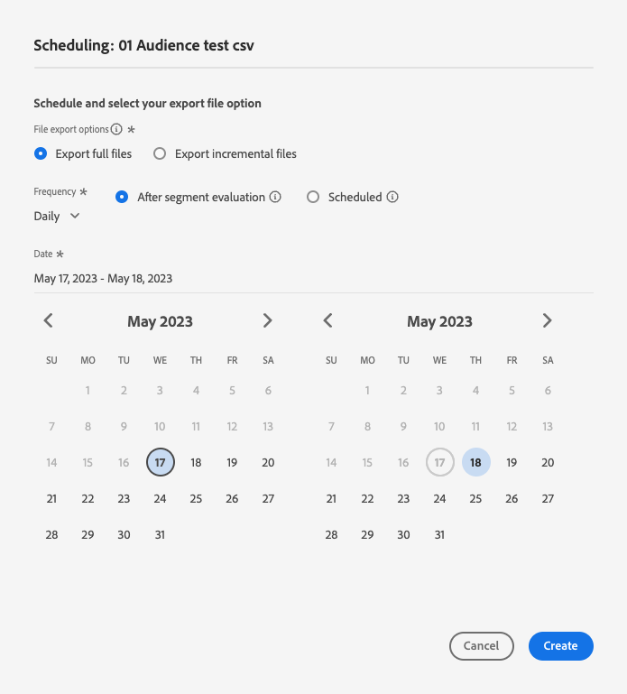
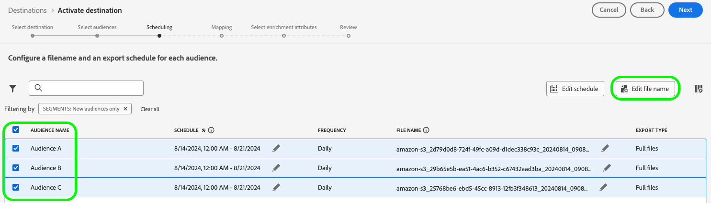

# 将受众激活到批量配置文件导出目标

>[!IMPORTANT]
> 
>* 要激活受众并启用工作流的[映射步骤](#mapping)，您需要&#x200B;**[!UICONTROL View Destinations]**、**[!UICONTROL Activate Destinations]**、**[!UICONTROL View Profiles]**&#x200B;和&#x200B;**[!UICONTROL View Segments]** [访问控制权限](/help/access-control/home.md#permissions)。
>* 要激活受众而不执行工作流的[映射步骤](#mapping)，您需要&#x200B;**[!UICONTROL View Destinations]**、**[!UICONTROL Activate Segment without Mapping]**、**[!UICONTROL View Profiles]**&#x200B;和&#x200B;**[!UICONTROL View Segments]** [访问控制权限](/help/access-control/home.md#permissions)。
>* 要导出&#x200B;*标识*，您需要&#x200B;**[!UICONTROL View Identity Graph]** [访问控制权限](/help/access-control/home.md#permissions)。<br> {width="100" zoomable="yes"}
> 
> 阅读[访问控制概述](/help/access-control/ui/overview.md)或联系您的产品管理员以获取所需的权限。

## 概述 {#overview}

本文介绍了在Adobe Experience Platform中激活受众以批量处理基于文件的目标（如云存储和电子邮件营销目标）所需的工作流。

## 先决条件 {#prerequisites}

要将受众激活到目标，您必须已成功[连接到目标](./connect-destination.md)。 如果您尚未这样做，请转到[目标目录](../catalog/overview.md)，浏览支持的目标，然后配置要使用的目标。

## 支持的导出文件格式 {#supported-file-formats-export}

导出受众时支持以下文件格式：

* CSV
* JSON
* Parquet

请注意，导出CSV文件可让您在构建导出文件的结构方面拥有更大的灵活性。 阅读有关CSV文件[文件格式配置的更多信息](/help/destinations/ui/batch-destinations-file-formatting-options.md#file-configuration)。

选择所需的文件格式，以便在[创建与基于文件的目标](/help/destinations/ui/connect-destination.md)的连接时导出。

## 选择您的目标 {#select-destination}

1. 转到&#x200B;**[!UICONTROL Connections > Destinations]**，然后选择&#x200B;**[!UICONTROL Catalog]**&#x200B;选项卡。

   

1. 在与您要激活受众的目标对应的卡片中选择&#x200B;**[!UICONTROL Activate audiences]**，如下图所示。

   

1. 选择要用于激活受众的目标连接，然后选择&#x200B;**[!UICONTROL Next]**。

   

1. 移到下一部分以[选择您的受众](#select-audiences)。

## 选择您的受众 {#select-audiences}

要选择要激活到目标的受众，请使用受众名称左侧的复选框，然后选择&#x200B;**[!UICONTROL Next]**。

您可以从多种类型的受众中进行选择，具体取决于其来源：

* **[!UICONTROL Segmentation Service]**：分段服务在Experience Platform中生成的受众。 有关详细信息，请参阅[分段文档](../../segmentation/ui/overview.md)。
* **[!UICONTROL Custom upload]**：受众在Experience Platform之外生成，并以CSV文件形式上传到Experience Platform。 要了解有关外部受众的更多信息，请参阅有关[导入受众](../../segmentation/ui/audience-portal.md#import-audience)的文档。 选择源自&#x200B;**[!UICONTROL Custom uploads]**&#x200B;的受众会自动启用[选择扩充属性](#select-enrichment-attributes)步骤。
* 其他类型的受众，来自其他Adobe解决方案，如[!DNL Audience Manager]。

>[!IMPORTANT]
>
>将自定义上传受众激活到基于文件的批处理目标时，您可以在数据流中激活10个此类受众的限制。


>[!TIP]
>
>要从现有激活流中删除受众，请使用&#x200B;**[!UICONTROL Activation data]**&#x200B;页面。 阅读有关如何[从激活流](../ui/destination-details-page.md#bulk-remove)中删除多个受众的部分以了解详细信息。

## 计划受众导出 {#scheduling}

>[!CONTEXTUALHELP]
>id="platform_destinations_activate_schedule"
>title="计划"
>abstract="使用铅笔图标设置文件导出类型（完整文件或增量文件）和导出频率。"

>[!CONTEXTUALHELP]
>id="platform_destinations_activate_schedule_weekly_messaging"
>title="每周导出"
>abstract="<sup>*</sup> 选择开始日期，后续导出将在一周的这一天进行，直到选定的结束日期。"

>[!CONTEXTUALHELP]
>id="platform_destinations_activate_schedule_monthly_messaging"
>title="每月导出"
>abstract="<sup>*</sup> 选择开始日期，后续导出将在一个月的这一天进行，直到选定的结束日期。对于少于 30 或 31 天的月份，导出将在该月的最后一天进行。"

[!DNL Adobe Experience Platform]将电子邮件营销和云存储目标的数据导出为[不同的文件类型](#supported-file-formats-export)。 在&#x200B;**[!UICONTROL Scheduling]**&#x200B;页面中，您可以为要导出的每个受众配置计划和文件名。

Experience Platform会自动为每次文件导出设置默认计划。 您可以根据需要修改默认计划，方法是选择每个计划旁边的铅笔图标，并定义自定义计划。


要同时编辑多个计划，请使用屏幕左侧的复选框选择受众，然后选择&#x200B;**[!UICONTROL Edit schedule]**。 然后，您配置的计划将被应用于选定受众的所有导出文件。


>[!TIP]
>
>您可以从&#x200B;**[!UICONTROL Activation data]**&#x200B;页面编辑现有激活流的受众激活计划。 有关详细信息，请参阅有关[批量编辑激活计划](../ui/destination-details-page.md#bulk-edit-schedule)的文档。

>[!IMPORTANT]
>
>[!DNL Adobe Experience Platform]以每个文件500万条记录（行）自动拆分导出文件。 每一行表示一个配置文件。
>
>拆分文件名后附加一个数字，指示文件是较大导出的一部分，例如： `filename.csv`、`filename_2.csv`、`filename_3.csv`。

### 导出全部文件 {#export-full-files}

>[!CONTEXTUALHELP]
>id="platform_destinations_activate_exportoptions"
>title="文件导出选项"
>abstract="选择&#x200B;**导出全部文件**&#x200B;以导出符合受众资格的所有轮廓的完整快照。选择&#x200B;**导出增量文件**&#x200B;以仅导出自上次导出后符合受众资格的轮廓。<br>第一个增量文件导出包括符合受众资格的所有轮廓，充当回填。后续增量文件仅包含自第一个增量文件导出后符合受众资格的轮廓。"
>additional-url="https://experienceleague.adobe.com/docs/experience-platform/destinations/ui/activate/activate-batch-profile-destinations.html#export-incremental-files" text="导出增量文件"

>[!CONTEXTUALHELP]
>id="platform_destinations_activationchaining_aftersegmentevaluation"
>title="在受众评估后激活"
>abstract="<p>在每日分段作业完成后立即运行激活。这将确保导出最新的轮廓。</p><p>受众评估后导出轮廓的选项<i>不</i>适用于每周和每月的导出频率。</p>"

>[!CONTEXTUALHELP]
>id="platform_destinations_activationchaining_scheduled"
>title="计划的激活"
>abstract="激活在一天中的固定时间运行。"

选择&#x200B;**[!UICONTROL Export full files]**&#x200B;以触发导出包含所选受众的所有配置文件资格的完整快照的文件。



1. 使用&#x200B;**[!UICONTROL Frequency]**&#x200B;选择器选择导出频率：

   * **[!UICONTROL Once]**：计划一次按需完整文件导出。
   * **[!UICONTROL Daily]**：计划每天在指定的时间导出一次完整文件。
   * **[!UICONTROL Weekly]**：选择开始日期，后续导出将发生在一周的该日，直到所选的结束日期。
   * **[!UICONTROL Monthly]**：选择开始日期，后续导出将在该月的该日期进行，直到所选的结束日期为止。 对于少于 30 或 31 天的月份，导出将在该月的最后一天进行。

   >[!NOTE]
   >
   > 当前仅基于文件的以下云存储目标支持每周和每月计划选项，并且仅在激活[人员受众](../../segmentation/types/overview.md#people-audience)和[潜在受众](../../segmentation/types/overview.md#prospect-audience)时支持。
   > 
   > * [Amazon S3](../catalog/cloud-storage/amazon-s3.md)
   > * [Azure Blob存储](../catalog/cloud-storage/azure-blob.md)
   > * [数据登陆区](../catalog/cloud-storage/data-landing-zone.md)
   > * [Google云存储](../catalog/cloud-storage/google-cloud-storage.md)
   > * [SFTP](../catalog/cloud-storage/sftp.md)
   > 
   > 每周和每月计划选项不适用于其他目标类型。

2. 使用&#x200B;**[!UICONTROL Time]**&#x200B;切换开关可选择导出是在受众评估后立即执行，还是在指定时间按计划执行。 在选择&#x200B;**[!UICONTROL Scheduled]**&#x200B;选项时，您可以使用选择器以[!DNL UTC]格式选择何时进行导出。

   使用&#x200B;**[!UICONTROL After segment evaluation]**&#x200B;选项可在每日Experience Platform批处理分段作业完成后立即运行激活作业。 此选项可确保当激活作业运行时，将最新的配置文件导出到您的目标。 这可能会导致根据您的操作，每天多次导出受众。

   >[!IMPORTANT]
   >
   >如果您对已设置为在区段评估后激活的受众运行[灵活受众评估](../../segmentation/ui/audience-portal.md#flexible-audience-evaluation)，则无论之前有任何每日激活作业，这些受众都会在灵活受众评估作业完成后立即激活。这可能会导致根据您的操作，每天多次导出受众。

   <!-- Batch segmentation currently runs at {{insert time of day}} and lasts for an average {{x hours}}. Adobe reserves the right to modify this schedule. -->

   
使用&#x200B;**[!UICONTROL Scheduled]**&#x200B;选项可让激活作业在固定时间运行。 此选项可确保每天在同一时间导出Experience Platform配置文件数据。 但是，您导出的用户档案可能不是最新的，具体取决于批量分段作业是否在激活作业开始之前完成。

   

   >[!IMPORTANT]
   >
   >在映射过去24小时内创建并通过[批量分段](../../segmentation/methods/batch-segmentation.md)评估的受众时，请将每日导出计划设置为至少从第二天开始。 这样可确保首先运行每日批次评估作业，并且您正在导出完整的受众数据。

3. 使用&#x200B;**[!UICONTROL Date]**&#x200B;选择器选择应该执行导出的日期或时间间隔。 对于每日导出，最佳实践是将开始和结束日期设置为与下游平台中的促销活动持续时间一致。

   >[!IMPORTANT]
   >
   > 选择导出间隔时，该间隔的最后一天不包含在导出中。 例如，如果选择1月4日至11日之间的时间间隔，则最后一次文件导出将在1月10日进行。

4. 选择&#x200B;**[!UICONTROL Create]**&#x200B;以保存计划。

### 导出增量文件

>[!CONTEXTUALHELP]
>id="platform_destinations_activate_something"
>title="轮廓名"
>abstract="对于基于文件的目标，为每个受众生成一个唯一的文件名。使用文件名编辑器可创建和编辑唯一文件名或保留默认名称。"

选择&#x200B;**[!UICONTROL Export incremental files]**&#x200B;以触发导出，其中第一个文件是选定受众的所有配置文件资格的完整快照，后续文件是自上次导出以来的增量配置文件资格。

>[!IMPORTANT]
>
>第一个导出的增量文件包含符合受众条件的所有用户档案，这些文件可用作回填。


1. 使用&#x200B;**[!UICONTROL Frequency]**&#x200B;选择器选择导出频率：

   * **[!UICONTROL Daily]**：计划每天在指定的时间导出一次增量文件。
   * **[!UICONTROL Hourly]**：每3、6、8或12小时安排一次增量文件导出。


2. 使用&#x200B;**[!UICONTROL Time]**&#x200B;选择器以[!DNL UTC]格式选择何时进行导出。

3. 使用&#x200B;**[!UICONTROL Date]**&#x200B;选择器选择应进行导出的时间间隔。 最佳实践是将您的开始和结束日期设置为与下游平台中的促销活动持续时间一致。

   >[!IMPORTANT]
   >
   >间隔的最后一天不包含在导出中。 例如，如果选择1月4日至11日之间的时间间隔，则最后一次文件导出将在1月10日进行。

4. 选择&#x200B;**[!UICONTROL Create]**&#x200B;以保存计划。

### 轮廓名 {#configure-file-names}

>[!CONTEXTUALHELP]
>id="platform_destinations_activate_filename"
>title="轮廓名"
>abstract="对于基于文件的目标，为每个受众生成一个唯一的文件名。使用文件名编辑器可创建和编辑唯一文件名或保留默认名称。"

对于大多数目标，默认文件名由目标名称、受众ID以及日期和时间指示器组成。 例如，您可以编辑导出的文件名，以区分不同的促销活动，或者将数据导出时间附加到文件。 请注意，某些目标开发人员可能选择为其目标显示不同的默认文件名附加选项。

要打开模式窗口并编辑文件名，请选择铅笔图标。 文件名限制为255个字符。

>[!NOTE]
>
>下图显示了如何为[!DNL Amazon S3]目标编辑文件名，但所有批处理目标的过程都相同（例如SFTP、[!DNL Azure Blob Storage]或[!DNL Google Cloud Storage]）。


在文件名编辑器中，可以选择要添加到文件名的不同组件。


无法从文件名中删除目标名称和受众ID。 除了这些选项之外，您还可以添加以下选项：

| 文件名选项 | 描述 |
|---------|----------|
| **[!UICONTROL Audience name]** | 导出受众的名称。 |
| **[!UICONTROL Date and time]** | 在添加`MMDDYYYY_HHMMSS`格式或文件生成时间的UNIX 10位时间戳之间选择。 如果希望文件随每次增量导出而生成动态文件名，请选择以下选项之一。 |
| **[!UICONTROL Custom text]** | 要添加到文件名的任何自定义文本。 |
| **[!UICONTROL Destination ID]** | 用于导出受众的目标数据流的ID。 |
| **[!UICONTROL Destination name]** | 用于导出受众的目标数据流的名称。 |
| **[!UICONTROL Organization name]** | 您在Experience Platform中的组织名称。 |
| **[!UICONTROL Sandbox name]** | 用于导出受众的沙盒的ID。 |

{style="table-layout:auto"}

要同时编辑多个文件名，请使用屏幕左侧的复选框选择受众，然后选择&#x200B;**[!UICONTROL Edit file name]**。 然后，您配置的文件名选项将应用于所选受众的所有导出文件。



选择&#x200B;**[!UICONTROL Apply changes]**&#x200B;以确认您的选择。

>[!IMPORTANT]
> 
>如果不选择&#x200B;**[!UICONTROL Date and Time]**&#x200B;组件，文件名将是静态的，并且新的导出文件将使用每次导出覆盖存储位置中的上一个文件。 将周期性导入作业从存储位置运行到电子邮件营销平台时，这是推荐的选项。

配置完所有受众后，选择&#x200B;**[!UICONTROL Next]**&#x200B;以继续。

## 映射 {#mapping}

在此步骤中，必须选择要添加到导出到目标目标的文件中的配置文件属性。 要选择要导出的配置文件属性和标识，请执行以下操作：

1. 在&#x200B;**[!UICONTROL Mapping]**&#x200B;页面中，选择&#x200B;**[!UICONTROL Add new mapping]**。

   

1. 选择&#x200B;**[!UICONTROL Source field]**&#x200B;条目右侧的箭头。

   

1. 在&#x200B;**[!UICONTROL Select source field]**&#x200B;页中，选择要包含在导出到目标文件中的配置文件属性和身份，然后选择&#x200B;**[!UICONTROL Select]**。

   >[!TIP]
   > 
   >您可以使用搜索字段缩小选择范围，如下图所示。

   使用&#x200B;**[!UICONTROL Show only fields with data]**&#x200B;切换可仅显示用值填充的架构字段。 默认情况下，仅显示填充的架构字段。

   


1. 您选择导出的字段现在会显示在映射视图中。 如果需要，可以编辑导出文件中的标头名称。 要实现此目的，请选择目标字段上的图标。

   >[!NOTE]
   >
   >导出文件中的字段名称不支持点(`.`)。 如果字段名称包含点（如`person.name.firstName`），则导出的列名称中每个点都将替换为下划线(`_`)。 例如，`person.name.firstName`将在导出文件中变为`person_name_firstName`。

   

1. 在&#x200B;**[!UICONTROL Select target field]**&#x200B;页中，键入导出文件中标题的所需名称，然后选择&#x200B;**[!UICONTROL Select]**。

   

1. 您选择导出的字段现在会显示在映射视图中，并在导出的文件中显示编辑后的标题。

   

1. （可选）用户界面中映射字段的顺序反映在导出CSV文件中列的顺序（从上到下），其中顶行是CSV文件中最左侧的列。 您可以通过拖放映射行，以所需的任何方式重新排列映射字段，如下所示。

   >[!NOTE]
   >
   >此功能为测试版，仅向部分客户提供。 若要申请访问此项功能，请联系您的 Adobe 代表。

   

1. （可选）您可以选择导出的字段为[必需键](#mandatory-keys)或[重复数据删除键](#deduplication-keys)。

   

1. 要添加更多要导出的字段，请重复上述步骤。

### 强制属性 {#mandatory-attributes}

>[!CONTEXTUALHELP]
>id="platform_destinations_activate_mandatorykey"
>title="关于强制属性"
>abstract="选择所有导出的轮廓应包含的 XDM 架构属性。不会将没有强制密钥的轮廓导出到目标。不选择强制密钥会导出所有合格的轮廓，而不管其属性如何。"

必填属性是启用用户的复选框，可确保所有配置文件记录都包含所选属性。 例如：所有导出的用户档案都包含电子邮件地址&#x200B;。

您可以将属性标记为必需，以确保[!DNL Experience Platform]仅导出包含特定属性的配置文件。 因此，它可以用作附加的筛选形式。 将属性标记为必需是&#x200B;**非**&#x200B;必需的。

不选择强制属性会导出所有符合条件的配置文件，而不管其属性如何。

建议其中一个属性是架构中的[唯一标识符](../../destinations/catalog/email-marketing/overview.md#identity)。 有关强制属性的更多信息，请参阅[电子邮件营销目标](../../destinations/catalog/email-marketing/overview.md#identity)文档中的身份部分。

### 删除重复项键 {#deduplication-keys}

>[!CONTEXTUALHELP]
>id="platform_destinations_activate_deduplicationkey"
>title="关于删除重复项键"
>abstract="通过选择删除重复项键，消除导出文件中同一轮廓的多条记录。选择一个命名空间或最多两个 XDM 架构属性作为删除重复项键。不选择删除重复项键可能会导致导出文件中出现重复的轮廓条目。"

重复数据删除键是用户定义的主键，可确定用户希望为其配置文件进行重复数据删除的身份&#x200B;。

重复数据删除键消除了在一个导出文件中拥有同一配置文件的多个记录的可能性。

有三种方法可以在[!DNL Experience Platform]中使用重复数据删除键：

* 将单个身份命名空间用作[!UICONTROL deduplication key]
* 将[!DNL XDM]配置文件中的单个配置文件属性用作[!UICONTROL deduplication key]
* 将[!DNL XDM]配置文件中的两个配置文件属性的组合用作复合键

>[!IMPORTANT]
>
> 您可以将单个身份命名空间导出到目标，并且该命名空间会自动设置为重复数据删除键。 不支持向目标发送多个命名空间。
> 
> 不能将身份命名空间和配置文件属性的组合用作重复数据删除键。

### 重复数据删除示例 {#deduplication-example}

此示例说明了重复数据删除的工作方式，具体取决于所选的重复数据删除键。

让我们考虑以下两个配置文件。

**配置文件A**

```json
{
  "identityMap": {
    "Email": [
      {
        "id": "johndoe@example.com"
      },
      {
        "id": "doejohn_1@example.com"
      }
    ]
  },
  "segmentMembership": {
    "ups": {
      "fa5c4622-6847-4199-8dd4-8b7c7c7ed1d6": {
        "status": "realized",
        "lastQualificationTime": "2021-03-10 10:03:08"
      }
    }
  },
  "person": {
    "name": {
      "lastName": "Doe",
      "firstName": "John"
    }
  },
  "personalEmail": {
    "address": "johndoe@example.com"
  }
}
```

**配置文件B**

```json
{
  "identityMap": {
    "Email": [
      {
        "id": "johndoe@example.com"
      },
      {
        "id": "doejohn_2@example.com"
      }
    ]
  },
  "segmentMembership": {
    "ups": {
      "fa5c4622-6847-4199-8dd4-8b7c7c7ed1d6": {
        "status": "realized",
        "lastQualificationTime": "2021-04-10 11:33:28"
      }
    }
  },
  "person": {
    "name": {
      "lastName": "D",
      "firstName": "John"
    }
  },
  "personalEmail": {
    "address": "johndoe@example.com"
  }
}
```

### 重复数据删除用例1：无重复数据删除 {#deduplication-use-case-1}

如果不使用重复数据删除，导出文件将包含以下条目。

| 个人电子邮件 | firstName | 姓氏 |
|---|---|---|
| johndoe@example.com | John | Doe |
| johndoe@example.com | John | D |


### 重复数据删除使用案例2：基于身份命名空间进行重复数据删除 {#deduplication-use-case-2}

假定按[!DNL Email]命名空间删除重复项，则导出文件将包含以下条目。 配置文件B是符合受众条件的最新配置文件，因此它是唯一导出的。

| 电子邮件* | 个人电子邮件 | firstName | 姓氏 |
|---|---|---|---|
| johndoe@example.com | johndoe@example.com | John | D |
| doejohn_2@example.com | johndoe@example.com | John | D |

### 重复数据删除使用案例3：基于单个配置文件属性进行重复数据删除 {#deduplication-use-case-3}

假定按`personal Email`属性去重，则导出文件将包含以下条目。 配置文件B是符合受众条件的最新配置文件，因此它是唯一导出的。

| 个人电子邮件* | firstName | 姓氏 |
|---|---|---|
| johndoe@example.com | John | D |


### 重复数据删除使用案例4：基于两个配置文件属性的重复数据删除 {#deduplication-use-case-4}

假定按复合键`personalEmail + lastName`删除重复项，则导出文件将包含以下条目。

| 个人电子邮件* | 姓氏* | firstName |
|---|---|---|
| johndoe@example.com | D | John |
| johndoe@example.com | Doe | John |

Adobe建议选择身份命名空间（如[!DNL CRM ID]或电子邮件地址）作为重复数据删除键，以确保所有配置文件记录都可唯一识别。

### 具有相同时间戳的用户档案的重复数据删除行为 {#deduplication-same-timestamp}

将轮廓导出到基于文件的目标时，删除重复项可确保当多个轮廓共享相同的删除重复项键和相同的参考时间戳时仅导出一个轮廓。此时间戳表示个人资料的受众成员资格或身份图的上次更新时间。 有关如何更新和导出配置文件的更多信息，请参阅[配置文件导出行为](https://experienceleague.adobe.com/en/docs/experience-platform/destinations/how-destinations-work/profile-export-behavior#what-determines-a-data-export-and-what-is-included-in-the-export-2)文档。

#### 关键注意事项

* **确定性选择**：当多个配置文件具有相同的重复数据删除键和相同的引用时间戳时，重复数据删除逻辑通过对其他选定列的值进行排序（不包括数组、映射或对象等复杂类型）来确定要导出的配置文件。 按词典顺序计算排序的值，并且选择第一个配置文件。

* **示例方案**

请考虑以下数据，其中重复数据删除键是`Email`列：

| 电子邮件* | 名字 | last_name | 时间戳 |
|---|---|---|---|  
| `test1@test.com` | John | 莫里斯 | 2024-10-12T09:50 |
| `test1@test.com` | John | Doe | 2024-10-12T09:50 |
| `test2@test.com` | 弗兰克 | Smith | 2024-10-12T09:50 |

{style="table-layout:auto"}

在重复数据删除之后，导出文件将包含：

| 电子邮件* | 名字 | last_name | 时间戳 |
|---|---|---|---|  
| `test1@test.com` | John | Doe | 2024-10-12T09:50 |
| `test2@test.com` | 弗兰克 | Smith | 2024-10-12T09:50 |

{style="table-layout:auto"}

**解释**：对于`test1@test.com`，两个配置文件共享相同的重复数据删除密钥和时间戳。 算法按词典对列值`first_name`和`last_name`进行排序。 由于名字相同，因此使用`last_name`列来解析连接，其中“Doe”在“Morris”之前。

**可靠性提高**：此更新的重复数据删除流程可确保使用相同坐标的连续运行始终产生相同的结果，从而提高一致性。

### 通过计算字段执行数据转换 {#calculated-fields}

您可以使用[计算字段](/help/destinations/ui/data-transformations-calculated-fields.md)控件对导出到基于文件的目标的数据执行各种数据转换。

### 已知限制 {#known-limitations}

新&#x200B;**[!UICONTROL Mapping]**&#x200B;页面具有以下已知限制：

#### 无法通过映射工作流选择受众成员资格属性

由于已知限制，您当前无法使用&#x200B;**[!UICONTROL Select field]**&#x200B;窗口将`segmentMembership.seg_namespace.seg_id.status`添加到文件导出。 相反，您需要将值`xdm: segmentMembership.seg_namespace.seg_id.status`手动粘贴到架构字段中，如下所示。


>[!NOTE]
>
>对于云存储目标，默认情况下会向映射中添加以下属性：
>
>* `segmentMembership.seg_namespace.seg_id.status`
>* `segmentMembership.seg_namespace.seg_id.lastQualificationTime`

文件导出将因以下方式而异，具体取决于是否选择了`segmentMembership.seg_namespace.seg_id.status`：

* 如果选择了`segmentMembership.seg_namespace.seg_id.status`字段，则导出的文件在初始完整快照中包含&#x200B;**[!UICONTROL Active]**&#x200B;个成员，在后续增量导出中包含&#x200B;**[!UICONTROL Active]**&#x200B;和&#x200B;**[!UICONTROL Expired]**&#x200B;个新成员。
* 如果未选择`segmentMembership.seg_namespace.seg_id.status`字段，则导出的文件在初始完整快照和后续增量导出中仅包含&#x200B;**[!UICONTROL Active]**&#x200B;个成员。

阅读有关[基于文件的目标的配置文件导出行为](/help/destinations/how-destinations-work/profile-export-behavior.md#file-based-destinations)的详细信息。

#### 当前无法选择要导出的身份命名空间

当前不支持选择导出身份命名空间（如下图所示）。 选择要导出的任何身份命名空间将导致&#x200B;**[!UICONTROL Review]**&#x200B;步骤中出现错误。


作为临时解决方法，如果您需要在测试版期间将身份命名空间添加到导出的文件，您可以：
* 对于要在导出中包含身份命名空间的数据流，请使用旧版云存储目标
* 将身份作为属性上传到Experience Platform，然后将其导出到您的云存储目标。

## 选择配置文件属性 {#select-attributes}

>[!IMPORTANT]
> 
>目录中的所有云存储目标都可以查看改进的[[!UICONTROL Mapping]步骤](#mapping)，该步骤取代了本节中描述的&#x200B;**[!UICONTROL Select attributes]**&#x200B;步骤。
>
>对于Adobe Campaign、Oracle Responsys、Oracle Eloqua和Salesforce Marketing Cloud电子邮件营销目标，仍会显示此&#x200B;**[!UICONTROL Select attributes]**&#x200B;步骤。

对于基于配置文件的目标，必须选择要发送到目标目标的配置文件属性。

1. 在&#x200B;**[!UICONTROL Select attributes]**&#x200B;页面中，选择&#x200B;**[!UICONTROL Add new field]**。

   

2. 选择&#x200B;**[!UICONTROL Schema field]**&#x200B;条目右侧的箭头。

   

3. 在&#x200B;**[!UICONTROL Select field]**&#x200B;页面中，选择要发送到目标的XDM属性或身份命名空间，然后选择&#x200B;**[!UICONTROL Select]**。

   

4. 要添加更多映射，请重复执行第一步到第三步。

>[!NOTE]
>
> Adobe Experience Platform使用架构中的四个推荐的常用属性预填充您的选择： `person.name.firstName`、`person.name.lastName`、`personalEmail.address`、`segmentMembership.seg_namespace.seg_id.status`。


>[!IMPORTANT]
>
>由于已知限制，您当前无法使用&#x200B;**[!UICONTROL Select field]**&#x200B;窗口将`segmentMembership.seg_namespace.seg_id.status`添加到文件导出。 相反，您必须将值`xdm: segmentMembership.seg_namespace.seg_id.status`手动粘贴到架构字段中，如下所示。
>
>

文件导出在以下方面有所不同，具体取决于是否选择了`segmentMembership.seg_namespace.seg_id.status`：

* 如果选择了`segmentMembership.seg_namespace.seg_id.status`字段，则导出的文件在初始完整快照中包含&#x200B;**[!UICONTROL Active]**&#x200B;个成员，在后续增量导出中包含&#x200B;**[!UICONTROL Active]**&#x200B;和&#x200B;**[!UICONTROL Expired]**&#x200B;个成员。
* 如果未选择`segmentMembership.seg_namespace.seg_id.status`字段，则导出的文件在初始完整快照和后续增量导出中仅包含&#x200B;**[!UICONTROL Active]**&#x200B;个成员。

## 选择扩充属性 {#select-enrichment-attributes}

>[!CONTEXTUALHELP]
>id="platform_destinations_activate_exclude_enrichment_attributes"
>title="排除扩充属性"
>abstract="启用此选项可将所选自定义上传受众的轮廓导出到您的目的地，同时排除其所有属性。"

>[!IMPORTANT]
>
>仅当您在&#x200B;**[!UICONTROL Custom upload]**&#x200B;受众选择[步骤中选择了](#select-audiences)受众时，才会显示此步骤。

扩充属性对应于Experience Platform中作为&#x200B;**[!UICONTROL Custom uploads]**&#x200B;摄取的自定义上传受众。 在此步骤中，您可以为每个选定的外部受众选择要导出到目标的属性。


请按照以下步骤为每个外部受众选择扩充属性：

1. 在&#x200B;**[!UICONTROL Enrichment attributes]**&#x200B;列中，选择 （编辑）按钮。
1. 选择 **[!UICONTROL Add enrichment attribute]**。将显示一个新的空架构字段。
   
1. 选择空字段右侧的按钮以打开字段选择屏幕。
1. 选择要为受众导出的属性。
   
1. 添加要导出的所有属性后，选择&#x200B;**[!UICONTROL Save and close]**。
1. 对每个外部受众重复这些步骤。

如果要在不导出任何属性的情况下将外部受众激活到目标，请启用&#x200B;**[!UICONTROL Exclude enrichment attributes]**&#x200B;切换开关。 此选项会从外部受众导出用户档案，但不会将其任何相应的属性发送到您的目标。


选择&#x200B;**[!UICONTROL Next]**&#x200B;以移至[审核](#review)步骤。

## 审查 {#review}

>[!NOTE]
> 
>如果有任何数据使用标签应用于数据集（而不是整个数据集）中的某些字段，则会在激活时强制实施这些字段级标签，具体情况如下：
>
>* 这些字段在受众定义中使用。
>* 这些字段配置为目标目标的投影属性。
>
> 例如，如果字段`person.name.firstName`的某些数据使用标签与目标的营销操作冲突，您将在审核步骤中看到数据使用策略冲突。 有关详细信息，请参阅[Adobe Experience Platform中的数据管理](../../rtcdp/privacy/data-governance-overview.md#destinations)。

在&#x200B;**[!UICONTROL Review]**&#x200B;页面上，您可以看到所选内容的摘要。 选择&#x200B;**[!UICONTROL Cancel]**&#x200B;以中断流，**[!UICONTROL Back]**&#x200B;以修改您的设置，或&#x200B;**[!UICONTROL Finish]**&#x200B;以确认您的选择并开始将数据发送到目标。


### 同意策略评估 {#consent-policy-evaluation}

>[!CONTEXTUALHELP]
>id="platform_governance_policies_viewApplicableConsentPolicies"
>title="查看适用的同意策略"
>abstract="如果您的组织购买了&#x200B;**Adobe Healthcare Shield**&#x200B;或&#x200B;**Adobe Privacy &amp; Security Shield**，请选择&#x200B;**[!UICONTROL View applicable consent policies]**&#x200B;以查看应用的同意政策以及激活中因此包含的用户档案数。 如果您的公司无权访问上述 SKU，则此控件将被禁用。"

如果您的组织购买了&#x200B;**Adobe Healthcare Shield**&#x200B;或&#x200B;**Adobe Privacy &amp; Security Shield**，请选择&#x200B;**[!UICONTROL View applicable consent policies]**&#x200B;以查看应用的同意政策以及激活中因此包含的用户档案数。 有关详细信息，请阅读[同意策略评估](/help/data-governance/enforcement/auto-enforcement.md#consent-policy-evaluation)。

### 数据使用策略检查 {#data-usage-policy-checks}

在&#x200B;**[!UICONTROL Review]**&#x200B;步骤中，Experience Platform还会检查是否存在任何数据使用策略违规。 下面显示了一个违反策略的示例。 在解决该违规之前，您无法完成受众激活工作流。 有关如何解决策略违规的信息，请参阅数据治理文档部分中的[数据使用策略违规](/help/data-governance/enforcement/auto-enforcement.md#data-usage-violation)。


### 筛选受众 {#filter-audiences}

此外，在此步骤中，您可以使用页面上的可用过滤器仅显示其计划或映射作为此工作流的一部分而更新的受众。 您还可以切换要查看的表列。


如果您对您的选择感到满意，并且未检测到任何违反策略的情况，请选择&#x200B;**[!UICONTROL Finish]**&#x200B;以确认您的选择并开始将数据发送到目标。

## 验证受众激活 {#verify}

将受众导出到云存储目标时，Adobe Experience Platform会在您提供的存储位置创建一个`.csv`、`.json`或`.parquet`文件。 预计会根据您在工作流中设置的时间表，在您的存储位置中创建一个新文件。 默认文件格式如下所示，但您可以[编辑文件名的组件](#configure-file-names)：
`<destinationName>_segment<segmentID>_<timestamp-yyyymmddhhmmss>.csv`

例如，如果您选择了每日导出频率，则您连续三天收到的文件可能会如下所示：

```console
Salesforce_Marketing_Cloud_segment12341e18-abcd-49c2-836d-123c88e76c39_20200408061804.csv
Salesforce_Marketing_Cloud_segment12341e18-abcd-49c2-836d-123c88e76c39_20200409052200.csv
Salesforce_Marketing_Cloud_segment12341e18-abcd-49c2-836d-123c88e76c39_20200410061130.csv
```

这些文件在您的存储位置中存在，即确认激活成功。 若要了解导出文件的结构形式，您可以[下载示例.csv文件](../assets/common/sample_export_file_segment12341e18-abcd-49c2-836d-123c88e76c39_20200408061804.csv)。 此示例文件包括配置文件属性`person.firstname`、`person.lastname`、`person.gender`、`person.birthyear`和`personalEmail.address`。
