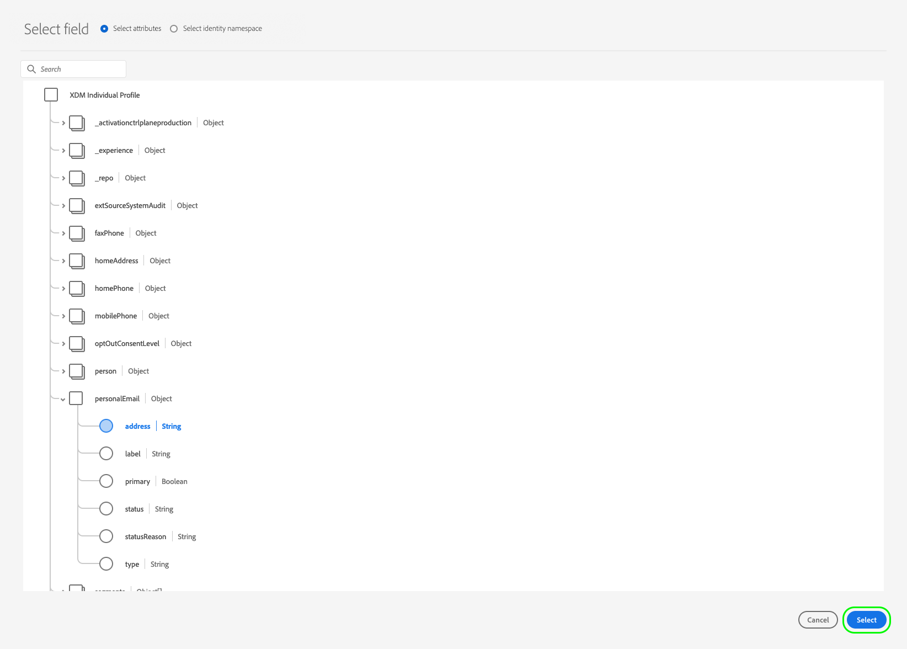

# 将受众激活到批量配置文件导出目标

>[!IMPORTANT]
> 
> * 激活受众并启用 [映射步骤](#mapping) 的工作流中，您需要 **[!UICONTROL 查看目标]**， **[!UICONTROL 激活目标]**， **[!UICONTROL 查看配置文件]**、和 **[!UICONTROL 查看区段]** [访问控制权限](/help/access-control/home.md#permissions).
> * 要激活受众，请不通过 [映射步骤](#mapping) 的工作流中，您需要 **[!UICONTROL 查看目标]**， **[!UICONTROL 激活没有映射的区段]**， **[!UICONTROL 查看配置文件]**、和 **[!UICONTROL 查看区段]** [访问控制权限](/help/access-control/home.md#permissions).
>* 要导出 *身份*，您需要 **[!UICONTROL 查看身份图]** [访问控制权限](/help/access-control/home.md#permissions). <br> {width="100" zoomable="yes"}
> 
> 阅读 [访问控制概述](/help/access-control/ui/overview.md) 或与产品管理员联系以获取所需的权限。

## 概述 {#overview}

本文介绍了在Adobe Experience Platform中激活受众以批量处理基于文件的目标（如云存储和电子邮件营销目标）所需的工作流。

## 先决条件 {#prerequisites}

要将受众激活到目标，您必须已成功完成 [已连接到目标](./connect-destination.md). 如果您尚未这样做，请转到 [目标目录](../catalog/overview.md)，浏览支持的目标，并配置要使用的目标。

## 支持的导出文件格式 {#supported-file-formats-export}

导出受众时支持以下文件格式：

* CSV
* JSON
* Parquet

请注意，导出CSV文件可让您在构建导出文件的结构方面拥有更大的灵活性。 详细了解 [CSV文件的文件格式配置](/help/destinations/ui/batch-destinations-file-formatting-options.md#file-configuration).

选择所需的文件格式以便在下列情况下导出 [创建与基于文件的目标的连接](/help/destinations/ui/connect-destination.md).

## 选择您的目标 {#select-destination}

1. 转到 **[!UICONTROL “连接”>“目标”]**，然后选择 **[!UICONTROL 目录]** 选项卡。

   

1. 选择 **[!UICONTROL 激活受众]** ，，如下图所示。

   

1. 选择要用于激活受众的目标连接，然后选择 **[!UICONTROL 下一个]**.

   

1. 移到下一节至 [选择您的受众](#select-audiences).

## 选择您的受众 {#select-audiences}

要选择要激活到目标的受众，请选中受众名称左侧的复选框，然后选择 **[!UICONTROL 下一个]**.

您可以从多种类型的受众中进行选择，具体取决于其来源：

* **[!UICONTROL 分段服务]**：分段服务在Experience Platform中生成的受众。 请参阅 [分段文档](../../segmentation/ui/overview.md) 以了解更多详细信息。
* **[!UICONTROL 自定义上传]**：在Experience Platform之外生成的受众，以CSV文件形式上传到Platform。 要了解有关外部受众的更多信息，请参阅关于以下内容的文档： [导入受众](../../segmentation/ui/audience-portal.md#import-audience).
* 其他类型的受众，源自其他Adobe解决方案，例如 [!DNL Audience Manager].


>[!TIP]
>
>选择源自 **[!UICONTROL 自定义上传]** 自动启用 [选择扩充属性](#select-enrichment-attributes) 步骤。

>[!TIP]
>
>您可以从现有的激活流中删除受众 **[!UICONTROL 激活数据]** 页面。 请参阅 [专用文档](../ui/destination-details-page.md#bulk-remove) 以了解详细信息。

## 计划受众导出 {#scheduling}

>[!CONTEXTUALHELP]
>id="platform_destinations_activate_schedule"
>title="计划"
>abstract="使用铅笔图标设置文件导出类型（完整文件或增量文件）和导出频率。"

[!DNL Adobe Experience Platform] 将电子邮件营销和云存储目标的数据导出为 [不同的文件类型](#supported-file-formats-export). 在 **[!UICONTROL 正在计划]** 页面上，您可以为要导出的每个受众配置计划和文件名。

Experience Platform会自动为每次文件导出设置默认计划。 您可以根据需要修改默认计划，方法是选择每个计划旁边的铅笔图标，并定义自定义计划。


>[!TIP]
>
>您可以从以下位置编辑现有激活流的受众激活计划： **[!UICONTROL 激活数据]** 页面。 请参阅相关文档 [批量编辑激活计划](../ui/destination-details-page.md#bulk-edit-schedule) 以了解详细信息。

>[!IMPORTANT]
>
>[!DNL Adobe Experience Platform] 自动以每个文件500万条记录（行）拆分导出文件。 每一行表示一个配置文件。
>
>拆分文件名后附加一个数字，指示文件是较大导出的一部分，例如： `filename.csv`， `filename_2.csv`， `filename_3.csv`.

### 导出全部文件 {#export-full-files}

>[!CONTEXTUALHELP]
>id="platform_destinations_activate_exportoptions"
>title="文件导出选项"
>abstract="选择&#x200B;**导出全部文件**&#x200B;以导出符合受众资格的所有配置文件的完整快照。选择&#x200B;**导出增量文件**&#x200B;以仅导出自上次导出后符合受众资格的配置文件。<br>第一个增量文件导出包括符合受众资格的所有配置文件，充当回填。后续增量文件仅包含自第一个增量文件导出后符合受众资格的配置文件。"
>additional-url="https://experienceleague.adobe.com/docs/experience-platform/destinations/ui/activate/activate-batch-profile-destinations.html?lang=zh-Hans#export-incremental-files" text="导出增量文件"

>[!CONTEXTUALHELP]
>id="platform_destinations_activationchaining_aftersegmentevaluation"
>title="在受众评估后激活"
>abstract="在每日分段作业完成后立即运行激活。这将确保导出最新的配置文件。"

>[!CONTEXTUALHELP]
>id="platform_destinations_activationchaining_scheduled"
>title="计划的激活"
>abstract="激活在一天中的固定时间运行。"

选择 **[!UICONTROL 导出完整文件]** 触发导出一个文件，其中包含选定受众的所有配置文件资格的完整快照。


1. 使用 **[!UICONTROL 频率]** 选择器以选择导出频率：

   * **[!UICONTROL 一次]**：计划一次按需完整文件导出。
   * **[!UICONTROL 每日]**：计划每天在指定时间导出一次完整文件。

2. 使用 **[!UICONTROL 时间]** 切换是否选择应在受众评估后立即导出，还是按计划在指定时间导出。 选择 **[!UICONTROL 已计划]** 选项，则可以使用选择器选择一天中的时间，在 [!DNL UTC] 格式，应何时进行导出。

   >[!NOTE]
   >
   >此 **[!UICONTROL 区段评估后]** 以下所述的选项仅适用于部分Beta客户。

   使用 **[!UICONTROL 区段评估后]** 一个选项，用于在每日Platform批处理分段作业完成后立即运行激活作业。 此选项可确保当激活作业运行时，将最新的配置文件导出到您的目标。

   <!-- Batch segmentation currently runs at {{insert time of day}} and lasts for an average {{x hours}}. Adobe reserves the right to modify this schedule. -->

   
使用 **[!UICONTROL 已计划]** 用于使激活作业在固定时间运行的选项。 此选项可确保每天在同一时间导出Experience Platform配置文件数据。 但是，您导出的用户档案可能不是最新的，具体取决于批量分段作业是否在激活作业开始之前完成。

   

3. 使用 **[!UICONTROL 日期]** 选择器来选择应执行导出的日期或时间间隔。 对于每日导出，最佳实践是将开始和结束日期设置为与下游平台中的促销活动持续时间一致。

   >[!IMPORTANT]
   >
   > 选择导出间隔时，该间隔的最后一天不包含在导出中。 例如，如果选择1月4日至11日之间的时间间隔，则最后一次文件导出将在1月10日进行。

4. 选择 **[!UICONTROL 创建]** 以保存计划。

### 导出增量文件

>[!CONTEXTUALHELP]
>id="platform_destinations_activate_something"
>title="配置文件名"
>abstract="对于基于文件的目标，为每个受众生成一个唯一的文件名。使用文件名编辑器可创建和编辑唯一文件名或保留默认名称。"

选择 **[!UICONTROL 导出增量文件]** 用于触发导出，其中第一个文件是选定受众的所有配置文件资格的完整快照，后续文件是自上次导出以来的增量配置文件资格。

>[!IMPORTANT]
>
>第一个导出的增量文件包含符合受众条件的所有用户档案，这些文件可用作回填。


1. 使用 **[!UICONTROL 频率]** 选择器以选择导出频率：

   * **[!UICONTROL 每日]**：安排增量文件每天在指定的时间导出一次。
   * **[!UICONTROL 每小时]**：计划每3、6、8或12小时执行一次增量文件导出。

2. 使用 **[!UICONTROL 时间]** 选择器以选择一天中的时间，在 [!DNL UTC] 格式，应何时进行导出。

3. 使用 **[!UICONTROL 日期]** 选择器来选择应进行导出的时间间隔。 最佳实践是将您的开始和结束日期设置为与下游平台中的促销活动持续时间一致。

   >[!IMPORTANT]
   >
   >间隔的最后一天不包含在导出中。 例如，如果选择1月4日至11日之间的时间间隔，则最后一次文件导出将在1月10日进行。

4. 选择 **[!UICONTROL 创建]** 以保存计划。

### 配置文件名

>[!CONTEXTUALHELP]
>id="platform_destinations_activate_filename"
>title="配置文件名"
>abstract="对于基于文件的目标，为每个受众生成一个唯一的文件名。使用文件名编辑器可创建和编辑唯一文件名或保留默认名称。"

对于大多数目标，默认文件名由目标名称、受众ID以及日期和时间指示器组成。 例如，您可以编辑导出的文件名，以区分不同的促销活动，或者将数据导出时间附加到文件。 请注意，某些目标开发人员可能选择为其目标显示不同的默认文件名附加选项。

要打开模式窗口并编辑文件名，请选择铅笔图标。 文件名限制为255个字符。

>[!NOTE]
>
>下图显示了如何编辑的文件名 [!DNL Amazon S3] 目标，但所有批处理目标的过程都相同(例如SFTP、 [!DNL Azure Blob Storage]，或 [!DNL Google Cloud Storage])。


在文件名编辑器中，可以选择要添加到文件名的不同组件。


无法从文件名中删除目标名称和受众ID。 除了这些选项之外，您还可以添加以下选项：

| 文件名选项 | 描述 |
|---------|----------|
| **[!UICONTROL 受众名称]** | 导出受众的名称。 |
| **[!UICONTROL 日期和时间]** | 在添加 `MMDDYYYY_HHMMSS` 格式或文件生成时间的UNIX 10位时间戳。 如果希望文件随每次增量导出而生成动态文件名，请选择以下选项之一。 |
| **[!UICONTROL 自定文本]** | 要添加到文件名的任何自定义文本。 |
| **[!UICONTROL 目标Id]** | 用于导出受众的目标数据流的ID。 |
| **[!UICONTROL 目标名称]** | 用于导出受众的目标数据流的名称。 |
| **[!UICONTROL 组织名称]** | Experience Platform中的组织名称。 |
| **[!UICONTROL 沙盒名称]** | 用于导出受众的沙盒的ID。 |

{style="table-layout:auto"}

选择 **[!UICONTROL 应用更改]** 以确认您的选择。

>[!IMPORTANT]
> 
>如果您不选择 **[!UICONTROL 日期和时间]** 组件中，文件名将是静态的，并且新的导出文件将使用每次导出覆盖存储位置中的上一个文件。 将周期性导入作业从存储位置运行到电子邮件营销平台时，这是推荐的选项。

配置完所有受众后，选择 **[!UICONTROL 下一个]** 以继续。

## 映射 {#mapping}

在此步骤中，必须选择要添加到导出到目标目标的文件中的配置文件属性。 要选择要导出的配置文件属性和标识，请执行以下操作：

1. 在 **[!UICONTROL 映射]** 页面，选择 **[!UICONTROL 添加新映射]**.

   

1. 选择右侧的箭头 **[!UICONTROL Source字段]** 进入。

   

1. 在 **[!UICONTROL 选择源字段]** 页面上，选择要包含在导出到目标文件中的配置文件属性和身份，然后选择 **[!UICONTROL 选择]**.

   >[!TIP]
   > 
   >您可以使用搜索字段缩小选择范围，如下图所示。

   使用 **[!UICONTROL 仅显示包含数据的字段]** 切换以仅显示使用值填充的架构字段。 默认情况下，仅显示填充的架构字段。

   


1. 您选择导出的字段现在会显示在映射视图中。 如果需要，可以编辑导出文件中的标头名称。 要实现此目的，请选择目标字段上的图标。

   

1. 在 **[!UICONTROL 选择目标字段]** 在导出的文件中键入所需的标头名称，然后选择 **[!UICONTROL 选择]**.

   

1. 您选择导出的字段现在会显示在映射视图中，并在导出的文件中显示编辑后的标题。

   

1. （可选）用户界面中映射字段的顺序反映在导出CSV文件中列的顺序（从上到下），其中顶行是CSV文件中最左侧的列。 您可以通过拖放映射行，以所需的任何方式重新排列映射字段，如下所示。

   >[!NOTE]
   >
   >此功能为测试版，仅向部分客户提供。 要请求访问此功能，请联系您的Adobe代表。

   

1. （可选）您可以将导出的字段选择为 [必需键](#mandatory-keys) 或 [重复数据删除键](#deduplication-keys).

   

1. 要添加更多要导出的字段，请重复上述步骤。

### 强制属性 {#mandatory-attributes}

>[!CONTEXTUALHELP]
>id="platform_destinations_activate_mandatorykey"
>title="关于强制属性"
>abstract="选择所有导出的配置文件应包含的 XDM 架构属性。不会将没有强制密钥的配置文件导出到目标。不选择强制密钥会导出所有合格的配置文件，而不管其属性如何。"

必填属性是启用用户的复选框，可确保所有配置文件记录都包含所选属性。 例如：所有导出的用户档案都包含电子邮件地址&#x200B;。

您可以将属性标记为必需，以确保 [!DNL Platform] 仅导出包含特定属性的配置文件。 因此，它可以用作附加的筛选形式。 将属性标记为必填字段是 **非** 必需。

不选择强制属性会导出所有符合条件的配置文件，而不管其属性如何。

建议其中一个属性为 [唯一标识符](../../destinations/catalog/email-marketing/overview.md#identity) 从你的架构中。 有关强制属性的更多信息，请参阅 [电子邮件营销目标](../../destinations/catalog/email-marketing/overview.md#identity) 文档。

### 内部重复数据删除键 {#deduplication-keys}

>[!CONTEXTUALHELP]
>id="platform_destinations_activate_deduplicationkey"
>title="关于删除重复项键"
>abstract="通过选择删除重复项键，消除导出文件中同一配置文件的多条记录。选择一个命名空间或最多两个 XDM 架构属性作为删除重复项键。不选择删除重复项键可能会导致导出文件中出现重复的配置文件条目。"

重复数据删除键是用户定义的主键，可确定用户希望为其配置文件进行重复数据删除的身份&#x200B;。

重复数据删除键消除了在一个导出文件中拥有同一配置文件的多个记录的可能性。

可通过三种方式在中使用重复数据删除键 [!DNL Platform]：

* 使用单个身份命名空间作为 [!UICONTROL 重复数据删除键]
* 使用 [!DNL XDM] profile as a [!UICONTROL 重复数据删除键]
* 使用来自的两个配置文件属性的组合 [!DNL XDM] 配置文件作为复合键

>[!IMPORTANT]
>
> 您可以将单个身份命名空间导出到目标，并且该命名空间会自动设置为重复数据删除键。 不支持向目标发送多个命名空间。
> 
> 不能将身份命名空间和配置文件属性的组合用作重复数据删除键。

### 重复数据删除示例 {#deduplication-example}

此示例说明了重复数据删除的工作方式，具体取决于所选的重复数据删除键。

让我们考虑以下两个配置文件。

**用户档案A**

```json
{
  "identityMap": {
    "Email": [
      {
        "id": "johndoe_1@example.com"
      },
      {
        "id": "johndoe_2@example.com"
      }
    ]
  },
  "segmentMembership": {
    "ups": {
      "fa5c4622-6847-4199-8dd4-8b7c7c7ed1d6": {
        "status": "realized",
        "lastQualificationTime": "2021-03-10 10:03:08"
      }
    }
  },
  "person": {
    "name": {
      "lastName": "Doe",
      "firstName": "John"
    }
  },
  "personalEmail": {
    "address": "johndoe@example.com"
  }
}
```

**个人资料B**

```json
{
  "identityMap": {
    "Email": [
      {
        "id": "johndoe_1@example.com"
      },
      {
        "id": "johndoe_2@example.com"
      }
    ]
  },
  "segmentMembership": {
    "ups": {
      "fa5c4622-6847-4199-8dd4-8b7c7c7ed1d6": {
        "status": "realized",
        "lastQualificationTime": "2021-04-10 11:33:28"
      }
    }
  },
  "person": {
    "name": {
      "lastName": "D",
      "firstName": "John"
    }
  },
  "personalEmail": {
    "address": "johndoe@example.com"
  }
}
```

### 重复数据删除用例1：无重复数据删除 {#deduplication-use-case-1}

如果不使用重复数据删除，导出文件将包含以下条目。

| 个人电子邮件 | firstName | 姓氏 |
|---|---|---|
| johndoe@example.com | John | Doe |
| johndoe@example.com | John | D |


### 重复数据删除使用案例2：基于身份命名空间进行重复数据删除 {#deduplication-use-case-2}

假设重复数据删除由 [!DNL Email] 命名空间中，导出文件将包含以下条目。 配置文件B是符合受众条件的最新配置文件，因此它是唯一导出的。

| 电子邮件* | 个人电子邮件 | firstName | 姓氏 |
|---|---|---|---|
| johndoe_1@example.com | johndoe@example.com | John | D |
| johndoe_2@example.com | johndoe@example.com | John | D |

### 重复数据删除使用案例3：基于单个配置文件属性进行重复数据删除 {#deduplication-use-case-3}

假设重复数据删除由 `personal Email` 属性，导出文件将包含以下条目。 配置文件B是符合受众条件的最新配置文件，因此它是唯一导出的。

| 个人电子邮件* | firstName | 姓氏 |
|---|---|---|
| johndoe@example.com | John | D |


### 重复数据删除使用案例4：基于两个配置文件属性的重复数据删除 {#deduplication-use-case-4}

假定通过复合键进行重复数据删除 `personalEmail + lastName`，则导出文件将包含以下条目。

| 个人电子邮件* | 姓氏* | firstName |
|---|---|---|
| johndoe@example.com | D | John |
| johndoe@example.com | Doe | John |

Adobe建议选择身份命名空间，如 [!DNL CRM ID] 或电子邮件地址作为重复数据删除键，以确保唯一标识所有配置文件记录。

>[!NOTE]
> 
>如果有任何数据使用标签应用于数据集（而不是整个数据集）中的某些字段，则会在激活时强制实施这些字段级标签，具体情况如下：
>
>* 这些字段在受众定义中使用。
>* 这些字段配置为目标目标的投影属性。
>
> 例如，如果字段 `person.name.firstName` 具有与目标的营销操作冲突的特定数据使用标签，则会在审核步骤中向您显示数据使用策略违规。 有关更多信息，请参阅 [Adobe Experience Platform中的数据治理](../../rtcdp/privacy/data-governance-overview.md#destinations).

### [!BADGE Beta]{type=Informative}通过计算字段导出数组 {#export-arrays-calculated-fields}

部分测试版客户可以将阵列对象从Experience Platform导出到云存储目标。 详细了解 [导出数组和计算字段](/help/destinations/ui/export-arrays-calculated-fields.md) 并联系Adobe代表以获取该功能的访问权限。

### 已知限制 {#known-limitations}

新 **[!UICONTROL 映射]** 页面具有以下已知限制：

#### 无法通过映射工作流选择受众成员资格属性

由于已知限制，您当前无法使用 **[!UICONTROL 选择字段]** 要添加的窗口 `segmentMembership.seg_namespace.seg_id.status` 到您的文件导出。 相反，您需要手动粘贴值 `xdm: segmentMembership.seg_namespace.seg_id.status` “架构”字段中，如下所示。


>[!NOTE]
>
对于云存储目标，默认情况下会向映射中添加以下属性：
>
* `segmentMembership.seg_namespace.seg_id.status`
* `segmentMembership.seg_namespace.seg_id.lastQualificationTime`

文件导出将以下列方式有所不同，具体取决于是否 `segmentMembership.seg_namespace.seg_id.status` 已选中：

* 如果 `segmentMembership.seg_namespace.seg_id.status` 字段已选中，导出的文件包括 **[!UICONTROL 活动]** 初始完整快照中的成员和 **[!UICONTROL 活动]** 和 **[!UICONTROL 已过期]** 后续增量导出中的成员。
* 如果 `segmentMembership.seg_namespace.seg_id.status` 未选择字段，导出的文件仅包括 **[!UICONTROL 活动]** 初始完整快照及其后的增量导出中的成员。

详细了解 [基于文件的目标的配置文件导出行为](/help/destinations/how-destinations-work/profile-export-behavior.md#file-based-destinations).

#### 当前无法选择要导出的身份命名空间

当前不支持选择导出身份命名空间（如下图所示）。 选择要导出的任何身份命名空间将导致中出现错误 **[!UICONTROL 审核]** 步骤。


作为临时解决方法，如果您需要在测试版期间将身份命名空间添加到导出的文件，您可以：
* 对于要在导出中包含身份命名空间的数据流，请使用旧版云存储目标
* 将身份作为属性上传到Experience Platform，然后将其导出到您的云存储目标。

## 选择配置文件属性 {#select-attributes}

>[!IMPORTANT]
> 
目录中的所有云存储目标都可以查看改进的内容 [[!UICONTROL 映射] 步骤](#mapping) 取代 **[!UICONTROL 选择属性]** 此部分介绍了的步骤。
>
此 **[!UICONTROL 选择属性]** 仍会为Adobe Campaign、OracleResponsys、OracleEloqua和SalesforceMarketing Cloud电子邮件营销目标显示步骤。

对于基于配置文件的目标，必须选择要发送到目标目标的配置文件属性。

1. 在 **[!UICONTROL 选择属性]** 页面，选择 **[!UICONTROL 添加新字段]**.

   

2. 选择右侧的箭头 **[!UICONTROL 架构字段]** 进入。

   

3. 在 **[!UICONTROL 选择字段]** 页面上，选择要发送到目标的XDM属性或身份命名空间，然后选择 **[!UICONTROL 选择]**.

   

4. 要添加更多映射，请重复执行第一步到第三步。

>[!NOTE]
>
Adobe Experience Platform会使用架构中的四个推荐的常用属性预填充您的选择： `person.name.firstName`， `person.name.lastName`， `personalEmail.address`， `segmentMembership.seg_namespace.seg_id.status`.


>[!IMPORTANT]
>
由于已知限制，您当前无法使用 **[!UICONTROL 选择字段]** 要添加的窗口 `segmentMembership.seg_namespace.seg_id.status` 到您的文件导出。 相反，您必须手动粘贴值 `xdm: segmentMembership.seg_namespace.seg_id.status` “架构”字段中，如下所示。
>


文件导出在以下方面有所不同，具体取决于是否 `segmentMembership.seg_namespace.seg_id.status` 已选中：
* 如果 `segmentMembership.seg_namespace.seg_id.status` 字段已选中，导出的文件包括 **[!UICONTROL 活动]** 初始完整快照中的成员和 **[!UICONTROL 活动]** 和 **[!UICONTROL 已过期]** 后续增量导出中的成员。
* 如果 `segmentMembership.seg_namespace.seg_id.status` 未选择字段，导出的文件仅包括 **[!UICONTROL 活动]** 初始完整快照及其后的增量导出中的成员。

## 选择扩充属性 {#select-enrichment-attributes}

[!CONTEXTUALHELP]
id="platform_destinations_activate_exclude_enrichment_attributes"
title="排除扩充属性"
abstract="启用此选项可将所选自定义上传受众的配置文件导出到您的目的地，同时排除其所有属性。"
additional-url="https://experienceleague.adobe.com/docs/experience-platform/destinations/ui/activate/activate-batch-profile-destinations.html?lang=zh-Hans#select-enrichment-attributes" text="请在文档中了解详情"

>[!IMPORTANT]
>
此步骤仅在您选择的情况下显示 **[!UICONTROL 自定义上传]** 受众时段 [受众选择](#select-audiences) 步骤。

扩充属性对应于Experience Platform中摄取的自定义上传受众，如 **[!UICONTROL 自定义上传]**. 在此步骤中，您可以为每个选定的外部受众选择要导出到目标的属性。


请按照以下步骤为每个外部受众选择扩充属性：

1. 在 **[!UICONTROL 扩充属性]** 列中，选择  （编辑）按钮。
2. 选择 **[!UICONTROL 添加扩充属性]**. 将显示一个新的空架构字段。
   
3. 选择空字段右侧的按钮以打开字段选择屏幕。
4. 选择要为受众导出的属性。
   
5. 添加要导出的所有属性后，选择 **[!UICONTROL 保存并关闭]**.
6. 对每个外部受众重复这些步骤。

如果要在不导出任何属性的情况下将外部受众激活到目标，请启用 **[!UICONTROL 排除扩充属性]** 切换。 此选项会从外部受众导出用户档案，但不会将其任何相应的属性发送到您的目标。


选择 **[!UICONTROL 下一个]** 以移至 [审核](#review) 步骤。

## 审查 {#review}

在 **[!UICONTROL 审核]** 页面上，您可以看到选择的摘要。 选择 **[!UICONTROL 取消]** 来打破气流， **[!UICONTROL 返回]** 以修改设置，或者 **[!UICONTROL 完成]** 以确认您的选择并开始向目标发送数据。


### 同意策略评估 {#consent-policy-evaluation}

[!CONTEXTUALHELP]
id="platform_governance_policies_viewApplicableConsentPolicies"
title="查看适用的同意策略"
abstract="如果您的组织购买了 **Adobe Healthcare Shield** 或 **Adobe Privacy &amp; Security Shield**，请选择&#x200B;**[!UICONTROL 查看适用的同意策略]**&#x200B;以查看应用了哪些同意策略以及作为其结果包含在激活中的配置文件数量。如果您的公司无权访问上述 SKU，则此控件将被禁用。"

如果您的组织购买了 **Adobe Healthcare Shield** 或 **Adobe Privacy &amp; Security Shield**，请选择&#x200B;**[!UICONTROL 查看适用的同意策略]**&#x200B;以查看应用了哪些同意策略以及作为其结果包含在激活中的配置文件数量。阅读关于 [同意政策评估](/help/data-governance/enforcement/auto-enforcement.md#consent-policy-evaluation) 以了解更多信息。

### 数据使用策略检查 {#data-usage-policy-checks}

在 **[!UICONTROL 审核]** 步骤，Experience Platform还会检查是否存在任何数据使用策略违规。 下面显示了一个违反策略的示例。 在解决该违规之前，您无法完成受众激活工作流。 有关如何解决策略违规的信息，请参阅 [数据使用策略违规](/help/data-governance/enforcement/auto-enforcement.md#data-usage-violation) 数据管理文档一节中。


### 筛选受众 {#filter-audiences}

此外，在此步骤中，您可以使用页面上的可用过滤器仅显示其计划或映射作为此工作流的一部分而更新的受众。 您还可以切换要查看的表列。


如果您对您的选择感到满意，并且未检测到任何违反策略的情况，请选择 **[!UICONTROL 完成]** 以确认您的选择并开始向目标发送数据。

## 验证受众激活 {#verify}

将受众导出到云存储目标时，Adobe Experience Platform会创建 `.csv`， `.json`，或 `.parquet` 文件存储位置。 预计会根据您在工作流中设置的时间表，在您的存储位置中创建一个新文件。 默认文件格式如下所示，但您可以 [编辑文件名的组件](#file-names)：
`<destinationName>_segment<segmentID>_<timestamp-yyyymmddhhmmss>.csv`

例如，如果您选择了每日导出频率，则您连续三天收到的文件可能会如下所示：

```console
Salesforce_Marketing_Cloud_segment12341e18-abcd-49c2-836d-123c88e76c39_20200408061804.csv
Salesforce_Marketing_Cloud_segment12341e18-abcd-49c2-836d-123c88e76c39_20200409052200.csv
Salesforce_Marketing_Cloud_segment12341e18-abcd-49c2-836d-123c88e76c39_20200410061130.csv
```

这些文件在您的存储位置中存在，即确认激活成功。 要了解导出文件的结构，您可以 [下载示例.csv文件](../assets/common/sample_export_file_segment12341e18-abcd-49c2-836d-123c88e76c39_20200408061804.csv). 此示例文件包括配置文件属性 `person.firstname`， `person.lastname`， `person.gender`， `person.birthyear`、和 `personalEmail.address`.
