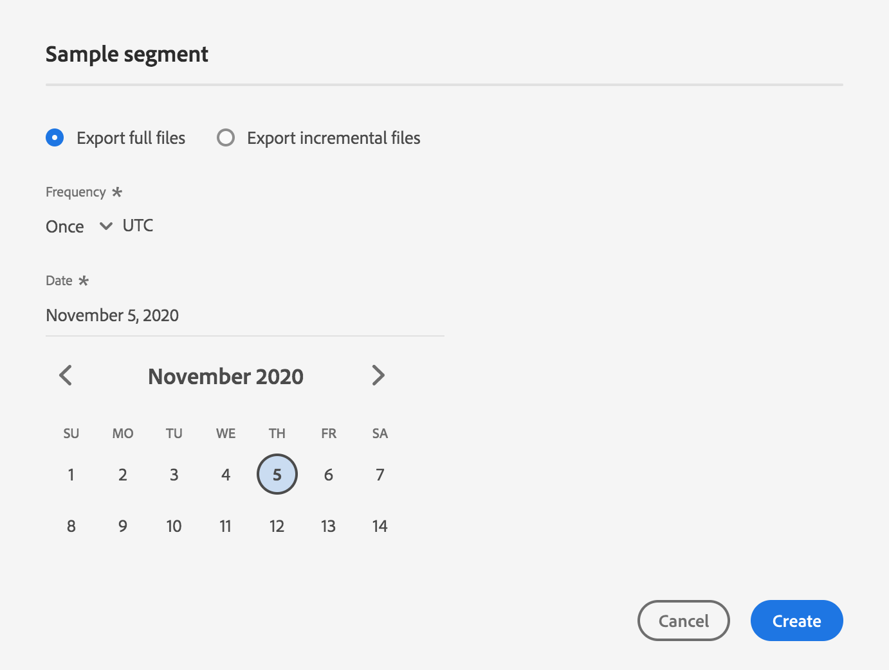

# 将用户档案和区段激活到目标

通过将区段映射到目标，激活您在Adobe Experience Platform的数据。 要完成此操作，请按照以下步骤操作。

## 先决条件 {#prerequisites}

要将数据激活到目标，您必须已成功地[连接目标](./connect-destination.md)。 如果尚未这样做，请转到[目标目录](../catalog/overview.md)，浏览支持的目标，并设置一个或多个目标。

## 激活数据{#activate-data}

激活工作流中的步骤因目标类型而略有不同。 以下概述了所有目标类型的完整工作流。

### 选择要将数据激活到{#select-destination}的目标

适用于：所有目标

在Adobe Experience Platform用户界面中，导航到&#x200B;**[!UICONTROL 目标]** > **[!UICONTROL 浏览]**，然后选择要激活区段的目标。


选择目标的名称以导航到激活工作流。


请注意，如果目标激活工作流已存在，您可以看到当前正在激活到目标的区段。 选择右边栏中的&#x200B;**[!UICONTROL 编辑激活]**，然后按照以下步骤修改激活详细信息。

选择目标后，选择&#x200B;**[!UICONTROL 激活]**。

### [!UICONTROL 选择段] 步骤  {#select-segments}

适用于：所有目标


在&#x200B;**[!UICONTROL 激活目标]**&#x200B;工作流的&#x200B;**[!UICONTROL 选择区段]**&#x200B;页面上，选择一个或多个要激活到目标的区段。 选择&#x200B;**[!UICONTROL 下一步]**&#x200B;以继续执行下一步。


### [!UICONTROL 身份映] 射步骤  {#identity-mapping}

适用于：社交目的地和Google客户匹配广告目的地


对于社交目标，您必须选择源属性或标识命名空间以映射为目标中的目标标识。

#### 示例：激活[!DNL Facebook] {#example-facebook}中的受众数据

这是激活[!DNL Facebook]中的受众数据时正确标识映射的示例。

选择源字段：

* 如果您使用的电子邮件地址没有散列，请选择`Email`命名空间作为源标识。
* 如果根据[!DNL Facebook] [电子邮件散列命名空间要求](../catalog/social/facebook.md#email-hashing-requirements)将数据接收时的客户电子邮件地址散列到[!DNL Platform]中，请选择`Email_LC_SHA256`作为源标识。
* 如果您的命名空间包含非散列电话号码，请选择`PHONE_E.164`作为源标识。 [!DNL Platform] 将对电话号码进行散列处理以符合 [!DNL Facebook] 要求。
* 如果根据[!DNL Facebook] [电话号码散列法要求](../catalog/social/facebook.md#phone-number-hashing-requirements)将数据接收时的电话号码散列到[!DNL Platform]中，请选择`Phone_SHA256`命名空间作为源标识。
* 如果您的命名空间包含[!DNL Apple]设备ID，请选择`IDFA`作为源标识。
* 如果您的命名空间包含[!DNL Android]设备ID，请选择`GAID`作为源标识。
* 如果您的命名空间包含其他类型的标识符，请选择`Custom`作为源标识。

选择目标字段：

* 当源命名空间为`Email`或`Email_LC_SHA256`时，选择`Email_LC_SHA256`命名空间作为目标标识。
* 当源命名空间为`PHONE_E.164`或`Phone_SHA256`时，选择`Phone_SHA256`命名空间作为目标标识。
* 当您的源命名空间为`IDFA`或`GAID`时，选择`IDFA`或`GAID`命名空间作为目标标识。
* 当源命名空间是自定义命名空间时，选择`Extern_ID`作为目标标识。


来自未散列命名空间的数据在激活时由[!DNL Platform]自动散列。

属性源数据不会自动散列。 当源字段包含未散列的属性时，请检查&#x200B;**[!UICONTROL 应用转换]**&#x200B;选项，使[!DNL Platform]在激活上自动对数据进行散列处理。


 

#### 示例：激活[!DNL Google Customer Match] {#example-gcm}中的受众数据

这是激活[!DNL Google Customer Match]中的受众数据时正确标识映射的示例。

选择源字段：

* 如果您使用的电子邮件地址没有散列，请选择`Email`命名空间作为源标识。
* 如果根据[!DNL Google Customer Match] [电子邮件散列命名空间要求](../catalog/social/../advertising/google-customer-match.md)将数据接收时的客户电子邮件地址散列到[!DNL Platform]中，请选择`Email_LC_SHA256`作为源标识。
* 如果您的命名空间包含非散列电话号码，请选择`PHONE_E.164`作为源标识。 [!DNL Platform] 将对电话号码进行散列处理以符合 [!DNL Google Customer Match] 要求。
* 如果根据[!DNL Facebook] [电话号码散列法要求](../catalog/social/../advertising/google-customer-match.md)将数据接收时的电话号码散列到[!DNL Platform]中，请选择`Phone_SHA256_E.164`命名空间作为源标识。
* 如果您的命名空间包含[!DNL Apple]设备ID，请选择`IDFA`作为源标识。
* 如果您的命名空间包含[!DNL Android]设备ID，请选择`GAID`作为源标识。
* 如果您的命名空间包含其他类型的标识符，请选择`Custom`作为源标识。

选择目标字段：

* 当源命名空间为`Email`或`Email_LC_SHA256`时，选择`Email_LC_SHA256`命名空间作为目标标识。
* 当源命名空间为`PHONE_E.164`或`Phone_SHA256_E.164`时，选择`Phone_SHA256_E.164`命名空间作为目标标识。
* 当您的源命名空间为`IDFA`或`GAID`时，选择`IDFA`或`GAID`命名空间作为目标标识。
* 当源命名空间是自定义命名空间时，选择`User_ID`作为目标标识。


来自未散列命名空间的数据在激活时由[!DNL Platform]自动散列。

属性源数据不会自动散列。 当源字段包含未散列的属性时，请检查&#x200B;**[!UICONTROL 应用转换]**&#x200B;选项，使[!DNL Platform]在激活上自动对数据进行散列处理。


<!-- 
`IDFA` IDs will be mapped to:

* [MADID](https://developers.facebook.com/docs/marketing-api/audiences/guides/custom-audiences#hash) if you are activating audiences in [[!DNL Facebook]](../../destinations/catalog/social/facebook.md).
* [mobileId](https://developers.google.com/adwords/api/docs/reference/v201809/AdwordsUserListService.Member#mobileid) if you are activating audiences in [[!DNL Google Customer Match]](../../destinations/catalog/advertising/google-customer-match.md).

Select `GAID` as target identity if your data consists of Android device IDs. `GAID` IDs will be mapped to:

* [MADID](https://developers.facebook.com/docs/marketing-api/audiences/guides/custom-audiences#hash) if you are activating audiences in [[!DNL Facebook]](../../destinations/catalog/social/facebook.md).
* [mobileId](https://developers.google.com/adwords/api/docs/reference/v201809/AdwordsUserListService.Member#mobileid) if you are activating audiences in [[!DNL Google Customer Match]](../../destinations/catalog/advertising/google-customer-match.md).

If you are using another ID, such as "Rewards ID" or "Loyalty ID", as primary identity in your schema, you need to map it to the following target identities:

* [EXTERN_ID](https://developers.facebook.com/docs/marketing-api/audiences/guides/custom-audiences#external_identifiers) if you are activating audiences in [[!DNL Facebook]](../../destinations/catalog/social/facebook.md).
* [USER_ID](https://developers.google.com/adwords/api/docs/reference/v201809/AdwordsUserListService.Member#userid) if you are activating audiences in [[!DNL Google Customer Match]](../../destinations/catalog/advertising/google-customer-match.md). -->

### **[!UICONTROL 配]** 置  {#configure}

适用于：电子邮件营销目标和云存储目标


在&#x200B;**[!UICONTROL 配置]**&#x200B;步骤中，您可以配置要导出的每个区段的计划和文件名。 必须配置计划，但配置文件名是可选的。

要为区段添加计划，请选择&#x200B;**[!UICONTROL 创建计划]**。


此时会显示一个弹出窗口，其中显示用于创建段计划的选项。

* **文件导出**:您可以选择导出完整文件或增量文件。导出完整文件会发布符合该区段条件的所有用户档案的完整快照。 导出增量文件会发布自上次导出以来符合该区段条件的用户档案增量。
* **频率**:如果 **[!UICONTROL 选择“]** 导出完整文件”，则可选择导 **** 出“Onceor  **[!UICONTROL Daily]**”。如果选择了&#x200B;**[!UICONTROL 导出增量文件]**，则您只能选择导出&#x200B;**[!UICONTROL 每日]**。 导出文件&#x200B;**[!UICONTROL 一次]**&#x200B;导出文件。 导出文件&#x200B;**[!UICONTROL Daily]**&#x200B;时，如果选择完整文件，则每天将从开始日期导出到结束日期(UTC:00 PM EST)；如果选择增量文件，则每天将导出文件。
* **日期**:如 **** 果选择“开始”，则可以选择一次性导出的日期。如果选择&#x200B;**[!UICONTROL 每日]**，则可以选择导出的开始和结束日期。



默认文件名由目标名称、段ID和日期和时间指示器组成。 例如，您可以编辑导出的文件名以区分不同的活动，或将数据导出时间附加到文件。

选择铅笔图标以打开模态窗口并编辑文件名。 请注意，文件名限制为255个字符。


在文件名编辑器中，可以选择要添加到文件名的其他组件。 目标名称和段ID无法从文件名中删除。 除了这些外，您还可以添加以下内容：

* **[!UICONTROL 区段名称]**:可将段名称追加到文件名。
* **[!UICONTROL 日期和时间]**:在添加格 `MMDDYYYY_HHMMSS` 式或生成文件时的Unix 10位时间戳之间进行选择。如果您希望文件在每次增量导出时生成动态文件名，请选择以下选项之一。
* **[!UICONTROL 自定义文本]**:向文件名中添加自定义文本。

选择&#x200B;**[!UICONTROL 应用更改]**&#x200B;以确认您的选择。

>[!IMPORTANT]
> 
>如果不选择&#x200B;**[!UICONTROL 日期和时间]**&#x200B;组件，则文件名将是静态的，新导出的文件将用每次导出覆盖存储位置上以前的文件。 当从存储位置向电子邮件营销平台运行重复导入作业时，建议使用此选项。


完成所有区段的配置后，请选择&#x200B;**[!UICONTROL 下一步]**&#x200B;继续。

### **[!UICONTROL 段计划]** 步骤  {#segment-schedule}

适用于：广告目的地，社交目的地


在&#x200B;**[!UICONTROL 区段计划]**&#x200B;页面上，您可以设置向目标发送数据的开始日期以及向目标发送数据的频率。

>[!IMPORTANT]
>
>对于社交目标，您必须在此步骤中选择受众的来源。 只有在选择下图中的某个选项后，才能继续执行下一步。


>[!IMPORTANT]
>
>对于Google客户匹配，在激活[!DNL IDFA]或[!DNL GAID]区段时，必须在此步骤中提供[!UICONTROL 应用程序ID]。


### **[!UICONTROL 计划]** 步骤  {#scheduling}

适用于：电子邮件营销目标和云存储目标


在&#x200B;**[!UICONTROL 计划]**&#x200B;页上，您可以看到向目标发送数据的开始日期以及向目标发送数据的频率。 无法编辑这些值。

### **[!UICONTROL 选择属]** 性步骤  {#select-attributes}

适用于：电子邮件营销目标和云存储目标


在&#x200B;**[!UICONTROL 选择属性]**&#x200B;页面上，选择&#x200B;**[!UICONTROL 添加新字段]**，然后选择要发送到目标的属性。

>[!NOTE]
>
> Adobe Experience Platform用您的模式的四个推荐、常用属性预填您的选择：`person.name.firstName`、`person.name.lastName`、`personalEmail.address`、`segmentMembership.status`。

文件导出方式将因是否选择了`segmentMembership.status`而异：
* 如果选择了`segmentMembership.status`字段，则导出的文件在初始完整快照中包含&#x200B;**[!UICONTROL 活动]**&#x200B;成员，在后续增量导出中包含&#x200B;**[!UICONTROL 活动]**&#x200B;和&#x200B;**[!UICONTROL 过期]**&#x200B;成员。
* 如果未选择`segmentMembership.status`字段，则导出的文件在初始完整快照和后续增量导出中只包含&#x200B;**[!UICONTROL Active]**&#x200B;成员。


此外，您还可以将不同属性标记为必需。 将某个属性标记为强制属性会使其成为强制属性，因此导出的区段必须包含该属性。 因此，它可以用作另外的过滤形式。 将属性标记为必填是&#x200B;**不**&#x200B;必需。

建议其中一个属性是模式的唯一标识符[](../../destinations/catalog/email-marketing/overview.md#identity)。 有关必选属性的详细信息，请参阅[电子邮件营销目标](../../destinations/catalog/email-marketing/overview.md#identity)文档中的标识部分。

>[!NOTE]
> 
>如果任何激活使用标签已应用于数据集（而非整个数据集）中的某些字段，则在以下条件下将执行这些字段级别标签：
>* 这些字段用在段定义中。
>* 字段将配置为目标目标的预计属性。

>
> 
例如，如果字段`person.name.firstName`具有与目标的营销用例冲突的特定数据使用标签，则在审核步骤中将显示数据使用策略违规。 有关详细信息，请参阅Adobe Experience Platform的[数据治理](../../rtcdp/privacy/data-governance-overview.md#destinations)。

### **[!UICONTROL 审阅]** 步骤  {#review}

适用于：所有目标


在&#x200B;**[!UICONTROL 评论]**&#x200B;页面上，您可以看到您所做选择的摘要。 选择&#x200B;**[!UICONTROL 取消]**&#x200B;以分组流，选择&#x200B;**[!UICONTROL 返回]**&#x200B;以修改设置，或选择&#x200B;**[!UICONTROL 完成]**&#x200B;以确认您的选择并开始将数据发送到目标。

>[!IMPORTANT]
>
>在此步骤中，Adobe Experience Platform检查数据使用策略是否违反。 下面显示了违反策略的示例。 在解决违规之前，您无法完成区段激活工作流。 有关如何解决策略违规的信息，请参阅数据治理文档部分中的[策略实施](../../rtcdp/privacy/data-governance-overview.md#enforcement)。


如果未检测到任何违反策略的情况，请选择&#x200B;**[!UICONTROL 完成]**&#x200B;以确认您的选择，并开始将数据发送到目标。


## 编辑激活{#edit-activation}

请按照以下步骤编辑Adobe Experience Platform的现有激活流：

1. 在左侧导航栏中选择&#x200B;**[!UICONTROL 目标]**，然后单击&#x200B;**[!UICONTROL 浏览]**&#x200B;选项卡，然后单击目标名称。
2. 选择右边栏中的&#x200B;**[!UICONTROL 编辑激活]**&#x200B;以更改要发送到目标的区段。

## 验证段激活是否成功{#verify-activation}

### 电子邮件营销目标和云存储目标{#esp-and-cloud-storage}

对于电子邮件营销目标和云存储目标，Adobe Experience Platform会在您提供的存储位置创建制表符分隔的`.csv`或`.txt`文件。 希望每天在存储位置创建新文件。 默认文件格式为：
`<destinationName>_segment<segmentID>_<timestamp-yyyymmddhhmmss>.csv|txt`

请注意，您可以编辑文件格式。 有关详细信息，请转至云存储目标和电子邮件营销目标的[配置](#configure)步骤。

使用默认文件格式，您在连续三天接收的文件可能如下所示：

```console
Salesforce_Marketing_Cloud_segment12341e18-abcd-49c2-836d-123c88e76c39_20200408061804.csv
Salesforce_Marketing_Cloud_segment12341e18-abcd-49c2-836d-123c88e76c39_20200409052200.csv
Salesforce_Marketing_Cloud_segment12341e18-abcd-49c2-836d-123c88e76c39_20200410061130.csv
```

这些文件在您的存储位置是确认成功激活。 要了解导出文件的结构，可以[下载示例。csv文件](../assets/common/sample_export_file_segment12341e18-abcd-49c2-836d-123c88e76c39_20200408061804.csv)。 此示例文件包括用户档案属性`person.firstname`、`person.lastname`、`person.gender`、`person.birthyear`和`personalEmail.address`。

### 广告目标

在要激活数据的相应广告目标中检查您的帐户。 如果激活成功，则受众将填充到您的广告平台中。

### 社交网络目标

对于[!DNL Facebook]，成功的激活意味着将在[[!UICONTROL Facebook广告管理器]](https://www.facebook.com/adsmanager/manage/)中以编程方式创建[!DNL Facebook]自定义受众。 由于用户对已激活的区段具有资格或取消资格，因此将添加和删除该受众的区段成员资格。

>[!TIP]
>
>Adobe Experience Platform与[!DNL Facebook]之间的集成支持历史受众回填。 在将区段激活到目标时，所有历史区段资格都将发送到[!DNL Facebook]。

## 禁用激活{#disable-activation}

要禁用现有激活流，请执行以下步骤：

1. 在左侧导航栏中选择&#x200B;**[!UICONTROL 目标]**，然后单击&#x200B;**[!UICONTROL 浏览]**&#x200B;选项卡，然后单击目标名称。
2. 单击右边栏中的&#x200B;**[!UICONTROL 已启用]**&#x200B;控件以更改激活流状态。
3. 在&#x200B;**更新激活流状态**&#x200B;窗口中，选择&#x200B;**确认**&#x200B;以禁用数据流。
