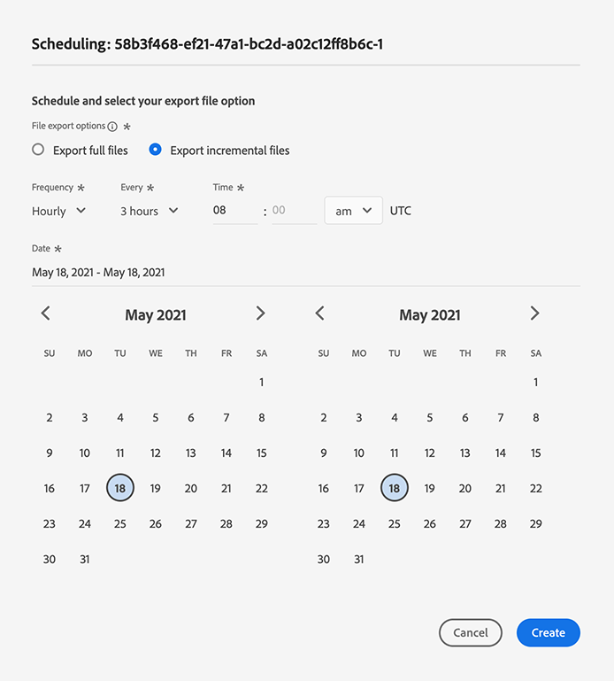

# 将用户档案和区段激活到目标

## 概述 {#overview}

通过将区段映射到目标，激活您在[!DNL Adobe Experience Platform]中拥有的数据。 要完成此操作，请执行以下步骤。

## 先决条件 {#prerequisites}

要将数据激活到目标，您必须已成功地[连接目标](./connect-destination.md)。 如果您尚未执行此操作，请转到[目标目录](../catalog/overview.md)，浏览支持的目标，然后设置一个或多个目标。

## 激活数据{#activate-data}

激活工作流中的步骤因目标类型而略有不同。 下面概述了所有目标类型的完整工作流。

## 选择要将数据激活到{#select-destination}的目标

适用于：所有目标

在Adobe Experience Platform用户界面中，导航到&#x200B;**[!UICONTROL 目标]** > **[!UICONTROL 浏览]**，然后单击与要激活区段的目标对应的&#x200B;**[!UICONTROL 激活]**&#x200B;按钮，如下图所示。


按照下一节中的步骤，选择要激活的区段。

## [!UICONTROL 选择区] 段步骤  {#select-segments}

适用于：所有目标


在&#x200B;**[!UICONTROL 激活目标]**&#x200B;工作流的&#x200B;**[!UICONTROL 选择区段]**&#x200B;页面上，选择一个或多个要激活到目标的区段。 选择&#x200B;**[!UICONTROL 下一步]**&#x200B;以继续执行下一步。


##  映射步骤 {#mapping}

适用于：社交目标和Google客户匹配广告目标


对于社交目标，您必须选择源属性或身份命名空间以在目标中映射为目标身份。

## 示例：在[!DNL Facebook Custom Audience] {#example-facebook}中激活受众数据

以下示例用于在[!DNL Facebook]中激活受众数据时正确映射身份。

选择源字段：

* 如果您使用的电子邮件地址没有经过哈希处理，请选择`Email`命名空间作为源标识。
* 如果您根据[!DNL Facebook] [电子邮件哈希处理要求](../catalog/social/facebook.md#email-hashing-requirements)对数据摄取时的客户电子邮件地址进行哈希处理，并将其转换为[!DNL Platform]，请选择`Email_LC_SHA256`命名空间作为源标识。
* 如果您的数据包含非哈希电话号码，请选择`PHONE_E.164`命名空间作为源标识。 [!DNL Platform] 将对电话号码进行哈希处理以符合 [!DNL Facebook] 要求。
* 如果您根据[!DNL Facebook] [电话号码哈希处理要求](../catalog/social/facebook.md#phone-number-hashing-requirements)对数据摄取时的电话号码进行哈希处理，请选择`Phone_SHA256`命名空间作为源标识。[!DNL Platform]
* 如果您的数据包含[!DNL Apple]设备ID，请选择`IDFA`命名空间作为源标识。
* 如果您的数据包含[!DNL Android]设备ID，请选择`GAID`命名空间作为源标识。
* 如果您的数据包含其他类型的标识符，请选择`Custom`命名空间作为源标识。

选择目标字段：

* 当源命名空间为`Email`或`Email_LC_SHA256`时，选择`Email_LC_SHA256`命名空间作为目标标识。
* 当源命名空间为`PHONE_E.164`或`Phone_SHA256`时，选择`Phone_SHA256`命名空间作为目标标识。
* 当源命名空间为`IDFA`或`GAID`时，选择`IDFA`或`GAID`命名空间作为目标标识。
* 如果源命名空间是自定义命名空间，请选择`Extern_ID`命名空间作为目标标识。


未哈希命名空间中的数据在激活后由[!DNL Platform]自动进行哈希处理。

属性源数据不会自动进行哈希处理。 当源字段包含未哈希属性时，请选中&#x200B;**[!UICONTROL Apply transformation]**&#x200B;选项，以使[!DNL Platform]在激活时自动对数据进行哈希处理。


 

## 示例：在[!DNL Google Customer Match] {#example-gcm}中激活受众数据

以下示例用于在[!DNL Google Customer Match]中激活受众数据时正确映射身份。

选择源字段：

* 如果您使用的电子邮件地址没有经过哈希处理，请选择`Email`命名空间作为源标识。
* 如果您根据[!DNL Google Customer Match] [电子邮件哈希处理要求](../catalog/social/../advertising/google-customer-match.md)对数据摄取时的客户电子邮件地址进行哈希处理，并将其转换为[!DNL Platform]，请选择`Email_LC_SHA256`命名空间作为源标识。
* 如果您的数据包含非哈希电话号码，请选择`PHONE_E.164`命名空间作为源标识。 [!DNL Platform] 将对电话号码进行哈希处理以符合 [!DNL Google Customer Match] 要求。
* 如果您根据[!DNL Facebook] [电话号码哈希处理要求](../catalog/social/../advertising/google-customer-match.md)对数据摄取时的电话号码进行哈希处理，请选择`Phone_SHA256_E.164`命名空间作为源标识。[!DNL Platform]
* 如果您的数据包含[!DNL Apple]设备ID，请选择`IDFA`命名空间作为源标识。
* 如果您的数据包含[!DNL Android]设备ID，请选择`GAID`命名空间作为源标识。
* 如果您的数据包含其他类型的标识符，请选择`Custom`命名空间作为源标识。

选择目标字段：

* 当源命名空间为`Email`或`Email_LC_SHA256`时，选择`Email_LC_SHA256`命名空间作为目标标识。
* 当源命名空间为`PHONE_E.164`或`Phone_SHA256_E.164`时，选择`Phone_SHA256_E.164`命名空间作为目标标识。
* 当源命名空间为`IDFA`或`GAID`时，选择`IDFA`或`GAID`命名空间作为目标标识。
* 如果源命名空间是自定义命名空间，请选择`User_ID`命名空间作为目标标识。


未哈希命名空间中的数据在激活后由[!DNL Platform]自动进行哈希处理。

属性源数据不会自动进行哈希处理。 当源字段包含未哈希属性时，请选中&#x200B;**[!UICONTROL Apply transformation]**&#x200B;选项，以使[!DNL Platform]在激活时自动对数据进行哈希处理。


## **** 计划步骤 {#scheduling}

适用于：电子邮件营销目标和云存储目标


[!DNL Adobe Experience Platform] 以文件形式导出电子邮件营销和云存储目标的 [!DNL CSV] 数据。在&#x200B;**[!UICONTROL 计划]**&#x200B;步骤中，您可以配置要导出的每个区段的计划和文件名。 必须配置计划，但配置文件名是可选的。

>[!IMPORTANT]
> 
>[!DNL Adobe Experience Platform] 自动将每个文件的导出文件拆分为500万条记录（行）。每行表示一个用户档案。
>
>拆分文件名后附加一个数字，表示该文件是较大导出的一部分，如下所示：`filename.csv`、`filename_2.csv`、`filename_3.csv`。

选择与要发送到目标的区段对应的&#x200B;**[!UICONTROL 创建计划]**&#x200B;按钮。


### 导出完整文件{#export-full-files}

选择&#x200B;**[!UICONTROL 导出完整文件]**&#x200B;以使导出的文件包含符合该区段资格的所有配置文件的完整快照。


1. 使用&#x200B;**[!UICONTROL Frequency]**&#x200B;选择器可在一次性（**[!UICONTROL 一次]**）或&#x200B;**[!UICONTROL 每日]**&#x200B;导出之间进行选择。 导出完整文件&#x200B;**[!UICONTROL Daily]**&#x200B;会每天从开始日期到结束日期(UTC时间上午12:00（东部标准时间晚上7:00）导出文件。
2. 使用&#x200B;**[!UICONTROL Time]**&#x200B;选择器选择应何时进行导出，并采用[!DNL UTC]格式选择一天中的时间。 导出文件&#x200B;**[!UICONTROL Daily]**&#x200B;会每天从开始日期导出文件，直到您选择的结束日期。

   >[!IMPORTANT]
   >
   >在一天中的某个特定时间导出文件的选项当前处于测试阶段，并且仅对选定数量的客户可用。

3. 使用&#x200B;**[!UICONTROL Date]**&#x200B;选择器选择导出的日期或间隔。
4. 选择&#x200B;**[!UICONTROL 创建]**&#x200B;以保存计划。

### 导出增量文件{#export-incremental-files}

选择&#x200B;**[!UICONTROL 导出增量文件]**，以使导出的文件仅包含自上次导出后符合该区段条件的配置文件。

>[!IMPORTANT]
>
>第一个导出的增量文件包含符合区段资格并可用作回填的所有配置文件。



1. 使用&#x200B;**[!UICONTROL Frequency]**&#x200B;选择器在&#x200B;**[!UICONTROL Daily]**&#x200B;或&#x200B;**[!UICONTROL Hourly]**&#x200B;导出中进行选择。 导出增量文件&#x200B;**[!UICONTROL Daily]**&#x200B;会每天从开始日期到结束日期（UTC时间中午7:00）导出文件。
   * 选择&#x200B;**[!UICONTROL 每小时]**&#x200B;时，使用&#x200B;**[!UICONTROL 每]**&#x200B;选择器在&#x200B;**[!UICONTROL 3]**、**[!UICONTROL 6]**、**[!UICONTROL 8]**&#x200B;和&#x200B;**[!UICONTROL 12]**&#x200B;小时选项之间进行选择。

      >[!IMPORTANT]
      >
      >每3、6、8或12小时导出增量文件的选项目前处于测试阶段，并且仅对选定数量的客户可用。 非测试版客户每天可导出一次增量文件。

2. 使用&#x200B;**[!UICONTROL Time]**&#x200B;选择器选择应何时进行导出，并采用[!DNL UTC]格式选择一天中的时间。

   >[!IMPORTANT]
   >
   >选择导出时间的选项仅适用于选定数量的客户。 非测试版客户每天可在UTC中午12:00（东部标准时间上午7:00）导出增量文件一次。

3. 使用&#x200B;**[!UICONTROL Date]**&#x200B;选择器选择导出的日期或间隔。
4. 选择&#x200B;**[!UICONTROL 创建]**&#x200B;以保存计划。

### 配置文件名{#file-names}

默认文件名由目标名称、区段ID以及日期和时间指示器组成。 例如，您可以编辑导出的文件名以区分不同的营销活动，或将数据导出时间附加到文件中。

选择铅笔图标以打开模式窗口并编辑文件名。 文件名长度限制为255个字符。


在文件名编辑器中，您可以选择要添加到文件名的不同组件。


无法从文件名中删除目标名称和区段ID。 除了这些外，您还可以添加以下内容：

* **[!UICONTROL 区段名称]**:可将区段名称附加到文件名。
* **[!UICONTROL 日期和时间]**:在添加格 `MMDDYYYY_HHMMSS` 式或生成文件时的Unix 10位时间戳之间进行选择。如果希望文件在每次增量导出时都生成一个动态文件名，请选择其中一个选项。
* **[!UICONTROL 自定义文本]**:向文件名中添加自定义文本。

选择&#x200B;**[!UICONTROL 应用更改]**&#x200B;以确认您的选择。

>[!IMPORTANT]
> 
>如果未选择&#x200B;**[!UICONTROL 日期和时间]**&#x200B;组件，则文件名将为静态文件，新导出的文件将使用每次导出时覆盖存储位置之前的文件。 在从存储位置向电子邮件营销平台运行定期导入作业时，建议使用此选项。

配置完所有区段后，请选择&#x200B;**[!UICONTROL Next]**&#x200B;以继续。

## **[!UICONTROL 区段计]** 划  {#segment-schedule}

适用于：广告目标、社交目标


在&#x200B;**[!UICONTROL 区段计划]**&#x200B;页面上，您可以设置向目标发送数据的开始日期和向目标发送数据的频率。

>[!IMPORTANT]
>
>对于社交目标，您必须在此步骤中选择受众的来源。 只有在下图中选择其中一个选项后，才能继续执行下一步。


>[!IMPORTANT]
>
>对于Google客户匹配，在激活[!DNL IDFA]或[!DNL GAID]区段时，必须在此步骤中提供[!UICONTROL 应用程序ID]。


## **[!UICONTROL 选择属]** 性步骤  {#select-attributes}

适用于：电子邮件营销目标和云存储目标


在&#x200B;**[!UICONTROL 选择属性]**&#x200B;页面上，选择&#x200B;**[!UICONTROL 添加新字段]**&#x200B;并选择要发送到目标的属性。

>[!NOTE]
>
> Adobe Experience Platform会使用您的架构中四个推荐的常用属性来预填充您的选择：`person.name.firstName`、`person.name.lastName`、`personalEmail.address`、`segmentMembership.status`。

根据是否选择了`segmentMembership.status`，文件导出将按以下方式而有所不同：
* 如果选择了`segmentMembership.status`字段，则导出的文件包括初始完整快照中的&#x200B;**[!UICONTROL 活动]**&#x200B;成员，以及后续增量导出中的&#x200B;**[!UICONTROL 活动]**&#x200B;和&#x200B;**[!UICONTROL 过期]**&#x200B;成员。
* 如果未选择`segmentMembership.status`字段，则导出的文件仅包括初始完整快照和后续增量导出中的&#x200B;**[!UICONTROL Active]**&#x200B;成员。


### 必需属性{#mandatory-attributes}

您可以将属性标记为必填项，以确保[!DNL Platform]仅导出包含特定属性的配置文件。 因此，它可用作附加的过滤形式。 将属性标记为必需属性是&#x200B;**不**&#x200B;必需的。

不选择强制属性会导出所有符合条件的用户档案，而不考虑其属性。

建议其中一个属性是架构中的[唯一标识符](../../destinations/catalog/email-marketing/overview.md#identity)。 有关必需属性的更多信息，请参阅[电子邮件营销目标](../../destinations/catalog/email-marketing/overview.md#identity)文档中的标识部分。

### 重复数据删除键{#deduplication-keys}

>[!IMPORTANT]
>
>使用重复数据删除键的选项当前处于测试阶段，并且仅对选定数量的客户可用。

重复数据删除键消除了在一个导出文件中存在多个相同用户档案记录的可能性。

在[!DNL Platform]中，可通过三种方式来使用重复数据删除键：

* 将单个身份命名空间用作[!UICONTROL 重复数据删除键]
* 将[!DNL XDM]配置文件中的单个配置文件属性用作[!UICONTROL 重复数据删除键]
* 使用[!DNL XDM]配置文件中两个配置文件属性的组合作为复合键

>[!IMPORTANT]
>
> 您可以将单个身份命名空间导出到目标，并且该命名空间会自动设置为重复数据删除键。 不支持将多个命名空间发送到目标。
> 
> 不能将身份命名空间和配置文件属性的组合用作重复数据删除键。

### 重复数据删除示例{#deduplication-example}

此示例说明了重复数据删除的工作方式，具体取决于所选的重复数据删除键。

让我们考虑以下两个用户档案。

**用户档案A**

```json
{
  "identityMap": {
    "Email": [
      {
        "id": "johndoe_1@example.com"
      },
      {
        "id": "johndoe_2@example.com"
      }
    ]
  },
  "segmentMembership": {
    "ups": {
      "fa5c4622-6847-4199-8dd4-8b7c7c7ed1d6": {
        "status": "existing",
        "lastQualificationTime": "2021-03-10 10:03:08"
      }
    }
  },
  "person": {
    "name": {
      "lastName": "Doe",
      "firstName": "John"
    }
  },
  "personalEmail": {
    "address": "johndoe@example.com"
  }
}
```

**用户档案B**

```json
{
  "identityMap": {
    "Email": [
      {
        "id": "johndoe_1@example.com"
      },
      {
        "id": "johndoe_2@example.com"
      }
    ]
  },
  "segmentMembership": {
    "ups": {
      "fa5c4622-6847-4199-8dd4-8b7c7c7ed1d6": {
        "status": "existing",
        "lastQualificationTime": "2021-04-10 11:33:28"
      }
    }
  },
  "person": {
    "name": {
      "lastName": "D",
      "firstName": "John"
    }
  },
  "personalEmail": {
    "address": "johndoe@example.com"
  }
}
```

### 重复数据删除用例1:无重复数据删除

如果不使用重复数据删除，则导出文件将包含以下条目。

| personalEmail | firstName | lastName |
|---|---|---|
| johndoe@example.com | 约翰 | Doe |
| johndoe@example.com | 约翰 | D |


### 重复数据删除用例2:基于身份命名空间的重复数据删除

假设使用[!DNL Email]命名空间进行重复数据删除，则导出文件将包含以下条目。 配置文件B是符合区段资格条件的最新配置文件，因此它是唯一一个要导出的配置文件。

| 电子邮件* | personalEmail | firstName | lastName |
|---|---|---|---|
| johndoe_1@example.com | johndoe@example.com | 约翰 | D |
| johndoe_2@example.com | johndoe@example.com | 约翰 | D |

### 重复数据删除用例3:基于单个配置文件属性的重复数据删除

假设使用`personal Email`属性进行重复数据删除，则导出文件将包含以下条目。 配置文件B是符合区段资格条件的最新配置文件，因此它是唯一一个要导出的配置文件。

| personalEmail* | firstName | lastName |
|---|---|---|
| johndoe@example.com | 约翰 | D |


### 重复数据删除用例4:基于两个用户档案属性的重复数据删除（复合重复数据删除键）

假设复合键`personalEmail + lastName`执行重复数据删除，则导出文件将包含以下条目。

| personalEmail* | lastName* | firstName |
|---|---|---|
| johndoe@example.com | D | 约翰 |
| johndoe@example.com | Doe | 约翰 |


Adobe建议选择身份命名空间（如[!DNL CRM ID]或电子邮件地址）作为重复数据删除键，以确保所有配置文件记录都是唯一标识的。

>[!NOTE]
> 
>如果任何数据使用标签已应用于数据集（而非整个数据集）中的某些字段，则在以下情况下会对激活强制执行这些字段级别标签：
>
>* 区段定义中使用了这些字段。
>* 这些字段配置为目标目标的投影属性。

>
> 
例如，如果字段`person.name.firstName`具有与目标的营销操作冲突的某些数据使用标签，则在审核步骤中将显示数据使用策略违规。 有关更多信息，请参阅Adobe Experience Platform中的[数据管理](../../rtcdp/privacy/data-governance-overview.md#destinations)。

## **** 审阅步骤 {#review}

适用于：所有目标


在&#x200B;**[!UICONTROL Review]**&#x200B;页面上，您可以看到您选择的摘要。 选择&#x200B;**[!UICONTROL 取消]**&#x200B;以划分流程，选择&#x200B;**[!UICONTROL 返回]**&#x200B;以修改设置，或选择&#x200B;**[!UICONTROL 完成]**&#x200B;以确认您的选择并开始向目标发送数据。

>[!IMPORTANT]
>
>在此步骤中，Adobe Experience Platform会检查是否存在数据使用策略违规。 下面显示了违反策略的示例。 在解决违规之前，无法完成区段激活工作流。 有关如何解决策略违规的信息，请参阅数据管理文档一节中的[策略执行](../../rtcdp/privacy/data-governance-overview.md#enforcement)。


如果未检测到任何违反策略的情况，请选择&#x200B;**[!UICONTROL 完成]**&#x200B;以确认您的选择并开始向目标发送数据。


## 验证区段激活是否成功{#verify-activation}

### 电子邮件营销目标和云存储目标{#esp-and-cloud-storage}

对于电子邮件营销目标和云存储目标，Adobe Experience Platform会在您提供的存储位置中创建一个以制表符分隔的`.csv`文件。 希望每天在您的存储位置中创建一个新文件。 默认文件格式为：
`<destinationName>_segment<segmentID>_<timestamp-yyyymmddhhmmss>.csv`

您将连续三天收到的文件可能如下所示：

```console
Salesforce_Marketing_Cloud_segment12341e18-abcd-49c2-836d-123c88e76c39_20200408061804.csv
Salesforce_Marketing_Cloud_segment12341e18-abcd-49c2-836d-123c88e76c39_20200409052200.csv
Salesforce_Marketing_Cloud_segment12341e18-abcd-49c2-836d-123c88e76c39_20200410061130.csv
```

这些文件在您的存储位置中的存在，即表明激活成功。 要了解导出文件的结构方式，您可以[下载一个.csv文件示例](../assets/common/sample_export_file_segment12341e18-abcd-49c2-836d-123c88e76c39_20200408061804.csv)。 此示例文件包括配置文件属性`person.firstname`、`person.lastname`、`person.gender`、`person.birthyear`和`personalEmail.address`。

## 广告目标

在要激活数据的相应广告目标中检查您的帐户。 如果激活成功，则广告平台中会填充受众。

## 社交目标

对于[!DNL Facebook]，成功激活意味着将在[[!UICONTROL Facebook Ads Manager]](https://www.facebook.com/adsmanager/manage/)中以编程方式创建[!DNL Facebook]自定义受众。 由于用户符合激活区段的资格条件或被取消资格，因此将会添加和删除受众中的区段成员资格。

>[!TIP]
>
>Adobe Experience Platform与[!DNL Facebook]之间的集成支持历史受众回填。 当您将区段激活到目标时，所有历史区段资格都会发送到[!DNL Facebook]。

## 禁用激活{#disable-activation}

要禁用现有激活流程，请执行以下步骤：

1. 在左侧导航栏中选择&#x200B;**[!UICONTROL 目标]** ，然后单击&#x200B;**[!UICONTROL 浏览]**&#x200B;选项卡，然后单击目标名称。
2. 单击右边栏中的&#x200B;**[!UICONTROL Enabled]**&#x200B;控件以更改激活流状态。
3. 在&#x200B;**更新数据流状态**&#x200B;窗口中，选择&#x200B;**Confirm**&#x200B;以禁用激活流。
