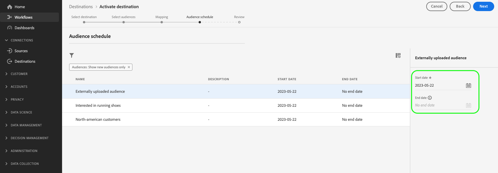

# 激活受众以边缘个性化目标

## 概述 {#overview}

Adobe Experience Platform使用[edge segmentation](../../segmentation/methods/edge-segmentation.md)和[edge destinations](/help/destinations/destination-types.md#edge-personalization-destinations)使客户能够实时大规模创建和定位受众。 此功能可帮助您配置同页和下一页个性化用例。

边缘目标的示例有[Adobe Target](../../destinations/catalog/personalization/adobe-target-connection.md)和[自定义个性化](../../destinations/catalog/personalization/custom-personalization.md)连接。

>[!NOTE]
>
>当[使用数据流ID配置Adobe Target连接](../catalog/personalization/adobe-target-connection.md) *而不配置*&#x200B;时，不支持本文中所述的用例。 在没有数据流的情况下，仅支持下一会话个性化用例。

>[!IMPORTANT]
> 
>* 要激活数据并启用工作流的[映射步骤](#mapping)，您需要&#x200B;**[!UICONTROL View Destinations]**、**[!UICONTROL Activate Destinations]**、**[!UICONTROL View Profiles]**&#x200B;和&#x200B;**[!UICONTROL View Segments]** [访问控制权限](/help/access-control/home.md#permissions)。
>* 若要在不执行工作流的[映射步骤](#mapping)的情况下激活数据，您需要&#x200B;**[!UICONTROL View Destinations]**、**[!UICONTROL Activate Segment without Mapping]**、**[!UICONTROL View Profiles]**&#x200B;和&#x200B;**[!UICONTROL View Segments]** [访问控制权限](/help/access-control/home.md#permissions)。
>* 要导出&#x200B;*标识*，您需要&#x200B;**[!UICONTROL View Identity Graph]** [访问控制权限](/help/access-control/home.md#permissions)。  {width="100" zoomable="yes"}
> 
> 阅读[访问控制概述](/help/access-control/ui/overview.md)或联系您的产品管理员以获取所需的权限。

本文介绍了将受众激活到Adobe Experience Platform Edge目标所需的工作流。 当与[边缘分段](../../segmentation/methods/edge-segmentation.md)和可选的[配置文件属性映射](#mapping)一起使用时，这些目标会在您的Web和移动属性上启用同一页面和下一页面个性化用例。

有关如何为Edge个性化配置Adobe Target连接的简短概述，请观看以下视频。

>[!NOTE]
>
>Experience Platform用户界面经常更新，自从录制此视频以来，可能已经发生了变化。 有关最新信息，请参阅以下部分中描述的配置步骤。

>[!VIDEO](https://video.tv.adobe.com/v/3449803/?captions=chi_hans&quality=12&learn=on)

有关如何将受众和配置文件属性共享到Adobe Target和自定义个性化目标的简短概述，请观看以下视频。

>[!VIDEO](https://video.tv.adobe.com/v/3447365/?captions=chi_hans&quality=12&learn=on)

## 用例 {#use-cases}

使用Adobe个性化解决方案(如Adobe Target)或您自己的个性化合作伙伴平台（例如，[!DNL Optimizely]、[!DNL Pega]）以及专有系统(例如，内部CMS)，通过[自定义Personalization](../catalog/personalization/custom-personalization.md)目标提供更深入的客户个性化体验。 所有这些功能的同时还利用了Experience Platform Edge Network数据收集和分段功能。

下面介绍的使用案例包括网站个性化和有针对性的网站广告。

要启用这些用例，客户需要一种快速、简化的方式，以便从Experience Platform中检索受众和配置文件属性信息，并将这些信息发送到Experience Platform UI中的[Adobe Target](../catalog/personalization/adobe-target-connection.md)或[自定义Personalization](../catalog/personalization/custom-personalization.md)连接。

### 同一页面个性化 {#same-page}

用户访问您网站的页面。 您可以使用当前页面访问信息（例如引荐URL、浏览器语言、嵌入的产品信息）为非Adobe平台（例如，[、](../catalog/personalization/custom-personalization.md)或其他）使用[!DNL Pega]自定义个性化[!DNL Optimizely]连接来选择下一个操作或决策（例如个性化）。

### 下一页面个性化 {#next-page}

用户访问您网站上的页面A。 基于此交互，用户已符合一组受众的资格。 然后，用户单击一个链接，该链接会将用户从页面A转至页面B。用户在上一次与页面A进行交互期间符合条件的受众，以及由当前网站访问决定的用户档案更新，将用于支持下一个操作或决策（例如，向访客显示哪个广告横幅，或者，在A/B测试的情况下，显示页面的哪个版本）。

### 下一会话个性化 {#next-session}

用户访问您网站上的多个页面。 根据这些交互，用户已符合一组受众的条件。 然后，用户终止当前的浏览会话。

第二天，用户返回到同一客户网站。 之前与所有访问过的网站页面交互时，他们符合条件的受众，以及由当前网站访问决定的配置文件更新，将用于选择下一个操作/决策（例如，向访客显示哪个广告横幅，或者，在A/B测试中，选择要显示的页面版本）。

### 个性化主页横幅 {#home-page-banner}

一家家庭租赁和销售公司希望根据Adobe Experience Platform中的受众资格条件，使用横幅来个性化其主页。 公司可以选择应该获得个性化体验的受众，并将这些受众发送到Adobe Target作为其Target选件的定位标准。

## 先决条件 {#prerequisites}

### 在数据收集UI中配置数据流 {#configure-datastream}

设置个性化目标的第一步是为Experience Platform Web SDK配置数据流。 可在数据收集UI中完成此操作。

配置数据流时，在&#x200B;**[!UICONTROL Adobe Experience Platform]**&#x200B;下，确保同时选择&#x200B;**[!UICONTROL Edge Segmentation]**&#x200B;和&#x200B;**[!UICONTROL Personalization Destinations]**。

>[!TIP]
>
>从2024年4月版本开始，在[配置与Edge的连接](/help/destinations/catalog/personalization/adobe-target-connection.md)时，无需选中“Adobe Target分段”复选框。 在这种情况下，[下一会话个性化](#next-session)是唯一可用的个性化用例。

有关如何设置数据流的更多详细信息，请按照[Experience Platform Web SDK文档](../../datastreams/configure.md#aep)中所述的说明操作。

### 创建[!DNL Active-On-Edge]合并策略 {#create-merge-policy}

创建目标连接后，必须创建[!DNL Active-On-Edge]合并策略。 [!DNL Active-On-Edge]合并策略确保在[边缘上持续评估受众](../../segmentation/methods/edge-segmentation.md)，并且可用于实时和下一页个性化用例。

>[!IMPORTANT]
>
>目前，边缘目标仅支持激活使用设置为默认的[Edge上的活动合并策略](../../segmentation/ui/segment-builder.md#merge-policies)的受众。 如果将使用不同合并策略的受众映射到边缘目标，则不会评估这些受众。

按照[创建合并策略](../../profile/merge-policies/ui-guide.md#create-a-merge-policy)中的说明进行操作，并确保启用&#x200B;**[!UICONTROL Active-On-Edge Merge Policy]**&#x200B;切换开关。

### 在Experience Platform中创建新受众 {#create-audience}

创建[!DNL Active-On-Edge]合并策略后，必须在Experience Platform中创建新受众。

按照[受众生成器](../../segmentation/ui/segment-builder.md)指南创建新受众，并确保为其[分配](../../segmentation/ui/segment-builder.md#merge-policies)您在上一步中创建的[!DNL Active-On-Edge]合并策略。

### 创建目标连接 {#connect-destination}

配置数据流后，您可以开始配置个性化目标。

有关如何创建新目标连接的详细说明，请按照[目标连接创建教程](../ui/connect-destination.md)中的说明进行操作。

根据您配置的目标，请参阅以下文章以了解特定于目标的先决条件和相关信息：

* [Adobe Target连接](../catalog/personalization/adobe-target-connection.md#parameters)
* [自定义个性化连接](../catalog/personalization/custom-personalization.md#parameters)

## 选择您的目标 {#select-destination}

完成先决条件后，您现在可以选择用于同一页面和下一页面个性化的边缘个性化目标。

1. 转到&#x200B;**[!UICONTROL Connections > Destinations]**，然后选择&#x200B;**[!UICONTROL Catalog]**&#x200B;选项卡。

   在Experience Platform UI中突出显示

1. 在要激活受众的个性化目标对应的卡片中选择&#x200B;**[!UICONTROL Activate audiences]**，如下图所示。

   

1. 选择要用于激活受众的目标连接，然后选择&#x200B;**[!UICONTROL Next]**。

   

1. 移到下一部分以[选择您的受众](#select-audiences)。

## 选择您的受众 {#select-audiences}

使用受众名称左侧的复选框选择要激活到目标的受众，然后选择&#x200B;**[!UICONTROL Next]**。

要选择要激活到目标的受众，请使用受众名称左侧的复选框，然后选择&#x200B;**[!UICONTROL Next]**。

您可以从多种类型的受众中进行选择，具体取决于其来源：

* **[!UICONTROL Segmentation Service]**：分段服务在Experience Platform中生成的受众。 有关详细信息，请参阅[分段文档](../../segmentation/ui/overview.md)。
* **[!UICONTROL Custom upload]**：受众在Experience Platform之外生成，并以CSV文件形式上传到Experience Platform。 要了解有关外部受众的更多信息，请参阅有关[导入受众](../../segmentation/ui/audience-portal.md#import-audience)的文档。
* 其他类型的受众，来自其他Adobe解决方案，如[!DNL Audience Manager]。

## 映射属性 {#mapping}

>[!IMPORTANT]
>
>配置文件属性可能包含敏感数据。 为了保护此数据，**[!UICONTROL Custom Personalization]**&#x200B;目标要求您在配置基于属性的个性化的目标时使用[Edge Network API](https://developer.adobe.com/data-collection-apis/docs/)。 所有Edge Network API调用必须在[经过身份验证的上下文](https://developer.adobe.com/data-collection-apis/docs/getting-started/authentication/)中进行。
>
> 如果您已在使用Web SDK或Mobile SDK进行集成，则可以通过添加服务器端集成来通过Edge Network API检索属性。
>
> 如果不遵循上述要求，则仅基于受众成员资格进行个性化。

选择要为用户启用个性化用例的属性。 这意味着，如果属性的值发生更改或将属性添加到配置文件中，则该配置文件将成为受众的成员，并将激活到个性化目标。

添加属性是可选的，您仍然可以继续下一步并启用同一页面和下一页面个性化，而无需选择属性。 如果您未在此步骤中添加任何属性，则仍会根据用户档案的受众成员资格和身份映射资格进行个性化。

### 选择源属性 {#select-source-attributes}

要添加源属性，请选择&#x200B;**[!UICONTROL Add new field]**&#x200B;列上的&#x200B;**[!UICONTROL Source field]**&#x200B;控件，然后搜索或导航到所需的XDM属性字段，如下所示。

### 选择目标属性 {#select-target-attributes}

要添加目标属性，请选择&#x200B;**[!UICONTROL Add new field]**&#x200B;列上的&#x200B;**[!UICONTROL Target field]**&#x200B;控件，并键入要将源属性映射到其中的自定义属性名称。

>[!NOTE]
>
>目标属性的选择仅适用于[自定义Personalization](../catalog/personalization/custom-personalization.md)激活工作流，以便支持目标平台中的友好名称字段映射。

中选择XDM属性的屏幕录制

## 计划受众导出 {#scheduling}

默认情况下，[!UICONTROL Audience schedule]页面仅显示您在当前激活流程中选择的新受众。

要查看激活到目标的所有受众，请使用筛选选项并禁用&#x200B;**[!UICONTROL Show new audiences only]**&#x200B;筛选器。

在&#x200B;**[!UICONTROL Audience schedule]**&#x200B;页面上，选择每个受众，然后使用&#x200B;**[!UICONTROL Start date]**&#x200B;和&#x200B;**[!UICONTROL End date]**&#x200B;选择器配置将数据发送到目标的时间间隔。

选择&#x200B;**[!UICONTROL Next]**&#x200B;以转到[!UICONTROL Review]页面。

## 审查 {#review}

在&#x200B;**[!UICONTROL Review]**&#x200B;页面上，您可以看到所选内容的摘要。 选择&#x200B;**[!UICONTROL Cancel]**&#x200B;以中断流，**[!UICONTROL Back]**&#x200B;以修改您的设置，或&#x200B;**[!UICONTROL Finish]**&#x200B;以确认您的选择并开始将数据发送到目标。

### 同意策略评估 {#consent-policy-evaluation}

如果您的组织购买了&#x200B;**Adobe Healthcare Shield**&#x200B;或&#x200B;**Adobe Privacy &amp; Security Shield**，请选择&#x200B;**[!UICONTROL View applicable consent policies]**&#x200B;以查看应用的同意政策以及激活中因此包含的用户档案数。 有关详细信息，请阅读[同意策略评估](/help/data-governance/enforcement/auto-enforcement.md#consent-policy-evaluation)。

### 数据使用策略检查 {#data-usage-policy-checks}

在&#x200B;**[!UICONTROL Review]**&#x200B;步骤中，Experience Platform还会检查是否存在任何数据使用策略违规。 下面显示了一个违反策略的示例。 在解决该违规之前，您无法完成受众激活工作流。 有关如何解决策略违规的信息，请参阅数据治理文档部分中的[数据使用策略违规](/help/data-governance/enforcement/auto-enforcement.md#data-usage-violation)。

### 筛选受众 {#filter-audiences}

在此步骤中，您可以使用页面上的可用过滤器仅显示其计划或映射作为此工作流的一部分而更新的受众。 您还可以切换要查看的表列。

如果您对您的选择感到满意，并且未检测到任何违反策略的情况，请选择&#x200B;**[!UICONTROL Finish]**&#x200B;以确认您的选择并开始将数据发送到目标。

<!--

Commenting out this part since destination monitoring is not available currently for the Adobe Target and Custom Personalization destinations.

## Verify audience activation {#verify}

Check the [destination monitoring documentation](../../dataflows/ui/monitor-destinations.md) for detailed information on how to monitor the flow of data to your destinations.

-->
